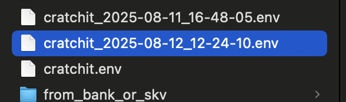
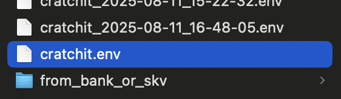
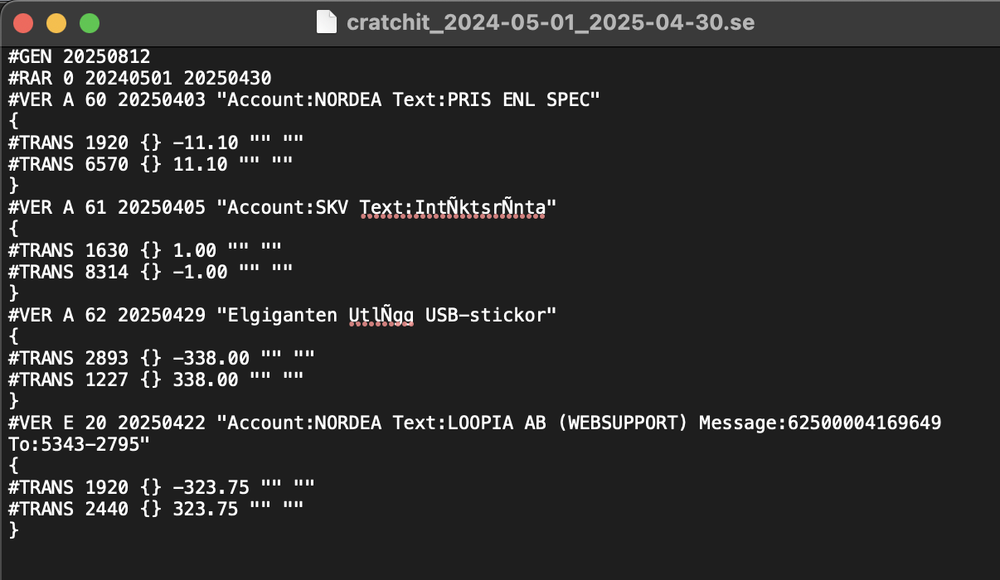
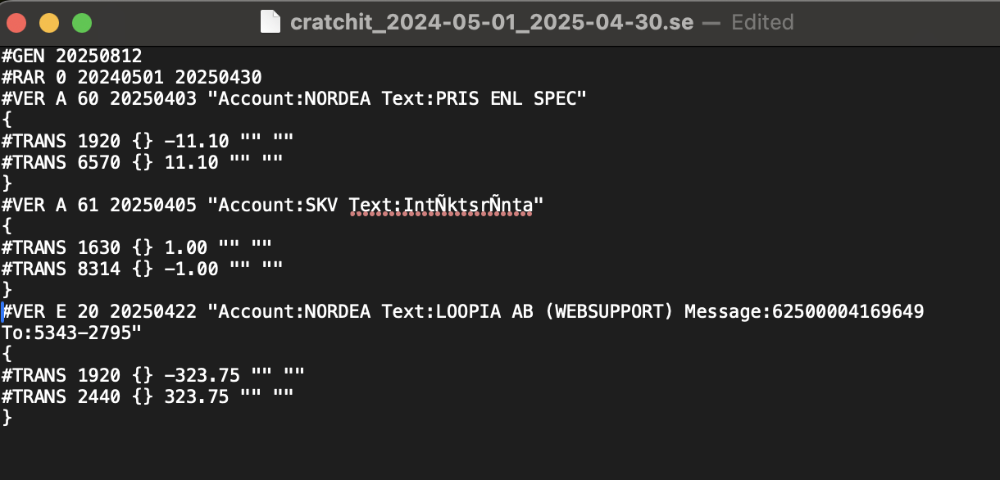

# cratchit users manual

Cratchit currently run by switching between 'zeroth' varaint and 'first' variant.

When cratchit is started it begins in 'zeroth' varaint which exposes a command line input user interface.

The command 'q' exits from 'zeroth' variant and enters 'first' variant.

The 'first' variant exposes an NCurses text window user interface with three panes. 

* The top pane shows currently selected 'data'.
* The middle pane shows mapping from sibgle keyes to 'states'.
* The bottom pane shows the states 'breadcrumb' and the input prompt. 

## Creating a VAT Returns report in zeroth variant

### Importing bank and tax account statement csv-files

The cratchit app will read account statement csv-file in the cratchit sub-folder 'from_bank_or_skv'.

In this example we are running cratchit from a folder called 'workspace'.

```sh
kjell-olovhogdahl@MacBook-Pro ~/Documents/GitHub/cratchit % tree workspace/from_bank_or_skv 
workspace/from_bank_or_skv
├── PLUSGIROKONTO FTG 51 86 87-9 - 2025-07-20 12.01.10.csv
├── bokf_trans_165567828172.skv
└── consumed
    ├── PLUSGIROKONTO FTG 51 86 87-9 - 2024-10-27 15.33.59.csv
    ├── PLUSGIROKONTO FTG 51 86 87-9 - 2025-02-11 11.12.22.csv
    ├── PLUSGIROKONTO FTG 51 86 87-9 - 2025-05-09 16.54.45.csv
    ├── PLUSGIROKONTO FTG 51 86 87-9 - 20250401-20250430.csv
    ├── SPARKONTO FÖRETAG 3259 23 17244 - 2024-10-27 15.34.21.csv
    ├── SPARKONTO FÖRETAG 3259 23 17244 - 20240501-20250430.csv
    ├── SPARKONTO FÖRETAG 3259 23 17244 - 2025-02-11 11.12.58.csv
    ├── SPARKONTO FÖRETAG 3259 23 17244 - 2025-05-09 17.00.26.csv
    └── bokf_trans_165567828172.skv

2 directories, 11 files
kjell-olovhogdahl@MacBook-Pro ~/Documents/GitHub/cratchit % 
```

As of this writing cratchit can read NORDEA bank statement file (in this example 'PLUSGIROKONTO FTG 51 86 87-9 - 2025-07-20 12.01.10.csv') and swedish tax agency tax account statement csv-file (in this example 'bokf_trans_165567828172.skv).

The files are processed and turned into 'tagged amounts' when cratchit is started. The result is logged to the console.

NOTE: AS of this writing a lot of development traces are also output into the console.

```sh
kjell-olovhogdahl@MacBook-Pro ~/Documents/GitHub/cratchit/workspace % ./cratchit 
Argument 0: ./cratchit
cratchit/0.6: Hello World Debug!
  cratchit/0.6: __aarch64__ defined
  cratchit/0.6: __cplusplus202302
  cratchit/0.6: __GNUC__4
  cratchit/0.6: __GNUC_MINOR__2
  cratchit/0.6: __clang_major__16
  cratchit/0.6: __apple_build_version__16000026
cratchit/0.6 test_package

current_date_to_year_id_map(financial_year_start_month:5,index_count:7)
        index:-1 range:20240501...20250430
        index:-2 range:20230501...20240430
        index:-3 range:20220501...20230430
        index:-4 range:20210501...20220430
        index:-5 range:20200501...20210430
        index:-6 range:20190501...20200430
        index:0 range:20250501...20260430
model_from_environment
date_ordered_tagged_amounts_from_sie_environment
Opening Saldo Date:20230501
        saldo_ta :  20230501 162495,27
        |--> "BAS=1221"
        |--> "IB=True"
        saldo_ta :  20230501 105496,03
        |--> "BAS=1226"
        |--> "IB=True"
        saldo_ta :  20230501 36605,97
        |--> "BAS=1227"
        |--> "IB=True"
        saldo_ta :  20230501 -15408,44
        |--> "BAS=1228"
        |--> "IB=True"
        saldo_ta :  20230501 -236867,71
        |--> "BAS=1229"
        |--> "IB=True"
        saldo_ta :  20230501 375,09
        |--> "BAS=1610"
        |--> "IB=True"
        saldo_ta :  20230501 630,00
        |--> "BAS=1630"
        |--> "IB=True"
        saldo_ta :  20230501 0,00
        |--> "BAS=1650"
        |--> "IB=True"
        saldo_ta :  20230501 36147,89
        |--> "BAS=1920"
        |--> "IB=True"
        saldo_ta :  20230501 217551,83
        |--> "BAS=1930"
        |--> "IB=True"
        saldo_ta :  20230501 156,75
        |--> "BAS=1999"
        |--> "IB=True"
        saldo_ta :  20230501 -100800,00
        |--> "BAS=2081"
        |--> "IB=True"
        saldo_ta :  20230501 -278845,23
        |--> "BAS=2091"
        |--> "IB=True"
        saldo_ta :  20230501 0,00
        |--> "BAS=2098"
        |--> "IB=True"
        saldo_ta :  20230501 84192,50
        |--> "BAS=2099"
        |--> "IB=True"
        saldo_ta :  20230501 -5459,55
        |--> "BAS=2440"
        |--> "IB=True"
        saldo_ta :  20230501 1331,46
        |--> "BAS=2641"
        |--> "IB=True"
        saldo_ta :  20230501 -2601,86
        |--> "BAS=2893"
        |--> "IB=True"
        saldo_ta :  20230501 -5000,00
        |--> "BAS=2898"
        |--> "IB=True"
date_ordered_tagged_amounts_from_sie_environment
Opening Saldo Date:20240501
        saldo_ta :  20240501 162495,27
        |--> "BAS=1221"
        |--> "IB=True"
        saldo_ta :  20240501 114976,20
        |--> "BAS=1226"
        |--> "IB=True"
        saldo_ta :  20240501 38223,49
        |--> "BAS=1227"
        |--> "IB=True"
        saldo_ta :  20240501 -15408,44
        |--> "BAS=1228"
        |--> "IB=True"
        saldo_ta :  20240501 -257552,58
        |--> "BAS=1229"
        |--> "IB=True"
        saldo_ta :  20240501 375,09
        |--> "BAS=1610"
        |--> "IB=True"
        saldo_ta :  20240501 645,00
        |--> "BAS=1630"
        |--> "IB=True"
        saldo_ta :  20240501 1026,00
        |--> "BAS=1650"
        |--> "IB=True"
        saldo_ta :  20240501 8129,56
        |--> "BAS=1920"
        |--> "IB=True"
        saldo_ta :  20240501 111124,72
        |--> "BAS=1930"
        |--> "IB=True"
        saldo_ta :  20240501 -100800,00
        |--> "BAS=2081"
        |--> "IB=True"
        saldo_ta :  20240501 -348498,23
        |--> "BAS=2091"
        |--> "IB=True"
        saldo_ta :  20240501 0,00
        |--> "BAS=2093"
        |--> "IB=True"
        saldo_ta :  20240501 278845,50
        |--> "BAS=2098"
        |--> "IB=True"
        saldo_ta :  20240501 30547,01
        |--> "BAS=2099"
        |--> "IB=True"
        saldo_ta :  20240501 896,25
        |--> "BAS=2440"
        |--> "IB=True"
        saldo_ta :  20240501 156,75
        |--> "BAS=2641"
        |--> "IB=True"
        saldo_ta :  20240501 -181,59
        |--> "BAS=2893"
        |--> "IB=True"
        saldo_ta :  20240501 -25000,00
        |--> "BAS=2898"
        |--> "IB=True"

BEGIN: Processing files in "/Users/kjell-olovhogdahl/Documents/GitHub/cratchit/workspace/from_bank_or_skv"

BEGIN File: "/Users/kjell-olovhogdahl/Documents/GitHub/cratchit/workspace/from_bank_or_skv/.DS_Store"
to_tagged_amounts("/Users/kjell-olovhogdahl/Documents/GitHub/cratchit/workspace/from_bank_or_skv/.DS_Store")
*Ignored* "/Users/kjell-olovhogdahl/Documents/GitHub/cratchit/workspace/from_bank_or_skv/.DS_Store" (Failed to understand file content)
END File: "/Users/kjell-olovhogdahl/Documents/GitHub/cratchit/workspace/from_bank_or_skv/.DS_Store"

BEGIN File: "/Users/kjell-olovhogdahl/Documents/GitHub/cratchit/workspace/from_bank_or_skv/consumed"
END File: "/Users/kjell-olovhogdahl/Documents/GitHub/cratchit/workspace/from_bank_or_skv/consumed"

BEGIN File: "/Users/kjell-olovhogdahl/Documents/GitHub/cratchit/workspace/from_bank_or_skv/PLUSGIROKONTO FTG 51 86 87-9 - 2025-07-20 12.01.10.csv"
to_tagged_amounts("/Users/kjell-olovhogdahl/Documents/GitHub/cratchit/workspace/from_bank_or_skv/PLUSGIROKONTO FTG 51 86 87-9 - 2025-07-20 12.01.10.csv")
        Valid entries count:8
        Consumed account statement file move DISABLED = NOT moved to "/Users/kjell-olovhogdahl/Documents/GitHub/cratchit/workspace/from_bank_or_skv/consumed/PLUSGIROKONTO FTG 51 86 87-9 - 2025-07-20 12.01.10.csv"
END File: "/Users/kjell-olovhogdahl/Documents/GitHub/cratchit/workspace/from_bank_or_skv/PLUSGIROKONTO FTG 51 86 87-9 - 2025-07-20 12.01.10.csv"

BEGIN File: "/Users/kjell-olovhogdahl/Documents/GitHub/cratchit/workspace/from_bank_or_skv/bokf_trans_165567828172.skv"
to_tagged_amounts("/Users/kjell-olovhogdahl/Documents/GitHub/cratchit/workspace/from_bank_or_skv/bokf_trans_165567828172.skv")
        Valid entries count:6
        Consumed account statement file move DISABLED = NOT moved to "/Users/kjell-olovhogdahl/Documents/GitHub/cratchit/workspace/from_bank_or_skv/consumed/bokf_trans_165567828172.skv"
END File: "/Users/kjell-olovhogdahl/Documents/GitHub/cratchit/workspace/from_bank_or_skv/bokf_trans_165567828172.skv"
END: Processed Files in "/Users/kjell-olovhogdahl/Documents/GitHub/cratchit/workspace/from_bank_or_skv"
date_ordered_tagged_amounts_from_account_statement_files RETURNS 14 entries
BEGIN: Processing files in "/Users/kjell-olovhogdahl/Documents/GitHub/cratchit/workspace/skv_specs"
END: Processing files in "/Users/kjell-olovhogdahl/Documents/GitHub/cratchit/workspace/skv_specs"
sie[-1] from "sie_in/TheITfiedAB20250211_145723.se"
sie[current] from "sie_in/TheITfiedAB20250510_190029.se"
DESIGN_UNSUFFICIENCY - No proper synchronization of tagged amounts with SIE files yet in place (dublicate SIE entries may remain in tagged amounts)
Init from "/Users/kjell-olovhogdahl/Documents/GitHub/cratchit/workspace/cratchit.env"
cratchit:>

```

We may now process these account statement entries as input for our VAR returns report


### cratchit:> -tas 20250401 20250630

The '-tas' command selects 'Tagged Amounts' in a date range. So the command '-tas 20250401 20250630' selects tagged amounts from 1'th of april to 30'th of june 2025.

```sh
<SELECTED>
0.  20250401 656,00
        |--> "Account=SKV"
        |--> "Text=Ingående saldo 2025-04-01"
        |--> "type=saldo"
1.  20250403 -11,10
        |--> "Account=NORDEA"
        |--> "Belopp=-11,10"
        |--> "Bokföringsdag=2025/04/03"
        |--> "Namn=PRIS ENL SPEC"
        |--> "Saldo=689134"
        |--> "Text=PRIS ENL SPEC"
        |--> "Valuta=SEK"
        |--> "Ytterligare detaljer=PRIS ENL SPEC"
2.  20250405 1,00
        |--> "Account=SKV"
        |--> "Belopp=1"
        |--> "Bokföringsdag=2025-04-05"
        |--> "Rubrik=Intäktsränta"
        |--> "Text=Intäktsränta"
3.  20250422 -323,75
...
```

### cratchit:tas>-has_tag Account

In this example the range of tagged amounts only contains such created from account statements.

But lets look at an example where the tagged amounts also contains already registered financial events (SIE entries aggregating BAS account entries).

```sh
cratchit:tas>-tas 20250101 20250331

<SELECTED>
0.  20250101 654,00
        |--> "Account=SKV"
        |--> "Text=Ingående saldo 2025-01-01"
        |--> "type=saldo"
1.  20250107 -1303,70
        |--> "BAS=1920"
        |--> "Ix=0"
        |--> "parent_SIE=A48"
2.  20250107 1303,70
        |--> "BAS=6570"
        |--> "Ix=1"
        |--> "parent_SIE=A48"
3.  20250107 1303,70
        |--> "SIE=A48"
        |--> "_members=79e6ff1babea1366^0ef6f017e667db16"
        |--> "type=aggregate"
        |--> "vertext=Account:NORDEA Text:PRIS ENL SPEC"
4.  20250107 -1303,70
        |--> "Account=NORDEA"
        |--> "Belopp=-1303,70"
        |--> "Bokföringsdag=2025/01/07"
        |--> "Namn=PRIS ENL SPEC"
        |--> "Saldo=5851280"
        |--> "Text=PRIS ENL SPEC"
        |--> "Valuta=SEK"
        |--> "Ytterligare detaljer=PRIS ENL SPEC"
5.  20250110 3240,00
        |--> "BAS=6250"
        |--> "Ix=0"
        |--> "TRANSTEXT=Postbox 1/2-år"
        |--> "parent_SIE=A49"
6.  20250110 810,00
        |--> "BAS=2641"
        |--> "Ix=1"
        |--> "parent_SIE=A49"
7.  20250110 -4050,00
        |--> "BAS=2440"
        |--> "Ix=2"
        |--> "parent_SIE=A49"
8.  20250110 4050,00
        |--> "SIE=A49"
        |--> "_members=b96d0e928fc83ba4^6f362aba04af54bc^6c846f5788dc8eb8"
        |--> "type=aggregate"
        |--> "vertext=Postnord Postbox"
9.  20250111 -996,25
        |--> "BAS=2440"
        |--> "Ix=0"
        |--> "parent_SIE=D14"

...

121.  20250331 1997,50
        |--> "SIE=M4"
        |--> "_members=130dcba2041c0646^bec82b9878b93d5e^a746ff66506071ea"
        |--> "type=aggregate"
        |--> "vertext=Momsrapport 20250101...20250331"
122.  20250331 -1083,75
        |--> "Account=NORDEA"
        |--> "Belopp=-1083,75"
        |--> "Bokföringsdag=2025/03/31"
        |--> "Egna anteckningar=Webhotell Q2"
        |--> "Meddelande=62500003193947"
        |--> "Message=62500003193947"
        |--> "Mottagare=5343-2795"
        |--> "Namn=LOOPIA AB (WEBSUPPORT)"
        |--> "Notes=Webhotell Q2"
        |--> "Saldo=690244"
        |--> "Text=LOOPIA AB (WEBSUPPORT)"
        |--> "To=5343-2795"
        |--> "Valuta=SEK"
        |--> "Ytterligare detaljer=LOOPIA AB (WEBSUPPORT)"
123.  20250331 656,00
        |--> "Account=SKV"
        |--> "Text=Utgående saldo 2025-03-31"
        |--> "type=saldo"
cratchit:tas>
```

To filter out account statement tagged amounts we can use the '-has_tag' command.

```sh
cratchit:tas>-has_tag Account
cratchit:tas>

Options:
The following options are available for Tagged Amounts selection.
<Enter> : Lists the currently selected tagged amounts
<index> - Selects tagged amount with provided index
-has_tag <regular expression> - Keep tagged amounts with tag matching regular expression
-has_not_tag <regular expression> - Keep tagged amounts with tag NOT matching regular expression
-is_tagged <tag name>=<regular expression> - Keep tagged amounts with named tag value matching regular expression
-is_not_tagged <tag name>=<regular expression> - Keep tagged amounts with named tag value NOT matching regular expression
-to_bas_account <bas account number> - Tag current selection of tagged amounts with provided BAS account number.
-amount_trails - Groups tagged amounts on transaction amount and lists them
-aggregates - Reduces tagged amounts to only aggregates (E.g., SIE entries referring to single account tagged amounts)
-todo - Lists tagged amounts subject to 'TODO' actions.
<SELECTED>
0.  20250101 654,00
        |--> "Account=SKV"
        |--> "Text=Ingående saldo 2025-01-01"
        |--> "type=saldo"
1.  20250107 -1303,70
        |--> "Account=NORDEA"
        |--> "Belopp=-1303,70"
        |--> "Bokföringsdag=2025/01/07"
        |--> "Namn=PRIS ENL SPEC"
        |--> "Saldo=5851280"
        |--> "Text=PRIS ENL SPEC"
        |--> "Valuta=SEK"
        |--> "Ytterligare detaljer=PRIS ENL SPEC"

...

19.  20250331 -1083,75
        |--> "Account=NORDEA"
        |--> "Belopp=-1083,75"
        |--> "Bokföringsdag=2025/03/31"
        |--> "Egna anteckningar=Webhotell Q2"
        |--> "Meddelande=62500003193947"
        |--> "Message=62500003193947"
        |--> "Mottagare=5343-2795"
        |--> "Namn=LOOPIA AB (WEBSUPPORT)"
        |--> "Notes=Webhotell Q2"
        |--> "Saldo=690244"
        |--> "Text=LOOPIA AB (WEBSUPPORT)"
        |--> "To=5343-2795"
        |--> "Valuta=SEK"
        |--> "Ytterligare detaljer=LOOPIA AB (WEBSUPPORT)"
20.  20250331 656,00
        |--> "Account=SKV"
        |--> "Text=Utgående saldo 2025-03-31"
        |--> "type=saldo"
cratchit:tas>
```

Now we can turn these tagged amounts into 'HADs' (Heading Amount Date) entries.

### cratchit:tas>-to_hads

When a range of tagged amounts has been selected (using the '-tas' command and required filtering command) the command '-to_hads' creates 'HADs' from these tagged amounts.

A 'HAD' is a 'Heading Amount Date' entry which serves as a seed for a financial event. So a HAD is later edited to become a full entry about the event.

```sh
cratchit:tas>-to_hads

Creating Heading Amount Date entries (HAD:s) from selected Tagged Amounts
cratchit:tas>
```

### cratchit:tas>-hads

The '-hads' command enters the 'hads' state (prompted as 'cratchit:had>').

As of this writing this command also triggers generated a HAD for the VAT returns report.

```sh
cratchit:tas>-hads

        to_box_49_amount += [10]:0.00 = 0.00
        to_box_49_amount += [30]:0.00 = 0.00
        to_box_49_amount += [60]:0.00 = 0.00
        to_box_49_amount += [48]:0.00 = 0.00
Period:20250401...20250930
        [5]
        [10]
        [20]
        [30]
        [39]
        [48]
        [49]
                00000000 account_amounts[0] += 0.00 saldo:0.00
        [50]
        [60]
        to_box_49_amount += [10]:0.00 = 0.00
        to_box_49_amount += [30]:0.00 = 0.00
        to_box_49_amount += [60]:0.00 = 0.00
        to_box_49_amount += [48]:0.00 = 0.00
Period:20250101...20250630
        [5]
        [10]
        [20]
        [30]
        [39]
        [48]
                20250110 account_amounts[2641] += 810.00 saldo:810.00
                20250111 account_amounts[2641] += 199.25 saldo:1009.25
                20250115 account_amounts[2641] += 47.25 saldo:1056.50
                20250205 account_amounts[2641] += 123.00 saldo:1179.50
                20250207 account_amounts[2641] += 64.75 saldo:1244.25
                20250217 account_amounts[2641] += 471.75 saldo:1716.00
                20250227 account_amounts[2641] += 216.75 saldo:1932.75
                20250319 account_amounts[2641] += 64.75 saldo:1997.50
                20250331 account_amounts[2641] += -1997.50 saldo:0.00
        [49]
                00000000 account_amounts[0] += 0.00 saldo:0.00
        [50]
        [60]
Please select:
  0   nnnn Dummy HAD 6.00 20250706
  1   nnnn Dummy HAD 5.00 20250705
  2   nnnn Dummy HAD 4.00 20250704
  3   nnnn Dummy HAD 3.00 20250703
  4   nnnn Dummy HAD 2.00 20250702
  5   nnnn Dymmy HAD 1.00 20250701
  6   nnnn Account:SKV Text:Utgående saldo 2025-06-30 658.00 20250630
  7   nnnn Kvitto Anthropic Claude 180.00 20250630
  8   nnnn Account:NORDEA Text:LOOPIA AB (WEBSUPPORT) Message:62500007488343 To:5343-2795 -1083.75 20250630
  9   nnnn Account:NORDEA Text:TELIA SVERIGE AB Message:19797379252 To:824-3040 -2359.00 20250616
  10   nnnn Account:NORDEA Text:PRIS ENL SPEC -1.85 20250604
  11   nnnn Account:SKV Text:Intäktsränta 1.00 20250601
  12   nnnn Faktura Loopia AB Webbsupport 1083.75 20250529
  13   nnnn Account:NORDEA Text:Fortnox Finans AB Message:583371610007452 To:5020-7042 -615.00 20250528
  14   nnnn Telia Faktura 2359.00 20250516
  15   nnnn Account:NORDEA Text:BG KONTOINS Message:5050-1030 SK5567828172 1997.00 20250516
  16   nnnn Utbetalning Moms 1997.00 20250514
  17   nnnn Account:SKV Text:Utbetalning -1997.00 20250514
  18   nnnn Account:SKV Text:Moms jan 2025 - mars 2025 1997.00 20250512
  19   nnnn Account:SKV Text:Utgående saldo 2025-05-10 657.00 20250510
  20   nnnn Faktura Fortnox 615.00 20250508
  21   nnnn Account:NORDEA Text:PRIS ENL SPEC -1.85 20250506
  22   nnnn Account:NORDEA Text:LOOPIA AB (WEBSUPPORT) Message:62500004169649 To:5343-2795 -323.75 20250422
  23   nnnn Account:SKV Text:Intäktsränta 1.00 20250405
  24   nnnn Account:NORDEA Text:PRIS ENL SPEC -11.10 20250403
  25   nnnn Account:SKV Text:Ingående saldo 2025-04-01 656.00 20250401
cratchit:had>
```

In this example we can see all the HAD entries created from the previously selected tagged amounts.

But we can also see some prte-existing HADs like '0   nnnn Dummy HAD 6.00 20250706' from testing the app and '14   nnnn Telia Faktura 2359.00 20250516' which was entered manually.

### cratchit:had>-

The command '-' exits current state and returns to root state.

It also shows an experimental 'command help' listing.

```sh
cratchit:had>-

to_previous_state
to_prompt_for_entering_state
Options:
<Heading> <Amount> <Date> : Entry of new Heading Amount Date (HAD) Transaction entry
-hads : lists current Heading Amount Date (HAD) entries
-sie <sie file path> : imports a new input sie file. Please enclose path with "" if it contains space.
-sie : lists transactions in input sie-file
-tas <first date> <last date> : Selects tagged amounts in the period first date .. last date
-tas : Selects last selected tagged amounts
-csv <csv file path> : Imports Comma Seperated Value file of Web bank account transactions
                       Stores them as Heading Amount Date (HAD) entries.
'q' or 'Quit'
cratchit:>
```

### Manual enter of HAD


In the root state, entering 'cratchit:>HAD Example 16,00 20250616' will cause cratchit to parse the input as a HAD (Heading Amount Date). 

```sh
cratchit:>HAD Example 16,00 20250616

  nnnn HAD Example 16.00 20250616
cratchit:>
```
### Deleting a HAD

To delete a HAD you have to first enter the HADs state with the command '-hads'. 

```sh
cratchit:>-hads

...

Please select:
  0   nnnn Dummy HAD 6.00 20250706
  1   nnnn Dummy HAD 5.00 20250705
  2   nnnn Dummy HAD 4.00 20250704
  3   nnnn Dummy HAD 3.00 20250703
  4   nnnn Dummy HAD 2.00 20250702
  5   nnnn Dymmy HAD 1.00 20250701
  6   nnnn Account:SKV Text:Utgående saldo 2025-06-30 658.00 20250630
  7   nnnn Kvitto Anthropic Claude 180.00 20250630
  8   nnnn Account:NORDEA Text:LOOPIA AB (WEBSUPPORT) Message:62500007488343 To:5343-2795 -1083.75 20250630
  9   nnnn HAD Example 16.00 20250616
  10   nnnn Account:NORDEA Text:TELIA SVERIGE AB Message:19797379252 To:824-3040 -2359.00 20250616
  11   nnnn Account:NORDEA Text:PRIS ENL SPEC -1.85 20250604
  12   nnnn Account:SKV Text:Intäktsränta 1.00 20250601
  13   nnnn Faktura Loopia AB Webbsupport 1083.75 20250529
  14   nnnn Account:NORDEA Text:Fortnox Finans AB Message:583371610007452 To:5020-7042 -615.00 20250528
  15   nnnn Telia Faktura 2359.00 20250516
  16   nnnn Account:NORDEA Text:BG KONTOINS Message:5050-1030 SK5567828172 1997.00 20250516
  17   nnnn Utbetalning Moms 1997.00 20250514
  18   nnnn Account:SKV Text:Utbetalning -1997.00 20250514
  19   nnnn Account:SKV Text:Moms jan 2025 - mars 2025 1997.00 20250512
  20   nnnn Account:SKV Text:Utgående saldo 2025-05-10 657.00 20250510
  21   nnnn Faktura Fortnox 615.00 20250508
  22   nnnn Account:NORDEA Text:PRIS ENL SPEC -1.85 20250506
  23   nnnn Account:NORDEA Text:LOOPIA AB (WEBSUPPORT) Message:62500004169649 To:5343-2795 -323.75 20250422
  24   nnnn Account:SKV Text:Intäktsränta 1.00 20250405
  25   nnnn Account:NORDEA Text:PRIS ENL SPEC -11.10 20250403
  26   nnnn Account:SKV Text:Ingående saldo 2025-04-01 656.00 20250401
cratchit:had>
```

Then you can delete a HAD by entering the index of the HAD to delete prefixed with '-'-

```sh
cratchit:had>-9

  nnnn HAD Example 16.00 20250616 REMOVED
cratchit:>
```

You then need to do the command '-hads' again to show the updated list of HADs.

### Prune the HADs to all events to register for the VAT returns report.

In this example we have 20 HADs as a result from placing relevant bank account statement csv-file as well as SKV (Swedish tax agency) tax account statement csv-file into the cratchit folder 'from_bank_or_skv'.

```sh
cratchit:>-hads

...

Please select:
  0   nnnn Kvitto Anthropic Claude 180.00 20250630
  1   nnnn Account:NORDEA Text:LOOPIA AB (WEBSUPPORT) Message:62500007488343 To:5343-2795 -1083.75 20250630
  2   nnnn Account:NORDEA Text:TELIA SVERIGE AB Message:19797379252 To:824-3040 -2359.00 20250616
  3   nnnn Account:NORDEA Text:PRIS ENL SPEC -1.85 20250604
  4   nnnn Account:SKV Text:Intäktsränta 1.00 20250601
  5   nnnn Faktura Loopia AB Webbsupport 1083.75 20250529
  6   nnnn Account:NORDEA Text:Fortnox Finans AB Message:583371610007452 To:5020-7042 -615.00 20250528
  7   nnnn Telia Faktura 2359.00 20250516
  8   nnnn Account:NORDEA Text:BG KONTOINS Message:5050-1030 SK5567828172 1997.00 20250516
  9   nnnn Utbetalning Moms 1997.00 20250514
  10   nnnn Account:SKV Text:Utbetalning -1997.00 20250514
  11   nnnn Account:SKV Text:Moms jan 2025 - mars 2025 1997.00 20250512
  12   nnnn Account:SKV Text:Utgående saldo 2025-05-10 657.00 20250510
  13   nnnn Faktura Fortnox 615.00 20250508
  14   nnnn Account:NORDEA Text:PRIS ENL SPEC -1.85 20250506
  15   nnnn Account:NORDEA Text:LOOPIA AB (WEBSUPPORT) Message:62500004169649 To:5343-2795 -323.75 20250422
  16   nnnn Account:SKV Text:Intäktsränta 1.00 20250405
  17   nnnn Account:NORDEA Text:PRIS ENL SPEC -11.10 20250403
cratchit:had>
```

### Register HADs as book keeping events

In the HADs state (command '-hads' and prompt 'cratchit:had>') we can now just enter the index of the HAD to register as a financial event.

```sh
cratchit:had>17

  nnnn Account:NORDEA Text:PRIS ENL SPEC -11.10 20250403
    0  E16 "Account:NORDEA Text:SVEA INKASSO AKTIEBOLAG Message:4414710655790067 To:486 66 03-6" 20250313
         ? = sort_code: 0x0 : "PlusGiro":1920 "" -4967.00
         ? = sort_code: 0x0 : "Leverantörsskulder":2440 "Inkasso faktisk avgift" -707.00
         ? = sort_code: 0x0 : "Leverantörsskulder":2440 "" 4967.00
         ? = sort_code: 0x0 : "Övriga externa kostnader, ej avdragsgilla":6992 "Inkass faktisk avgift" 707.00
    1  A16 "Account:NORDEA Text:Insättning Message:FÖR UTDELNING From:32592317244" 20230918
         gross = sort_code: 0x3 : "PlusGiro":1920 "" 50000.00
         gross = sort_code: 0x3 : "Företagskonto/checkkonto/affärskonto":1930 "" -50000.00
    2  A32 "Account:NORDEA Message:FRåN SPARKONTO To:5186879" 20240121
         gross = sort_code: 0x3 : "PlusGiro":1920 "" 10000.00
         gross = sort_code: 0x3 : "Företagskonto/checkkonto/affärskonto":1930 "" -10000.00

...

    40  A2 "PRIS ENLIGT SPEC" 20230504
         gross = sort_code: 0x3 : "PlusGiro":1920 "" -1.75
         gross = sort_code: 0x3 : "Bankkostnader":6570 "" 1.75
    41  A8 "Account:NORDEA Text:PRIS ENL SPEC" 20230705
         gross = sort_code: 0x3 : "PlusGiro":1920 "" -3.70
         gross = sort_code: 0x3 : "Bankkostnader":6570 "" 3.70
    42  A14 "Account:NORDEA Text:PRIS ENL SPEC" 20230905
         gross = sort_code: 0x3 : "PlusGiro":1920 "" -1.85
         gross = sort_code: 0x3 : "Bankkostnader":6570 "" 1.85
    43  A29 "Account:NORDEA Text:PRIS ENL SPEC" 20240104
         gross = sort_code: 0x3 : "PlusGiro":1920 "" -1307.40
         gross = sort_code: 0x3 : "Bankkostnader":6570 "" 1307.40
    44  A45 "Account:NORDEA Text:PRIS ENL SPEC" 20240305
         gross = sort_code: 0x3 : "PlusGiro":1920 "" -7.40
         gross = sort_code: 0x3 : "Bankkostnader":6570 "" 7.40

...

    67  A12 "Account:NORDEA Text:KORT PAYPAL *IFIXIT 26 Message:PAYPAL *IFIXIT 2656" 20230801
         gross = sort_code: 0x3 : "PlusGiro":1920 "" -1153.43
         eu_vat vat = sort_code: 0x56 : "Utgående moms omvänd skattskyldighet, 25 %":2614 "" -230.69
         eu_vat vat = sort_code: 0x56 : "Ingående moms":2640 "" 230.69
         gross = sort_code: 0x3 : "Reparation och underhåll (gruppkonto)":5500 "" 1153.43
         eu_purchase = sort_code: 0x2 : "Varuvärde Inlöp annat EG-land (Momsrapport ruta 20)":9021 "" 1153.43
         eu_purchase = sort_code: 0x2 : "Motkonto Varuvärde Inköp EU/Import":9099 "" -1153.43
    68  A _  "Bestallning Inventarie" 20250403
         net = sort_code: 0x4 : "Inventarier":1221  800.00
         gross = sort_code: 0x3 : "Leverantörsskulder":2440  -1000.00
         vat = sort_code: 0x6 : "Debiterad ingående moms":2641  200.00
cratchit:had:je>
```

The cratchit app will list previously registered financial events that somehow matches the HAD selected.

NOT: As of this writing this matching is generous and not restricted in time. So the list can become very long...

But we can find entries like '42  A14 "Account:NORDEA Text:PRIS ENL SPEC" 20230905' which seems to be a sutable template for our HAD.

To choose a templatem just enter the index of the entry to use as a template.

```sh
cratchit:had:je>42

"gross" count:2
Template is an NO VAT, all gross amount transaction :)
vat_type = No VAT
Plain transfer  A _  "Account:NORDEA Text:PRIS ENL SPEC" 20250403
  "PlusGiro":1920 "" -11.10
  "Bankkostnader":6570 "" 11.10
cratchit:had:je:1*at>
```

To see the options at this stage just press Enter.

```sh
cratchit:had:je:1*at>

Options:
0 1 x counter transactions aggregate
1 n x counter transactions aggregate
2 Edit account transactions
3 STAGE as-is
cratchit:had:je:1*at>
```

For this example we just press '3' to register the financial event as proposed.

```sh
cratchit:had:je:1*at>3

"gross" count:2
Template is an NO VAT, all gross amount transaction :)
 A _  "Account:NORDEA Text:PRIS ENL SPEC" 20250403
         gross = sort_code: 0x3 : "PlusGiro":1920 "" -11.10
         gross = sort_code: 0x3 : "Bankkostnader":6570 "" 11.10
 A60 "Account:NORDEA Text:PRIS ENL SPEC" 20250403
  "PlusGiro":1920 "" -11.10
  "Bankkostnader":6570 "" 11.10 STAGED
Please enter a valid had index
cratchit:had>
```

The HAD is now registered (staged) as the financial event A60

Note: The the entry is 'STAGED' means it is detected as 'not posted' to any external book keeping system using an SIE export. Or rather, the latest SIE import does NOT contain this entry.

We can now do command '-hads' again and process entry 16

```sh
cratchit:had>-hads

...

  15   nnnn Account:NORDEA Text:LOOPIA AB (WEBSUPPORT) Message:62500004169649 To:5343-2795 -323.75 20250422
  16   nnnn Account:SKV Text:Intäktsränta 1.00 20250405
cratchit:had>16

  nnnn Account:SKV Text:Intäktsränta 1.00 20250405
    0  A44 "Account:SKV Text:Intäktsränta" 20240706
         gross = sort_code: 0x3 : "Avräkning för skatter och avgifter (skattekonto)":1630 "" 2.00
         gross = sort_code: 0x3 : "Skattefria ränteintäkter":8314 "" -2.00
...

    9  A12 "Account:SKV Text:Intäktsränta" 20240601
         transfer gross = sort_code: 0x13 : "Avräkning för skatter och avgifter (skattekonto)":1630 "" 1.00
         transfer gross = sort_code: 0x13 : "Skattefria ränteintäkter":8314 "" -1.00
    10  A43 "Account:SKV Text:Intäktsränta" 20240601
         transfer gross = sort_code: 0x13 : "Avräkning för skatter och avgifter (skattekonto)":1630 "" 1.00
         transfer gross = sort_code: 0x13 : "Skattefria ränteintäkter":8314 "" -1.00
    11  A51 "Account:SKV Text:Intäktsränta" 20250201
         transfer gross = sort_code: 0x13 : "Avräkning för skatter och avgifter (skattekonto)":1630 "" 1.00
         transfer gross = sort_code: 0x13 : "Skattefria ränteintäkter":8314 "" -1.00

...

cratchit:had:je>10

"gross" count:2
"transfer" count:2
vat_type = SKV Interest
Tax free SKV interest  A _  "Account:SKV Text:Intäktsränta" 20250405
  "Avräkning för skatter och avgifter (skattekonto)":1630 "" 1.00
  "Skattefria ränteintäkter":8314 "" -1.00
cratchit:had:je:1*at>3

"gross" count:2
"transfer" count:2
DESIGN INSUFFICIENCY - Unknown JournalEntryVATType SKV Interest
 A _  "Account:SKV Text:Intäktsränta" 20250405
         transfer gross = sort_code: 0x13 : "Avräkning för skatter och avgifter (skattekonto)":1630 "" 1.00
         transfer gross = sort_code: 0x13 : "Skattefria ränteintäkter":8314 "" -1.00
 A61 "Account:SKV Text:Intäktsränta" 20250405
  "Avräkning för skatter och avgifter (skattekonto)":1630 "" 1.00
  "Skattefria ränteintäkter":8314 "" -1.00 STAGED
Please enter a valid had index
cratchit:had>-hads
...

```

Note: As of this writing cratchit logs 'DESIGN INSUFFICIENCY - Unknown JournalEntryVATType SKV Interest' which we can ignore.

### Switching to a new financial year

The cratchit app currently keep track of financial years based on imported SIE files. And it keeps the notion of the tagging 'current', '-1', '-2',... to refer to a year.

To update the financial years cratchit provides the command '-sie <year id> <sie-file>'.

If no 'year id' is provided in the command, then cratchit asumes the year id 'current'.

```sh
cratchit:>-sie sie_in/TheITfiedAB20250811_141304.se

Importing SIE to current year from "sie_in/TheITfiedAB20250811_141304.se"
```

If the 'current' is now a new financial year, then the user is required to adjust also the '-1' (previous), '-2' (before previous) and so on.

```sh
cratchit:>-sie -1 sie_in/TheITfiedAB20250510_190029.se

Importing SIE to realtive year -1 from "sie_in/TheITfiedAB20250510_190029.se"
```

```sh
cratchit:>-sie -2 sie_in/TheITfiedAB20250213_102434.se

Importing SIE to realtive year -2 from "sie_in/TheITfiedAB20250213_102434.se"
cratchit:>
```

### command '-hads'

```sh
cratchit:>-hads

        to_box_49_amount += [10]:0.00 = 0.00
        to_box_49_amount += [30]:0.00 = 0.00
        to_box_49_amount += [60]:0.00 = 0.00
        to_box_49_amount += [48]:0.00 = 0.00
Period:20250401...20250930
        [5]
        [10]
        [20]
        [30]
        [39]
        [48]
        [49]
                00000000 account_amounts[0] += 0.00 saldo:0.00
        [50]
        [60]
        to_box_49_amount += [10]:0.00 = 0.00
        to_box_49_amount += [30]:0.00 = 0.00
        to_box_49_amount += [60]:0.00 = 0.00
        to_box_49_amount += [48]:0.00 = 0.00
Period:20250101...20250630
        [5]
        [10]
        [20]
        [30]
        [39]
        [48]
                20250110 account_amounts[2641] += 810.00 saldo:810.00
                20250111 account_amounts[2641] += 199.25 saldo:1009.25
                20250115 account_amounts[2641] += 47.25 saldo:1056.50
                20250205 account_amounts[2641] += 123.00 saldo:1179.50
                20250207 account_amounts[2641] += 64.75 saldo:1244.25
                20250217 account_amounts[2641] += 471.75 saldo:1716.00
                20250227 account_amounts[2641] += 216.75 saldo:1932.75
                20250319 account_amounts[2641] += 64.75 saldo:1997.50
                20250331 account_amounts[2641] += -1997.50 saldo:0.00
        [49]
                00000000 account_amounts[0] += 0.00 saldo:0.00
        [50]
        [60]
Please select:
  0   nnnn Kvitto Anthropic Claude 180.00 20250630
  1   nnnn Account:NORDEA Text:LOOPIA AB (WEBSUPPORT) Message:62500007488343 To:5343-2795 -1083.75 20250630
  2   nnnn Account:NORDEA Text:TELIA SVERIGE AB Message:19797379252 To:824-3040 -2359.00 20250616
  3   nnnn Account:NORDEA Text:PRIS ENL SPEC -1.85 20250604
  4   nnnn Account:SKV Text:Intäktsränta 1.00 20250601
  5   nnnn Faktura Loopia AB Webbsupport 1083.75 20250529
  6   nnnn Account:NORDEA Text:Fortnox Finans AB Message:583371610007452 To:5020-7042 -615.00 20250528
  7   nnnn Telia Faktura 2359.00 20250516
  8   nnnn Account:NORDEA Text:BG KONTOINS Message:5050-1030 SK5567828172 1997.00 20250516
  9   nnnn Utbetalning Moms 1997.00 20250514
  10   nnnn Account:SKV Text:Utbetalning -1997.00 20250514
  11   nnnn Account:SKV Text:Moms jan 2025 - mars 2025 1997.00 20250512
  12   nnnn Account:SKV Text:Utgående saldo 2025-05-10 657.00 20250510
  13   nnnn Faktura Fortnox 615.00 20250508
  14   nnnn Account:NORDEA Text:PRIS ENL SPEC -1.85 20250506
  15   nnnn Elgiganten Utlägg USB-stickor 338.00 20250429
  16   nnnn Account:NORDEA Text:LOOPIA AB (WEBSUPPORT) Message:62500004169649 To:5343-2795 -323.75 20250422
  17   nnnn Account:SKV Text:Intäktsränta 1.00 20250405
cratchit:had>
```

### Select HAD 17

```sh
cratchit:had>17

  nnnn Account:SKV Text:Intäktsränta 1.00 20250405
    0  A44 "Account:SKV Text:Intäktsränta" 20240706
         gross = sort_code: 0x3 : "Avräkning för skatter och avgifter (skattekonto)":1630 "" 2.00
         gross = sort_code: 0x3 : "Skattefria ränteintäkter":8314 "" -2.00
    1  A46 "Account:SKV Text:Intäktsränta" 20241201
         gross = sort_code: 0x3 : "Avräkning för skatter och avgifter (skattekonto)":1630 "" 2.00
         gross = sort_code: 0x3 : "Skattefria ränteintäkter":8314 "" -2.00
    2  A7 "Account:SKV Text:Moms jan 2024 - mars 2024" 20240514
         gross = sort_code: 0x3 : "Avräkning för skatter och avgifter (skattekonto)":1630 "" 1206.00
         gross vat = sort_code: 0x36 : "Momsfordran":1650 "" -1206.00
    3  A45 "Account:SKV Text:Moms april 2024 - juni 2024" 20240708
         gross = sort_code: 0x3 : "Avräkning för skatter och avgifter (skattekonto)":1630 "" 282.00
         gross vat = sort_code: 0x36 : "Momsfordran":1650 "" -282.00
    4  A54 "Account:SKV Text:Moms okt 2024 - dec 2024" 20250212
         gross = sort_code: 0x3 : "Avräkning för skatter och avgifter (skattekonto)":1630 "" 9810.00
         gross vat = sort_code: 0x36 : "Momsfordran":1650 "" -9810.00
    5  A2 "Account:SKV Text:Intäktsränta" 20240504
         transfer gross = sort_code: 0x13 : "Avräkning för skatter och avgifter (skattekonto)":1630 "" 1.00
         transfer gross = sort_code: 0x13 : "Skattefria ränteintäkter":8314 "" -1.00
    6  A12 "Account:SKV Text:Intäktsränta" 20240601
         transfer gross = sort_code: 0x13 : "Avräkning för skatter och avgifter (skattekonto)":1630 "" 1.00
         transfer gross = sort_code: 0x13 : "Skattefria ränteintäkter":8314 "" -1.00
    7  A43 "Account:SKV Text:Intäktsränta" 20240601
         transfer gross = sort_code: 0x13 : "Avräkning för skatter och avgifter (skattekonto)":1630 "" 1.00
         transfer gross = sort_code: 0x13 : "Skattefria ränteintäkter":8314 "" -1.00
    8  A51 "Account:SKV Text:Intäktsränta" 20250201
         transfer gross = sort_code: 0x13 : "Avräkning för skatter och avgifter (skattekonto)":1630 "" 1.00
         transfer gross = sort_code: 0x13 : "Skattefria ränteintäkter":8314 "" -1.00
    9  A52 "Account:SKV Text:Intäktsränta" 20250201
         transfer gross = sort_code: 0x13 : "Avräkning för skatter och avgifter (skattekonto)":1630 "" 1.00
         transfer gross = sort_code: 0x13 : "Skattefria ränteintäkter":8314 "" -1.00
    10  A57 "Account:SKV Text:Intäktsränta" 20250301
         transfer gross = sort_code: 0x13 : "Avräkning för skatter och avgifter (skattekonto)":1630 "" 1.00
         transfer gross = sort_code: 0x13 : "Skattefria ränteintäkter":8314 "" -1.00
    11  A30 "Account:SKV Text:Intäktssränta" 20240106
         transfer gross = sort_code: 0x13 : "Avräkning för skatter och avgifter (skattekonto)":1630 "" 1.00
         transfer gross = sort_code: 0x13 : "Skattefria ränteintäkter":8314 "" -1.00
    12  A34 "Account:SKV Text:Intäktssränta" 20240203
         transfer gross = sort_code: 0x13 : "Avräkning för skatter och avgifter (skattekonto)":1630 "" 1.00
         transfer gross = sort_code: 0x13 : "Skattefria ränteintäkter":8314 "" -1.00
    13  A44 "Account:SKV Text:Intäktsränta" 20240302
         transfer gross = sort_code: 0x13 : "Avräkning för skatter och avgifter (skattekonto)":1630 "" 1.00
         transfer gross = sort_code: 0x13 : "Skattefria ränteintäkter":8314 "" -1.00
    14  A _  "Bestallning Inventarie" 20250405
         net = sort_code: 0x4 : "Inventarier":1221  800.00
         gross = sort_code: 0x3 : "Leverantörsskulder":2440  -1000.00
         vat = sort_code: 0x6 : "Debiterad ingående moms":2641  200.00
cratchit:had:je>12

"gross" count:2
"transfer" count:2
vat_type = SKV Interest
Tax free SKV interest  A _  "Account:SKV Text:Intäktsränta" 20250405
  "Avräkning för skatter och avgifter (skattekonto)":1630 "" 1.00
  "Skattefria ränteintäkter":8314 "" -1.00
cratchit:had:je:1*at>3

"gross" count:2
"transfer" count:2
DESIGN INSUFFICIENCY - Unknown JournalEntryVATType SKV Interest
 A _  "Account:SKV Text:Intäktsränta" 20250405
         transfer gross = sort_code: 0x13 : "Avräkning för skatter och avgifter (skattekonto)":1630 "" 1.00
         transfer gross = sort_code: 0x13 : "Skattefria ränteintäkter":8314 "" -1.00
 A61 "Account:SKV Text:Intäktsränta" 20250405
  "Avräkning för skatter och avgifter (skattekonto)":1630 "" 1.00
  "Skattefria ränteintäkter":8314 "" -1.00 STAGED
Please enter a valid had index
cratchit:had>
```
### Select HAD 16

```sh
cratchit:had>-hads

        to_box_49_amount += [10]:0.00 = 0.00
        to_box_49_amount += [30]:0.00 = 0.00
        to_box_49_amount += [60]:0.00 = 0.00
        to_box_49_amount += [48]:0.00 = 0.00
Period:20250401...20250930
        [5]
        [10]
        [20]
        [30]
        [39]
        [48]
        [49]
                00000000 account_amounts[0] += 0.00 saldo:0.00
        [50]
        [60]
        to_box_49_amount += [10]:0.00 = 0.00
        to_box_49_amount += [30]:0.00 = 0.00
        to_box_49_amount += [60]:0.00 = 0.00
        to_box_49_amount += [48]:0.00 = 0.00
Period:20250101...20250630
        [5]
        [10]
        [20]
        [30]
        [39]
        [48]
                20250110 account_amounts[2641] += 810.00 saldo:810.00
                20250111 account_amounts[2641] += 199.25 saldo:1009.25
                20250115 account_amounts[2641] += 47.25 saldo:1056.50
                20250205 account_amounts[2641] += 123.00 saldo:1179.50
                20250207 account_amounts[2641] += 64.75 saldo:1244.25
                20250217 account_amounts[2641] += 471.75 saldo:1716.00
                20250227 account_amounts[2641] += 216.75 saldo:1932.75
                20250319 account_amounts[2641] += 64.75 saldo:1997.50
                20250331 account_amounts[2641] += -1997.50 saldo:0.00
        [49]
                00000000 account_amounts[0] += 0.00 saldo:0.00
        [50]
        [60]
Please select:
  0   nnnn Kvitto Anthropic Claude 180.00 20250630
  1   nnnn Account:NORDEA Text:LOOPIA AB (WEBSUPPORT) Message:62500007488343 To:5343-2795 -1083.75 20250630
  2   nnnn Account:NORDEA Text:TELIA SVERIGE AB Message:19797379252 To:824-3040 -2359.00 20250616
  3   nnnn Account:NORDEA Text:PRIS ENL SPEC -1.85 20250604
  4   nnnn Account:SKV Text:Intäktsränta 1.00 20250601
  5   nnnn Faktura Loopia AB Webbsupport 1083.75 20250529
  6   nnnn Account:NORDEA Text:Fortnox Finans AB Message:583371610007452 To:5020-7042 -615.00 20250528
  7   nnnn Telia Faktura 2359.00 20250516
  8   nnnn Account:NORDEA Text:BG KONTOINS Message:5050-1030 SK5567828172 1997.00 20250516
  9   nnnn Utbetalning Moms 1997.00 20250514
  10   nnnn Account:SKV Text:Utbetalning -1997.00 20250514
  11   nnnn Account:SKV Text:Moms jan 2025 - mars 2025 1997.00 20250512
  12   nnnn Account:SKV Text:Utgående saldo 2025-05-10 657.00 20250510
  13   nnnn Faktura Fortnox 615.00 20250508
  14   nnnn Account:NORDEA Text:PRIS ENL SPEC -1.85 20250506
  15   nnnn Elgiganten Utlägg USB-stickor 338.00 20250429
  16   nnnn Account:NORDEA Text:LOOPIA AB (WEBSUPPORT) Message:62500004169649 To:5343-2795 -323.75 20250422
cratchit:had>16

  nnnn Account:NORDEA Text:LOOPIA AB (WEBSUPPORT) Message:62500004169649 To:5343-2795 -323.75 20250422
    0  E16 "Account:NORDEA Text:SVEA INKASSO AKTIEBOLAG Message:4414710655790067 To:486 66 03-6" 20250313
         ? = sort_code: 0x0 : "PlusGiro":1920 "" -4967.00
         ? = sort_code: 0x0 : "Leverantörsskulder":2440 "Inkasso faktisk avgift" -707.00
         ? = sort_code: 0x0 : "Leverantörsskulder":2440 "" 4967.00
         ? = sort_code: 0x0 : "Övriga externa kostnader, ej avdragsgilla":6992 "Inkass faktisk avgift" 707.00
    1  A10 "Account:NORDEA Text:Nordea Message:UTDELNING To:3259 0174586" 20240530
         gross = sort_code: 0x3 : "PlusGiro":1920 "" 5000.00
         gross = sort_code: 0x3 : "Företagskonto/checkkonto/affärskonto":1930 "" -5000.00
    2  A33 "Account:NORDEA Message:MACBOOK PRO + IPHONE To:5186879" 20241019
         gross = sort_code: 0x3 : "PlusGiro":1920 "" 41490.00
         gross = sort_code: 0x3 : "Företagskonto/checkkonto/affärskonto":1930 "" -41490.00
    3  A50 "Account:NORDEA Message:PG TILL SPAR From:5186879" 20250124
         gross = sort_code: 0x3 : "PlusGiro":1920 "" -50000.00
         gross = sort_code: 0x3 : "Företagskonto/checkkonto/affärskonto":1930 "" 50000.00
    4  A16 "Account:NORDEA Text:Insättning Message:FÖR UTDELNING From:32592317244" 20230918
         gross = sort_code: 0x3 : "PlusGiro":1920 "" 50000.00
         gross = sort_code: 0x3 : "Företagskonto/checkkonto/affärskonto":1930 "" -50000.00
    5  A32 "Account:NORDEA Message:FRåN SPARKONTO To:5186879" 20240121
         gross = sort_code: 0x3 : "PlusGiro":1920 "" 10000.00
         gross = sort_code: 0x3 : "Företagskonto/checkkonto/affärskonto":1930 "" -10000.00
    6  A40 "Account:NORDEA Message:UTDELNING HöGDAL To:5186879" 20240226
         gross = sort_code: 0x3 : "PlusGiro":1920 "" 50000.00
         gross = sort_code: 0x3 : "Företagskonto/checkkonto/affärskonto":1930 "" -50000.00
    7  E13 "LOOPIA AB (WEBBSUPPORT)" 20231023
         gross = sort_code: 0x3 : "Andra kortfristiga fordringar":1680 "Dubbelbetald 393356498" 211.25
         gross = sort_code: 0x3 : "PlusGiro":1920 "" -211.25
    8  E15 "LOOPIA AB (WEBBSUPPORT)" 20231023
         gross = sort_code: 0x3 : "Andra kortfristiga fordringar":1680 "dubbelbetald 393039698" 783.75
         gross = sort_code: 0x3 : "PlusGiro":1920 "" -783.75
    9  A4 "Account:NORDEA Text:KORT JULA SVERIGE AB 26 Message:JULA SVERIGE AB 2656" 20240506
         gross = sort_code: 0x3 : "Kortfristiga fordringar hos anställda":1610 "" 318.40
         gross = sort_code: 0x3 : "PlusGiro":1920 "privat inköp" -318.40
    10  A5 "Account:NORDEA Text:KORT JULA SVERIGE AB 26 Message:JULA SVERIGE AB 2656" 20240506
         gross = sort_code: 0x3 : "Kortfristiga fordringar hos anställda":1610 "" 200.00
         gross = sort_code: 0x3 : "PlusGiro":1920 "privat inköp" -200.00
    11  A6 "Account:NORDEA Text:KORT HORNBACH SUNDBY 26 Message:HORNBACH SUNDBY 2656" 20240507
         gross = sort_code: 0x3 : "Kortfristiga fordringar hos anställda":1610 "" 184.00
         gross = sort_code: 0x3 : "PlusGiro":1920 "privat inköp" -184.00
    12  A39 "Account:NORDEA Text:HÖGDAL,KJELL-OLOV Message:HÖGDAL,KJELL-OLOV" 20241106
         gross = sort_code: 0x3 : "Kortfristiga fordringar hos anställda":1610 "" -73.00
         gross = sort_code: 0x3 : "PlusGiro":1920 "" 73.00
    13  A8 "Account:NORDEA Text:BG KONTOINS Message:5050-1030 SK5567828172" 20240517
         gross = sort_code: 0x3 : "Avräkning för skatter och avgifter (skattekonto)":1630 "" -1206.00
         gross = sort_code: 0x3 : "PlusGiro":1920 "" 1206.00
    14  A41 "Account:NORDEA Text:BG KONTOINS Message:5050-1030 SK5567828172" 20241118
         gross = sort_code: 0x3 : "Avräkning för skatter och avgifter (skattekonto)":1630 "" -3704.00
         gross = sort_code: 0x3 : "PlusGiro":1920 "" 3704.00
    15  A55 "Account:NORDEA Text:BG KONTOINS Message:5050-1030 SK5567828172" 20250218
         gross = sort_code: 0x3 : "Avräkning för skatter och avgifter (skattekonto)":1630 "" -9810.00
         gross = sort_code: 0x3 : "PlusGiro":1920 "" 9810.00
    16  A11 "Account:NORDEA Text:BG KONTOINS Message:5050-1030 SK5567828172" 20230727
         gross = sort_code: 0x3 : "Avräkning för skatter och avgifter (skattekonto)":1630 "" -1361.00
         gross = sort_code: 0x3 : "PlusGiro":1920 "" 1361.00
    17  A17 "Account:NORDEA Message:FÖR UTDELNING To:5186879" 20230918
         gross = sort_code: 0x3 : "PlusGiro":1920 "" -50000.00
         gross = sort_code: 0x3 : "Outtagen vinstutdelning":2898 "" 50000.00
    18  A41 "Account:NORDEA Text:Nordea Message:UTDELNING To:3259 0174586" 20240226
         gross = sort_code: 0x3 : "PlusGiro":1920 "" -50000.00
         gross = sort_code: 0x3 : "Outtagen vinstutdelning":2898 "" 50000.00
    19  E1 "Account:NORDEA Text:Fortnox Finans AB Message:520181098967754 To:5020-7042" 20240607
         gross = sort_code: 0x3 : "PlusGiro":1920 "" -533.00
         gross = sort_code: 0x3 : "Leverantörsskulder":2440 "" 533.00
    20  E2 "Account:NORDEA Text:TELIA SVERIGE AB Message:19855934246 To:824-3040" 20240619
         gross = sort_code: 0x3 : "PlusGiro":1920 "" -882.00
         gross = sort_code: 0x3 : "Leverantörsskulder":2440 "" 882.00
    21  E3 "Account:NORDEA Text:LOOPIA AB (WEBSUPPORT) Message:62440038433846 To:5343-2795" 20240628
         gross = sort_code: 0x3 : "PlusGiro":1920 "" -896.25
         gross = sort_code: 0x3 : "Leverantörsskulder":2440 "" 896.25
    22  E5 "Levbet Fortnox Finans AB (121)" 20240902
         gross = sort_code: 0x3 : "PlusGiro":1920 "" -533.00
         gross = sort_code: 0x3 : "Leverantörsskulder":2440 "" 533.00
    23  E6 "Levbet Telia Sverige AB (122)" 20240916
         gross = sort_code: 0x3 : "PlusGiro":1920 "" -917.00
         gross = sort_code: 0x3 : "Leverantörsskulder":2440 "" 917.00
    24  E8 "Account:NORDEA Text:LOOPIA AB (WEBSUPPORT) Message:62440044502048 To:5343-2795" 20241021
         gross = sort_code: 0x3 : "PlusGiro":1920 "" -323.75
         gross = sort_code: 0x3 : "Leverantörsskulder":2440 "" 323.75
    25  E9 "Account:NORDEA Text:TELIA SVERIGE AB Message:20794397248 To:824-3040" 20241216
         gross = sort_code: 0x3 : "PlusGiro":1920 "" -3168.00
         gross = sort_code: 0x3 : "Leverantörsskulder":2440 "" 3168.00
    26  E10 "Account:NORDEA Text:LOOPIA AB (WEBSUPPORT) Message:62440048948742 To:5343-2795" 20241227
         gross = sort_code: 0x3 : "PlusGiro":1920 "" -1046.25
         gross = sort_code: 0x3 : "Leverantörsskulder":2440 "" 1046.25
    27  E11 "Account:NORDEA Text:Fortnox Finans AB Message:504051343754051 To:5020-7042" 20250113
         gross = sort_code: 0x3 : "PlusGiro":1920 "" -775.66
         gross = sort_code: 0x3 : "Leverantörsskulder":2440 "" 775.66
    28  E12 "Account:NORDEA Text:Fortnox Finans AB Message:577901470193352 To:5020-7042" 20250225
         gross = sort_code: 0x3 : "PlusGiro":1920 "" -615.00
         gross = sort_code: 0x3 : "Leverantörsskulder":2440 "" 615.00
    29  E13 "Account:NORDEA Text:LOOPIA AB (WEBSUPPORT) Message:62500000851240 To:5343-2795" 20250307
         gross = sort_code: 0x3 : "PlusGiro":1920 "" -236.25
         gross = sort_code: 0x3 : "Leverantörsskulder":2440 "" 236.25
    30  E14 "Account:NORDEA Text:LOOPIA AB (WEBSUPPORT) Message:62500000619845 To:5343-2795" 20250307
         gross = sort_code: 0x3 : "PlusGiro":1920 "" -996.25
         gross = sort_code: 0x3 : "Leverantörsskulder":2440 "" 996.25
    31  E15 "Account:NORDEA Text:LOOPIA AB (WEBSUPPORT) Message:62500002196347 To:5343-2795" 20250310
         gross = sort_code: 0x3 : "PlusGiro":1920 "" -323.75
         gross = sort_code: 0x3 : "Leverantörsskulder":2440 "" 323.75
    32  E17 "Account:NORDEA Text:PostNord Sverige AB Message:902964072620 To:5249-4309" 20250314
         gross = sort_code: 0x3 : "PlusGiro":1920 "" -60.00
         gross = sort_code: 0x3 : "Leverantörsskulder":2440 "" 60.00
    33  E18 "Account:NORDEA Text:TELIA SVERIGE AB Message:19348145251 To:824-3040" 20250319
         gross = sort_code: 0x3 : "PlusGiro":1920 "" -2359.00
         gross = sort_code: 0x3 : "Leverantörsskulder":2440 "" 2359.00
    34  E19 "Account:NORDEA Text:LOOPIA AB (WEBSUPPORT) Message:62500003193947 To:5343-2795" 20250331
         gross = sort_code: 0x3 : "PlusGiro":1920 "" -1083.75
         gross = sort_code: 0x3 : "Leverantörsskulder":2440 "" 1083.75
    35  E10 "Account:NORDEA Text:Fortnox Finans AB Message:58353763864141 To:5020-7042" 20230831
         gross = sort_code: 0x3 : "PlusGiro":1920 "" -521.00
         gross = sort_code: 0x3 : "Leverantörsskulder":2440 "" 521.00
    36  E11 "Account:NORDEA Text:TELIA SVERIGE AB Message:20430224236 To:824-3040" 20230918
         gross = sort_code: 0x3 : "PlusGiro":1920 "" -909.00
         gross = sort_code: 0x3 : "Leverantörsskulder":2440 "" 909.00
    37  E12 "LOOPIA AB (WEBBSUPPORT)" 20231019
         gross = sort_code: 0x3 : "PlusGiro":1920 "" -211.25
         gross = sort_code: 0x3 : "Leverantörsskulder":2440 "" 211.25
    38  E14 "LOOPIA AB (WEBBSUPPORT)" 20231023
         gross = sort_code: 0x3 : "PlusGiro":1920 "" -783.75
         gross = sort_code: 0x3 : "Leverantörsskulder":2440 "" 783.75
    39  E16 "Fortnox Finans AB" 20231130
         gross = sort_code: 0x3 : "PlusGiro":1920 "" -521.00
         gross = sort_code: 0x3 : "Leverantörsskulder":2440 "" 521.00
    40  E17 "Cowab AB" 20231201
         gross = sort_code: 0x3 : "PlusGiro":1920 "" -8743.00
         gross = sort_code: 0x3 : "Leverantörsskulder":2440 "" 8743.00
    41  E18 "Rajapack AB" 20231211
         gross = sort_code: 0x3 : "PlusGiro":1920 "" -1625.00
         gross = sort_code: 0x3 : "Leverantörsskulder":2440 "" 1625.00
    42  E19 "TELIA SVERIGE AB" 20231218
         gross = sort_code: 0x3 : "PlusGiro":1920 "" -1013.00
         gross = sort_code: 0x3 : "Leverantörsskulder":2440 "" 1013.00
    43  E20 "LOOPIA AB (WBBSUPPORT)" 20231228
         gross = sort_code: 0x3 : "PlusGiro":1920 "" -783.75
         gross = sort_code: 0x3 : "Leverantörsskulder":2440 "" 783.75
    44  E21 "Account:NORDEA Text:LOOPIA AB (WEBSUPPORT) Message:394683890 To:5343-2795" 20240209
         gross = sort_code: 0x3 : "PlusGiro":1920 "" -683.75
         gross = sort_code: 0x3 : "Leverantörsskulder":2440 "" 683.75
    45  E22 "Account:NORDEA Text:LOOPIA AB (WEBSUPPORT) Message:394718191 To:5343-2795" 20240213
         gross = sort_code: 0x3 : "PlusGiro":1920 "" -186.25
         gross = sort_code: 0x3 : "Leverantörsskulder":2440 "" 186.25
    46  E23 "Account:NORDEA Text:Fortnox Finans AB Message:59157985192341 To:5020-7042" 20240229
         gross = sort_code: 0x3 : "PlusGiro":1920 "" -521.00
         gross = sort_code: 0x3 : "Leverantörsskulder":2440 "" 521.00
    47  E24 "Account:NORDEA Text:LOOPIA AB (WEBSUPPORT) Message:62440032294343 To:5343-2795" 20240311
         gross = sort_code: 0x3 : "PlusGiro":1920 "" -211.25
         gross = sort_code: 0x3 : "Leverantörsskulder":2440 "" 211.25
    48  E25 "Account:NORDEA Text:TELIA SVERIGE AB Message:19365659242 To:824-3040" 20240318
         gross = sort_code: 0x3 : "PlusGiro":1920 "" -870.00
         gross = sort_code: 0x3 : "Leverantörsskulder":2440 "" 870.00
    49  A42 "Account:NORDEA Text:SKATTEVERKET Message:1655678281726 To:5050-1055" 20240229
         gross = sort_code: 0x3 : "Avräkning för skatter och avgifter (skattekonto)":1630 "" -625.00
         gross = sort_code: 0x3 : "Skatteskulder":2510 "" 625.00
    50  A34 "Account:NORDEA Text:HÖGDAL,KJELL-OLOV Message:HÖGDAL,KJELL-OLOV" 20241021
         gross = sort_code: 0x3 : "PlusGiro":1920 "" 50000.00
         gross = sort_code: 0x3 : "Erhållna aktieägartillskott":2093 "" -50000.00
    51  A3 "Account:NORDEA Text:PRIS ENL SPEC" 20240506
         gross = sort_code: 0x3 : "PlusGiro":1920 "" -3.70
         gross = sort_code: 0x3 : "Bankkostnader":6570 "" 3.70
    52  A31 "Account:NORDEA Text:PRIS ENL SPEC" 20241003
         gross = sort_code: 0x3 : "PlusGiro":1920 "" -5.55
         gross = sort_code: 0x3 : "Bankkostnader":6570 "" 5.55
    53  A38 "Account:NORDEA Text:PRIS ENL SPEC" 20241105
         gross = sort_code: 0x3 : "PlusGiro":1920 "" -1.85
         gross = sort_code: 0x3 : "Bankkostnader":6570 "" 1.85
    54  A48 "Account:NORDEA Text:PRIS ENL SPEC" 20250107
         gross = sort_code: 0x3 : "PlusGiro":1920 "" -1303.70
         gross = sort_code: 0x3 : "Bankkostnader":6570 "" 1303.70
    55  A53 "Account:NORDEA Text:PRIS ENL SPEC" 20250205
         gross = sort_code: 0x3 : "PlusGiro":1920 "" -1.85
         gross = sort_code: 0x3 : "Bankkostnader":6570 "" 1.85
    56  A58 "Account:NORDEA Text:PRIS ENL SPEC" 20250305
         gross = sort_code: 0x3 : "PlusGiro":1920 "" -1.85
         gross = sort_code: 0x3 : "Bankkostnader":6570 "" 1.85
    57 *A60 "Account:NORDEA Text:PRIS ENL SPEC" 20250403
         gross = sort_code: 0x3 : "PlusGiro":1920 "" -11.10
         gross = sort_code: 0x3 : "Bankkostnader":6570 "" 11.10
    58  A8 "Account:NORDEA Text:PRIS ENL SPEC" 20230705
         gross = sort_code: 0x3 : "PlusGiro":1920 "" -3.70
         gross = sort_code: 0x3 : "Bankkostnader":6570 "" 3.70
    59  A14 "Account:NORDEA Text:PRIS ENL SPEC" 20230905
         gross = sort_code: 0x3 : "PlusGiro":1920 "" -1.85
         gross = sort_code: 0x3 : "Bankkostnader":6570 "" 1.85
    60  A29 "Account:NORDEA Text:PRIS ENL SPEC" 20240104
         gross = sort_code: 0x3 : "PlusGiro":1920 "" -1307.40
         gross = sort_code: 0x3 : "Bankkostnader":6570 "" 1307.40
    61  A45 "Account:NORDEA Text:PRIS ENL SPEC" 20240305
         gross = sort_code: 0x3 : "PlusGiro":1920 "" -7.40
         gross = sort_code: 0x3 : "Bankkostnader":6570 "" 7.40
    62  A9 "Account:NORDEA Text:KORT PAYPAL *GITHUB 26 Message:PAYPAL *GITHUB 2656" 20240520
         gross = sort_code: 0x3 : "PlusGiro":1920 "CoPilot" -112.71
         gross = sort_code: 0x3 : "Datakommunikation":6230 "CoPilot" 112.71
    63  A9 "Account:NORDEA Text:KORT BEANSTALK APP 26 Message:BEANSTALK APP 2656" 20230713
         gross = sort_code: 0x3 : "PlusGiro":1920 "" -166.60
         gross = sort_code: 0x3 : "Datakommunikation":6230 "" 166.60
    64  A13 "Account:NORDEA Text:KORT BEANSTALK APP 26 Message:BEANSTALK APP 2656" 20230814
         gross = sort_code: 0x3 : "PlusGiro":1920 "Beanstalk" -164.46
         gross = sort_code: 0x3 : "Datakommunikation":6230 "Beanstalk" 164.46
    65  A15 "Account:NORDEA Text:KORT BEANSTALK APP 26 Message:BEANSTALK APP 2656" 20230913
         gross = sort_code: 0x3 : "PlusGiro":1920 "Beanstalk" -170.88
         gross = sort_code: 0x3 : "Datakommunikation":6230 "Beanstalk" 170.88
    66  A37 "Account:NORDEA Text:KORT PAYPAL *GITHUB 26 Message:PAYPAL *GITHUB 2656" 20240213
         gross = sort_code: 0x3 : "PlusGiro":1920 "CoPilot" -109.40
         gross = sort_code: 0x3 : "Datakommunikation":6230 "CoPilot" 109.40
    67  A46 "Account:NORDEA Text:KORT PAYPAL *GITHUB 26 Message:PAYPAL *GITHUB 2656" 20240312
         gross = sort_code: 0x3 : "PlusGiro":1920 "CoPilot" -106.66
         gross = sort_code: 0x3 : "Datakommunikation":6230 "CoPilot" 106.66
    68  A13 "Account:NORDEA Text:KORT DIREKTEN KALLHA 26 Message:DIREKTEN KALLHA 2656" 20240627
         gross = sort_code: 0x3 : "PlusGiro":1920 "" -540.00
         gross = sort_code: 0x3 : "Postbefordran":6250 "" 540.00
    69  A42 "Account:NORDEA From:2024" 20241231
         gross = sort_code: 0x3 : "Företagskonto/checkkonto/affärskonto":1930 "" 1998.07
         gross = sort_code: 0x3 : "Ränteintäkter från omsättningstillgångar":8310 "" -1998.07
    70  A37 "Account:NORDEA Text:KORT APPLE COM SE 26 Message:APPLE COM SE 2656" 20241022
         net = sort_code: 0x4 : "Inventarier":1221 "Iphone 16" 9196.00
         net = sort_code: 0x4 : "Inventarier":1221 "Macbook Pro M3 14" 23996.00
         gross = sort_code: 0x3 : "PlusGiro":1920 "" -41490.00
         vat = sort_code: 0x6 : "Debiterad ingående moms":2641 "" 8298.00
    71  A38 "Account:NORDEA Text:KORT KJELL O CO 84 26 Message:KJELL O CO 84 2656" 20240221
         net = sort_code: 0x4 : "Elektroniklabb - Lager":1227 "Filament E-PLA 750g vit" 199.92
         gross = sort_code: 0x3 : "PlusGiro":1920 "" -249.90
         vat = sort_code: 0x6 : "Debiterad ingående moms":2641 "" 49.98
    72  A48 "Account:NORDEA Text:KORT www elfa se 26 Message:www elfa se 2656" 20240318
         net = sort_code: 0x4 : "Elektroniklabb - Verktyg och maskiner":1226 "Avrullare för lödtenn" 1091.37
         gross = sort_code: 0x3 : "PlusGiro":1920 "" -1364.21
         vat = sort_code: 0x6 : "Debiterad ingående moms":2641 "" 272.84
    73  A47 "Account:NORDEA Text:KORT electrokit com 26 Message:electrokit com 2656" 20240318
         net = sort_code: 0x4 : "Elektroniklabb - Verktyg och maskiner":1226 "Kopplingsdäck 400 anslutningar" 39.20
         net = sort_code: 0x4 : "Elektroniklabb - Verktyg och maskiner":1226 "Kopplingsdäck 840 anslutningar" 55.20
         net = sort_code: 0x4 : "Elektroniklabb - Lager":1227 "Frakt" 29.00
         net = sort_code: 0x4 : "Elektroniklabb - Lager":1227 "Kopplingstråd byglar för kopplingsdäck 65st" 31.20
         net = sort_code: 0x4 : "Elektroniklabb - Lager":1227 "Krympslang 170st blandade" 71.20
         gross = sort_code: 0x3 : "PlusGiro":1920 "" -282.25
         vat = sort_code: 0x6 : "Debiterad ingående moms":2641 "" 56.45
    74  D5 "Levfakt Fortnox Finans AB (121)" 20240809
         gross = sort_code: 0x3 : "Leverantörsskulder":2440 "" -533.00
         vat = sort_code: 0x6 : "Debiterad ingående moms":2641 "" 106.60
         net = sort_code: 0x4 : "Programvaror":5420 "" 426.40
    75  A35 "Account:NORDEA Text:KORT KJELL O CO 84 26 Message:KJELL O CO 84 2656" 20241022
         gross = sort_code: 0x3 : "PlusGiro":1920 "" -1368.60
         vat = sort_code: 0x6 : "Debiterad ingående moms":2641 "" 273.72
         net = sort_code: 0x4 : "Förbrukningsinventarier":5410 "" 1094.88
    76  A36 "Account:NORDEA Text:KORT Webhallen Sveri 26 Message:Webhallen Sveri 2656" 20241022
         gross = sort_code: 0x3 : "PlusGiro":1920 "" -1449.00
         vat = sort_code: 0x6 : "Debiterad ingående moms":2641 "" 289.80
         net = sort_code: 0x4 : "Förbrukningsinventarier":5410 "" 1159.20
    77  A39 "Account:NORDEA Text:KORT CLAS OHLSON 26 Message:CLAS OHLSON 2656" 20240221
         gross = sort_code: 0x3 : "PlusGiro":1920 "" -169.60
         vat = sort_code: 0x6 : "Debiterad ingående moms":2641 "" 33.92
         net = sort_code: 0x4 : "Kontorsmateriel":6110 "Pärmar" 135.68
    78  A51 "Account:NORDEA Text:KORT KLACKENBERGS BO 26 Message:KLACKENBERGS BO 2656" 20240325
         gross = sort_code: 0x3 : "PlusGiro":1920 "" -322.00
         vat = sort_code: 0x6 : "Debiterad ingående moms":2641 "" 64.40
         net = sort_code: 0x4 : "Kontorsmateriel":6110 "Block, pärmar och markeringspennor" 257.60
    79  D6 "Levfakt Telia Sverige AB (122)" 20240816
         gross = sort_code: 0x3 : "Leverantörsskulder":2440 "" -917.00
         vat = sort_code: 0x6 : "Debiterad ingående moms":2641 "" 183.48
         cents = sort_code: 0x7 : "Öres- och kronutjämning":3740 "" -0.35
         net = sort_code: 0x4 : "Mobiltelefon":6212 "" 733.87
    80  A12 "Account:NORDEA Text:KORT PAYPAL *IFIXIT 26 Message:PAYPAL *IFIXIT 2656" 20230801
         gross = sort_code: 0x3 : "PlusGiro":1920 "" -1153.43
         eu_vat vat = sort_code: 0x56 : "Utgående moms omvänd skattskyldighet, 25 %":2614 "" -230.69
         eu_vat vat = sort_code: 0x56 : "Ingående moms":2640 "" 230.69
         gross = sort_code: 0x3 : "Reparation och underhåll (gruppkonto)":5500 "" 1153.43
         eu_purchase = sort_code: 0x2 : "Varuvärde Inlöp annat EG-land (Momsrapport ruta 20)":9021 "" 1153.43
         eu_purchase = sort_code: 0x2 : "Motkonto Varuvärde Inköp EU/Import":9099 "" -1153.43
    81  A _  "Bestallning Inventarie" 20250422
         net = sort_code: 0x4 : "Inventarier":1221  800.00
         gross = sort_code: 0x3 : "Leverantörsskulder":2440  -1000.00
         vat = sort_code: 0x6 : "Debiterad ingående moms":2641  200.00
cratchit:had:je>38

"gross" count:2
Template is an NO VAT, all gross amount transaction :)
vat_type = No VAT
Plain transfer  E _  "Account:NORDEA Text:LOOPIA AB (WEBSUPPORT) Message:62500004169649 To:5343-2795" 20250422
  "PlusGiro":1920 "" -323.75
  "Leverantörsskulder":2440 "" 323.75
cratchit:had:je:1*at>3

"gross" count:2
Template is an NO VAT, all gross amount transaction :)
 E _  "Account:NORDEA Text:LOOPIA AB (WEBSUPPORT) Message:62500004169649 To:5343-2795" 20250422
         gross = sort_code: 0x3 : "PlusGiro":1920 "" -323.75
         gross = sort_code: 0x3 : "Leverantörsskulder":2440 "" 323.75
 E20 "Account:NORDEA Text:LOOPIA AB (WEBSUPPORT) Message:62500004169649 To:5343-2795" 20250422
  "PlusGiro":1920 "" -323.75
  "Leverantörsskulder":2440 "" 323.75 STAGED
Please enter a valid had index
cratchit:had>
```

### Select HAD 15

```sh
cratchit:had>-hads

        to_box_49_amount += [10]:0.00 = 0.00
        to_box_49_amount += [30]:0.00 = 0.00
        to_box_49_amount += [60]:0.00 = 0.00
        to_box_49_amount += [48]:0.00 = 0.00
Period:20250401...20250930
        [5]
        [10]
        [20]
        [30]
        [39]
        [48]
        [49]
                00000000 account_amounts[0] += 0.00 saldo:0.00
        [50]
        [60]
        to_box_49_amount += [10]:0.00 = 0.00
        to_box_49_amount += [30]:0.00 = 0.00
        to_box_49_amount += [60]:0.00 = 0.00
        to_box_49_amount += [48]:0.00 = 0.00
Period:20250101...20250630
        [5]
        [10]
        [20]
        [30]
        [39]
        [48]
                20250110 account_amounts[2641] += 810.00 saldo:810.00
                20250111 account_amounts[2641] += 199.25 saldo:1009.25
                20250115 account_amounts[2641] += 47.25 saldo:1056.50
                20250205 account_amounts[2641] += 123.00 saldo:1179.50
                20250207 account_amounts[2641] += 64.75 saldo:1244.25
                20250217 account_amounts[2641] += 471.75 saldo:1716.00
                20250227 account_amounts[2641] += 216.75 saldo:1932.75
                20250319 account_amounts[2641] += 64.75 saldo:1997.50
                20250331 account_amounts[2641] += -1997.50 saldo:0.00
        [49]
                00000000 account_amounts[0] += 0.00 saldo:0.00
        [50]
        [60]
Please select:
  0   nnnn Kvitto Anthropic Claude 180.00 20250630
  1   nnnn Account:NORDEA Text:LOOPIA AB (WEBSUPPORT) Message:62500007488343 To:5343-2795 -1083.75 20250630
  2   nnnn Account:NORDEA Text:TELIA SVERIGE AB Message:19797379252 To:824-3040 -2359.00 20250616
  3   nnnn Account:NORDEA Text:PRIS ENL SPEC -1.85 20250604
  4   nnnn Account:SKV Text:Intäktsränta 1.00 20250601
  5   nnnn Faktura Loopia AB Webbsupport 1083.75 20250529
  6   nnnn Account:NORDEA Text:Fortnox Finans AB Message:583371610007452 To:5020-7042 -615.00 20250528
  7   nnnn Telia Faktura 2359.00 20250516
  8   nnnn Account:NORDEA Text:BG KONTOINS Message:5050-1030 SK5567828172 1997.00 20250516
  9   nnnn Utbetalning Moms 1997.00 20250514
  10   nnnn Account:SKV Text:Utbetalning -1997.00 20250514
  11   nnnn Account:SKV Text:Moms jan 2025 - mars 2025 1997.00 20250512
  12   nnnn Account:SKV Text:Utgående saldo 2025-05-10 657.00 20250510
  13   nnnn Faktura Fortnox 615.00 20250508
  14   nnnn Account:NORDEA Text:PRIS ENL SPEC -1.85 20250506
  15   nnnn Elgiganten Utlägg USB-stickor 338.00 20250429
cratchit:had>15

  nnnn Elgiganten Utlägg USB-stickor 338.00 20250429
    0  A1 "Utbetalning utdelning + utlägg till Högdal" 20230501
         gross = sort_code: 0x3 : "PlusGiro":1920 "" -7420.27
         counter = sort_code: 0x8 : "Skulder till närstående personer, kortfristig del":2893 "" 2420.27
         counter = sort_code: 0x8 : "Outtagen vinstutdelning":2898 "" 5000.00
    1  A _  "Bestallning Inventarie" 20250429
         net = sort_code: 0x4 : "Inventarier":1221  800.00
         gross = sort_code: 0x3 : "Leverantörsskulder":2440  -1000.00
         vat = sort_code: 0x6 : "Debiterad ingående moms":2641  200.00
cratchit:had:je>
```

In this none of the cratchit templates listed are viable. We need to manually create an SIE entry.

### In state 'cratchit:had:je>' enter a BAS account as target

In state 'cratchit:had:je>' (HAD to Journal Entry) we can enter a BAS account and have cratchit create a transaction to this account.

```sh
cratchit:had:je>2893
candidate:  _  "Elgiganten Utlägg USB-stickor" 20250429
  "Skulder till närstående personer, kortfristig del":2893  338.00
cratchithad:aggregate:gross 0+or-:>
```

### Hit <enter> to see options for state 'cratchithad:aggregate:gross 0+or-'

By hitting Enter in state 'cratchithad:aggregate:gross 0+or-' (Gross amount as-is or force Debit or Credit) we can make cratchit list out options.

```sh

Options:
0: As is 
1: (+) Force to Debit 
2: (-) Force to Credit 
cratchithad:aggregate:gross 0+or-:>
```

### Select '2' in state 'cratchithad:aggregate:gross 0+or-' to force gross amount to credit

Select '2' in state 'cratchithad:aggregate:gross 0+or-' to force gross amount to credit.

```sh
cratchithad:aggregate:gross 0+or-:>2

candidate:  _  "Elgiganten Utlägg USB-stickor" 20250429
  "Skulder till närstående personer, kortfristig del":2893  -338.00
cratchithad:aggregate:counter:>

Options:
0: Gross counter transaction account aggregate
1: {Net, VAT} counter transaction accounts aggregate
cratchithad:aggregate:counter:>0
```

### State 'cratchithad:aggregate:counter' asks for counter transaction(s)

In this case we want to counter the 2893 with a single BAS account

```sh
cratchithad:aggregate:counter:>0

candidate:  _  "Elgiganten Utlägg USB-stickor" 20250429
  "Skulder till närstående personer, kortfristig del":2893  -338.00
cratchithad:aggregate:counter:gross>labb

  1010 "Utvecklingsutgifter" SRU:7201
  1011 "Balanserade utgifter för forskning och utveckling" SRU:7201
  1012 "Balanserade utgifter för programvaror" SRU:7201
  1018 "Ackumulerade nedskrivningar på balanserade utgifter" SRU:7201
  1019 "Ackumulerade avskrivningar på balanserade utgifter" SRU:7201
  1030 "Patent" SRU:7201
  1038 "Ackumulerade nedskrivningar på patent" SRU:7201
  1039 "Ackumulerade avskrivningar på patent" SRU:7201
  1060 "Hyresrätter, tomträtter och liknande" SRU:7201
  1069 "Ackumulerade avskrivningar på hyresrätter, tomträtter och liknande" SRU:7201
  1070 "Goodwill" SRU:7201
  1078 "Ackumulerade nedskrivningar på goodwill" SRU:7201
  1079 "Ackumulerade avskrivningar på goodwill" SRU:7201
  1110 "Byggnader" SRU:7214
  1118 "Ackumulerade nedskrivningar på byggnader" SRU:7214
  1119 "Ackumulerade avskrivningar på byggnader" SRU:7214
  1130 "Mark" SRU:7214
  1150 "Markanläggningar" SRU:7214
  1158 "Ackumulerade nedskrivningar på markanläggningar" SRU:7214
  1159 "Ackumulerade avskrivningar på markanläggningar" SRU:7214
  1210 "Maskiner och andra tekniska anläggningar" SRU:7215
  1218 "Ackumulerade nedskrivningar på maskiner och andra tekniska anläggningar" SRU:7215
  1219 "Ackumulerade avskrivningar på maskiner och andra tekniska anläggningar" SRU:7215
  1220 "Inventarier och verktyg" SRU:7215
  1221 "Inventarier" SRU:7215
  1226 "Elektroniklabb - Verktyg och maskiner"
  1227 "Elektroniklabb - Lager"
  1228 "Ackumulerade nedskrivningar på inventarier och verktyg" SRU:7215
  1229 "Ackumulerade avskrivningar på inventarier och verktyg" SRU:7215
  1240 "Bilar och andra transportmedel" SRU:7215
  1248 "Ackumulerade nedskrivningar på bilar och andra transportmedel" SRU:7215
  1249 "Ackumulerade avskrivningar på bilar och andra transportmedel" SRU:7215
  1250 "Datorer" SRU:7215
  1258 "Ackumulerade nedskrivningar på datorer" SRU:7215
  1259 "Ackumulerade avskrivningar på datorer" SRU:7215
  1260 "Leasade tillgångar" SRU:7215
  1269 "Ack avskrivningar på leasingavtal" SRU:7215
  1290 "Övriga materiella anläggningstillgångar" SRU:7215
  1291 "Konst och liknande tillgångar" SRU:7215
  1299 "Ackumulerade avskrivningar på övriga materiella anläggningstillgångar" SRU:7215
  1350 "Andelar och värdepapper i andra företag" SRU:7233
  1370 "Uppskjuten skattefordran" SRU:7235
  1380 "Andra långfristiga fordringar" SRU:7235
  1410 "Lager av råvaror" SRU:7241
  1411 "Elektroniklabb - Lager av Komponenter och Material"
  1419 "Förändring av lager av råvaror" SRU:7241
  1430 "Lager av halvfabrikat" SRU:7241
  1431 "Lager av köpta halvfabrikat" SRU:7241
  1432 "Lager av egentillverkade halvfabrikat" SRU:7242
  1438 "Förändring av lager köpta halvfabrikat" SRU:7241
  1439 "Förändring av lager egentillv halvfabrikat" SRU:7241
  1440 "Produkter i arbete" SRU:7242
  1449 "Förändring av produkter i arbete" SRU:7242
  1450 "Lager av färdiga varor" SRU:7243
  1459 "Förändring av lager av färdiga varor" SRU:7243
  1460 "Lager av handelsvaror" SRU:7243
  1469 "Förändring av lager av handelsvaror" SRU:7243
  1470 "Pågående arbeten" SRU:7245
  1479 "Förändring av pågående arbeten" SRU:7245
  1480 "Förskott för varor och tjänster" SRU:7246
  1490 "Övriga lagertillgångar" SRU:7244
  1510 "Kundfordringar" SRU:7251
  1512 "Belånade kundfordringar (factoring)" SRU:7251
  1513 "Kundfordringar - delad faktura" SRU:7251
  1519 "Nedskrivning av kundfordringar" SRU:7251
  1535 "Osäkra kontraktsfordringar" SRU:7251
  1565 "Osäkra kundfordringar hos koncernföretag" SRU:7252
  1575 "Osäkra kundfordringar intresseföretag" SRU:7252
  1578 "Ej reskontraförda kundfordr intresseftg" SRU:7252
  1579 "Nedskr kundfordringar intresseföretag" SRU:7252
  1580 "Fordringar för kontokort och kuponger" SRU:7251
  1610 "Kortfristiga fordringar hos anställda" SRU:7261
  1630 "Avräkning för skatter och avgifter (skattekonto)" SRU:7261
  1640 "Skattefordringar" SRU:7261
  1650 "Momsfordran" SRU:7261
  1680 "Andra kortfristiga fordringar" SRU:7261
  1710 "Förutbetalda hyreskostnader" SRU:7263
  1720 "Förutbetalda leasingavgifter, kortfristig del" SRU:7263
  1730 "Förutbetalda försäkringspremier" SRU:7263
  1740 "Förutbetalda räntekostnader" SRU:7263
  1750 "Upplupna hyresintäkter" SRU:7263
  1760 "Upplupna ränteintäkter" SRU:7263
  1790 "Övriga förutbetalda kostnader och upplupna intäkter" SRU:7263
  1810 "Andelar i börsnoterade företag" SRU:7271
  1880 "Andra kortfristiga placeringar" SRU:7271
  1890 "Nedskrivning av kortfristiga placeringar" SRU:7271
  1910 "Kassa" SRU:7281
  1920 "PlusGiro" SRU:7281
  1930 "Företagskonto/checkkonto/affärskonto" SRU:7281
  1939 "Depositionskonto" SRU:7281
  1940 "Övriga bankkonton" SRU:7281
  1999 "OBS" SRU:7281
  2010 "Eget kapital, delägare 1" SRU:7310
  2011 "Egna varuuttag" SRU:7311
  2012 "Skattekonto" SRU:7300
  2013 "Övriga egna uttag" SRU:7311
  2016 "Förändring i fond för verkligt värde" SRU:7300
  2017 "Årets kapitaltillskott" SRU:7311
  2018 "Övriga egna insättningar" SRU:7311
  2019 "Årets resultat, delägare 1" SRU:7312
  2020 "Eget kapital, delägare 2" SRU:7310
  2030 "Eget kapital, delägare 3" SRU:7310
  2040 "Eget kapital, delägare 4" SRU:7310
  2060 "Eget kapital i ideella föreningar, stiftelser och registrerade trossamfund" SRU:8735
  2070 "Ändamålsbestämda medel" SRU:8735
  2081 "Aktiekapital" SRU:7301
  2083 "Medlemsinsatser" SRU:7301
  2085 "Uppskrivningsfond" SRU:7301
  2086 "Reservfond" SRU:7301
  2089 "Fond för utvecklingsutgifter" SRU:7301
  2090 "Fritt eget kapital" SRU:7302
  2091 "Balanserad vinst eller förlust" SRU:7302
  2092 "Erhållna/lämnade koncernbidrag" SRU:7302
  2093 "Erhållna aktieägartillskott" SRU:7302
  2096 "73,7% övertagen exp fond" SRU:7302
  2098 "Vinst eller förlust från föregående år" SRU:7302
  2099 "Årets resultat" SRU:7302
  2110 "Periodiseringsfond vid 2010 års taxering" SRU:7321
  2111 "Periodiseringsfond vid 2011 års taxering" SRU:7321
  2112 "Periodiseringsfond vid 2012 års taxering" SRU:7321
  2113 "Periodiseringsfond vid 2013 års taxering" SRU:7321
  2114 "Periodiseringsfond tax 2014" SRU:7321
  2115 "Periodiseringsfond tax 2015" SRU:7321
  2116 "Periodiseringsfond tax 2016" SRU:7321
  2123 "Periodiseringsfond 2013" SRU:7321
  2124 "Periodiseringsfond 2014" SRU:7321
  2125 "Periodiseringsfond 2015" SRU:7321
  2126 "Periodiseringsfond 2016" SRU:7321
  2127 "Periodiseringsfond 2017" SRU:7321
  2128 "Periodiseringsfond 2018" SRU:7321
  2129 "Periodiseringsfond 2019" SRU:7321
  2130 "Periodiseringsfond 2020 - nr 2" SRU:7321
  2131 "Periodiseringsfond 2021 - nr 2" SRU:7321
  2132 "Periodiseringsfond 2022 - nr 2" SRU:7321
  2133 "Periodiseringsfond 2023 - nr 2" SRU:7321
  2134 "Periodiseringsfond 2024 - nr 2" SRU:7321
  2135 "Periodiseringsfond 2015 - nr 2" SRU:7321
  2136 "Periodiseringsfond 2016 - nr 2" SRU:7321
  2137 "Periodiseringsfond 2017 - nr 2" SRU:7321
  2138 "Periodiseringsfond 2018 - nr 2" SRU:7321
  2139 "Periodiseringsfond 2019 - nr 2" SRU:7321
  2150 "Ackumulerade överavskrivningar" SRU:7322
  2180 "Obeskattade intäkter" SRU:7323
  2181 "Obeskattade upphovsmannaintäkter" SRU:7323
  2185 "Obeskattade skogsintäkter" SRU:7323
  2191 "Skillnad bokf och faktisk pensionsskuld" SRU:7323
  2210 "Avsättningar för pensioner enligt tryggandelagen" SRU:7331
  2220 "Avsättningar för garantier" SRU:7333
  2240 "Avsättn uppskjutn skatter" SRU:7333
  2259 "Avsättningar för övriga skatter" SRU:7333
  2290 "Övriga avsättningar" SRU:7333
  2330 "Checkräkningskredit" SRU:7351
  2350 "Andra långfristiga skulder till kreditinstitut" SRU:7352
  2390 "Övriga långfristiga skulder" SRU:7354
  2393 "Lån från närstående personer, långfristig del" SRU:7354
  2410 "Andra kortfristiga låneskulder till kreditinstitut" SRU:7361
  2420 "Förskott från kunder" SRU:7362
  2440 "Leverantörsskulder" SRU:7365
  2480 "Checkräkningskredit, kortfristig" SRU:7360
  2490 "Övriga kortfristiga skulder till kreditinstitut, kunder och leverantörer" SRU:7369
  2510 "Skatteskulder" SRU:7368
  2514 "Beräknad särskild löneskatt på pensionskostnader" SRU:7368
  2610 "Utgående moms, 25 %" SRU:7369
  2611 "Utgående moms på försäljning inom Sverige, 25 %" SRU:7369
  2612 "Utgående moms på egna uttag, 25 %" SRU:7369
  2613 "Utgående moms för uthyrning, 25 %" SRU:7369
  2614 "Utgående moms omvänd skattskyldighet, 25 %" SRU:7369
  2615 "Utgående moms import av varor, 25 %" SRU:7369
  2616 "Utgående moms VMB 25 %" SRU:7369
  2617 "Utg moms omv skattskyldighet i Sv 25%" SRU:7369
  2619 "Utg moms EU-land" SRU:7369
  2620 "Utgående moms, 12 %" SRU:7369
  2621 "Utgående moms på försäljning inom Sverige, 12 %" SRU:7369
  2622 "Utgående moms på egna uttag, 12 %" SRU:7369
  2623 "Utgående moms för uthyrning, 12 %" SRU:7369
  2624 "Utgående moms omvänd skattskyldighet, 12 %" SRU:7369
  2625 "Utgående moms import av varor, 12 %" SRU:7369
  2626 "Utgående moms VMB 12 %" SRU:7369
  2627 "Utg moms omv skattskyldighet i Sv 12%" SRU:7369
  2630 "Utgående moms, 6 %" SRU:7369
  2631 "Utgående moms på försäljning inom Sverige, 6 %" SRU:7369
  2632 "Utgående moms på egna uttag, 6 %" SRU:7369
  2633 "Utgående moms för uthyrning, 6 %" SRU:7369
  2634 "Utgående moms omvänd skattskyldighet, 6 %" SRU:7369
  2635 "Utgående moms import av varor, 6 %" SRU:7369
  2636 "Utgående moms VMB 6 %" SRU:7369
  2637 "Utg moms omv skattskyldighet i Sv 6%" SRU:7369
  2640 "Ingående moms" SRU:7369
  2641 "Debiterad ingående moms" SRU:7369
  2642 "Debiterad ingående moms i anslutning till frivillig skattskyldighet" SRU:7369
  2645 "Beräknad ingående moms på förvärv från utlandet" SRU:7369
  2646 "Ingående moms på uthyrning" SRU:7369
  2647 "Ingående moms omvänd skattskyldighet varor och tjänster i Sverige" SRU:7369
  2648 "Vilande ingående moms" SRU:7369
  2649 "Ingående moms, blandad verksamhet" SRU:7369
  2650 "Redovisningskonto för moms" SRU:7369
  2651 "Bokslutsmoms" SRU:7369
  2710 "Personalskatt" SRU:7369
  2730 "Lagstadgade sociala avgifter och särskild löneskatt" SRU:7369
  2731 "Avräkning lagstadgade sociala avgifter" SRU:7369
  2740 "Avtalade sociala avgifter" SRU:7369
  2741 "Avtalade försäkringsavgifter" SRU:7369
  2749 "Avtalade pensionsförsäkr.premier, dekl.post" SRU:7369
  2790 "Övriga löneavdrag" SRU:7369
  2811 "Avräkning för factoring" SRU:7369
  2812 "Avräkning för belånade kontraktsfordringar" SRU:7369
  2820 "Kortfristiga skulder till anställda" SRU:7369
  2840 "Kortfristiga låneskulder" SRU:7369
  2890 "Övriga kortfristiga skulder" SRU:7369
  2893 "Skulder till närstående personer, kortfristig del" SRU:7369
  2898 "Outtagen vinstutdelning" SRU:7369
  2910 "Upplupna löner" SRU:7370
  2920 "Upplupna semesterlöner" SRU:7370
  2940 "Upplupna lagstadgade sociala och andra avgifter" SRU:7370
  2945 "Ber uppl särskild sjukförsäkringsavgift" SRU:7370
  2950 "Upplupna avtalade sociala avgifter" SRU:7370
  2960 "Upplupna räntekostnader" SRU:7370
  2970 "Förutbetalda intäkter" SRU:7370
  2990 "Övriga upplupna kostnader och förutbetalda intäkter" SRU:7370
  2999 "OBS-konto" SRU:7370
  3000 "Försäljning inom Sverige" SRU:7410
  3001 "Försäljning inom Sverige, 25 % moms" SRU:7410
  3002 "Försäljning inom Sverige, 12 % moms" SRU:7410
  3003 "Försäljning inom Sverige, 6 % moms" SRU:7410
  3004 "Försäljning inom Sverige, momsfri" SRU:7410
  3005 "Försäljning varor, utanför EU" SRU:7410
  3006 "Försäljning varor EU-land momspliktig" SRU:7410
  3007 "Försäljning varor, EU-land, mellanman" SRU:7410
  3008 "Försäljning varor, EU-land" SRU:7410
  3010 "Försäljning" SRU:7410
  3100 "Försäljning av varor utanför Sverige" SRU:7410
  3105 "Försäljning varor till land utanför EU" SRU:7410
  3106 "Försäljning varor till annat EU-land, momspliktig" SRU:7410
  3108 "Försäljning varor till annat EU-land, momsfri" SRU:7410
  3200 "Försäljning VMB och omvänd moms" SRU:7410
  3211 "Försäljning positiv VMB 25 %" SRU:7410
  3212 "Försäljning negativ VMB 25 %" SRU:7410
  3220 "Försäljning VMB förenklad 25%" SRU:7410
  3231 "Försäljning inom byggsektorn, omvänd skattskyldighet moms" SRU:7410
  3232 "Försäljning investeringsguld, omv skattsk" SRU:7410
  3233 "Utl företagares försäljning, omv skattsk" SRU:7410
  3259 "Momspliktiga uttag, 25%" SRU:7410
  3300 "Försäljning av tjänster utanför Sverige" SRU:7410
  3301 "Försäljning tjänster, oreducerad" SRU:7410
  3302 "Försäljning tjänster, reducerad 1" SRU:7410
  3303 "Försäljning tjänster, reducerad 2" SRU:7410
  3304 "Försäljning tjänster, momsfri" SRU:7410
  3305 "Försäljning tjänster till land utanför EU" SRU:7410
  3306 "Försäljning tjänster, EU-land momspliktig" SRU:7410
  3307 "Försäljning tjänster EU-land momsfri" SRU:7410
  3308 "Försäljning tjänster till annat EU-land" SRU:7410
  3400 "Försäljning, egna uttag" SRU:7410
  3401 "Egna uttag momspliktiga, 25 %" SRU:7410
  3402 "Egna uttag momspliktiga, 12 %" SRU:7410
  3403 "Egna uttag momspliktiga, 6 %" SRU:7410
  3404 "Egna uttag, momsfria" SRU:7410
  3500 "Fakturerade kostnader (gruppkonto)" SRU:7410
  3510 "Fakturerat emballage" SRU:7410
  3520 "Fakturerade frakter" SRU:7410
  3521 "Fakturerade frakter, EU-land" SRU:7410
  3522 "Fakturerade frakter, export" SRU:7410
  3530 "Fakturerade tull- och speditionskostnader m.m." SRU:7410
  3540 "Faktureringsavgifter" SRU:7410
  3541 "Faktureringsavgifter, EU-land" SRU:7410
  3542 "Faktureringsavgifter, export" SRU:7410
  3600 "Rörelsens sidointäkter (gruppkonto)" SRU:7410
  3730 "Lämnade rabatter" SRU:7410
  3740 "Öres- och kronutjämning" SRU:7410
  3800 "Aktiverat arbete för egen räkning (gruppkonto)" SRU:7412
  3900 "Övriga rörelseintäkter (gruppkonto)" SRU:7413
  3913 "Frivilligt momspliktiga hyresintäkter" SRU:7413
  3960 "Valutakursvinster på fordringar och skulder av rörelsekaraktär" SRU:7413
  3970 "Vinst vid avyttring av immateriella och materiella anläggningstillgångar" SRU:7413
  3971 "Vinst vid avyttring av immateriella anläggningstillgångar" SRU:7413
  3972 "Vinst vid avyttring av byggnader och mark" SRU:7413
  3973 "Vinst vid avyttring av maskiner och inventarier" SRU:7413
  3980 "Erhållna offentliga stöd m.m." SRU:7413
  3990 "Övriga ersättningar och intäkter" SRU:7413
  3999 "Övriga rörelseintäkter" SRU:7413
  4000 "Inköp av varor från Sverige" SRU:7512
  4010 "Inköp varor och material" SRU:7511
  4200 "Sålda varor VMB" SRU:7512
  4211 "Sålda varor positiv VMB 25 %" SRU:7512
  4212 "Sålda varor negativ VMB 25 %" SRU:7512
  4400 "Momspliktiga inköp i Sverige" SRU:7512
  4415 "Inköpta varor i Sverige, omvänd skattskyldighet, 25 % moms" SRU:7512
  4420 "Inköp tjänster, omvänd skattsk" SRU:7511
  4426 "Inköpta tjänster i Sverige, omvänd skattskyldighet, 12 %" SRU:7512
  4427 "Inköpta tjänster i Sverige, omvänd skattskyldighet, 6 %" SRU:7512
  4500 "Övriga momspliktiga inköp" SRU:7512
  4511 "Import varor från land utanför EU" SRU:7511
  4512 "Import varor, trepartsförvärv, mellanman" SRU:7511
  4515 "Inköp av varor från annat EU-land, 25 %" SRU:7512
  4516 "Inköp av varor från annat EU-land, 12 %" SRU:7512
  4517 "Inköp av varor från annat EU-land, 6 %" SRU:7512
  4518 "Inköp av varor från annat EU-land, momsfri" SRU:7512
  4531 "Inköp av tjänster från ett land utanför EU, 25 % moms" SRU:7512
  4532 "Inköp av tjänster från ett land utanför EU, 12 % moms" SRU:7512
  4533 "Inköp av tjänster från ett land utanför EU, 6 % moms" SRU:7512
  4535 "Inköp av tjänster från annat EU-land, 25 %" SRU:7512
  4536 "Inköp av tjänster från annat EU-land, 12 %" SRU:7512
  4537 "Inköp av tjänster från annat EU-land, 6 %" SRU:7512
  4538 "Inköp av tjänster från annat EU-land, momsfri" SRU:7512
  4545 "Import av varor, 25 % moms" SRU:7512
  4546 "Import av varor, 12 % moms" SRU:7512
  4547 "Import av varor, 6 % moms" SRU:7512
  4599 "Justering, omvänd moms" SRU:7511
  4600 "Legoarbeten och underentreprenader (gruppkonto)" SRU:7512
  4700 "Reduktion av inköpspriser (gruppkonto)" SRU:7512
  4731 "Erhållna kassarabatter" SRU:7512
  4900 "Förändring av lager (gruppkonto)" SRU:7411
  4910 "Förändring av lager av råvaror" SRU:7511
  4920 "Förändring av lager av tillsatsmaterial och förnödenheter" SRU:7511
  4930 "Förändring av lager av halvfabrikat" SRU:7511
  4931 "Förändr lager köpta halvfabrikat" SRU:7511
  4932 "Förändr lager egentillv halvfabrikat" SRU:7411
  4940 "Förändring av produkter i arbete" SRU:7411
  4950 "Förändring av lager av färdiga varor" SRU:7411
  4960 "Förändring av lager av handelsvaror" SRU:7512
  4970 "Förändring av pågående arbeten, nedlagda kostnader" SRU:7411
  4990 "Förändring lager/påg arbeten (ofördelad)" SRU:7411
  5010 "Lokalhyra" SRU:7513
  5020 "El för belysning" SRU:7513
  5030 "Värme" SRU:7513
  5040 "Vatten och avlopp" SRU:7513
  5060 "Städning och renhållning" SRU:7513
  5070 "Reparation och underhåll av lokaler" SRU:7513
  5090 "Övriga lokalkostnader" SRU:7513
  5120 "El för belysning" SRU:7513
  5130 "Värme" SRU:7513
  5140 "Vatten och avlopp" SRU:7513
  5160 "Städning och renhållning" SRU:7513
  5170 "Reparation och underhåll av fastighet" SRU:7513
  5200 "Hyra av anläggningstillgångar (gruppkonto)" SRU:7513
  5210 "Hyra av maskiner och andra tekniska anläggningar" SRU:7513
  5220 "Hyra av inventarier och verktyg" SRU:7513
  5300 "Energikostnader (gruppkonto)" SRU:7513
  5410 "Förbrukningsinventarier" SRU:7513
  5420 "Programvaror" SRU:7513
  5460 "Förbrukningsmaterial" SRU:7513
  5480 "Arbetskläder och skyddsmaterial" SRU:7513
  5500 "Reparation och underhåll (gruppkonto)" SRU:7513
  5520 "Reparation och underhåll av inventarier, verktyg och datorer m.m." SRU:7513
  5600 "Kostnader för transportmedel (gruppkonto)" SRU:7513
  5611 "Drivmedel för personbilar" SRU:7513
  5612 "Försäkring och skatt för personbilar" SRU:7513
  5613 "Reparation och underhåll av personbilar" SRU:7513
  5615 "Leasing av personbilar" SRU:7513
  5616 "Trängselskatt, avdragsgill" SRU:7513
  5619 "Övriga personbilskostnader" SRU:7513
  5690 "Övriga kostnader för transportmedel" SRU:7513
  5700 "Frakter och transporter (gruppkonto)" SRU:7513
  5710 "Frakter, transporter och försäkringar vid varudistribution" SRU:7513
  5720 "Tull- och speditionskostnader m.m." SRU:7513
  5800 "Resekostnader (gruppkonto)" SRU:7513
  5810 "Biljetter" SRU:7513
  5820 "Hyrbilskostnader" SRU:7513
  5831 "Kost och logi i Sverige" SRU:7513
  5832 "Kost och logi i utlandet" SRU:7513
  5900 "Reklam och PR (gruppkonto)" SRU:7513
  5910 "Annonsering" SRU:7513
  5990 "Övriga kostnader för reklam och PR" SRU:7513
  6040 "Kontokortsavgifter" SRU:7513
  6060 "Kreditförsäljningskostnader" SRU:7513
  6071 "Representation, avdragsgill" SRU:7513
  6072 "Representation, ej avdragsgill" SRU:7513
  6090 "Övriga försäljningskostnader" SRU:7513
  6100 "Kontorsmateriel och trycksaker (gruppkonto)" SRU:7513
  6110 "Kontorsmateriel" SRU:7513
  6210 "Telekommunikation" SRU:7513
  6212 "Mobiltelefon" SRU:7513
  6230 "Datakommunikation" SRU:7513
  6231 "Domännamn" SRU:7513
  6250 "Postbefordran" SRU:7513
  6310 "Företagsförsäkringar" SRU:7513
  6350 "Förluster på kundfordringar" SRU:7513
  6390 "Övriga riskkostnader" SRU:7513
  6410 "Styrelsearvoden som inte är lön" SRU:7513
  6420 "Ersättningar till revisor" SRU:7513
  6530 "Redovisningstjänster" SRU:7513
  6540 "IT-tjänster" SRU:7513
  6550 "Konsultarvoden" SRU:7513
  6560 "Serviceavgifter till branschorganisationer" SRU:7513
  6570 "Bankkostnader" SRU:7513
  6590 "Övriga externa tjänster" SRU:7513
  6800 "Inhyrd personal (gruppkonto)" SRU:7513
  6970 "Tidningar, tidskrifter och facklitteratur" SRU:7513
  6980 "Föreningsavgifter" SRU:7513
  6981 "Föreningsavgifter, avdragsgilla" SRU:7513
  6982 "Föreningsavgifter, ej avdragsgilla" SRU:7513
  6991 "Övriga externa kostnader, avdragsgilla" SRU:7513
  6992 "Övriga externa kostnader, ej avdragsgilla" SRU:7513
  6998 "Utländsk moms" SRU:7513
  7010 "Löner till kollektivanställda" SRU:7514
  7033 "Löner kollektivanställda under 26 år (utl anställd" SRU:7514
  7090 "Förändring av semesterlöneskuld" SRU:7514
  7210 "Löner till tjänstemän" SRU:7514
  7220 "Löner till företagsledare" SRU:7514
  7223 "Löner företagsledare under 26 år" SRU:7514
  7233 "Löner tjänstem/företagsledare under 26 år (utl ans" SRU:7514
  7240 "Styrelsearvoden" SRU:7514
  7290 "Förändring av semesterlöneskuld" SRU:7514
  7310 "Kontanta extraersättningar" SRU:7514
  7321 "Skattefria traktamenten, Sverige" SRU:7514
  7322 "Skattepliktiga traktamenten, Sverige" SRU:7514
  7323 "Skattefria traktamenten, utlandet" SRU:7514
  7324 "Skattepliktiga traktamenten, utlandet" SRU:7514
  7331 "Skattefria bilersättningar" SRU:7514
  7332 "Skattepliktiga bilersättningar" SRU:7514
  7380 "Kostnader för förmåner till anställda" SRU:7514
  7385 "Kostnader för fri bil" SRU:7514
  7390 "Övriga kostnadsersättningar och förmåner" SRU:7514
  7399 "Motkontering förmån" SRU:7514
  7410 "Pensionsförsäkringspremier" SRU:7514
  7490 "Övriga pensionskostnader" SRU:7514
  7510 "Arbetsgivaravgifter 31,42 %" SRU:7514
  7511 "Arbetsgivaravgifter för löner och ersättningar" SRU:7514
  7512 "Arbetsgivaravgifter för förmånsvärden" SRU:7514
  7519 "Arbetsgivaravgifter för semester- och löneskulder" SRU:7514
  7520 "Avgifter 16,36 %" SRU:7514
  7530 "Särskild löneskatt" SRU:7514
  7560 "Arbetsgivaravgifter under 26 år" SRU:7514
  7570 "Premier för arbetsmarknadsförsäkringar" SRU:7514
  7580 "Gruppförsäkringspremier" SRU:7514
  7590 "Övriga sociala och andra avgifter enligt lag och avtal" SRU:7514
  7600 "Övriga personalkostnader (gruppkonto)" SRU:7514
  7610 "Utbildning" SRU:7514
  7621 "Sjuk- och hälsovård, avdragsgill" SRU:7514
  7622 "Sjuk- och hälsovård, ej avdragsgill" SRU:7514
  7631 "Personalrepresentation, avdragsgill" SRU:7514
  7632 "Personalrepresentation, ej avdragsgill" SRU:7514
  7690 "Övriga personalkostnader" SRU:7514
  7699 "Övriga personalkostnader" SRU:7514
  7710 "Nedskrivningar av immateriella anläggningstillgångar" SRU:7515
  7720 "Nedskrivningar av byggnader och mark" SRU:7515
  7730 "Nedskrivningar av maskiner och inventarier" SRU:7515
  7810 "Avskrivningar på immateriella anläggningstillgångar" SRU:7515
  7813 "Avskrivningar på patent" SRU:7515
  7817 "Avskrivningar på goodwill" SRU:7515
  7820 "Avskrivningar på byggnader och markanläggningar" SRU:7515
  7821 "Avskrivningar på byggnader" SRU:7515
  7824 "Avskrivningar på markanläggningar" SRU:7515
  7830 "Avskrivningar på maskiner och inventarier" SRU:7515
  7831 "Avskrivningar på maskiner och andra tekniska anläggningar" SRU:7515
  7832 "Avskrivningar på inventarier och verktyg" SRU:7515
  7834 "Avskrivningar på bilar och andra transportmedel" SRU:7515
  7835 "Avskrivningar på datorer" SRU:7515
  7940 "Orealiserad positiv värdeförändr säkringsinstrumen" SRU:7517
  7960 "Valutakursförluster på fordringar och skulder av rörelsekaraktär" SRU:7517
  7970 "Förlust vid avyttring av immateriella och materiella anläggningstillgångar" SRU:7517
  7971 "Förlust vid avyttring av immateriella anläggningstillgångar" SRU:7517
  7972 "Förlust vid avyttring av byggnader och mark" SRU:7517
  7973 "Förlust vid avyttring av maskiner och inventarier" SRU:7517
  7990 "Övriga rörelsekostnader" SRU:7517
  8210 "Utdelningar på andelar i andra företag" SRU:7416
  8220 "Resultat vid försäljning av värdepapper i och långfristiga fordringar hos andra företag" SRU:7416
  8250 "Ränteintäkter från långfristiga fordringar hos och värdepapper i andra företag" SRU:7416
  8270 "Nedskrivningar av innehav av andelar i och långfristiga fordringar hos andra företag" SRU:7521
  8290 "Orealiserad värdeför anläggningstillgångar" SRU:7416
  8291 "Orealiserad värdeför anläggningstillgångar" SRU:7416
  8295 "Orealiserad värdeför derivatinstrument" SRU:7416
  8310 "Ränteintäkter från omsättningstillgångar" SRU:7417
  8313 "Ränteintäkter från kortfristiga fordringar" SRU:7417
  8314 "Skattefria ränteintäkter" SRU:7417
  8320 "Orealiserad värdeför omsättningstillgångar" SRU:7417
  8321 "Orealiserad värdeför omsättningstillgångar" SRU:7417
  8325 "Orealiserad värdeför derivatinstrument" SRU:7417
  8330 "Valutakursdifferenser på kortfristiga fordringar och placeringar" SRU:7417
  8340 "Utdelningar på kortfristiga placeringar" SRU:7417
  8350 "Resultat vid försäljning av kortfristiga placeringar" SRU:7417
  8390 "Övriga finansiella intäkter" SRU:7417
  8410 "Räntekostnader för långfristiga skulder" SRU:7522
  8413 "Räntekostnader för checkräkningskredit" SRU:7522
  8420 "Räntekostnader för kortfristiga skulder" SRU:7522
  8422 "Dröjsmålsräntor för leverantörsskulder" SRU:7522
  8423 "Räntekostnader för skatter och avgifter" SRU:7522
  8430 "Valutakursdifferenser på skulder" SRU:7522
  8450 "Orealiserad värdeför skulder" SRU:7522
  8451 "Orealiserad värdeför skulder" SRU:7522
  8455 "Orealiserad värdeför säkringsinstrument" SRU:7522
  8480 "Aktiverade ränteutgifter" SRU:7522
  8710 "Extraordinära intäkter" SRU:7418
  8750 "Extraordinära kostnader" SRU:7523
  8811 "Avsättning till periodiseringsfond" SRU:7525
  8819 "Återföring från periodiseringsfond" SRU:7420
  8850 "Förändring av överavskrivningar" SRU:7526
  8880 "Förändring av obeskattade intäkter" SRU:7422
  8881 "Avsättning till upphovsmannakonto" SRU:7422
  8882 "Återföring från upphovsmannakonto" SRU:7422
  8885 "Avsättning till skogskonto" SRU:7422
  8886 "Återföring från skogskonto" SRU:7422
  8891 "Förändr bokförd o faktisk pensionsskuld" SRU:7527
  8910 "Skatt som belastar årets resultat" SRU:7528
  8940 "Uppskjuten skatt" SRU:7528
  8990 "Resultat" SRU:7450
  8999 "Årets resultat" SRU:7450
  9000 "Slaskkonto för att korrigera leverantörsreskontra"
  9021 "Varuvärde Inlöp annat EG-land (Momsrapport ruta 20)"
  9022 "Beskattningsunderlag vid import (Momsrapport Ruta 50)"
  9099 "Motkonto Varuvärde Inköp EU/Import"
cratchithad:aggregate:counter:gross>1227

mutated candidate:  _  "Elgiganten Utlägg USB-stickor" 20250429
  "Skulder till närstående personer, kortfristig del":2893  -338.00
  "Elektroniklabb - Lager":1227  338.00
candidate:  _  "Elgiganten Utlägg USB-stickor" 20250429
  "Skulder till närstående personer, kortfristig del":2893  -338.00
  "Elektroniklabb - Lager":1227  338.00
cratchit:had:je:1*at>

Options:
0 1 x counter transactions aggregate
1 n x counter transactions aggregate
2 Edit account transactions
3 STAGE as-is
cratchit:had:je:1*at>3

"gross" count:2
Template is an NO VAT, all gross amount transaction :)
add(me) assigned series 'A' to entry with no series assigned
  _  "Elgiganten Utlägg USB-stickor" 20250429
         gross = sort_code: 0x3 : "Elektroniklabb - Lager":1227  338.00
         gross = sort_code: 0x3 : "Skulder till närstående personer, kortfristig del":2893  -338.00
 62 "Elgiganten Utlägg USB-stickor" 20250429
  "Skulder till närstående personer, kortfristig del":2893  -338.00
  "Elektroniklabb - Lager":1227  338.00 STAGED
Please enter a valid had index
cratchit:had>
```

### Select HAD 14

NOTE: HAD 14 has date '20250506' which is on a new financial year compared to the prefious HADs. But cratchit detects this and adds it as A1 on the (so far empty) financial year.

```sh
cratchit:had>-hads

        to_box_49_amount += [10]:0.00 = 0.00
        to_box_49_amount += [30]:0.00 = 0.00
        to_box_49_amount += [60]:0.00 = 0.00
        to_box_49_amount += [48]:0.00 = 0.00
Period:20250401...20250930
        [5]
        [10]
        [20]
        [30]
        [39]
        [48]
        [49]
                00000000 account_amounts[0] += 0.00 saldo:0.00
        [50]
        [60]
        to_box_49_amount += [10]:0.00 = 0.00
        to_box_49_amount += [30]:0.00 = 0.00
        to_box_49_amount += [60]:0.00 = 0.00
        to_box_49_amount += [48]:0.00 = 0.00
Period:20250101...20250630
        [5]
        [10]
        [20]
        [30]
        [39]
        [48]
                20250110 account_amounts[2641] += 810.00 saldo:810.00
                20250111 account_amounts[2641] += 199.25 saldo:1009.25
                20250115 account_amounts[2641] += 47.25 saldo:1056.50
                20250205 account_amounts[2641] += 123.00 saldo:1179.50
                20250207 account_amounts[2641] += 64.75 saldo:1244.25
                20250217 account_amounts[2641] += 471.75 saldo:1716.00
                20250227 account_amounts[2641] += 216.75 saldo:1932.75
                20250319 account_amounts[2641] += 64.75 saldo:1997.50
                20250331 account_amounts[2641] += -1997.50 saldo:0.00
        [49]
                00000000 account_amounts[0] += 0.00 saldo:0.00
        [50]
        [60]
Please select:
  0   nnnn Kvitto Anthropic Claude 180.00 20250630
  1   nnnn Account:NORDEA Text:LOOPIA AB (WEBSUPPORT) Message:62500007488343 To:5343-2795 -1083.75 20250630
  2   nnnn Account:NORDEA Text:TELIA SVERIGE AB Message:19797379252 To:824-3040 -2359.00 20250616
  3   nnnn Account:NORDEA Text:PRIS ENL SPEC -1.85 20250604
  4   nnnn Account:SKV Text:Intäktsränta 1.00 20250601
  5   nnnn Faktura Loopia AB Webbsupport 1083.75 20250529
  6   nnnn Account:NORDEA Text:Fortnox Finans AB Message:583371610007452 To:5020-7042 -615.00 20250528
  7   nnnn Telia Faktura 2359.00 20250516
  8   nnnn Account:NORDEA Text:BG KONTOINS Message:5050-1030 SK5567828172 1997.00 20250516
  9   nnnn Utbetalning Moms 1997.00 20250514
  10   nnnn Account:SKV Text:Utbetalning -1997.00 20250514
  11   nnnn Account:SKV Text:Moms jan 2025 - mars 2025 1997.00 20250512
  12   nnnn Account:SKV Text:Utgående saldo 2025-05-10 657.00 20250510
  13   nnnn Faktura Fortnox 615.00 20250508
  14   nnnn Account:NORDEA Text:PRIS ENL SPEC -1.85 20250506
cratchit:had>14

  nnnn Account:NORDEA Text:PRIS ENL SPEC -1.85 20250506
    0  E16 "Account:NORDEA Text:SVEA INKASSO AKTIEBOLAG Message:4414710655790067 To:486 66 03-6" 20250313
         ? = sort_code: 0x0 : "PlusGiro":1920 "" -4967.00
         ? = sort_code: 0x0 : "Leverantörsskulder":2440 "Inkasso faktisk avgift" -707.00
         ? = sort_code: 0x0 : "Leverantörsskulder":2440 "" 4967.00
         ? = sort_code: 0x0 : "Övriga externa kostnader, ej avdragsgilla":6992 "Inkass faktisk avgift" 707.00
    1  A10 "Account:NORDEA Text:Nordea Message:UTDELNING To:3259 0174586" 20240530
         gross = sort_code: 0x3 : "PlusGiro":1920 "" 5000.00
         gross = sort_code: 0x3 : "Företagskonto/checkkonto/affärskonto":1930 "" -5000.00
    2  A33 "Account:NORDEA Message:MACBOOK PRO + IPHONE To:5186879" 20241019
         gross = sort_code: 0x3 : "PlusGiro":1920 "" 41490.00
         gross = sort_code: 0x3 : "Företagskonto/checkkonto/affärskonto":1930 "" -41490.00
    3  A50 "Account:NORDEA Message:PG TILL SPAR From:5186879" 20250124
         gross = sort_code: 0x3 : "PlusGiro":1920 "" -50000.00
         gross = sort_code: 0x3 : "Företagskonto/checkkonto/affärskonto":1930 "" 50000.00
    4  A16 "Account:NORDEA Text:Insättning Message:FÖR UTDELNING From:32592317244" 20230918
         gross = sort_code: 0x3 : "PlusGiro":1920 "" 50000.00
         gross = sort_code: 0x3 : "Företagskonto/checkkonto/affärskonto":1930 "" -50000.00
    5  A32 "Account:NORDEA Message:FRåN SPARKONTO To:5186879" 20240121
         gross = sort_code: 0x3 : "PlusGiro":1920 "" 10000.00
         gross = sort_code: 0x3 : "Företagskonto/checkkonto/affärskonto":1930 "" -10000.00
    6  A40 "Account:NORDEA Message:UTDELNING HöGDAL To:5186879" 20240226
         gross = sort_code: 0x3 : "PlusGiro":1920 "" 50000.00
         gross = sort_code: 0x3 : "Företagskonto/checkkonto/affärskonto":1930 "" -50000.00
    7  A4 "Account:NORDEA Text:KORT JULA SVERIGE AB 26 Message:JULA SVERIGE AB 2656" 20240506
         gross = sort_code: 0x3 : "Kortfristiga fordringar hos anställda":1610 "" 318.40
         gross = sort_code: 0x3 : "PlusGiro":1920 "privat inköp" -318.40
    8  A5 "Account:NORDEA Text:KORT JULA SVERIGE AB 26 Message:JULA SVERIGE AB 2656" 20240506
         gross = sort_code: 0x3 : "Kortfristiga fordringar hos anställda":1610 "" 200.00
         gross = sort_code: 0x3 : "PlusGiro":1920 "privat inköp" -200.00
    9  A6 "Account:NORDEA Text:KORT HORNBACH SUNDBY 26 Message:HORNBACH SUNDBY 2656" 20240507
         gross = sort_code: 0x3 : "Kortfristiga fordringar hos anställda":1610 "" 184.00
         gross = sort_code: 0x3 : "PlusGiro":1920 "privat inköp" -184.00
    10  A39 "Account:NORDEA Text:HÖGDAL,KJELL-OLOV Message:HÖGDAL,KJELL-OLOV" 20241106
         gross = sort_code: 0x3 : "Kortfristiga fordringar hos anställda":1610 "" -73.00
         gross = sort_code: 0x3 : "PlusGiro":1920 "" 73.00
    11  A8 "Account:NORDEA Text:BG KONTOINS Message:5050-1030 SK5567828172" 20240517
         gross = sort_code: 0x3 : "Avräkning för skatter och avgifter (skattekonto)":1630 "" -1206.00
         gross = sort_code: 0x3 : "PlusGiro":1920 "" 1206.00
    12  A41 "Account:NORDEA Text:BG KONTOINS Message:5050-1030 SK5567828172" 20241118
         gross = sort_code: 0x3 : "Avräkning för skatter och avgifter (skattekonto)":1630 "" -3704.00
         gross = sort_code: 0x3 : "PlusGiro":1920 "" 3704.00
    13  A55 "Account:NORDEA Text:BG KONTOINS Message:5050-1030 SK5567828172" 20250218
         gross = sort_code: 0x3 : "Avräkning för skatter och avgifter (skattekonto)":1630 "" -9810.00
         gross = sort_code: 0x3 : "PlusGiro":1920 "" 9810.00
    14  A11 "Account:NORDEA Text:BG KONTOINS Message:5050-1030 SK5567828172" 20230727
         gross = sort_code: 0x3 : "Avräkning för skatter och avgifter (skattekonto)":1630 "" -1361.00
         gross = sort_code: 0x3 : "PlusGiro":1920 "" 1361.00
    15  A17 "Account:NORDEA Message:FÖR UTDELNING To:5186879" 20230918
         gross = sort_code: 0x3 : "PlusGiro":1920 "" -50000.00
         gross = sort_code: 0x3 : "Outtagen vinstutdelning":2898 "" 50000.00
    16  A41 "Account:NORDEA Text:Nordea Message:UTDELNING To:3259 0174586" 20240226
         gross = sort_code: 0x3 : "PlusGiro":1920 "" -50000.00
         gross = sort_code: 0x3 : "Outtagen vinstutdelning":2898 "" 50000.00
    17  E1 "Account:NORDEA Text:Fortnox Finans AB Message:520181098967754 To:5020-7042" 20240607
         gross = sort_code: 0x3 : "PlusGiro":1920 "" -533.00
         gross = sort_code: 0x3 : "Leverantörsskulder":2440 "" 533.00
    18  E2 "Account:NORDEA Text:TELIA SVERIGE AB Message:19855934246 To:824-3040" 20240619
         gross = sort_code: 0x3 : "PlusGiro":1920 "" -882.00
         gross = sort_code: 0x3 : "Leverantörsskulder":2440 "" 882.00
    19  E3 "Account:NORDEA Text:LOOPIA AB (WEBSUPPORT) Message:62440038433846 To:5343-2795" 20240628
         gross = sort_code: 0x3 : "PlusGiro":1920 "" -896.25
         gross = sort_code: 0x3 : "Leverantörsskulder":2440 "" 896.25
    20  E8 "Account:NORDEA Text:LOOPIA AB (WEBSUPPORT) Message:62440044502048 To:5343-2795" 20241021
         gross = sort_code: 0x3 : "PlusGiro":1920 "" -323.75
         gross = sort_code: 0x3 : "Leverantörsskulder":2440 "" 323.75
    21  E9 "Account:NORDEA Text:TELIA SVERIGE AB Message:20794397248 To:824-3040" 20241216
         gross = sort_code: 0x3 : "PlusGiro":1920 "" -3168.00
         gross = sort_code: 0x3 : "Leverantörsskulder":2440 "" 3168.00
    22  E10 "Account:NORDEA Text:LOOPIA AB (WEBSUPPORT) Message:62440048948742 To:5343-2795" 20241227
         gross = sort_code: 0x3 : "PlusGiro":1920 "" -1046.25
         gross = sort_code: 0x3 : "Leverantörsskulder":2440 "" 1046.25
    23  E11 "Account:NORDEA Text:Fortnox Finans AB Message:504051343754051 To:5020-7042" 20250113
         gross = sort_code: 0x3 : "PlusGiro":1920 "" -775.66
         gross = sort_code: 0x3 : "Leverantörsskulder":2440 "" 775.66
    24  E12 "Account:NORDEA Text:Fortnox Finans AB Message:577901470193352 To:5020-7042" 20250225
         gross = sort_code: 0x3 : "PlusGiro":1920 "" -615.00
         gross = sort_code: 0x3 : "Leverantörsskulder":2440 "" 615.00
    25  E13 "Account:NORDEA Text:LOOPIA AB (WEBSUPPORT) Message:62500000851240 To:5343-2795" 20250307
         gross = sort_code: 0x3 : "PlusGiro":1920 "" -236.25
         gross = sort_code: 0x3 : "Leverantörsskulder":2440 "" 236.25
    26  E14 "Account:NORDEA Text:LOOPIA AB (WEBSUPPORT) Message:62500000619845 To:5343-2795" 20250307
         gross = sort_code: 0x3 : "PlusGiro":1920 "" -996.25
         gross = sort_code: 0x3 : "Leverantörsskulder":2440 "" 996.25
    27  E15 "Account:NORDEA Text:LOOPIA AB (WEBSUPPORT) Message:62500002196347 To:5343-2795" 20250310
         gross = sort_code: 0x3 : "PlusGiro":1920 "" -323.75
         gross = sort_code: 0x3 : "Leverantörsskulder":2440 "" 323.75
    28  E17 "Account:NORDEA Text:PostNord Sverige AB Message:902964072620 To:5249-4309" 20250314
         gross = sort_code: 0x3 : "PlusGiro":1920 "" -60.00
         gross = sort_code: 0x3 : "Leverantörsskulder":2440 "" 60.00
    29  E18 "Account:NORDEA Text:TELIA SVERIGE AB Message:19348145251 To:824-3040" 20250319
         gross = sort_code: 0x3 : "PlusGiro":1920 "" -2359.00
         gross = sort_code: 0x3 : "Leverantörsskulder":2440 "" 2359.00
    30  E19 "Account:NORDEA Text:LOOPIA AB (WEBSUPPORT) Message:62500003193947 To:5343-2795" 20250331
         gross = sort_code: 0x3 : "PlusGiro":1920 "" -1083.75
         gross = sort_code: 0x3 : "Leverantörsskulder":2440 "" 1083.75
    31 *E20 "Account:NORDEA Text:LOOPIA AB (WEBSUPPORT) Message:62500004169649 To:5343-2795" 20250422
         gross = sort_code: 0x3 : "PlusGiro":1920 "" -323.75
         gross = sort_code: 0x3 : "Leverantörsskulder":2440 "" 323.75
    32  E10 "Account:NORDEA Text:Fortnox Finans AB Message:58353763864141 To:5020-7042" 20230831
         gross = sort_code: 0x3 : "PlusGiro":1920 "" -521.00
         gross = sort_code: 0x3 : "Leverantörsskulder":2440 "" 521.00
    33  E11 "Account:NORDEA Text:TELIA SVERIGE AB Message:20430224236 To:824-3040" 20230918
         gross = sort_code: 0x3 : "PlusGiro":1920 "" -909.00
         gross = sort_code: 0x3 : "Leverantörsskulder":2440 "" 909.00
    34  E21 "Account:NORDEA Text:LOOPIA AB (WEBSUPPORT) Message:394683890 To:5343-2795" 20240209
         gross = sort_code: 0x3 : "PlusGiro":1920 "" -683.75
         gross = sort_code: 0x3 : "Leverantörsskulder":2440 "" 683.75
    35  E22 "Account:NORDEA Text:LOOPIA AB (WEBSUPPORT) Message:394718191 To:5343-2795" 20240213
         gross = sort_code: 0x3 : "PlusGiro":1920 "" -186.25
         gross = sort_code: 0x3 : "Leverantörsskulder":2440 "" 186.25
    36  E23 "Account:NORDEA Text:Fortnox Finans AB Message:59157985192341 To:5020-7042" 20240229
         gross = sort_code: 0x3 : "PlusGiro":1920 "" -521.00
         gross = sort_code: 0x3 : "Leverantörsskulder":2440 "" 521.00
    37  E24 "Account:NORDEA Text:LOOPIA AB (WEBSUPPORT) Message:62440032294343 To:5343-2795" 20240311
         gross = sort_code: 0x3 : "PlusGiro":1920 "" -211.25
         gross = sort_code: 0x3 : "Leverantörsskulder":2440 "" 211.25
    38  E25 "Account:NORDEA Text:TELIA SVERIGE AB Message:19365659242 To:824-3040" 20240318
         gross = sort_code: 0x3 : "PlusGiro":1920 "" -870.00
         gross = sort_code: 0x3 : "Leverantörsskulder":2440 "" 870.00
    39  A42 "Account:NORDEA Text:SKATTEVERKET Message:1655678281726 To:5050-1055" 20240229
         gross = sort_code: 0x3 : "Avräkning för skatter och avgifter (skattekonto)":1630 "" -625.00
         gross = sort_code: 0x3 : "Skatteskulder":2510 "" 625.00
    40  A34 "Account:NORDEA Text:HÖGDAL,KJELL-OLOV Message:HÖGDAL,KJELL-OLOV" 20241021
         gross = sort_code: 0x3 : "PlusGiro":1920 "" 50000.00
         gross = sort_code: 0x3 : "Erhållna aktieägartillskott":2093 "" -50000.00
    41  A3 "Account:NORDEA Text:PRIS ENL SPEC" 20240506
         gross = sort_code: 0x3 : "PlusGiro":1920 "" -3.70
         gross = sort_code: 0x3 : "Bankkostnader":6570 "" 3.70
    42  A31 "Account:NORDEA Text:PRIS ENL SPEC" 20241003
         gross = sort_code: 0x3 : "PlusGiro":1920 "" -5.55
         gross = sort_code: 0x3 : "Bankkostnader":6570 "" 5.55
    43  A38 "Account:NORDEA Text:PRIS ENL SPEC" 20241105
         gross = sort_code: 0x3 : "PlusGiro":1920 "" -1.85
         gross = sort_code: 0x3 : "Bankkostnader":6570 "" 1.85
    44  A48 "Account:NORDEA Text:PRIS ENL SPEC" 20250107
         gross = sort_code: 0x3 : "PlusGiro":1920 "" -1303.70
         gross = sort_code: 0x3 : "Bankkostnader":6570 "" 1303.70
    45  A53 "Account:NORDEA Text:PRIS ENL SPEC" 20250205
         gross = sort_code: 0x3 : "PlusGiro":1920 "" -1.85
         gross = sort_code: 0x3 : "Bankkostnader":6570 "" 1.85
    46  A58 "Account:NORDEA Text:PRIS ENL SPEC" 20250305
         gross = sort_code: 0x3 : "PlusGiro":1920 "" -1.85
         gross = sort_code: 0x3 : "Bankkostnader":6570 "" 1.85
    47 *A60 "Account:NORDEA Text:PRIS ENL SPEC" 20250403
         gross = sort_code: 0x3 : "PlusGiro":1920 "" -11.10
         gross = sort_code: 0x3 : "Bankkostnader":6570 "" 11.10
    48  A2 "PRIS ENLIGT SPEC" 20230504
         gross = sort_code: 0x3 : "PlusGiro":1920 "" -1.75
         gross = sort_code: 0x3 : "Bankkostnader":6570 "" 1.75
    49  A8 "Account:NORDEA Text:PRIS ENL SPEC" 20230705
         gross = sort_code: 0x3 : "PlusGiro":1920 "" -3.70
         gross = sort_code: 0x3 : "Bankkostnader":6570 "" 3.70
    50  A14 "Account:NORDEA Text:PRIS ENL SPEC" 20230905
         gross = sort_code: 0x3 : "PlusGiro":1920 "" -1.85
         gross = sort_code: 0x3 : "Bankkostnader":6570 "" 1.85
    51  A29 "Account:NORDEA Text:PRIS ENL SPEC" 20240104
         gross = sort_code: 0x3 : "PlusGiro":1920 "" -1307.40
         gross = sort_code: 0x3 : "Bankkostnader":6570 "" 1307.40
    52  A45 "Account:NORDEA Text:PRIS ENL SPEC" 20240305
         gross = sort_code: 0x3 : "PlusGiro":1920 "" -7.40
         gross = sort_code: 0x3 : "Bankkostnader":6570 "" 7.40
    53  A9 "Account:NORDEA Text:KORT PAYPAL *GITHUB 26 Message:PAYPAL *GITHUB 2656" 20240520
         gross = sort_code: 0x3 : "PlusGiro":1920 "CoPilot" -112.71
         gross = sort_code: 0x3 : "Datakommunikation":6230 "CoPilot" 112.71
    54  A9 "Account:NORDEA Text:KORT BEANSTALK APP 26 Message:BEANSTALK APP 2656" 20230713
         gross = sort_code: 0x3 : "PlusGiro":1920 "" -166.60
         gross = sort_code: 0x3 : "Datakommunikation":6230 "" 166.60
    55  A13 "Account:NORDEA Text:KORT BEANSTALK APP 26 Message:BEANSTALK APP 2656" 20230814
         gross = sort_code: 0x3 : "PlusGiro":1920 "Beanstalk" -164.46
         gross = sort_code: 0x3 : "Datakommunikation":6230 "Beanstalk" 164.46
    56  A15 "Account:NORDEA Text:KORT BEANSTALK APP 26 Message:BEANSTALK APP 2656" 20230913
         gross = sort_code: 0x3 : "PlusGiro":1920 "Beanstalk" -170.88
         gross = sort_code: 0x3 : "Datakommunikation":6230 "Beanstalk" 170.88
    57  A37 "Account:NORDEA Text:KORT PAYPAL *GITHUB 26 Message:PAYPAL *GITHUB 2656" 20240213
         gross = sort_code: 0x3 : "PlusGiro":1920 "CoPilot" -109.40
         gross = sort_code: 0x3 : "Datakommunikation":6230 "CoPilot" 109.40
    58  A46 "Account:NORDEA Text:KORT PAYPAL *GITHUB 26 Message:PAYPAL *GITHUB 2656" 20240312
         gross = sort_code: 0x3 : "PlusGiro":1920 "CoPilot" -106.66
         gross = sort_code: 0x3 : "Datakommunikation":6230 "CoPilot" 106.66
    59  A13 "Account:NORDEA Text:KORT DIREKTEN KALLHA 26 Message:DIREKTEN KALLHA 2656" 20240627
         gross = sort_code: 0x3 : "PlusGiro":1920 "" -540.00
         gross = sort_code: 0x3 : "Postbefordran":6250 "" 540.00
    60  A42 "Account:NORDEA From:2024" 20241231
         gross = sort_code: 0x3 : "Företagskonto/checkkonto/affärskonto":1930 "" 1998.07
         gross = sort_code: 0x3 : "Ränteintäkter från omsättningstillgångar":8310 "" -1998.07
    61  A37 "Account:NORDEA Text:KORT APPLE COM SE 26 Message:APPLE COM SE 2656" 20241022
         net = sort_code: 0x4 : "Inventarier":1221 "Iphone 16" 9196.00
         net = sort_code: 0x4 : "Inventarier":1221 "Macbook Pro M3 14" 23996.00
         gross = sort_code: 0x3 : "PlusGiro":1920 "" -41490.00
         vat = sort_code: 0x6 : "Debiterad ingående moms":2641 "" 8298.00
    62  A38 "Account:NORDEA Text:KORT KJELL O CO 84 26 Message:KJELL O CO 84 2656" 20240221
         net = sort_code: 0x4 : "Elektroniklabb - Lager":1227 "Filament E-PLA 750g vit" 199.92
         gross = sort_code: 0x3 : "PlusGiro":1920 "" -249.90
         vat = sort_code: 0x6 : "Debiterad ingående moms":2641 "" 49.98
    63  A48 "Account:NORDEA Text:KORT www elfa se 26 Message:www elfa se 2656" 20240318
         net = sort_code: 0x4 : "Elektroniklabb - Verktyg och maskiner":1226 "Avrullare för lödtenn" 1091.37
         gross = sort_code: 0x3 : "PlusGiro":1920 "" -1364.21
         vat = sort_code: 0x6 : "Debiterad ingående moms":2641 "" 272.84
    64  A47 "Account:NORDEA Text:KORT electrokit com 26 Message:electrokit com 2656" 20240318
         net = sort_code: 0x4 : "Elektroniklabb - Verktyg och maskiner":1226 "Kopplingsdäck 400 anslutningar" 39.20
         net = sort_code: 0x4 : "Elektroniklabb - Verktyg och maskiner":1226 "Kopplingsdäck 840 anslutningar" 55.20
         net = sort_code: 0x4 : "Elektroniklabb - Lager":1227 "Frakt" 29.00
         net = sort_code: 0x4 : "Elektroniklabb - Lager":1227 "Kopplingstråd byglar för kopplingsdäck 65st" 31.20
         net = sort_code: 0x4 : "Elektroniklabb - Lager":1227 "Krympslang 170st blandade" 71.20
         gross = sort_code: 0x3 : "PlusGiro":1920 "" -282.25
         vat = sort_code: 0x6 : "Debiterad ingående moms":2641 "" 56.45
    65  A35 "Account:NORDEA Text:KORT KJELL O CO 84 26 Message:KJELL O CO 84 2656" 20241022
         gross = sort_code: 0x3 : "PlusGiro":1920 "" -1368.60
         vat = sort_code: 0x6 : "Debiterad ingående moms":2641 "" 273.72
         net = sort_code: 0x4 : "Förbrukningsinventarier":5410 "" 1094.88
    66  A36 "Account:NORDEA Text:KORT Webhallen Sveri 26 Message:Webhallen Sveri 2656" 20241022
         gross = sort_code: 0x3 : "PlusGiro":1920 "" -1449.00
         vat = sort_code: 0x6 : "Debiterad ingående moms":2641 "" 289.80
         net = sort_code: 0x4 : "Förbrukningsinventarier":5410 "" 1159.20
    67  A39 "Account:NORDEA Text:KORT CLAS OHLSON 26 Message:CLAS OHLSON 2656" 20240221
         gross = sort_code: 0x3 : "PlusGiro":1920 "" -169.60
         vat = sort_code: 0x6 : "Debiterad ingående moms":2641 "" 33.92
         net = sort_code: 0x4 : "Kontorsmateriel":6110 "Pärmar" 135.68
    68  A51 "Account:NORDEA Text:KORT KLACKENBERGS BO 26 Message:KLACKENBERGS BO 2656" 20240325
         gross = sort_code: 0x3 : "PlusGiro":1920 "" -322.00
         vat = sort_code: 0x6 : "Debiterad ingående moms":2641 "" 64.40
         net = sort_code: 0x4 : "Kontorsmateriel":6110 "Block, pärmar och markeringspennor" 257.60
    69  A12 "Account:NORDEA Text:KORT PAYPAL *IFIXIT 26 Message:PAYPAL *IFIXIT 2656" 20230801
         gross = sort_code: 0x3 : "PlusGiro":1920 "" -1153.43
         eu_vat vat = sort_code: 0x56 : "Utgående moms omvänd skattskyldighet, 25 %":2614 "" -230.69
         eu_vat vat = sort_code: 0x56 : "Ingående moms":2640 "" 230.69
         gross = sort_code: 0x3 : "Reparation och underhåll (gruppkonto)":5500 "" 1153.43
         eu_purchase = sort_code: 0x2 : "Varuvärde Inlöp annat EG-land (Momsrapport ruta 20)":9021 "" 1153.43
         eu_purchase = sort_code: 0x2 : "Motkonto Varuvärde Inköp EU/Import":9099 "" -1153.43
    70  A _  "Bestallning Inventarie" 20250506
         net = sort_code: 0x4 : "Inventarier":1221  800.00
         gross = sort_code: 0x3 : "Leverantörsskulder":2440  -1000.00
         vat = sort_code: 0x6 : "Debiterad ingående moms":2641  200.00
cratchit:had:je>42

"gross" count:2
Template is an NO VAT, all gross amount transaction :)
vat_type = No VAT
Plain transfer  A _  "Account:NORDEA Text:PRIS ENL SPEC" 20250506
  "PlusGiro":1920 "" -1.85
  "Bankkostnader":6570 "" 1.85
cratchit:had:je:1*at>3

"gross" count:2
Template is an NO VAT, all gross amount transaction :)
 A _  "Account:NORDEA Text:PRIS ENL SPEC" 20250506
         gross = sort_code: 0x3 : "PlusGiro":1920 "" -1.85
         gross = sort_code: 0x3 : "Bankkostnader":6570 "" 1.85
 A1 "Account:NORDEA Text:PRIS ENL SPEC" 20250506
  "PlusGiro":1920 "" -1.85
  "Bankkostnader":6570 "" 1.85 STAGED
Please enter a valid had index
cratchit:had>
```

### Select HAD 13

```sh
cratchit:had>-hads

        to_box_49_amount += [10]:0.00 = 0.00
        to_box_49_amount += [30]:0.00 = 0.00
        to_box_49_amount += [60]:0.00 = 0.00
        to_box_49_amount += [48]:0.00 = 0.00
Period:20250401...20250930
        [5]
        [10]
        [20]
        [30]
        [39]
        [48]
        [49]
                00000000 account_amounts[0] += 0.00 saldo:0.00
        [50]
        [60]
        to_box_49_amount += [10]:0.00 = 0.00
        to_box_49_amount += [30]:0.00 = 0.00
        to_box_49_amount += [60]:0.00 = 0.00
        to_box_49_amount += [48]:0.00 = 0.00
Period:20250101...20250630
        [5]
        [10]
        [20]
        [30]
        [39]
        [48]
                20250110 account_amounts[2641] += 810.00 saldo:810.00
                20250111 account_amounts[2641] += 199.25 saldo:1009.25
                20250115 account_amounts[2641] += 47.25 saldo:1056.50
                20250205 account_amounts[2641] += 123.00 saldo:1179.50
                20250207 account_amounts[2641] += 64.75 saldo:1244.25
                20250217 account_amounts[2641] += 471.75 saldo:1716.00
                20250227 account_amounts[2641] += 216.75 saldo:1932.75
                20250319 account_amounts[2641] += 64.75 saldo:1997.50
                20250331 account_amounts[2641] += -1997.50 saldo:0.00
        [49]
                00000000 account_amounts[0] += 0.00 saldo:0.00
        [50]
        [60]
Please select:
  0   nnnn Kvitto Anthropic Claude 180.00 20250630
  1   nnnn Account:NORDEA Text:LOOPIA AB (WEBSUPPORT) Message:62500007488343 To:5343-2795 -1083.75 20250630
  2   nnnn Account:NORDEA Text:TELIA SVERIGE AB Message:19797379252 To:824-3040 -2359.00 20250616
  3   nnnn Account:NORDEA Text:PRIS ENL SPEC -1.85 20250604
  4   nnnn Account:SKV Text:Intäktsränta 1.00 20250601
  5   nnnn Faktura Loopia AB Webbsupport 1083.75 20250529
  6   nnnn Account:NORDEA Text:Fortnox Finans AB Message:583371610007452 To:5020-7042 -615.00 20250528
  7   nnnn Telia Faktura 2359.00 20250516
  8   nnnn Account:NORDEA Text:BG KONTOINS Message:5050-1030 SK5567828172 1997.00 20250516
  9   nnnn Utbetalning Moms 1997.00 20250514
  10   nnnn Account:SKV Text:Utbetalning -1997.00 20250514
  11   nnnn Account:SKV Text:Moms jan 2025 - mars 2025 1997.00 20250512
  12   nnnn Account:SKV Text:Utgående saldo 2025-05-10 657.00 20250510
  13   nnnn Faktura Fortnox 615.00 20250508
cratchit:had>13

  nnnn Faktura Fortnox 615.00 20250508
    0  E1 "Låtsasbetalning för bortbokning i leverantörsreskontra av betald Faktura 41 181227" 20230504
         ? = sort_code: 0x0 : "PlusGiro":1920 "Nollning låtsasbetalning Levbet Fortnox Finans AB (41)" -241.38
         ? = sort_code: 0x0 : "PlusGiro":1920 "Låtsasbetalning Levbet Fortnox Finans AB (41)" 241.38
         ? = sort_code: 0x0 : "Leverantörsskulder":2440 "Låtsasskuld Levbet Fortnox Finans AB (41)" -241.38
         ? = sort_code: 0x0 : "Leverantörsskulder":2440 "Nollning Låtsasskuld Levbet Fortnox Finans AB (41)" 241.38
         ? = sort_code: 0x0 : "Slaskkonto för att korrigera leverantörsreskontra":9000 "Motkonto Låtsasskuld Levbet Fortnox Finans AB (41)" -241.38
         ? = sort_code: 0x0 : "Slaskkonto för att korrigera leverantörsreskontra":9000 "Motkonto Låtsasbetalning Levbet Fortnox Finans AB (41)" 241.38
    1  E2 "Låtsasbetalning för bortbokning i leverantörsreskontra av betald Faktura 83 200406" 20230504
         ? = sort_code: 0x0 : "PlusGiro":1920 "Låtsasbetalning Kontorsgiganten AB (83)" -286.00
         ? = sort_code: 0x0 : "PlusGiro":1920 "nollning Låtsasbetalning Kontorsgiganten AB (83)" 286.00
         ? = sort_code: 0x0 : "Leverantörsskulder":2440 "Nollning Låtsasskuld Kontorsgiganten AB (83)" -286.00
         ? = sort_code: 0x0 : "Leverantörsskulder":2440 "Låtsasskuld Kontorsgiganten AB (83)" 286.00
         ? = sort_code: 0x0 : "Slaskkonto för att korrigera leverantörsreskontra":9000 "Motkonto nollning Låtsasbetalning Kontorsgiganten AB (83)" -286.00
         ? = sort_code: 0x0 : "Slaskkonto för att korrigera leverantörsreskontra":9000 "Motkonto Nollning Låtsasskuld Kontorsgiganten AB (83)" 286.00
    2  E3 "Låtsasbetalning för bortbokning i leverantörsreskontra av betald Faktura  104 210206" 20230504
         ? = sort_code: 0x0 : "PlusGiro":1920 "Låtsasbetalning av  WebSupport / Loopia Aktiebolag (104)" -161.25
         ? = sort_code: 0x0 : "PlusGiro":1920 "Nollning av Låtsasbetalning av  WebSupport / Loopia Aktiebolag (104)" 161.25
         ? = sort_code: 0x0 : "Leverantörsskulder":2440 "Nollning av låtsasskuld WebSupport / Loopia Aktiebolag (104)" -161.25
         ? = sort_code: 0x0 : "Leverantörsskulder":2440 "Låtsasskuld  WebSupport / Loopia Aktiebolag (104)" 161.25
         ? = sort_code: 0x0 : "Slaskkonto för att korrigera leverantörsreskontra":9000 "Motkonto Nollning av Låtsasbetalning av  WebSupport / Loopia Aktiebolag (104)" -161.25
         ? = sort_code: 0x0 : "Slaskkonto för att korrigera leverantörsreskontra":9000 "Motkonto Nollning av låtsasskuld WebSupport / Loopia Aktiebolag (104)" 161.25
    3  E4 "Låtsasbetalning för bortbokning i leverantörsreskontra av betald Faktura 117 210919" 20230504
         ? = sort_code: 0x0 : "PlusGiro":1920 "Låtsasbetalning WebSupport / Loopia Aktiebolag (117)" -161.25
         ? = sort_code: 0x0 : "PlusGiro":1920 "Nollning Låtsasbetalning WebSupport / Loopia Aktiebolag (117)" 161.25
         ? = sort_code: 0x0 : "Leverantörsskulder":2440 "Nollning Låtsasskuld WebSupport / Loopia Aktiebolag (117)" -161.25
         ? = sort_code: 0x0 : "Leverantörsskulder":2440 "Låtsasskuld WebSupport / Loopia Aktiebolag (117)" 161.25
         ? = sort_code: 0x0 : "Slaskkonto för att korrigera leverantörsreskontra":9000 "Motkonto Nollning Låtsasbetalning WebSupport / Loopia Aktiebolag (117)" -161.25
         ? = sort_code: 0x0 : "Slaskkonto för att korrigera leverantörsreskontra":9000 "Motkonto Nollning Låtsasskuld WebSupport / Loopia Aktiebolag (117)" 161.25
    4  E5 "Levbet Fortnox Finans AB (121)" 20240902
         gross = sort_code: 0x3 : "PlusGiro":1920 "" -533.00
         gross = sort_code: 0x3 : "Leverantörsskulder":2440 "" 533.00
    5  E5 "Betalning Elfa faktura (WPH-80 lödkolv)" 20230504
         gross = sort_code: 0x3 : "PlusGiro":1920 "" -2858.15
         gross = sort_code: 0x3 : "Leverantörsskulder":2440 "11449604" 2858.15
    6  E7 "Fortnox levbet" 20230531
         gross = sort_code: 0x3 : "PlusGiro":1920 "" -521.00
         gross = sort_code: 0x3 : "Leverantörsskulder":2440 "" 521.00
    7  E16 "Fortnox Finans AB" 20231130
         gross = sort_code: 0x3 : "PlusGiro":1920 "" -521.00
         gross = sort_code: 0x3 : "Leverantörsskulder":2440 "" 521.00
    8  E27 "Webbsupport betalning faktura" 20240418
         gross = sort_code: 0x3 : "PlusGiro":1920 "" -273.75
         gross = sort_code: 0x3 : "Leverantörsskulder":2440 "" 273.75
    9  D11 "Fortnox påminnelse OCR:504051343754051" 20241205
         gross = sort_code: 0x3 : "Leverantörsskulder":2440 "" -533.00
         vat = sort_code: 0x6 : "Debiterad ingående moms":2641 "" 106.60
         eu_vat cents = sort_code: 0x57 : "Öres- och kronutjämning":3740 "" 0.00
         net = sort_code: 0x4 : "Programvaror":5420 "" 426.40
    10  D13 "Makulering Fortnox Påminnelse" 20241223
         gross = sort_code: 0x3 : "Leverantörsskulder":2440 "" 533.00
         vat = sort_code: 0x6 : "Debiterad ingående moms":2641 "" -106.60
         eu_vat cents = sort_code: 0x57 : "Öres- och kronutjämning":3740 "" 0.00
         net = sort_code: 0x4 : "Programvaror":5420 "" -426.40
    11  D16 "Fortnox 47867283" 20250205
         gross = sort_code: 0x3 : "Leverantörsskulder":2440 "" -615.00
         vat = sort_code: 0x6 : "Debiterad ingående moms":2641 "" 123.00
         eu_vat cents = sort_code: 0x57 : "Öres- och kronutjämning":3740 "" 0.00
         net = sort_code: 0x4 : "Programvaror":5420 "" 492.00
    12  D5 "Levfakt Fortnox Finans AB (121)" 20240809
         gross = sort_code: 0x3 : "Leverantörsskulder":2440 "" -533.00
         vat = sort_code: 0x6 : "Debiterad ingående moms":2641 "" 106.60
         net = sort_code: 0x4 : "Programvaror":5420 "" 426.40
    13  D3 "Webbsupport Faktura" 20230528
         gross = sort_code: 0x3 : "Leverantörsskulder":2440 "" -783.75
         vat = sort_code: 0x6 : "Debiterad ingående moms":2641 "" 156.75
         net = sort_code: 0x4 : "Telekommunikation":6210 "" 627.00
    14  D6 "Webbsupport Faktura (Webbhotell Q3)" 20230828
         gross = sort_code: 0x3 : "Leverantörsskulder":2440 "" -783.75
         vat = sort_code: 0x6 : "Debiterad ingående moms":2641 "" 156.75
         net = sort_code: 0x4 : "Telekommunikation":6210 "" 627.00
    15  D7 "Webbsupport Faktura (sharedplanetcitizen.org)" 20230919
         gross = sort_code: 0x3 : "Leverantörsskulder":2440 "" -211.25
         vat = sort_code: 0x6 : "Debiterad ingående moms":2641 "" 42.25
         net = sort_code: 0x4 : "Telekommunikation":6210 "" 169.00
    16  D13 "Webbsupport Faktura" 20240110
         gross = sort_code: 0x3 : "Leverantörsskulder":2440 "" -683.75
         vat = sort_code: 0x6 : "Debiterad ingående moms":2641 "" 136.75
         net = sort_code: 0x4 : "Telekommunikation":6210 "" 547.00
    17  D14 "Webbsupport Faktura itifed.se" 20240114
         gross = sort_code: 0x3 : "Leverantörsskulder":2440 "" -186.25
         vat = sort_code: 0x6 : "Debiterad ingående moms":2641 "" 37.25
         net = sort_code: 0x4 : "Telekommunikation":6210 "" 149.00
    18  D15 "Webbsupport Faktura darwinet.org" 20240208
         gross = sort_code: 0x3 : "Leverantörsskulder":2440 "" -211.25
         vat = sort_code: 0x6 : "Debiterad ingående moms":2641 "" 42.25
         net = sort_code: 0x4 : "Telekommunikation":6210 "" 169.00
    19  D18 "Webbsupport Faktura sharedplanet.se" 20240319
         gross = sort_code: 0x3 : "Leverantörsskulder":2440 "" -273.75
         vat = sort_code: 0x6 : "Debiterad ingående moms":2641 "" 54.75
         net = sort_code: 0x4 : "Telekommunikation":6210 "" 219.00
    20  D2 "Telia faktura" 20230519
         gross = sort_code: 0x3 : "Leverantörsskulder":2440 "" -974.00
         vat = sort_code: 0x6 : "Debiterad ingående moms":2641 "" 194.90
         cents = sort_code: 0x7 : "Öres- och kronutjämning":3740 "" -0.49
         net = sort_code: 0x4 : "Mobiltelefon":6212 "" 779.59
    21  D5 "Telia Faktura" 20230817
         gross = sort_code: 0x3 : "Leverantörsskulder":2440 "" -909.00
         vat = sort_code: 0x6 : "Debiterad ingående moms":2641 "" 181.84
         cents = sort_code: 0x7 : "Öres- och kronutjämning":3740 "" -0.18
         net = sort_code: 0x4 : "Mobiltelefon":6212 "" 727.34
    22  D17 "Telia Faktura Q1" 20240216
         gross = sort_code: 0x3 : "Leverantörsskulder":2440 "" -870.00
         vat = sort_code: 0x6 : "Debiterad ingående moms":2641 "" 173.95
         cents = sort_code: 0x7 : "Öres- och kronutjämning":3740 "" 0.24
         net = sort_code: 0x4 : "Mobiltelefon":6212 "" 695.81
    23  D1 "Fortnox" 20240510
         gross = sort_code: 0x3 : "Leverantörsskulder":2440 "" -533.00
         vat = sort_code: 0x6 : "Debiterad ingående moms":2641 "" 106.50
         cents = sort_code: 0x7 : "Öres- och kronutjämning":3740 "" 0.50
         net = sort_code: 0x4 : "Programvaror":5420 "" 426.00
    24  D1 "Fortnox Faktura" 20230511
         gross = sort_code: 0x3 : "Leverantörsskulder":2440 "" -521.00
         vat = sort_code: 0x6 : "Debiterad ingående moms":2641 "" 104.25
         cents = sort_code: 0x7 : "Öres- och kronutjämning":3740 "" -0.25
         net = sort_code: 0x4 : "Programvaror":5420 "" 417.00
    25  D4 "Fortnox Faktura" 20230811
         gross = sort_code: 0x3 : "Leverantörsskulder":2440 "" -521.00
         vat = sort_code: 0x6 : "Debiterad ingående moms":2641 "" 104.25
         cents = sort_code: 0x7 : "Öres- och kronutjämning":3740 "" -0.25
         net = sort_code: 0x4 : "Programvaror":5420 "" 417.00
    26  D10 "FORTNOX 51591872243445" 20231110
         gross = sort_code: 0x3 : "Leverantörsskulder":2440 "" -521.00
         vat = sort_code: 0x6 : "Debiterad ingående moms":2641 "" 104.25
         cents = sort_code: 0x7 : "Öres- och kronutjämning":3740 "" -0.25
         net = sort_code: 0x4 : "Programvaror":5420 "" 417.00
    27  D16 "Fortnox Faktura mar-maj" 20240209
         gross = sort_code: 0x3 : "Leverantörsskulder":2440 "" -521.00
         vat = sort_code: 0x6 : "Debiterad ingående moms":2641 "" 104.25
         cents = sort_code: 0x7 : "Öres- och kronutjämning":3740 "" -0.25
         net = sort_code: 0x4 : "Programvaror":5420 "" 417.00
    28  D12 "Fortnox Inkassokrav 504051343754051" 20241223
         gross = sort_code: 0x3 : "Leverantörsskulder":2440 "" -775.66
         vat = sort_code: 0x6 : "Debiterad ingående moms":2641 "" 106.50
         cents = sort_code: 0x7 : "Öres- och kronutjämning":3740 "" 0.50
         net = sort_code: 0x4 : "Programvaror":5420 "" 426.00
         net = sort_code: 0x4 : "Övriga externa kostnader, ej avdragsgilla":6992 "" 240.00
         net = sort_code: 0x4 : "Dröjsmålsräntor för leverantörsskulder":8422 "" 2.66
    29  A _  "Bestallning Inventarie" 20250508
         net = sort_code: 0x4 : "Inventarier":1221  800.00
         gross = sort_code: 0x3 : "Leverantörsskulder":2440  -1000.00
         vat = sort_code: 0x6 : "Debiterad ingående moms":2641  200.00
cratchit:had:je>24

"cents" count:1
"gross" count:1
"net" count:1
"vat" count:1
Template is a SWEDISH PURCHASE/sale
vat_type = Swedish VAT
Swedish VAT candidate  D _  "Faktura Fortnox" 20250508
  "Leverantörsskulder":2440 "" -615.00
  "Programvaror":5420 "" 492.00
  "Debiterad ingående moms":2641 "" 123.00
  "Öres- och kronutjämning":3740 "" 0.00
cratchit:had:je:1*at>3

"cents" count:1
"eu_vat" count:1
"gross" count:1
"net" count:1
"vat" count:1
Failed to recognise the VAT type
DESIGN INSUFFICIENCY - Unknown JournalEntryVATType Undefined
 D _  "Faktura Fortnox" 20250508
         gross = sort_code: 0x3 : "Leverantörsskulder":2440 "" -615.00
         vat = sort_code: 0x6 : "Debiterad ingående moms":2641 "" 123.00
         eu_vat cents = sort_code: 0x57 : "Öres- och kronutjämning":3740 "" 0.00
         net = sort_code: 0x4 : "Programvaror":5420 "" 492.00
 D1 "Faktura Fortnox" 20250508
  "Leverantörsskulder":2440 "" -615.00
  "Programvaror":5420 "" 492.00
  "Debiterad ingående moms":2641 "" 123.00
  "Öres- och kronutjämning":3740 "" 0.00 STAGED
Please enter a valid had index
cratchit:had>
```

### Undoing a wrongly registered HAD -> SIE entry

At this stage we discover that our registration of HAD 17 was wronly turned into an SIE entry with no VAT. But this tranaction actually carries a VAT amount. 

BUT: As of this writing cratchit has no user interface to undo or delete registered SIE entries.

Instead the user can manually switch back to an older environment file state. And also delete the SIE entry from the cratchit SIE-file for staged entries.

First quit cratchit with the 'q' command. While in 'zeroth' mode the 'q' command will make cratchit enter 'first' mode. Entering 'q' again quits cratchit.

Now we identify what cached environment file to revert to. The cratchit app creates a new cached one each time the app ends and an envuronment change is detected (New/Removed HADs and or new tagged amounts etc...). 



In this case we delete the cratchit.env and renames cached environment file 'cratchit_2025-08-12_12-24-10.env' to 'cratchit.env'.



Secondly we open the SIE-file withy the staged SIE-entries (in this case the file 'cratchit_2024-05-01_2025-04-30.se')





Now we restart cratchit again.

```sh
...
sie_x[-1] from "sie_in/TheITfiedAB20250510_190029.se"
sie_x[-2] from "sie_in/TheITfiedAB20250211_145723.se"
sie_x[current] from "sie_in/TheITfiedAB20250811_141304.se"
<STAGED>
Financial Period:2024-05-01...2025-04-30
 A60 "Account:NORDEA Text:PRIS ENL SPEC" 20250403
  "PlusGiro":1920 "" -11.10
  "Bankkostnader":6570 "" 11.10
 A61 "Account:SKV Text:Intäktsränta" 20250405
  "Avräkning för skatter och avgifter (skattekonto)":1630 "" 1.00
  "Skattefria ränteintäkter":8314 "" -1.00
 E20 "Account:NORDEA Text:LOOPIA AB (WEBSUPPORT) Message:62500004169649 To:5343-2795" 20250422
  "PlusGiro":1920 "" -323.75
  "Leverantörsskulder":2440 "" 323.75
<STAGED>
Financial Period:2025-05-01...2026-04-30
 A1 "Account:NORDEA Text:PRIS ENL SPEC" 20250506
  "PlusGiro":1920 "" -1.85
  "Bankkostnader":6570 "" 1.85
 D1 "Faktura Fortnox" 20250508
  "Leverantörsskulder":2440 "" -615.00
  "Programvaror":5420 "" 492.00
  "Debiterad ingående moms":2641 "" 123.00
  "Öres- och kronutjämning":3740 "" 0.00
DESIGN_UNSUFFICIENCY - No proper synchronization of tagged amounts with SIE files yet in place (dublicate SIE entries may remain in tagged amounts)
Init from "/Users/kjell-olovhogdahl/Documents/GitHub/cratchit/workspace/cratchit.env"
cratchit:>
```

And our HADs are 'back' as we are now using the older (cached) envrironment.

```sh
cratchit:>-hads

        to_box_49_amount += [10]:0.00 = 0.00
        to_box_49_amount += [30]:0.00 = 0.00
        to_box_49_amount += [60]:0.00 = 0.00
        to_box_49_amount += [48]:123.00 = 123.00
Period:20250401...20250930
        [5]
        [10]
        [20]
        [30]
        [39]
        [48]
                20250508 account_amounts[2641] += 123.00 saldo:123.00
        [49]
                00000000 account_amounts[0] += 123.00 saldo:123.00
        [50]
        [60]
        to_box_49_amount += [10]:0.00 = 0.00
        to_box_49_amount += [30]:0.00 = 0.00
        to_box_49_amount += [60]:0.00 = 0.00
        to_box_49_amount += [48]:123.00 = 123.00
Period:20250101...20250630
        [5]
        [10]
        [20]
        [30]
        [39]
        [48]
                20250110 account_amounts[2641] += 810.00 saldo:810.00
                20250111 account_amounts[2641] += 199.25 saldo:1009.25
                20250115 account_amounts[2641] += 47.25 saldo:1056.50
                20250205 account_amounts[2641] += 123.00 saldo:1179.50
                20250207 account_amounts[2641] += 64.75 saldo:1244.25
                20250217 account_amounts[2641] += 471.75 saldo:1716.00
                20250227 account_amounts[2641] += 216.75 saldo:1932.75
                20250319 account_amounts[2641] += 64.75 saldo:1997.50
                20250331 account_amounts[2641] += -1997.50 saldo:0.00
                20250508 account_amounts[2641] += 123.00 saldo:123.00
        [49]
                00000000 account_amounts[0] += 123.00 saldo:123.00
        [50]
        [60]
*NEW*   nnnn Momsrapport 2025-07-01...2025-09-30 123.00 20250930
*NEW*   nnnn Momsrapport 2025-04-01...2025-06-30 123.00 20250630
Please select:
  0   nnnn Momsrapport 2025-07-01...2025-09-30 123.00 20250930
  1   nnnn Kvitto Anthropic Claude 180.00 20250630
  2   nnnn Account:NORDEA Text:LOOPIA AB (WEBSUPPORT) Message:62500007488343 To:5343-2795 -1083.75 20250630
  3   nnnn Momsrapport 2025-04-01...2025-06-30 123.00 20250630
  4   nnnn Account:NORDEA Text:TELIA SVERIGE AB Message:19797379252 To:824-3040 -2359.00 20250616
  5   nnnn Account:NORDEA Text:PRIS ENL SPEC -1.85 20250604
  6   nnnn Account:SKV Text:Intäktsränta 1.00 20250601
  7   nnnn Faktura Loopia AB Webbsupport 1083.75 20250529
  8   nnnn Account:NORDEA Text:Fortnox Finans AB Message:583371610007452 To:5020-7042 -615.00 20250528
  9   nnnn Telia Faktura 2359.00 20250516
  10   nnnn Account:NORDEA Text:BG KONTOINS Message:5050-1030 SK5567828172 1997.00 20250516
  11   nnnn Utbetalning Moms 1997.00 20250514
  12   nnnn Account:SKV Text:Utbetalning -1997.00 20250514
  13   nnnn Account:SKV Text:Moms jan 2025 - mars 2025 1997.00 20250512
  14   nnnn Account:SKV Text:Utgående saldo 2025-05-10 657.00 20250510
  15   nnnn Faktura Fortnox 615.00 20250508
  16   nnnn Account:NORDEA Text:PRIS ENL SPEC -1.85 20250506
  17   nnnn Elgiganten Utlägg USB-stickor 338.00 20250429
  18   nnnn Account:NORDEA Text:LOOPIA AB (WEBSUPPORT) Message:62500004169649 To:5343-2795 -323.75 20250422
  19   nnnn Account:SKV Text:Intäktsränta 1.00 20250405
cratchit:had>
```

So we need to removed HADs 19 and 18 ase those are already in staged SIE entries.

Now we can register HAD 17 again to be correct with VAT and net counter amount.

### Command '-sie -1 *' (list staged SIE entries the year previous to current)

To see what HADs we can prune we can list the staged SIE entries for the year previous to current year.

```sh
cratchit:had>-sie -1 *

*Filter BEGIN*
*A60 "Account:NORDEA Text:PRIS ENL SPEC" 20250403
  "PlusGiro":1920 "" -11.10
  "Bankkostnader":6570 "" 11.10
*A61 "Account:SKV Text:Intäktsränta" 20250405
  "Avräkning för skatter och avgifter (skattekonto)":1630 "" 1.00
  "Skattefria ränteintäkter":8314 "" -1.00
*E20 "Account:NORDEA Text:LOOPIA AB (WEBSUPPORT) Message:62500004169649 To:5343-2795" 20250422
  "PlusGiro":1920 "" -323.75
  "Leverantörsskulder":2440 "" 323.75
*Filter end*
cratchit:had>
```

And we can see that A61 is for HAD 19 and E20 is for HAD 18

### Register HAD 17 as the correct SIE entry with VAT and net counter amount

```sh
cratchit:>-hads

        to_box_49_amount += [10]:0.00 = 0.00
        to_box_49_amount += [30]:0.00 = 0.00
        to_box_49_amount += [60]:0.00 = 0.00
        to_box_49_amount += [48]:123.00 = 123.00
Period:20250401...20250930
        [5]
        [10]
        [20]
        [30]
        [39]
        [48]
                20250508 account_amounts[2641] += 123.00 saldo:123.00
        [49]
                00000000 account_amounts[0] += 123.00 saldo:123.00
        [50]
        [60]
        to_box_49_amount += [10]:0.00 = 0.00
        to_box_49_amount += [30]:0.00 = 0.00
        to_box_49_amount += [60]:0.00 = 0.00
        to_box_49_amount += [48]:123.00 = 123.00
Period:20250101...20250630
        [5]
        [10]
        [20]
        [30]
        [39]
        [48]
                20250110 account_amounts[2641] += 810.00 saldo:810.00
                20250111 account_amounts[2641] += 199.25 saldo:1009.25
                20250115 account_amounts[2641] += 47.25 saldo:1056.50
                20250205 account_amounts[2641] += 123.00 saldo:1179.50
                20250207 account_amounts[2641] += 64.75 saldo:1244.25
                20250217 account_amounts[2641] += 471.75 saldo:1716.00
                20250227 account_amounts[2641] += 216.75 saldo:1932.75
                20250319 account_amounts[2641] += 64.75 saldo:1997.50
                20250331 account_amounts[2641] += -1997.50 saldo:0.00
                20250508 account_amounts[2641] += 123.00 saldo:123.00
        [49]
                00000000 account_amounts[0] += 123.00 saldo:123.00
        [50]
        [60]
Please select:
  0   nnnn Momsrapport 2025-07-01...2025-09-30 123.00 20250930
  1   nnnn Kvitto Anthropic Claude 180.00 20250630
  2   nnnn Account:NORDEA Text:LOOPIA AB (WEBSUPPORT) Message:62500007488343 To:5343-2795 -1083.75 20250630
  3   nnnn Momsrapport 2025-04-01...2025-06-30 123.00 20250630
  4   nnnn Account:NORDEA Text:TELIA SVERIGE AB Message:19797379252 To:824-3040 -2359.00 20250616
  5   nnnn Account:NORDEA Text:PRIS ENL SPEC -1.85 20250604
  6   nnnn Account:SKV Text:Intäktsränta 1.00 20250601
  7   nnnn Faktura Loopia AB Webbsupport 1083.75 20250529
  8   nnnn Account:NORDEA Text:Fortnox Finans AB Message:583371610007452 To:5020-7042 -615.00 20250528
  9   nnnn Telia Faktura 2359.00 20250516
  10   nnnn Account:NORDEA Text:BG KONTOINS Message:5050-1030 SK5567828172 1997.00 20250516
  11   nnnn Utbetalning Moms 1997.00 20250514
  12   nnnn Account:SKV Text:Utbetalning -1997.00 20250514
  13   nnnn Account:SKV Text:Moms jan 2025 - mars 2025 1997.00 20250512
  14   nnnn Account:SKV Text:Utgående saldo 2025-05-10 657.00 20250510
  15   nnnn Faktura Fortnox 615.00 20250508
  16   nnnn Account:NORDEA Text:PRIS ENL SPEC -1.85 20250506
  17   nnnn Elgiganten Utlägg USB-stickor 338.00 20250429
cratchit:had>17

  nnnn Elgiganten Utlägg USB-stickor 338.00 20250429
    0  A1 "Utbetalning utdelning + utlägg till Högdal" 20230501
         gross = sort_code: 0x3 : "PlusGiro":1920 "" -7420.27
         counter = sort_code: 0x8 : "Skulder till närstående personer, kortfristig del":2893 "" 2420.27
         counter = sort_code: 0x8 : "Outtagen vinstutdelning":2898 "" 5000.00
    1  A _  "Bestallning Inventarie" 20250429
         net = sort_code: 0x4 : "Inventarier":1221  800.00
         gross = sort_code: 0x3 : "Leverantörsskulder":2440  -1000.00
         vat = sort_code: 0x6 : "Debiterad ingående moms":2641  200.00
cratchit:had:je>2893

candidate:  _  "Elgiganten Utlägg USB-stickor" 20250429
  "Skulder till närstående personer, kortfristig del":2893  338.00
cratchithad:aggregate:gross 0+or-:>

Options:
0: As is 
1: (+) Force to Debit 
2: (-) Force to Credit 
cratchithad:aggregate:gross 0+or-:>2

candidate:  _  "Elgiganten Utlägg USB-stickor" 20250429
  "Skulder till närstående personer, kortfristig del":2893  -338.00
cratchithad:aggregate:counter:>

Options:
0: Gross counter transaction account aggregate
1: {Net, VAT} counter transaction accounts aggregate
cratchithad:aggregate:counter:>1
```

Now we select '1' to register counter transactions for net amount and VAT amount.

```sh
cratchithad:aggregate:counter:>1

candidate:  _  "Elgiganten Utlägg USB-stickor" 20250429
  "Skulder till närstående personer, kortfristig del":2893  -338.00
cratchithad:aggregate:counter:net+vat>

Options:
Please enter Net + VAT counter accounts (separated by space
cratchithad:aggregate:counter:net+vat>1227 2641
```

No template is viable so we manually enter the net and vat amount BAS accounts.

```sh
cratchithad:aggregate:counter:net+vat>1227 2641

NOTE: Cratchit currently assumes 25% VAT
candidate:  _  "Elgiganten Utlägg USB-stickor" 20250429
  "Skulder till närstående personer, kortfristig del":2893  -338.00
  "Elektroniklabb - Lager":1227  270.40
  "Debiterad ingående moms":2641  67.60
cratchit:had:je:1*at>

Options:
0 1 x counter transactions aggregate
1 n x counter transactions aggregate
2 Edit account transactions
3 STAGE as-is
cratchit:had:je:1*at>3
```

And we can now stage this SIE entry with the option '3'.

```sh
cratchit:had:je:1*at>3


"gross" count:1
"net" count:1
"vat" count:1
Template is a SWEDISH PURCHASE/sale
add(me) assigned series 'A' to entry with no series assigned
  _  "Elgiganten Utlägg USB-stickor" 20250429
         net = sort_code: 0x4 : "Elektroniklabb - Lager":1227  270.40
         vat = sort_code: 0x6 : "Debiterad ingående moms":2641  67.60
         gross = sort_code: 0x3 : "Skulder till närstående personer, kortfristig del":2893  -338.00
 62 "Elgiganten Utlägg USB-stickor" 20250429
  "Skulder till närstående personer, kortfristig del":2893  -338.00
  "Elektroniklabb - Lager":1227  270.40
  "Debiterad ingående moms":2641  67.60 STAGED
Please enter a valid had index
cratchit:had>
```

### Pruning already regsitered HAD 16 and 15

```sh
cratchit:had>-hads

        to_box_49_amount += [10]:0.00 = 0.00
        to_box_49_amount += [30]:0.00 = 0.00
        to_box_49_amount += [60]:0.00 = 0.00
        to_box_49_amount += [48]:190.60 = 190.60
Period:20250401...20250930
        [5]
        [10]
        [20]
        [30]
        [39]
        [48]
                20250429 account_amounts[2641] += 67.60 saldo:67.60
                20250508 account_amounts[2641] += 123.00 saldo:190.60
        [49]
                00000000 account_amounts[0] += 190.60 saldo:190.60
        [50]
        [60]
        to_box_49_amount += [10]:0.00 = 0.00
        to_box_49_amount += [30]:0.00 = 0.00
        to_box_49_amount += [60]:0.00 = 0.00
        to_box_49_amount += [48]:190.60 = 190.60
Period:20250101...20250630
        [5]
        [10]
        [20]
        [30]
        [39]
        [48]
                20250110 account_amounts[2641] += 810.00 saldo:810.00
                20250429 account_amounts[2641] += 67.60 saldo:877.60
                20250111 account_amounts[2641] += 199.25 saldo:1076.85
                20250115 account_amounts[2641] += 47.25 saldo:1124.10
                20250205 account_amounts[2641] += 123.00 saldo:1247.10
                20250207 account_amounts[2641] += 64.75 saldo:1311.85
                20250217 account_amounts[2641] += 471.75 saldo:1783.60
                20250227 account_amounts[2641] += 216.75 saldo:2000.35
                20250319 account_amounts[2641] += 64.75 saldo:2065.10
                20250331 account_amounts[2641] += -1997.50 saldo:67.60
                20250508 account_amounts[2641] += 123.00 saldo:190.60
        [49]
                00000000 account_amounts[0] += 190.60 saldo:190.60
        [50]
        [60]
*UPDATED*   nnnn Momsrapport 2025-07-01...2025-09-30 190.60 20250930
*UPDATED*   nnnn Momsrapport 2025-04-01...2025-06-30 190.60 20250630
Please select:
  0   nnnn Momsrapport 2025-07-01...2025-09-30 190.60 20250930
  1   nnnn Kvitto Anthropic Claude 180.00 20250630
  2   nnnn Account:NORDEA Text:LOOPIA AB (WEBSUPPORT) Message:62500007488343 To:5343-2795 -1083.75 20250630
  3   nnnn Momsrapport 2025-04-01...2025-06-30 190.60 20250630
  4   nnnn Account:NORDEA Text:TELIA SVERIGE AB Message:19797379252 To:824-3040 -2359.00 20250616
  5   nnnn Account:NORDEA Text:PRIS ENL SPEC -1.85 20250604
  6   nnnn Account:SKV Text:Intäktsränta 1.00 20250601
  7   nnnn Faktura Loopia AB Webbsupport 1083.75 20250529
  8   nnnn Account:NORDEA Text:Fortnox Finans AB Message:583371610007452 To:5020-7042 -615.00 20250528
  9   nnnn Telia Faktura 2359.00 20250516
  10   nnnn Account:NORDEA Text:BG KONTOINS Message:5050-1030 SK5567828172 1997.00 20250516
  11   nnnn Utbetalning Moms 1997.00 20250514
  12   nnnn Account:SKV Text:Utbetalning -1997.00 20250514
  13   nnnn Account:SKV Text:Moms jan 2025 - mars 2025 1997.00 20250512
  14   nnnn Account:SKV Text:Utgående saldo 2025-05-10 657.00 20250510
  15   nnnn Faktura Fortnox 615.00 20250508
  16   nnnn Account:NORDEA Text:PRIS ENL SPEC -1.85 20250506
cratchit:had>-sie *

*Filter BEGIN*
*A1 "Account:NORDEA Text:PRIS ENL SPEC" 20250506
  "PlusGiro":1920 "" -1.85
  "Bankkostnader":6570 "" 1.85
*D1 "Faktura Fortnox" 20250508
  "Leverantörsskulder":2440 "" -615.00
  "Programvaror":5420 "" 492.00
  "Debiterad ingående moms":2641 "" 123.00
  "Öres- och kronutjämning":3740 "" 0.00
*Filter end*
cratchit:had>-16

  nnnn Account:NORDEA Text:PRIS ENL SPEC -1.85 20250506 REMOVED
cratchit:>-15
cratchit:>-hads

        to_box_49_amount += [10]:0.00 = 0.00
        to_box_49_amount += [30]:0.00 = 0.00
        to_box_49_amount += [60]:0.00 = 0.00
        to_box_49_amount += [48]:190.60 = 190.60
Period:20250401...20250930
        [5]
        [10]
        [20]
        [30]
        [39]
        [48]
                20250429 account_amounts[2641] += 67.60 saldo:67.60
                20250508 account_amounts[2641] += 123.00 saldo:190.60
        [49]
                00000000 account_amounts[0] += 190.60 saldo:190.60
        [50]
        [60]
        to_box_49_amount += [10]:0.00 = 0.00
        to_box_49_amount += [30]:0.00 = 0.00
        to_box_49_amount += [60]:0.00 = 0.00
        to_box_49_amount += [48]:190.60 = 190.60
Period:20250101...20250630
        [5]
        [10]
        [20]
        [30]
        [39]
        [48]
                20250110 account_amounts[2641] += 810.00 saldo:810.00
                20250429 account_amounts[2641] += 67.60 saldo:877.60
                20250111 account_amounts[2641] += 199.25 saldo:1076.85
                20250115 account_amounts[2641] += 47.25 saldo:1124.10
                20250205 account_amounts[2641] += 123.00 saldo:1247.10
                20250207 account_amounts[2641] += 64.75 saldo:1311.85
                20250217 account_amounts[2641] += 471.75 saldo:1783.60
                20250227 account_amounts[2641] += 216.75 saldo:2000.35
                20250319 account_amounts[2641] += 64.75 saldo:2065.10
                20250331 account_amounts[2641] += -1997.50 saldo:67.60
                20250508 account_amounts[2641] += 123.00 saldo:190.60
        [49]
                00000000 account_amounts[0] += 190.60 saldo:190.60
        [50]
        [60]
Please select:
  0   nnnn Momsrapport 2025-07-01...2025-09-30 190.60 20250930
  1   nnnn Kvitto Anthropic Claude 180.00 20250630
  2   nnnn Account:NORDEA Text:LOOPIA AB (WEBSUPPORT) Message:62500007488343 To:5343-2795 -1083.75 20250630
  3   nnnn Momsrapport 2025-04-01...2025-06-30 190.60 20250630
  4   nnnn Account:NORDEA Text:TELIA SVERIGE AB Message:19797379252 To:824-3040 -2359.00 20250616
  5   nnnn Account:NORDEA Text:PRIS ENL SPEC -1.85 20250604
  6   nnnn Account:SKV Text:Intäktsränta 1.00 20250601
  7   nnnn Faktura Loopia AB Webbsupport 1083.75 20250529
  8   nnnn Account:NORDEA Text:Fortnox Finans AB Message:583371610007452 To:5020-7042 -615.00 20250528
  9   nnnn Telia Faktura 2359.00 20250516
  10   nnnn Account:NORDEA Text:BG KONTOINS Message:5050-1030 SK5567828172 1997.00 20250516
  11   nnnn Utbetalning Moms 1997.00 20250514
  12   nnnn Account:SKV Text:Utbetalning -1997.00 20250514
  13   nnnn Account:SKV Text:Moms jan 2025 - mars 2025 1997.00 20250512
  14   nnnn Account:SKV Text:Utgående saldo 2025-05-10 657.00 20250510
  15   nnnn Faktura Fortnox 615.00 20250508
cratchit:had>-sie *

*Filter BEGIN*
*A1 "Account:NORDEA Text:PRIS ENL SPEC" 20250506
  "PlusGiro":1920 "" -1.85
  "Bankkostnader":6570 "" 1.85
*D1 "Faktura Fortnox" 20250508
  "Leverantörsskulder":2440 "" -615.00
  "Programvaror":5420 "" 492.00
  "Debiterad ingående moms":2641 "" 123.00
  "Öres- och kronutjämning":3740 "" 0.00
*Filter end*
cratchit:had>-15

  nnnn Faktura Fortnox 615.00 20250508 REMOVED
cratchit:>
```

### Automatic HADs for detected VAT returns report

Now, after having registered HAD 17 with VAT we can see that cratchit has created two new HADs (HAD 0 and 3).

HAD 0 is for Q3 and HAD 3 is for Q2.

NOTE: The cratchit app scans 6 month (3 month before each VAT returns quarter) to be able to correct any misstakes in a previous report. In this case the Q3 report thus will conatin the Q2 amount as we have not created the report, nor settled any amounts with SKV yet (so it shows up as not-yet-cleared for Q3).

```sh
cratchit:>-hads

        to_box_49_amount += [10]:0.00 = 0.00
        to_box_49_amount += [30]:0.00 = 0.00
        to_box_49_amount += [60]:0.00 = 0.00
        to_box_49_amount += [48]:190.60 = 190.60
Period:20250401...20250930
        [5]
        [10]
        [20]
        [30]
        [39]
        [48]
                20250429 account_amounts[2641] += 67.60 saldo:67.60
                20250508 account_amounts[2641] += 123.00 saldo:190.60
        [49]
                00000000 account_amounts[0] += 190.60 saldo:190.60
        [50]
        [60]
        to_box_49_amount += [10]:0.00 = 0.00
        to_box_49_amount += [30]:0.00 = 0.00
        to_box_49_amount += [60]:0.00 = 0.00
        to_box_49_amount += [48]:190.60 = 190.60
Period:20250101...20250630
        [5]
        [10]
        [20]
        [30]
        [39]
        [48]
                20250110 account_amounts[2641] += 810.00 saldo:810.00
                20250429 account_amounts[2641] += 67.60 saldo:877.60
                20250111 account_amounts[2641] += 199.25 saldo:1076.85
                20250115 account_amounts[2641] += 47.25 saldo:1124.10
                20250205 account_amounts[2641] += 123.00 saldo:1247.10
                20250207 account_amounts[2641] += 64.75 saldo:1311.85
                20250217 account_amounts[2641] += 471.75 saldo:1783.60
                20250227 account_amounts[2641] += 216.75 saldo:2000.35
                20250319 account_amounts[2641] += 64.75 saldo:2065.10
                20250331 account_amounts[2641] += -1997.50 saldo:67.60
                20250508 account_amounts[2641] += 123.00 saldo:190.60
        [49]
                00000000 account_amounts[0] += 190.60 saldo:190.60
        [50]
        [60]
Please select:
  0   nnnn Momsrapport 2025-07-01...2025-09-30 190.60 20250930
  1   nnnn Kvitto Anthropic Claude 180.00 20250630
  2   nnnn Account:NORDEA Text:LOOPIA AB (WEBSUPPORT) Message:62500007488343 To:5343-2795 -1083.75 20250630
  3   nnnn Momsrapport 2025-04-01...2025-06-30 190.60 20250630
  4   nnnn Account:NORDEA Text:TELIA SVERIGE AB Message:19797379252 To:824-3040 -2359.00 20250616
  5   nnnn Account:NORDEA Text:PRIS ENL SPEC -1.85 20250604
  6   nnnn Account:SKV Text:Intäktsränta 1.00 20250601
  7   nnnn Faktura Loopia AB Webbsupport 1083.75 20250529
  8   nnnn Account:NORDEA Text:Fortnox Finans AB Message:583371610007452 To:5020-7042 -615.00 20250528
  9   nnnn Telia Faktura 2359.00 20250516
  10   nnnn Account:NORDEA Text:BG KONTOINS Message:5050-1030 SK5567828172 1997.00 20250516
  11   nnnn Utbetalning Moms 1997.00 20250514
  12   nnnn Account:SKV Text:Utbetalning -1997.00 20250514
  13   nnnn Account:SKV Text:Moms jan 2025 - mars 2025 1997.00 20250512
  14   nnnn Account:SKV Text:Utgående saldo 2025-05-10 657.00 20250510
cratchit:had>
```

### As of this writing cracthit can not show the saldo on BAS accounts

HAD 14 is a saldo information for the SKV (tax) account. But we are unable to use this infromation to check against our registered SIE entries.

So we just delete HAD 14 with '-14'.

```sh
cratchit:had>-14

  nnnn Account:SKV Text:Utgående saldo 2025-05-10 657.00 20250510 REMOVED
cratchit:>-hads

        to_box_49_amount += [10]:0.00 = 0.00
        to_box_49_amount += [30]:0.00 = 0.00
        to_box_49_amount += [60]:0.00 = 0.00
        to_box_49_amount += [48]:190.60 = 190.60
Period:20250401...20250930
        [5]
        [10]
        [20]
        [30]
        [39]
        [48]
                20250429 account_amounts[2641] += 67.60 saldo:67.60
                20250508 account_amounts[2641] += 123.00 saldo:190.60
        [49]
                00000000 account_amounts[0] += 190.60 saldo:190.60
        [50]
        [60]
        to_box_49_amount += [10]:0.00 = 0.00
        to_box_49_amount += [30]:0.00 = 0.00
        to_box_49_amount += [60]:0.00 = 0.00
        to_box_49_amount += [48]:190.60 = 190.60
Period:20250101...20250630
        [5]
        [10]
        [20]
        [30]
        [39]
        [48]
                20250110 account_amounts[2641] += 810.00 saldo:810.00
                20250429 account_amounts[2641] += 67.60 saldo:877.60
                20250111 account_amounts[2641] += 199.25 saldo:1076.85
                20250115 account_amounts[2641] += 47.25 saldo:1124.10
                20250205 account_amounts[2641] += 123.00 saldo:1247.10
                20250207 account_amounts[2641] += 64.75 saldo:1311.85
                20250217 account_amounts[2641] += 471.75 saldo:1783.60
                20250227 account_amounts[2641] += 216.75 saldo:2000.35
                20250319 account_amounts[2641] += 64.75 saldo:2065.10
                20250331 account_amounts[2641] += -1997.50 saldo:67.60
                20250508 account_amounts[2641] += 123.00 saldo:190.60
        [49]
                00000000 account_amounts[0] += 190.60 saldo:190.60
        [50]
        [60]
Please select:
  0   nnnn Momsrapport 2025-07-01...2025-09-30 190.60 20250930
  1   nnnn Kvitto Anthropic Claude 180.00 20250630
  2   nnnn Account:NORDEA Text:LOOPIA AB (WEBSUPPORT) Message:62500007488343 To:5343-2795 -1083.75 20250630
  3   nnnn Momsrapport 2025-04-01...2025-06-30 190.60 20250630
  4   nnnn Account:NORDEA Text:TELIA SVERIGE AB Message:19797379252 To:824-3040 -2359.00 20250616
  5   nnnn Account:NORDEA Text:PRIS ENL SPEC -1.85 20250604
  6   nnnn Account:SKV Text:Intäktsränta 1.00 20250601
  7   nnnn Faktura Loopia AB Webbsupport 1083.75 20250529
  8   nnnn Account:NORDEA Text:Fortnox Finans AB Message:583371610007452 To:5020-7042 -615.00 20250528
  9   nnnn Telia Faktura 2359.00 20250516
  10   nnnn Account:NORDEA Text:BG KONTOINS Message:5050-1030 SK5567828172 1997.00 20250516
  11   nnnn Utbetalning Moms 1997.00 20250514
  12   nnnn Account:SKV Text:Utbetalning -1997.00 20250514
  13   nnnn Account:SKV Text:Moms jan 2025 - mars 2025 1997.00 20250512
cratchit:had>
```

### Select HAD 13 'Account:SKV Text:Moms jan 2025 - mars 2025 1997.00 20250512'

```sh
cratchit:>-hads

        to_box_49_amount += [10]:0.00 = 0.00
        to_box_49_amount += [30]:0.00 = 0.00
        to_box_49_amount += [60]:0.00 = 0.00
        to_box_49_amount += [48]:190.60 = 190.60
Period:20250401...20250930
        [5]
        [10]
        [20]
        [30]
        [39]
        [48]
                20250429 account_amounts[2641] += 67.60 saldo:67.60
                20250508 account_amounts[2641] += 123.00 saldo:190.60
        [49]
                00000000 account_amounts[0] += 190.60 saldo:190.60
        [50]
        [60]
        to_box_49_amount += [10]:0.00 = 0.00
        to_box_49_amount += [30]:0.00 = 0.00
        to_box_49_amount += [60]:0.00 = 0.00
        to_box_49_amount += [48]:190.60 = 190.60
Period:20250101...20250630
        [5]
        [10]
        [20]
        [30]
        [39]
        [48]
                20250110 account_amounts[2641] += 810.00 saldo:810.00
                20250429 account_amounts[2641] += 67.60 saldo:877.60
                20250111 account_amounts[2641] += 199.25 saldo:1076.85
                20250115 account_amounts[2641] += 47.25 saldo:1124.10
                20250205 account_amounts[2641] += 123.00 saldo:1247.10
                20250207 account_amounts[2641] += 64.75 saldo:1311.85
                20250217 account_amounts[2641] += 471.75 saldo:1783.60
                20250227 account_amounts[2641] += 216.75 saldo:2000.35
                20250319 account_amounts[2641] += 64.75 saldo:2065.10
                20250331 account_amounts[2641] += -1997.50 saldo:67.60
                20250508 account_amounts[2641] += 123.00 saldo:190.60
        [49]
                00000000 account_amounts[0] += 190.60 saldo:190.60
        [50]
        [60]
*UPDATED*   nnnn Momsrapport 2025-07-01...2025-09-30 190.60 20250930
*UPDATED*   nnnn Momsrapport 2025-04-01...2025-06-30 190.60 20250630
Please select:
  0   nnnn Momsrapport 2025-07-01...2025-09-30 190.60 20250930
  1   nnnn Kvitto Anthropic Claude 180.00 20250630
  2   nnnn Account:NORDEA Text:LOOPIA AB (WEBSUPPORT) Message:62500007488343 To:5343-2795 -1083.75 20250630
  3   nnnn Momsrapport 2025-04-01...2025-06-30 190.60 20250630
  4   nnnn Account:NORDEA Text:TELIA SVERIGE AB Message:19797379252 To:824-3040 -2359.00 20250616
  5   nnnn Account:NORDEA Text:PRIS ENL SPEC -1.85 20250604
  6   nnnn Account:SKV Text:Intäktsränta 1.00 20250601
  7   nnnn Faktura Loopia AB Webbsupport 1083.75 20250529
  8   nnnn Account:NORDEA Text:Fortnox Finans AB Message:583371610007452 To:5020-7042 -615.00 20250528
  9   nnnn Telia Faktura 2359.00 20250516
  10   nnnn Account:NORDEA Text:BG KONTOINS Message:5050-1030 SK5567828172 1997.00 20250516
  11   nnnn Utbetalning Moms 1997.00 20250514
  12   nnnn Account:SKV Text:Utbetalning -1997.00 20250514
  13   nnnn Account:SKV Text:Moms jan 2025 - mars 2025 1997.00 20250512
cratchit:had>13

  nnnn Account:SKV Text:Moms jan 2025 - mars 2025 1997.00 20250512
    0  A44 "Account:SKV Text:Intäktsränta" 20240706
         gross = sort_code: 0x3 : "Avräkning för skatter och avgifter (skattekonto)":1630 "" 2.00
         gross = sort_code: 0x3 : "Skattefria ränteintäkter":8314 "" -2.00
    1  A46 "Account:SKV Text:Intäktsränta" 20241201
         gross = sort_code: 0x3 : "Avräkning för skatter och avgifter (skattekonto)":1630 "" 2.00
         gross = sort_code: 0x3 : "Skattefria ränteintäkter":8314 "" -2.00
    2  A7 "Account:SKV Text:Moms jan 2024 - mars 2024" 20240514
         gross = sort_code: 0x3 : "Avräkning för skatter och avgifter (skattekonto)":1630 "" 1206.00
         gross vat = sort_code: 0x36 : "Momsfordran":1650 "" -1206.00
    3  A45 "Account:SKV Text:Moms april 2024 - juni 2024" 20240708
         gross = sort_code: 0x3 : "Avräkning för skatter och avgifter (skattekonto)":1630 "" 282.00
         gross vat = sort_code: 0x36 : "Momsfordran":1650 "" -282.00
    4  A54 "Account:SKV Text:Moms okt 2024 - dec 2024" 20250212
         gross = sort_code: 0x3 : "Avräkning för skatter och avgifter (skattekonto)":1630 "" 9810.00
         gross vat = sort_code: 0x36 : "Momsfordran":1650 "" -9810.00
    5  A2 "Account:SKV Text:Intäktsränta" 20240504
         transfer gross = sort_code: 0x13 : "Avräkning för skatter och avgifter (skattekonto)":1630 "" 1.00
         transfer gross = sort_code: 0x13 : "Skattefria ränteintäkter":8314 "" -1.00
    6  A12 "Account:SKV Text:Intäktsränta" 20240601
         transfer gross = sort_code: 0x13 : "Avräkning för skatter och avgifter (skattekonto)":1630 "" 1.00
         transfer gross = sort_code: 0x13 : "Skattefria ränteintäkter":8314 "" -1.00
    7  A43 "Account:SKV Text:Intäktsränta" 20240601
         transfer gross = sort_code: 0x13 : "Avräkning för skatter och avgifter (skattekonto)":1630 "" 1.00
         transfer gross = sort_code: 0x13 : "Skattefria ränteintäkter":8314 "" -1.00
    8  A51 "Account:SKV Text:Intäktsränta" 20250201
         transfer gross = sort_code: 0x13 : "Avräkning för skatter och avgifter (skattekonto)":1630 "" 1.00
         transfer gross = sort_code: 0x13 : "Skattefria ränteintäkter":8314 "" -1.00
    9  A52 "Account:SKV Text:Intäktsränta" 20250201
         transfer gross = sort_code: 0x13 : "Avräkning för skatter och avgifter (skattekonto)":1630 "" 1.00
         transfer gross = sort_code: 0x13 : "Skattefria ränteintäkter":8314 "" -1.00
    10  A57 "Account:SKV Text:Intäktsränta" 20250301
         transfer gross = sort_code: 0x13 : "Avräkning för skatter och avgifter (skattekonto)":1630 "" 1.00
         transfer gross = sort_code: 0x13 : "Skattefria ränteintäkter":8314 "" -1.00
    11 *A61 "Account:SKV Text:Intäktsränta" 20250405
         transfer gross = sort_code: 0x13 : "Avräkning för skatter och avgifter (skattekonto)":1630 "" 1.00
         transfer gross = sort_code: 0x13 : "Skattefria ränteintäkter":8314 "" -1.00
    12  A30 "Account:SKV Text:Intäktssränta" 20240106
         transfer gross = sort_code: 0x13 : "Avräkning för skatter och avgifter (skattekonto)":1630 "" 1.00
         transfer gross = sort_code: 0x13 : "Skattefria ränteintäkter":8314 "" -1.00
    13  A34 "Account:SKV Text:Intäktssränta" 20240203
         transfer gross = sort_code: 0x13 : "Avräkning för skatter och avgifter (skattekonto)":1630 "" 1.00
         transfer gross = sort_code: 0x13 : "Skattefria ränteintäkter":8314 "" -1.00
    14  A44 "Account:SKV Text:Intäktsränta" 20240302
         transfer gross = sort_code: 0x13 : "Avräkning för skatter och avgifter (skattekonto)":1630 "" 1.00
         transfer gross = sort_code: 0x13 : "Skattefria ränteintäkter":8314 "" -1.00
    15  D10 "Websupport web-hotell Q1 2025" 20241127
         gross = sort_code: 0x3 : "Leverantörsskulder":2440 "" -1046.25
         vat = sort_code: 0x6 : "Debiterad ingående moms":2641 "" 209.25
         net = sort_code: 0x4 : "Telekommunikation":6210 "" 837.00
    16  A _  "Bestallning Inventarie" 20250512
         net = sort_code: 0x4 : "Inventarier":1221  800.00
         gross = sort_code: 0x3 : "Leverantörsskulder":2440  -1000.00
         vat = sort_code: 0x6 : "Debiterad ingående moms":2641  200.00
cratchit:had:je>3

"gross" count:2
"vat" count:1
vat_type = VAT Returns Clearing
VAT clearing candidate  A _  "Account:SKV Text:Moms jan 2025 - mars 2025" 20250512
  "Avräkning för skatter och avgifter (skattekonto)":1630 "" 1997.00
  "Momsfordran":1650 "" -1997.00
cratchit:had:je:1*at>3

"gross" count:2
"vat" count:1
DESIGN INSUFFICIENCY - Unknown JournalEntryVATType VAT Returns Clearing
 A _  "Account:SKV Text:Moms jan 2025 - mars 2025" 20250512
         gross = sort_code: 0x3 : "Avräkning för skatter och avgifter (skattekonto)":1630 "" 1997.00
         gross vat = sort_code: 0x36 : "Momsfordran":1650 "" -1997.00
 A2 "Account:SKV Text:Moms jan 2025 - mars 2025" 20250512
  "Avräkning för skatter och avgifter (skattekonto)":1630 "" 1997.00
  "Momsfordran":1650 "" -1997.00 STAGED
Please enter a valid had index
cratchit:had>
```

### Prune mirror HADs for the same VAT returns payment

```sh
cratchit:had>-hads

        to_box_49_amount += [10]:0.00 = 0.00
        to_box_49_amount += [30]:0.00 = 0.00
        to_box_49_amount += [60]:0.00 = 0.00
        to_box_49_amount += [48]:190.60 = 190.60
Period:20250401...20250930
        [5]
        [10]
        [20]
        [30]
        [39]
        [48]
                20250429 account_amounts[2641] += 67.60 saldo:67.60
                20250508 account_amounts[2641] += 123.00 saldo:190.60
        [49]
                00000000 account_amounts[0] += 190.60 saldo:190.60
        [50]
        [60]
        to_box_49_amount += [10]:0.00 = 0.00
        to_box_49_amount += [30]:0.00 = 0.00
        to_box_49_amount += [60]:0.00 = 0.00
        to_box_49_amount += [48]:190.60 = 190.60
Period:20250101...20250630
        [5]
        [10]
        [20]
        [30]
        [39]
        [48]
                20250110 account_amounts[2641] += 810.00 saldo:810.00
                20250429 account_amounts[2641] += 67.60 saldo:877.60
                20250111 account_amounts[2641] += 199.25 saldo:1076.85
                20250115 account_amounts[2641] += 47.25 saldo:1124.10
                20250205 account_amounts[2641] += 123.00 saldo:1247.10
                20250207 account_amounts[2641] += 64.75 saldo:1311.85
                20250217 account_amounts[2641] += 471.75 saldo:1783.60
                20250227 account_amounts[2641] += 216.75 saldo:2000.35
                20250319 account_amounts[2641] += 64.75 saldo:2065.10
                20250331 account_amounts[2641] += -1997.50 saldo:67.60
                20250508 account_amounts[2641] += 123.00 saldo:190.60
        [49]
                00000000 account_amounts[0] += 190.60 saldo:190.60
        [50]
        [60]
Please select:
  0   nnnn Momsrapport 2025-07-01...2025-09-30 190.60 20250930
  1   nnnn Kvitto Anthropic Claude 180.00 20250630
  2   nnnn Account:NORDEA Text:LOOPIA AB (WEBSUPPORT) Message:62500007488343 To:5343-2795 -1083.75 20250630
  3   nnnn Momsrapport 2025-04-01...2025-06-30 190.60 20250630
  4   nnnn Account:NORDEA Text:TELIA SVERIGE AB Message:19797379252 To:824-3040 -2359.00 20250616
  5   nnnn Account:NORDEA Text:PRIS ENL SPEC -1.85 20250604
  6   nnnn Account:SKV Text:Intäktsränta 1.00 20250601
  7   nnnn Faktura Loopia AB Webbsupport 1083.75 20250529
  8   nnnn Account:NORDEA Text:Fortnox Finans AB Message:583371610007452 To:5020-7042 -615.00 20250528
  9   nnnn Telia Faktura 2359.00 20250516
  10   nnnn Account:NORDEA Text:BG KONTOINS Message:5050-1030 SK5567828172 1997.00 20250516
  11   nnnn Utbetalning Moms 1997.00 20250514
  12   nnnn Account:SKV Text:Utbetalning -1997.00 20250514
cratchit:had>
```

We now see that HAD 12,11 and 10 are about the same financial event. HAD 12 and 11 are from the SKV account statement about the payment of VAT to return. And HAD 10 is the entry on the banck account statement of the receipment of this amount.

We here chose to register the recipient of the amount and simply delete HAD 12 and 11 as 'surplus'

### Registring HAD 10

```sh
cratchit:>-hads

        to_box_49_amount += [10]:0.00 = 0.00
        to_box_49_amount += [30]:0.00 = 0.00
        to_box_49_amount += [60]:0.00 = 0.00
        to_box_49_amount += [48]:190.60 = 190.60
Period:20250401...20250930
        [5]
        [10]
        [20]
        [30]
        [39]
        [48]
                20250429 account_amounts[2641] += 67.60 saldo:67.60
                20250508 account_amounts[2641] += 123.00 saldo:190.60
        [49]
                00000000 account_amounts[0] += 190.60 saldo:190.60
        [50]
        [60]
        to_box_49_amount += [10]:0.00 = 0.00
        to_box_49_amount += [30]:0.00 = 0.00
        to_box_49_amount += [60]:0.00 = 0.00
        to_box_49_amount += [48]:190.60 = 190.60
Period:20250101...20250630
        [5]
        [10]
        [20]
        [30]
        [39]
        [48]
                20250110 account_amounts[2641] += 810.00 saldo:810.00
                20250429 account_amounts[2641] += 67.60 saldo:877.60
                20250111 account_amounts[2641] += 199.25 saldo:1076.85
                20250115 account_amounts[2641] += 47.25 saldo:1124.10
                20250205 account_amounts[2641] += 123.00 saldo:1247.10
                20250207 account_amounts[2641] += 64.75 saldo:1311.85
                20250217 account_amounts[2641] += 471.75 saldo:1783.60
                20250227 account_amounts[2641] += 216.75 saldo:2000.35
                20250319 account_amounts[2641] += 64.75 saldo:2065.10
                20250331 account_amounts[2641] += -1997.50 saldo:67.60
                20250508 account_amounts[2641] += 123.00 saldo:190.60
        [49]
                00000000 account_amounts[0] += 190.60 saldo:190.60
        [50]
        [60]
Please select:
  0   nnnn Momsrapport 2025-07-01...2025-09-30 190.60 20250930
  1   nnnn Kvitto Anthropic Claude 180.00 20250630
  2   nnnn Account:NORDEA Text:LOOPIA AB (WEBSUPPORT) Message:62500007488343 To:5343-2795 -1083.75 20250630
  3   nnnn Momsrapport 2025-04-01...2025-06-30 190.60 20250630
  4   nnnn Account:NORDEA Text:TELIA SVERIGE AB Message:19797379252 To:824-3040 -2359.00 20250616
  5   nnnn Account:NORDEA Text:PRIS ENL SPEC -1.85 20250604
  6   nnnn Account:SKV Text:Intäktsränta 1.00 20250601
  7   nnnn Faktura Loopia AB Webbsupport 1083.75 20250529
  8   nnnn Account:NORDEA Text:Fortnox Finans AB Message:583371610007452 To:5020-7042 -615.00 20250528
  9   nnnn Telia Faktura 2359.00 20250516
  10   nnnn Account:NORDEA Text:BG KONTOINS Message:5050-1030 SK5567828172 1997.00 20250516
cratchit:had>10

  nnnn Account:NORDEA Text:BG KONTOINS Message:5050-1030 SK5567828172 1997.00 20250516
    0  E16 "Account:NORDEA Text:SVEA INKASSO AKTIEBOLAG Message:4414710655790067 To:486 66 03-6" 20250313
         ? = sort_code: 0x0 : "PlusGiro":1920 "" -4967.00
         ? = sort_code: 0x0 : "Leverantörsskulder":2440 "Inkasso faktisk avgift" -707.00
         ? = sort_code: 0x0 : "Leverantörsskulder":2440 "" 4967.00
         ? = sort_code: 0x0 : "Övriga externa kostnader, ej avdragsgilla":6992 "Inkass faktisk avgift" 707.00
    1  A10 "Account:NORDEA Text:Nordea Message:UTDELNING To:3259 0174586" 20240530
         gross = sort_code: 0x3 : "PlusGiro":1920 "" 5000.00
         gross = sort_code: 0x3 : "Företagskonto/checkkonto/affärskonto":1930 "" -5000.00
    2  A33 "Account:NORDEA Message:MACBOOK PRO + IPHONE To:5186879" 20241019
         gross = sort_code: 0x3 : "PlusGiro":1920 "" 41490.00
         gross = sort_code: 0x3 : "Företagskonto/checkkonto/affärskonto":1930 "" -41490.00
    3  A50 "Account:NORDEA Message:PG TILL SPAR From:5186879" 20250124
         gross = sort_code: 0x3 : "PlusGiro":1920 "" -50000.00
         gross = sort_code: 0x3 : "Företagskonto/checkkonto/affärskonto":1930 "" 50000.00
    4  A16 "Account:NORDEA Text:Insättning Message:FÖR UTDELNING From:32592317244" 20230918
         gross = sort_code: 0x3 : "PlusGiro":1920 "" 50000.00
         gross = sort_code: 0x3 : "Företagskonto/checkkonto/affärskonto":1930 "" -50000.00
    5  A32 "Account:NORDEA Message:FRåN SPARKONTO To:5186879" 20240121
         gross = sort_code: 0x3 : "PlusGiro":1920 "" 10000.00
         gross = sort_code: 0x3 : "Företagskonto/checkkonto/affärskonto":1930 "" -10000.00
    6  A40 "Account:NORDEA Message:UTDELNING HöGDAL To:5186879" 20240226
         gross = sort_code: 0x3 : "PlusGiro":1920 "" 50000.00
         gross = sort_code: 0x3 : "Företagskonto/checkkonto/affärskonto":1930 "" -50000.00
    7  A4 "Account:NORDEA Text:KORT JULA SVERIGE AB 26 Message:JULA SVERIGE AB 2656" 20240506
         gross = sort_code: 0x3 : "Kortfristiga fordringar hos anställda":1610 "" 318.40
         gross = sort_code: 0x3 : "PlusGiro":1920 "privat inköp" -318.40
    8  A5 "Account:NORDEA Text:KORT JULA SVERIGE AB 26 Message:JULA SVERIGE AB 2656" 20240506
         gross = sort_code: 0x3 : "Kortfristiga fordringar hos anställda":1610 "" 200.00
         gross = sort_code: 0x3 : "PlusGiro":1920 "privat inköp" -200.00
    9  A6 "Account:NORDEA Text:KORT HORNBACH SUNDBY 26 Message:HORNBACH SUNDBY 2656" 20240507
         gross = sort_code: 0x3 : "Kortfristiga fordringar hos anställda":1610 "" 184.00
         gross = sort_code: 0x3 : "PlusGiro":1920 "privat inköp" -184.00
    10  A39 "Account:NORDEA Text:HÖGDAL,KJELL-OLOV Message:HÖGDAL,KJELL-OLOV" 20241106
         gross = sort_code: 0x3 : "Kortfristiga fordringar hos anställda":1610 "" -73.00
         gross = sort_code: 0x3 : "PlusGiro":1920 "" 73.00
    11  A8 "Account:NORDEA Text:BG KONTOINS Message:5050-1030 SK5567828172" 20240517
         gross = sort_code: 0x3 : "Avräkning för skatter och avgifter (skattekonto)":1630 "" -1206.00
         gross = sort_code: 0x3 : "PlusGiro":1920 "" 1206.00
    12  A41 "Account:NORDEA Text:BG KONTOINS Message:5050-1030 SK5567828172" 20241118
         gross = sort_code: 0x3 : "Avräkning för skatter och avgifter (skattekonto)":1630 "" -3704.00
         gross = sort_code: 0x3 : "PlusGiro":1920 "" 3704.00
    13  A55 "Account:NORDEA Text:BG KONTOINS Message:5050-1030 SK5567828172" 20250218
         gross = sort_code: 0x3 : "Avräkning för skatter och avgifter (skattekonto)":1630 "" -9810.00
         gross = sort_code: 0x3 : "PlusGiro":1920 "" 9810.00
    14  A11 "Account:NORDEA Text:BG KONTOINS Message:5050-1030 SK5567828172" 20230727
         gross = sort_code: 0x3 : "Avräkning för skatter och avgifter (skattekonto)":1630 "" -1361.00
         gross = sort_code: 0x3 : "PlusGiro":1920 "" 1361.00
    15  A17 "Account:NORDEA Message:FÖR UTDELNING To:5186879" 20230918
         gross = sort_code: 0x3 : "PlusGiro":1920 "" -50000.00
         gross = sort_code: 0x3 : "Outtagen vinstutdelning":2898 "" 50000.00
    16  A41 "Account:NORDEA Text:Nordea Message:UTDELNING To:3259 0174586" 20240226
         gross = sort_code: 0x3 : "PlusGiro":1920 "" -50000.00
         gross = sort_code: 0x3 : "Outtagen vinstutdelning":2898 "" 50000.00
    17  E1 "Account:NORDEA Text:Fortnox Finans AB Message:520181098967754 To:5020-7042" 20240607
         gross = sort_code: 0x3 : "PlusGiro":1920 "" -533.00
         gross = sort_code: 0x3 : "Leverantörsskulder":2440 "" 533.00
    18  E2 "Account:NORDEA Text:TELIA SVERIGE AB Message:19855934246 To:824-3040" 20240619
         gross = sort_code: 0x3 : "PlusGiro":1920 "" -882.00
         gross = sort_code: 0x3 : "Leverantörsskulder":2440 "" 882.00
    19  E3 "Account:NORDEA Text:LOOPIA AB (WEBSUPPORT) Message:62440038433846 To:5343-2795" 20240628
         gross = sort_code: 0x3 : "PlusGiro":1920 "" -896.25
         gross = sort_code: 0x3 : "Leverantörsskulder":2440 "" 896.25
    20  E8 "Account:NORDEA Text:LOOPIA AB (WEBSUPPORT) Message:62440044502048 To:5343-2795" 20241021
         gross = sort_code: 0x3 : "PlusGiro":1920 "" -323.75
         gross = sort_code: 0x3 : "Leverantörsskulder":2440 "" 323.75
    21  E9 "Account:NORDEA Text:TELIA SVERIGE AB Message:20794397248 To:824-3040" 20241216
         gross = sort_code: 0x3 : "PlusGiro":1920 "" -3168.00
         gross = sort_code: 0x3 : "Leverantörsskulder":2440 "" 3168.00
    22  E10 "Account:NORDEA Text:LOOPIA AB (WEBSUPPORT) Message:62440048948742 To:5343-2795" 20241227
         gross = sort_code: 0x3 : "PlusGiro":1920 "" -1046.25
         gross = sort_code: 0x3 : "Leverantörsskulder":2440 "" 1046.25
    23  E11 "Account:NORDEA Text:Fortnox Finans AB Message:504051343754051 To:5020-7042" 20250113
         gross = sort_code: 0x3 : "PlusGiro":1920 "" -775.66
         gross = sort_code: 0x3 : "Leverantörsskulder":2440 "" 775.66
    24  E12 "Account:NORDEA Text:Fortnox Finans AB Message:577901470193352 To:5020-7042" 20250225
         gross = sort_code: 0x3 : "PlusGiro":1920 "" -615.00
         gross = sort_code: 0x3 : "Leverantörsskulder":2440 "" 615.00
    25  E13 "Account:NORDEA Text:LOOPIA AB (WEBSUPPORT) Message:62500000851240 To:5343-2795" 20250307
         gross = sort_code: 0x3 : "PlusGiro":1920 "" -236.25
         gross = sort_code: 0x3 : "Leverantörsskulder":2440 "" 236.25
    26  E14 "Account:NORDEA Text:LOOPIA AB (WEBSUPPORT) Message:62500000619845 To:5343-2795" 20250307
         gross = sort_code: 0x3 : "PlusGiro":1920 "" -996.25
         gross = sort_code: 0x3 : "Leverantörsskulder":2440 "" 996.25
    27  E15 "Account:NORDEA Text:LOOPIA AB (WEBSUPPORT) Message:62500002196347 To:5343-2795" 20250310
         gross = sort_code: 0x3 : "PlusGiro":1920 "" -323.75
         gross = sort_code: 0x3 : "Leverantörsskulder":2440 "" 323.75
    28  E17 "Account:NORDEA Text:PostNord Sverige AB Message:902964072620 To:5249-4309" 20250314
         gross = sort_code: 0x3 : "PlusGiro":1920 "" -60.00
         gross = sort_code: 0x3 : "Leverantörsskulder":2440 "" 60.00
    29  E18 "Account:NORDEA Text:TELIA SVERIGE AB Message:19348145251 To:824-3040" 20250319
         gross = sort_code: 0x3 : "PlusGiro":1920 "" -2359.00
         gross = sort_code: 0x3 : "Leverantörsskulder":2440 "" 2359.00
    30  E19 "Account:NORDEA Text:LOOPIA AB (WEBSUPPORT) Message:62500003193947 To:5343-2795" 20250331
         gross = sort_code: 0x3 : "PlusGiro":1920 "" -1083.75
         gross = sort_code: 0x3 : "Leverantörsskulder":2440 "" 1083.75
    31 *E20 "Account:NORDEA Text:LOOPIA AB (WEBSUPPORT) Message:62500004169649 To:5343-2795" 20250422
         gross = sort_code: 0x3 : "PlusGiro":1920 "" -323.75
         gross = sort_code: 0x3 : "Leverantörsskulder":2440 "" 323.75
    32  E10 "Account:NORDEA Text:Fortnox Finans AB Message:58353763864141 To:5020-7042" 20230831
         gross = sort_code: 0x3 : "PlusGiro":1920 "" -521.00
         gross = sort_code: 0x3 : "Leverantörsskulder":2440 "" 521.00
    33  E11 "Account:NORDEA Text:TELIA SVERIGE AB Message:20430224236 To:824-3040" 20230918
         gross = sort_code: 0x3 : "PlusGiro":1920 "" -909.00
         gross = sort_code: 0x3 : "Leverantörsskulder":2440 "" 909.00
    34  E21 "Account:NORDEA Text:LOOPIA AB (WEBSUPPORT) Message:394683890 To:5343-2795" 20240209
         gross = sort_code: 0x3 : "PlusGiro":1920 "" -683.75
         gross = sort_code: 0x3 : "Leverantörsskulder":2440 "" 683.75
    35  E22 "Account:NORDEA Text:LOOPIA AB (WEBSUPPORT) Message:394718191 To:5343-2795" 20240213
         gross = sort_code: 0x3 : "PlusGiro":1920 "" -186.25
         gross = sort_code: 0x3 : "Leverantörsskulder":2440 "" 186.25
    36  E23 "Account:NORDEA Text:Fortnox Finans AB Message:59157985192341 To:5020-7042" 20240229
         gross = sort_code: 0x3 : "PlusGiro":1920 "" -521.00
         gross = sort_code: 0x3 : "Leverantörsskulder":2440 "" 521.00
    37  E24 "Account:NORDEA Text:LOOPIA AB (WEBSUPPORT) Message:62440032294343 To:5343-2795" 20240311
         gross = sort_code: 0x3 : "PlusGiro":1920 "" -211.25
         gross = sort_code: 0x3 : "Leverantörsskulder":2440 "" 211.25
    38  E25 "Account:NORDEA Text:TELIA SVERIGE AB Message:19365659242 To:824-3040" 20240318
         gross = sort_code: 0x3 : "PlusGiro":1920 "" -870.00
         gross = sort_code: 0x3 : "Leverantörsskulder":2440 "" 870.00
    39  A42 "Account:NORDEA Text:SKATTEVERKET Message:1655678281726 To:5050-1055" 20240229
         gross = sort_code: 0x3 : "Avräkning för skatter och avgifter (skattekonto)":1630 "" -625.00
         gross = sort_code: 0x3 : "Skatteskulder":2510 "" 625.00
    40  A34 "Account:NORDEA Text:HÖGDAL,KJELL-OLOV Message:HÖGDAL,KJELL-OLOV" 20241021
         gross = sort_code: 0x3 : "PlusGiro":1920 "" 50000.00
         gross = sort_code: 0x3 : "Erhållna aktieägartillskott":2093 "" -50000.00
    41  A3 "Account:NORDEA Text:PRIS ENL SPEC" 20240506
         gross = sort_code: 0x3 : "PlusGiro":1920 "" -3.70
         gross = sort_code: 0x3 : "Bankkostnader":6570 "" 3.70
    42  A31 "Account:NORDEA Text:PRIS ENL SPEC" 20241003
         gross = sort_code: 0x3 : "PlusGiro":1920 "" -5.55
         gross = sort_code: 0x3 : "Bankkostnader":6570 "" 5.55
    43  A38 "Account:NORDEA Text:PRIS ENL SPEC" 20241105
         gross = sort_code: 0x3 : "PlusGiro":1920 "" -1.85
         gross = sort_code: 0x3 : "Bankkostnader":6570 "" 1.85
    44  A48 "Account:NORDEA Text:PRIS ENL SPEC" 20250107
         gross = sort_code: 0x3 : "PlusGiro":1920 "" -1303.70
         gross = sort_code: 0x3 : "Bankkostnader":6570 "" 1303.70
    45  A53 "Account:NORDEA Text:PRIS ENL SPEC" 20250205
         gross = sort_code: 0x3 : "PlusGiro":1920 "" -1.85
         gross = sort_code: 0x3 : "Bankkostnader":6570 "" 1.85
    46  A58 "Account:NORDEA Text:PRIS ENL SPEC" 20250305
         gross = sort_code: 0x3 : "PlusGiro":1920 "" -1.85
         gross = sort_code: 0x3 : "Bankkostnader":6570 "" 1.85
    47 *A60 "Account:NORDEA Text:PRIS ENL SPEC" 20250403
         gross = sort_code: 0x3 : "PlusGiro":1920 "" -11.10
         gross = sort_code: 0x3 : "Bankkostnader":6570 "" 11.10
    48  A8 "Account:NORDEA Text:PRIS ENL SPEC" 20230705
         gross = sort_code: 0x3 : "PlusGiro":1920 "" -3.70
         gross = sort_code: 0x3 : "Bankkostnader":6570 "" 3.70
    49  A14 "Account:NORDEA Text:PRIS ENL SPEC" 20230905
         gross = sort_code: 0x3 : "PlusGiro":1920 "" -1.85
         gross = sort_code: 0x3 : "Bankkostnader":6570 "" 1.85
    50  A29 "Account:NORDEA Text:PRIS ENL SPEC" 20240104
         gross = sort_code: 0x3 : "PlusGiro":1920 "" -1307.40
         gross = sort_code: 0x3 : "Bankkostnader":6570 "" 1307.40
    51  A45 "Account:NORDEA Text:PRIS ENL SPEC" 20240305
         gross = sort_code: 0x3 : "PlusGiro":1920 "" -7.40
         gross = sort_code: 0x3 : "Bankkostnader":6570 "" 7.40
    52 *A1 "Account:NORDEA Text:PRIS ENL SPEC" 20250506
         gross = sort_code: 0x3 : "PlusGiro":1920 "" -1.85
         gross = sort_code: 0x3 : "Bankkostnader":6570 "" 1.85
    53  A9 "Account:NORDEA Text:KORT PAYPAL *GITHUB 26 Message:PAYPAL *GITHUB 2656" 20240520
         gross = sort_code: 0x3 : "PlusGiro":1920 "CoPilot" -112.71
         gross = sort_code: 0x3 : "Datakommunikation":6230 "CoPilot" 112.71
    54  A9 "Account:NORDEA Text:KORT BEANSTALK APP 26 Message:BEANSTALK APP 2656" 20230713
         gross = sort_code: 0x3 : "PlusGiro":1920 "" -166.60
         gross = sort_code: 0x3 : "Datakommunikation":6230 "" 166.60
    55  A13 "Account:NORDEA Text:KORT BEANSTALK APP 26 Message:BEANSTALK APP 2656" 20230814
         gross = sort_code: 0x3 : "PlusGiro":1920 "Beanstalk" -164.46
         gross = sort_code: 0x3 : "Datakommunikation":6230 "Beanstalk" 164.46
    56  A15 "Account:NORDEA Text:KORT BEANSTALK APP 26 Message:BEANSTALK APP 2656" 20230913
         gross = sort_code: 0x3 : "PlusGiro":1920 "Beanstalk" -170.88
         gross = sort_code: 0x3 : "Datakommunikation":6230 "Beanstalk" 170.88
    57  A37 "Account:NORDEA Text:KORT PAYPAL *GITHUB 26 Message:PAYPAL *GITHUB 2656" 20240213
         gross = sort_code: 0x3 : "PlusGiro":1920 "CoPilot" -109.40
         gross = sort_code: 0x3 : "Datakommunikation":6230 "CoPilot" 109.40
    58  A46 "Account:NORDEA Text:KORT PAYPAL *GITHUB 26 Message:PAYPAL *GITHUB 2656" 20240312
         gross = sort_code: 0x3 : "PlusGiro":1920 "CoPilot" -106.66
         gross = sort_code: 0x3 : "Datakommunikation":6230 "CoPilot" 106.66
    59  A13 "Account:NORDEA Text:KORT DIREKTEN KALLHA 26 Message:DIREKTEN KALLHA 2656" 20240627
         gross = sort_code: 0x3 : "PlusGiro":1920 "" -540.00
         gross = sort_code: 0x3 : "Postbefordran":6250 "" 540.00
    60  A42 "Account:NORDEA From:2024" 20241231
         gross = sort_code: 0x3 : "Företagskonto/checkkonto/affärskonto":1930 "" 1998.07
         gross = sort_code: 0x3 : "Ränteintäkter från omsättningstillgångar":8310 "" -1998.07
    61  A37 "Account:NORDEA Text:KORT APPLE COM SE 26 Message:APPLE COM SE 2656" 20241022
         net = sort_code: 0x4 : "Inventarier":1221 "Iphone 16" 9196.00
         net = sort_code: 0x4 : "Inventarier":1221 "Macbook Pro M3 14" 23996.00
         gross = sort_code: 0x3 : "PlusGiro":1920 "" -41490.00
         vat = sort_code: 0x6 : "Debiterad ingående moms":2641 "" 8298.00
    62  A38 "Account:NORDEA Text:KORT KJELL O CO 84 26 Message:KJELL O CO 84 2656" 20240221
         net = sort_code: 0x4 : "Elektroniklabb - Lager":1227 "Filament E-PLA 750g vit" 199.92
         gross = sort_code: 0x3 : "PlusGiro":1920 "" -249.90
         vat = sort_code: 0x6 : "Debiterad ingående moms":2641 "" 49.98
    63  A48 "Account:NORDEA Text:KORT www elfa se 26 Message:www elfa se 2656" 20240318
         net = sort_code: 0x4 : "Elektroniklabb - Verktyg och maskiner":1226 "Avrullare för lödtenn" 1091.37
         gross = sort_code: 0x3 : "PlusGiro":1920 "" -1364.21
         vat = sort_code: 0x6 : "Debiterad ingående moms":2641 "" 272.84
    64  A47 "Account:NORDEA Text:KORT electrokit com 26 Message:electrokit com 2656" 20240318
         net = sort_code: 0x4 : "Elektroniklabb - Verktyg och maskiner":1226 "Kopplingsdäck 400 anslutningar" 39.20
         net = sort_code: 0x4 : "Elektroniklabb - Verktyg och maskiner":1226 "Kopplingsdäck 840 anslutningar" 55.20
         net = sort_code: 0x4 : "Elektroniklabb - Lager":1227 "Frakt" 29.00
         net = sort_code: 0x4 : "Elektroniklabb - Lager":1227 "Kopplingstråd byglar för kopplingsdäck 65st" 31.20
         net = sort_code: 0x4 : "Elektroniklabb - Lager":1227 "Krympslang 170st blandade" 71.20
         gross = sort_code: 0x3 : "PlusGiro":1920 "" -282.25
         vat = sort_code: 0x6 : "Debiterad ingående moms":2641 "" 56.45
    65  A35 "Account:NORDEA Text:KORT KJELL O CO 84 26 Message:KJELL O CO 84 2656" 20241022
         gross = sort_code: 0x3 : "PlusGiro":1920 "" -1368.60
         vat = sort_code: 0x6 : "Debiterad ingående moms":2641 "" 273.72
         net = sort_code: 0x4 : "Förbrukningsinventarier":5410 "" 1094.88
    66  A36 "Account:NORDEA Text:KORT Webhallen Sveri 26 Message:Webhallen Sveri 2656" 20241022
         gross = sort_code: 0x3 : "PlusGiro":1920 "" -1449.00
         vat = sort_code: 0x6 : "Debiterad ingående moms":2641 "" 289.80
         net = sort_code: 0x4 : "Förbrukningsinventarier":5410 "" 1159.20
    67  A39 "Account:NORDEA Text:KORT CLAS OHLSON 26 Message:CLAS OHLSON 2656" 20240221
         gross = sort_code: 0x3 : "PlusGiro":1920 "" -169.60
         vat = sort_code: 0x6 : "Debiterad ingående moms":2641 "" 33.92
         net = sort_code: 0x4 : "Kontorsmateriel":6110 "Pärmar" 135.68
    68  A51 "Account:NORDEA Text:KORT KLACKENBERGS BO 26 Message:KLACKENBERGS BO 2656" 20240325
         gross = sort_code: 0x3 : "PlusGiro":1920 "" -322.00
         vat = sort_code: 0x6 : "Debiterad ingående moms":2641 "" 64.40
         net = sort_code: 0x4 : "Kontorsmateriel":6110 "Block, pärmar och markeringspennor" 257.60
    69  A12 "Account:NORDEA Text:KORT PAYPAL *IFIXIT 26 Message:PAYPAL *IFIXIT 2656" 20230801
         gross = sort_code: 0x3 : "PlusGiro":1920 "" -1153.43
         eu_vat vat = sort_code: 0x56 : "Utgående moms omvänd skattskyldighet, 25 %":2614 "" -230.69
         eu_vat vat = sort_code: 0x56 : "Ingående moms":2640 "" 230.69
         gross = sort_code: 0x3 : "Reparation och underhåll (gruppkonto)":5500 "" 1153.43
         eu_purchase = sort_code: 0x2 : "Varuvärde Inlöp annat EG-land (Momsrapport ruta 20)":9021 "" 1153.43
         eu_purchase = sort_code: 0x2 : "Motkonto Varuvärde Inköp EU/Import":9099 "" -1153.43
    70  A _  "Bestallning Inventarie" 20250516
         net = sort_code: 0x4 : "Inventarier":1221  800.00
         gross = sort_code: 0x3 : "Leverantörsskulder":2440  -1000.00
         vat = sort_code: 0x6 : "Debiterad ingående moms":2641  200.00
cratchit:had:je>11

"gross" count:2
Template is an NO VAT, all gross amount transaction :)
vat_type = No VAT
Plain transfer  A _  "Account:NORDEA Text:BG KONTOINS Message:5050-1030 SK5567828172" 20250516
  "Avräkning för skatter och avgifter (skattekonto)":1630 "" -1997.00
  "PlusGiro":1920 "" 1997.00
cratchit:had:je:1*at>3

"gross" count:2
Template is an NO VAT, all gross amount transaction :)
 A _  "Account:NORDEA Text:BG KONTOINS Message:5050-1030 SK5567828172" 20250516
         gross = sort_code: 0x3 : "Avräkning för skatter och avgifter (skattekonto)":1630 "" -1997.00
         gross = sort_code: 0x3 : "PlusGiro":1920 "" 1997.00
 A3 "Account:NORDEA Text:BG KONTOINS Message:5050-1030 SK5567828172" 20250516
  "Avräkning för skatter och avgifter (skattekonto)":1630 "" -1997.00
  "PlusGiro":1920 "" 1997.00 STAGED
Please enter a valid had index
cratchit:had>
```

### Checking staged SIE entries with '-sie *'

We can now check that our registred VAT transactions are correctly in sequence and on correct accounts.

NOTE: A2 is the SKV decision to pay the VAT to our tax account. And A3 is the actual transfer from the tax account to our bank account.

```sh
cratchit:had>-sie *

*Filter BEGIN*
*A1 "Account:NORDEA Text:PRIS ENL SPEC" 20250506
  "PlusGiro":1920 "" -1.85
  "Bankkostnader":6570 "" 1.85
*A2 "Account:SKV Text:Moms jan 2025 - mars 2025" 20250512
  "Avräkning för skatter och avgifter (skattekonto)":1630 "" 1997.00
  "Momsfordran":1650 "" -1997.00
*A3 "Account:NORDEA Text:BG KONTOINS Message:5050-1030 SK5567828172" 20250516
  "Avräkning för skatter och avgifter (skattekonto)":1630 "" -1997.00
  "PlusGiro":1920 "" 1997.00
*D1 "Faktura Fortnox" 20250508
  "Leverantörsskulder":2440 "" -615.00
  "Programvaror":5420 "" 492.00
  "Debiterad ingående moms":2641 "" 123.00
  "Öres- och kronutjämning":3740 "" 0.00
*Filter end*
cratchit:had>
```

### Registring HAD 9 'Telia Faktura 2359.00 20250516' with adjusted VAT and 'rounding'

The next HAD 9 'Telia Faktura 2359.00 20250516' needs some tweaking as Telia for some reason tweaks their amounts for VAT in their own way (NOT 25% with cents but net amount without cents).

```sh
cratchit:>-hads

        to_box_49_amount += [10]:0.00 = 0.00
        to_box_49_amount += [30]:0.00 = 0.00
        to_box_49_amount += [60]:0.00 = 0.00
        to_box_49_amount += [48]:190.60 = 190.60
Period:20250401...20250930
        [5]
        [10]
        [20]
        [30]
        [39]
        [48]
                20250429 account_amounts[2641] += 67.60 saldo:67.60
                20250508 account_amounts[2641] += 123.00 saldo:190.60
        [49]
                00000000 account_amounts[0] += 190.60 saldo:190.60
        [50]
        [60]
        to_box_49_amount += [10]:0.00 = 0.00
        to_box_49_amount += [30]:0.00 = 0.00
        to_box_49_amount += [60]:0.00 = 0.00
        to_box_49_amount += [48]:190.60 = 190.60
Period:20250101...20250630
        [5]
        [10]
        [20]
        [30]
        [39]
        [48]
                20250110 account_amounts[2641] += 810.00 saldo:810.00
                20250429 account_amounts[2641] += 67.60 saldo:877.60
                20250111 account_amounts[2641] += 199.25 saldo:1076.85
                20250115 account_amounts[2641] += 47.25 saldo:1124.10
                20250205 account_amounts[2641] += 123.00 saldo:1247.10
                20250207 account_amounts[2641] += 64.75 saldo:1311.85
                20250217 account_amounts[2641] += 471.75 saldo:1783.60
                20250227 account_amounts[2641] += 216.75 saldo:2000.35
                20250319 account_amounts[2641] += 64.75 saldo:2065.10
                20250331 account_amounts[2641] += -1997.50 saldo:67.60
                20250508 account_amounts[2641] += 123.00 saldo:190.60
        [49]
                00000000 account_amounts[0] += 190.60 saldo:190.60
        [50]
        [60]
*UPDATED*   nnnn Momsrapport 2025-07-01...2025-09-30 190.60 20250930
*UPDATED*   nnnn Momsrapport 2025-04-01...2025-06-30 190.60 20250630
Please select:
  0   nnnn Momsrapport 2025-07-01...2025-09-30 190.60 20250930
  1   nnnn Kvitto Anthropic Claude 180.00 20250630
  2   nnnn Account:NORDEA Text:LOOPIA AB (WEBSUPPORT) Message:62500007488343 To:5343-2795 -1083.75 20250630
  3   nnnn Momsrapport 2025-04-01...2025-06-30 190.60 20250630
  4   nnnn Account:NORDEA Text:TELIA SVERIGE AB Message:19797379252 To:824-3040 -2359.00 20250616
  5   nnnn Account:NORDEA Text:PRIS ENL SPEC -1.85 20250604
  6   nnnn Account:SKV Text:Intäktsränta 1.00 20250601
  7   nnnn Faktura Loopia AB Webbsupport 1083.75 20250529
  8   nnnn Account:NORDEA Text:Fortnox Finans AB Message:583371610007452 To:5020-7042 -615.00 20250528
  9   nnnn Telia Faktura 2359.00 20250516
cratchit:had>9

  nnnn Telia Faktura 2359.00 20250516
    0  E1 "Låtsasbetalning för bortbokning i leverantörsreskontra av betald Faktura 41 181227" 20230504
         ? = sort_code: 0x0 : "PlusGiro":1920 "Nollning låtsasbetalning Levbet Fortnox Finans AB (41)" -241.38
         ? = sort_code: 0x0 : "PlusGiro":1920 "Låtsasbetalning Levbet Fortnox Finans AB (41)" 241.38
         ? = sort_code: 0x0 : "Leverantörsskulder":2440 "Låtsasskuld Levbet Fortnox Finans AB (41)" -241.38
         ? = sort_code: 0x0 : "Leverantörsskulder":2440 "Nollning Låtsasskuld Levbet Fortnox Finans AB (41)" 241.38
         ? = sort_code: 0x0 : "Slaskkonto för att korrigera leverantörsreskontra":9000 "Motkonto Låtsasskuld Levbet Fortnox Finans AB (41)" -241.38
         ? = sort_code: 0x0 : "Slaskkonto för att korrigera leverantörsreskontra":9000 "Motkonto Låtsasbetalning Levbet Fortnox Finans AB (41)" 241.38
    1  E2 "Låtsasbetalning för bortbokning i leverantörsreskontra av betald Faktura 83 200406" 20230504
         ? = sort_code: 0x0 : "PlusGiro":1920 "Låtsasbetalning Kontorsgiganten AB (83)" -286.00
         ? = sort_code: 0x0 : "PlusGiro":1920 "nollning Låtsasbetalning Kontorsgiganten AB (83)" 286.00
         ? = sort_code: 0x0 : "Leverantörsskulder":2440 "Nollning Låtsasskuld Kontorsgiganten AB (83)" -286.00
         ? = sort_code: 0x0 : "Leverantörsskulder":2440 "Låtsasskuld Kontorsgiganten AB (83)" 286.00
         ? = sort_code: 0x0 : "Slaskkonto för att korrigera leverantörsreskontra":9000 "Motkonto nollning Låtsasbetalning Kontorsgiganten AB (83)" -286.00
         ? = sort_code: 0x0 : "Slaskkonto för att korrigera leverantörsreskontra":9000 "Motkonto Nollning Låtsasskuld Kontorsgiganten AB (83)" 286.00
    2  E3 "Låtsasbetalning för bortbokning i leverantörsreskontra av betald Faktura  104 210206" 20230504
         ? = sort_code: 0x0 : "PlusGiro":1920 "Låtsasbetalning av  WebSupport / Loopia Aktiebolag (104)" -161.25
         ? = sort_code: 0x0 : "PlusGiro":1920 "Nollning av Låtsasbetalning av  WebSupport / Loopia Aktiebolag (104)" 161.25
         ? = sort_code: 0x0 : "Leverantörsskulder":2440 "Nollning av låtsasskuld WebSupport / Loopia Aktiebolag (104)" -161.25
         ? = sort_code: 0x0 : "Leverantörsskulder":2440 "Låtsasskuld  WebSupport / Loopia Aktiebolag (104)" 161.25
         ? = sort_code: 0x0 : "Slaskkonto för att korrigera leverantörsreskontra":9000 "Motkonto Nollning av Låtsasbetalning av  WebSupport / Loopia Aktiebolag (104)" -161.25
         ? = sort_code: 0x0 : "Slaskkonto för att korrigera leverantörsreskontra":9000 "Motkonto Nollning av låtsasskuld WebSupport / Loopia Aktiebolag (104)" 161.25
    3  E4 "Låtsasbetalning för bortbokning i leverantörsreskontra av betald Faktura 117 210919" 20230504
         ? = sort_code: 0x0 : "PlusGiro":1920 "Låtsasbetalning WebSupport / Loopia Aktiebolag (117)" -161.25
         ? = sort_code: 0x0 : "PlusGiro":1920 "Nollning Låtsasbetalning WebSupport / Loopia Aktiebolag (117)" 161.25
         ? = sort_code: 0x0 : "Leverantörsskulder":2440 "Nollning Låtsasskuld WebSupport / Loopia Aktiebolag (117)" -161.25
         ? = sort_code: 0x0 : "Leverantörsskulder":2440 "Låtsasskuld WebSupport / Loopia Aktiebolag (117)" 161.25
         ? = sort_code: 0x0 : "Slaskkonto för att korrigera leverantörsreskontra":9000 "Motkonto Nollning Låtsasbetalning WebSupport / Loopia Aktiebolag (117)" -161.25
         ? = sort_code: 0x0 : "Slaskkonto för att korrigera leverantörsreskontra":9000 "Motkonto Nollning Låtsasskuld WebSupport / Loopia Aktiebolag (117)" 161.25
    4  E6 "Levbet Telia Sverige AB (122)" 20240916
         gross = sort_code: 0x3 : "PlusGiro":1920 "" -917.00
         gross = sort_code: 0x3 : "Leverantörsskulder":2440 "" 917.00
    5  E5 "Betalning Elfa faktura (WPH-80 lödkolv)" 20230504
         gross = sort_code: 0x3 : "PlusGiro":1920 "" -2858.15
         gross = sort_code: 0x3 : "Leverantörsskulder":2440 "11449604" 2858.15
    6  E9 "Telia betalning" 20230628
         gross = sort_code: 0x3 : "PlusGiro":1920 "" -974.00
         gross = sort_code: 0x3 : "Leverantörsskulder":2440 "" 974.00
    7  E19 "TELIA SVERIGE AB" 20231218
         gross = sort_code: 0x3 : "PlusGiro":1920 "" -1013.00
         gross = sort_code: 0x3 : "Leverantörsskulder":2440 "" 1013.00
    8  E27 "Webbsupport betalning faktura" 20240418
         gross = sort_code: 0x3 : "PlusGiro":1920 "" -273.75
         gross = sort_code: 0x3 : "Leverantörsskulder":2440 "" 273.75
    9 *D1 "Faktura Fortnox" 20250508
         gross = sort_code: 0x3 : "Leverantörsskulder":2440 "" -615.00
         vat = sort_code: 0x6 : "Debiterad ingående moms":2641 "" 123.00
         eu_vat cents = sort_code: 0x57 : "Öres- och kronutjämning":3740 "" 0.00
         net = sort_code: 0x4 : "Programvaror":5420 "" 492.00
    10  A27 "Kortköp web Telia se red e6 2656" 20240808
         gross = sort_code: 0x3 : "PlusGiro":1920 "" -411.25
         vat = sort_code: 0x6 : "Debiterad ingående moms":2641 "" 82.25
         net = sort_code: 0x4 : "Telekommunikation":6210 "Extra 50GB Surf" 329.00
    11  D3 "Webbsupport Faktura" 20230528
         gross = sort_code: 0x3 : "Leverantörsskulder":2440 "" -783.75
         vat = sort_code: 0x6 : "Debiterad ingående moms":2641 "" 156.75
         net = sort_code: 0x4 : "Telekommunikation":6210 "" 627.00
    12  D6 "Webbsupport Faktura (Webbhotell Q3)" 20230828
         gross = sort_code: 0x3 : "Leverantörsskulder":2440 "" -783.75
         vat = sort_code: 0x6 : "Debiterad ingående moms":2641 "" 156.75
         net = sort_code: 0x4 : "Telekommunikation":6210 "" 627.00
    13  D7 "Webbsupport Faktura (sharedplanetcitizen.org)" 20230919
         gross = sort_code: 0x3 : "Leverantörsskulder":2440 "" -211.25
         vat = sort_code: 0x6 : "Debiterad ingående moms":2641 "" 42.25
         net = sort_code: 0x4 : "Telekommunikation":6210 "" 169.00
    14  D13 "Webbsupport Faktura" 20240110
         gross = sort_code: 0x3 : "Leverantörsskulder":2440 "" -683.75
         vat = sort_code: 0x6 : "Debiterad ingående moms":2641 "" 136.75
         net = sort_code: 0x4 : "Telekommunikation":6210 "" 547.00
    15  D14 "Webbsupport Faktura itifed.se" 20240114
         gross = sort_code: 0x3 : "Leverantörsskulder":2440 "" -186.25
         vat = sort_code: 0x6 : "Debiterad ingående moms":2641 "" 37.25
         net = sort_code: 0x4 : "Telekommunikation":6210 "" 149.00
    16  D15 "Webbsupport Faktura darwinet.org" 20240208
         gross = sort_code: 0x3 : "Leverantörsskulder":2440 "" -211.25
         vat = sort_code: 0x6 : "Debiterad ingående moms":2641 "" 42.25
         net = sort_code: 0x4 : "Telekommunikation":6210 "" 169.00
    17  D18 "Webbsupport Faktura sharedplanet.se" 20240319
         gross = sort_code: 0x3 : "Leverantörsskulder":2440 "" -273.75
         vat = sort_code: 0x6 : "Debiterad ingående moms":2641 "" 54.75
         net = sort_code: 0x4 : "Telekommunikation":6210 "" 219.00
    18  D2 "Telia" 20240520
         gross = sort_code: 0x3 : "Leverantörsskulder":2440 "" -882.00
         vat = sort_code: 0x6 : "Debiterad ingående moms":2641 "" 176.39
         cents = sort_code: 0x7 : "Öres- och kronutjämning":3740 "" 0.05
         net = sort_code: 0x4 : "Mobiltelefon":6212 "" 705.56
    19  D6 "Levfakt Telia Sverige AB (122)" 20240816
         gross = sort_code: 0x3 : "Leverantörsskulder":2440 "" -917.00
         vat = sort_code: 0x6 : "Debiterad ingående moms":2641 "" 183.48
         cents = sort_code: 0x7 : "Öres- och kronutjämning":3740 "" -0.35
         net = sort_code: 0x4 : "Mobiltelefon":6212 "" 733.87
    20  D9 "Telia Q4" 20241115
         gross = sort_code: 0x3 : "Leverantörsskulder":2440 "" -3168.00
         vat = sort_code: 0x6 : "Debiterad ingående moms":2641 "" 633.55
         cents = sort_code: 0x7 : "Öres- och kronutjämning":3740 "" 0.28
         net = sort_code: 0x4 : "Mobiltelefon":6212 "" 2534.17
    21  D18 "Telia 19348145251" 20250217
         gross = sort_code: 0x3 : "Leverantörsskulder":2440 "" -2359.00
         vat = sort_code: 0x6 : "Debiterad ingående moms":2641 "" 471.75
         cents = sort_code: 0x7 : "Öres- och kronutjämning":3740 "" 0.25
         net = sort_code: 0x4 : "Mobiltelefon":6212 "" 1887.00
    22  D2 "Telia faktura" 20230519
         gross = sort_code: 0x3 : "Leverantörsskulder":2440 "" -974.00
         vat = sort_code: 0x6 : "Debiterad ingående moms":2641 "" 194.90
         cents = sort_code: 0x7 : "Öres- och kronutjämning":3740 "" -0.49
         net = sort_code: 0x4 : "Mobiltelefon":6212 "" 779.59
    23  D5 "Telia Faktura" 20230817
         gross = sort_code: 0x3 : "Leverantörsskulder":2440 "" -909.00
         vat = sort_code: 0x6 : "Debiterad ingående moms":2641 "" 181.84
         cents = sort_code: 0x7 : "Öres- och kronutjämning":3740 "" -0.18
         net = sort_code: 0x4 : "Mobiltelefon":6212 "" 727.34
    24  D11 "Telia 20938723234" 20231116
         gross = sort_code: 0x3 : "Leverantörsskulder":2440 "" -1013.00
         vat = sort_code: 0x6 : "Debiterad ingående moms":2641 "" 202.69
         cents = sort_code: 0x7 : "Öres- och kronutjämning":3740 "" -0.40
         net = sort_code: 0x4 : "Mobiltelefon":6212 "" 810.71
    25  D17 "Telia Faktura Q1" 20240216
         gross = sort_code: 0x3 : "Leverantörsskulder":2440 "" -870.00
         vat = sort_code: 0x6 : "Debiterad ingående moms":2641 "" 173.95
         cents = sort_code: 0x7 : "Öres- och kronutjämning":3740 "" 0.24
         net = sort_code: 0x4 : "Mobiltelefon":6212 "" 695.81
    26  D1 "Fortnox Faktura" 20230511
         gross = sort_code: 0x3 : "Leverantörsskulder":2440 "" -521.00
         vat = sort_code: 0x6 : "Debiterad ingående moms":2641 "" 104.25
         cents = sort_code: 0x7 : "Öres- och kronutjämning":3740 "" -0.25
         net = sort_code: 0x4 : "Programvaror":5420 "" 417.00
    27  D4 "Fortnox Faktura" 20230811
         gross = sort_code: 0x3 : "Leverantörsskulder":2440 "" -521.00
         vat = sort_code: 0x6 : "Debiterad ingående moms":2641 "" 104.25
         cents = sort_code: 0x7 : "Öres- och kronutjämning":3740 "" -0.25
         net = sort_code: 0x4 : "Programvaror":5420 "" 417.00
    28  D16 "Fortnox Faktura mar-maj" 20240209
         gross = sort_code: 0x3 : "Leverantörsskulder":2440 "" -521.00
         vat = sort_code: 0x6 : "Debiterad ingående moms":2641 "" 104.25
         cents = sort_code: 0x7 : "Öres- och kronutjämning":3740 "" -0.25
         net = sort_code: 0x4 : "Programvaror":5420 "" 417.00
    29  A _  "Bestallning Inventarie" 20250516
         net = sort_code: 0x4 : "Inventarier":1221  800.00
         gross = sort_code: 0x3 : "Leverantörsskulder":2440  -1000.00
         vat = sort_code: 0x6 : "Debiterad ingående moms":2641  200.00
cratchit:had:je>18

"cents" count:1
"gross" count:1
"net" count:1
"vat" count:1
Template is a SWEDISH PURCHASE/sale
vat_type = Swedish VAT
Swedish VAT candidate  D _  "Telia Faktura" 20250516
  "Leverantörsskulder":2440 "" -2359.00
  "Mobiltelefon":6212 "" 1887.20
  "Debiterad ingående moms":2641 "" 471.80
  "Öres- och kronutjämning":3740 "" 0.00
cratchit:had:je:1*at>
```

### Edit account transactions in state 'cratchit:had:je:1*at'

```sh
cratchit:had:je:1*at>
Options:
0 1 x counter transactions aggregate
1 n x counter transactions aggregate
2 Edit account transactions
3 STAGE as-is
cratchit:had:je:1*at>2
```

We now select '2' to edit (tweak) the SIE entry to match the invoice from Telia.

```sh
cratchit:had:je:1*at>2

"cents" count:1
"eu_vat" count:1
"gross" count:1
"net" count:1
"vat" count:1
Failed to recognise the VAT type
DESIGN INSUFFICIENCY - Unknown JournalEntryVATType Undefined
to_prompt_for_entering_state
 D _  "Telia Faktura" 20250516
         gross = sort_code: 0x3 : "Leverantörsskulder":2440 "" -2359.00
         vat = sort_code: 0x6 : "Debiterad ingående moms":2641 "" 471.80
         eu_vat cents = sort_code: 0x57 : "Öres- och kronutjämning":3740 "" 0.00
         net = sort_code: 0x4 : "Mobiltelefon":6212 "" 1887.20
  0 "Leverantörsskulder":2440 "" -2359.00
  1 "Mobiltelefon":6212 "" 1887.20
  2 "Debiterad ingående moms":2641 "" 471.80
  3 "Öres- och kronutjämning":3740 "" 0.00
cratchit:had:je:at>1
```

We select '1' to edit the net amount on account 6212.

```sh
cratchit:had:je:at>1

to_at_iter(1),had_iter ok,optional ok,ix ok --> selected at:"Mobiltelefon":6212 "" 1887.20
Account Transaction:"Mobiltelefon":6212 "" 1887.20
cratchit:had:je:at:edit>
```

We enter the amount 1887,00 to set the amount defined on Telia invoice.

```sh
cratchit:had:je:at:edit>1887,00

to_at_iter(1),had_iter ok,optional ok,ix ok --> selected at:"Mobiltelefon":6212 "" 1887.20
        before:"Mobiltelefon":6212 "" 1887.20
Amount 1887.00
  0 "Leverantörsskulder":2440 "" -2359.00
  1 "Mobiltelefon":6212 "" 1887.00
  2 "Debiterad ingående moms":2641 "" 471.80
  3 "Öres- och kronutjämning":3740 "" 0.00
cratchit:had:je:at>
```

We now select '2' to tweak the VAT amount

```sh
cratchit:had:je:at>2

to_at_iter(2),had_iter ok,optional ok,ix ok --> selected at:"Debiterad ingående moms":2641 "" 471.80
Account Transaction:"Debiterad ingående moms":2641 "" 471.80
cratchit:had:je:at:edit>471,75

to_at_iter(2),had_iter ok,optional ok,ix ok --> selected at:"Debiterad ingående moms":2641 "" 471.80
        before:"Debiterad ingående moms":2641 "" 471.80
Amount 471.75
  0 "Leverantörsskulder":2440 "" -2359.00
  1 "Mobiltelefon":6212 "" 1887.00
  2 "Debiterad ingående moms":2641 "" 471.75
  3 "Öres- och kronutjämning":3740 "" 0.00
cratchit:had:je:at>
```

Finally we tweak account 3740 to make the entry balance.

```sh
cratchit:had:je:at>3

to_at_iter(3),had_iter ok,optional ok,ix ok --> selected at:"Öres- och kronutjämning":3740 "" 0.00
Account Transaction:"Öres- och kronutjämning":3740 "" 0.00
cratchit:had:je:at:edit>0,25

to_at_iter(3),had_iter ok,optional ok,ix ok --> selected at:"Öres- och kronutjämning":3740 "" 0.00
        before:"Öres- och kronutjämning":3740 "" 0.00
Amount 0.25
  0 "Leverantörsskulder":2440 "" -2359.00
  1 "Mobiltelefon":6212 "" 1887.00
  2 "Debiterad ingående moms":2641 "" 471.75
  3 "Öres- och kronutjämning":3740 "" 0.25
cratchit:had:je:at>

Options:
Please enter index of entry to edit, or <BAS account> <Amount> to add a new entry;'-' to exit back to journal entry
cratchit:had:je:at>-

to_previous_state
to_prompt_for_entering_state
Options:
0 1 x counter transactions aggregate
1 n x counter transactions aggregate
2 Edit account transactions
3 STAGE as-is
cratchit:had:je:1*at>3

"cents" count:1
"gross" count:1
"net" count:1
"vat" count:1
Template is a SWEDISH PURCHASE/sale
 D _  "Telia Faktura" 20250516
         gross = sort_code: 0x3 : "Leverantörsskulder":2440 "" -2359.00
         vat = sort_code: 0x6 : "Debiterad ingående moms":2641 "" 471.75
         cents = sort_code: 0x7 : "Öres- och kronutjämning":3740 "" 0.25
         net = sort_code: 0x4 : "Mobiltelefon":6212 "" 1887.00
 D2 "Telia Faktura" 20250516
  "Leverantörsskulder":2440 "" -2359.00
  "Mobiltelefon":6212 "" 1887.00
  "Debiterad ingående moms":2641 "" 471.75
  "Öres- och kronutjämning":3740 "" 0.25 STAGED
Please enter a valid had index
cratchit:had>
```

### Registring HAD 8 'Account:NORDEA Text:Fortnox Finans AB Message:583371610007452 To:5020-7042 -615.00 20250528'

```sh
cratchit:had>-hads

        to_box_49_amount += [10]:0.00 = 0.00
        to_box_49_amount += [30]:0.00 = 0.00
        to_box_49_amount += [60]:0.00 = 0.00
        to_box_49_amount += [48]:662.35 = 662.35
Period:20250401...20250930
        [5]
        [10]
        [20]
        [30]
        [39]
        [48]
                20250429 account_amounts[2641] += 67.60 saldo:67.60
                20250508 account_amounts[2641] += 123.00 saldo:190.60
                20250516 account_amounts[2641] += 471.75 saldo:662.35
        [49]
                00000000 account_amounts[0] += 662.35 saldo:662.35
        [50]
        [60]
        to_box_49_amount += [10]:0.00 = 0.00
        to_box_49_amount += [30]:0.00 = 0.00
        to_box_49_amount += [60]:0.00 = 0.00
        to_box_49_amount += [48]:662.35 = 662.35
Period:20250101...20250630
        [5]
        [10]
        [20]
        [30]
        [39]
        [48]
                20250110 account_amounts[2641] += 810.00 saldo:810.00
                20250429 account_amounts[2641] += 67.60 saldo:877.60
                20250111 account_amounts[2641] += 199.25 saldo:1076.85
                20250115 account_amounts[2641] += 47.25 saldo:1124.10
                20250205 account_amounts[2641] += 123.00 saldo:1247.10
                20250207 account_amounts[2641] += 64.75 saldo:1311.85
                20250217 account_amounts[2641] += 471.75 saldo:1783.60
                20250227 account_amounts[2641] += 216.75 saldo:2000.35
                20250319 account_amounts[2641] += 64.75 saldo:2065.10
                20250331 account_amounts[2641] += -1997.50 saldo:67.60
                20250508 account_amounts[2641] += 123.00 saldo:190.60
                20250516 account_amounts[2641] += 471.75 saldo:662.35
        [49]
                00000000 account_amounts[0] += 662.35 saldo:662.35
        [50]
        [60]
*UPDATED*   nnnn Momsrapport 2025-07-01...2025-09-30 662.35 20250930
*UPDATED*   nnnn Momsrapport 2025-04-01...2025-06-30 662.35 20250630
Please select:
  0   nnnn Momsrapport 2025-07-01...2025-09-30 662.35 20250930
  1   nnnn Kvitto Anthropic Claude 180.00 20250630
  2   nnnn Account:NORDEA Text:LOOPIA AB (WEBSUPPORT) Message:62500007488343 To:5343-2795 -1083.75 20250630
  3   nnnn Momsrapport 2025-04-01...2025-06-30 662.35 20250630
  4   nnnn Account:NORDEA Text:TELIA SVERIGE AB Message:19797379252 To:824-3040 -2359.00 20250616
  5   nnnn Account:NORDEA Text:PRIS ENL SPEC -1.85 20250604
  6   nnnn Account:SKV Text:Intäktsränta 1.00 20250601
  7   nnnn Faktura Loopia AB Webbsupport 1083.75 20250529
  8   nnnn Account:NORDEA Text:Fortnox Finans AB Message:583371610007452 To:5020-7042 -615.00 20250528
cratchit:had>8

  nnnn Account:NORDEA Text:Fortnox Finans AB Message:583371610007452 To:5020-7042 -615.00 20250528
    0  E16 "Account:NORDEA Text:SVEA INKASSO AKTIEBOLAG Message:4414710655790067 To:486 66 03-6" 20250313
         ? = sort_code: 0x0 : "PlusGiro":1920 "" -4967.00
         ? = sort_code: 0x0 : "Leverantörsskulder":2440 "Inkasso faktisk avgift" -707.00
         ? = sort_code: 0x0 : "Leverantörsskulder":2440 "" 4967.00
         ? = sort_code: 0x0 : "Övriga externa kostnader, ej avdragsgilla":6992 "Inkass faktisk avgift" 707.00
    1  A10 "Account:NORDEA Text:Nordea Message:UTDELNING To:3259 0174586" 20240530
         gross = sort_code: 0x3 : "PlusGiro":1920 "" 5000.00
         gross = sort_code: 0x3 : "Företagskonto/checkkonto/affärskonto":1930 "" -5000.00
    2  A33 "Account:NORDEA Message:MACBOOK PRO + IPHONE To:5186879" 20241019
         gross = sort_code: 0x3 : "PlusGiro":1920 "" 41490.00
         gross = sort_code: 0x3 : "Företagskonto/checkkonto/affärskonto":1930 "" -41490.00
    3  A50 "Account:NORDEA Message:PG TILL SPAR From:5186879" 20250124
         gross = sort_code: 0x3 : "PlusGiro":1920 "" -50000.00
         gross = sort_code: 0x3 : "Företagskonto/checkkonto/affärskonto":1930 "" 50000.00
    4  A16 "Account:NORDEA Text:Insättning Message:FÖR UTDELNING From:32592317244" 20230918
         gross = sort_code: 0x3 : "PlusGiro":1920 "" 50000.00
         gross = sort_code: 0x3 : "Företagskonto/checkkonto/affärskonto":1930 "" -50000.00
    5  A32 "Account:NORDEA Message:FRåN SPARKONTO To:5186879" 20240121
         gross = sort_code: 0x3 : "PlusGiro":1920 "" 10000.00
         gross = sort_code: 0x3 : "Företagskonto/checkkonto/affärskonto":1930 "" -10000.00
    6  A40 "Account:NORDEA Message:UTDELNING HöGDAL To:5186879" 20240226
         gross = sort_code: 0x3 : "PlusGiro":1920 "" 50000.00
         gross = sort_code: 0x3 : "Företagskonto/checkkonto/affärskonto":1930 "" -50000.00
    7  E13 "LOOPIA AB (WEBBSUPPORT)" 20231023
         gross = sort_code: 0x3 : "Andra kortfristiga fordringar":1680 "Dubbelbetald 393356498" 211.25
         gross = sort_code: 0x3 : "PlusGiro":1920 "" -211.25
    8  E15 "LOOPIA AB (WEBBSUPPORT)" 20231023
         gross = sort_code: 0x3 : "Andra kortfristiga fordringar":1680 "dubbelbetald 393039698" 783.75
         gross = sort_code: 0x3 : "PlusGiro":1920 "" -783.75
    9  A4 "Account:NORDEA Text:KORT JULA SVERIGE AB 26 Message:JULA SVERIGE AB 2656" 20240506
         gross = sort_code: 0x3 : "Kortfristiga fordringar hos anställda":1610 "" 318.40
         gross = sort_code: 0x3 : "PlusGiro":1920 "privat inköp" -318.40
    10  A5 "Account:NORDEA Text:KORT JULA SVERIGE AB 26 Message:JULA SVERIGE AB 2656" 20240506
         gross = sort_code: 0x3 : "Kortfristiga fordringar hos anställda":1610 "" 200.00
         gross = sort_code: 0x3 : "PlusGiro":1920 "privat inköp" -200.00
    11  A6 "Account:NORDEA Text:KORT HORNBACH SUNDBY 26 Message:HORNBACH SUNDBY 2656" 20240507
         gross = sort_code: 0x3 : "Kortfristiga fordringar hos anställda":1610 "" 184.00
         gross = sort_code: 0x3 : "PlusGiro":1920 "privat inköp" -184.00
    12  A39 "Account:NORDEA Text:HÖGDAL,KJELL-OLOV Message:HÖGDAL,KJELL-OLOV" 20241106
         gross = sort_code: 0x3 : "Kortfristiga fordringar hos anställda":1610 "" -73.00
         gross = sort_code: 0x3 : "PlusGiro":1920 "" 73.00
    13  A8 "Account:NORDEA Text:BG KONTOINS Message:5050-1030 SK5567828172" 20240517
         gross = sort_code: 0x3 : "Avräkning för skatter och avgifter (skattekonto)":1630 "" -1206.00
         gross = sort_code: 0x3 : "PlusGiro":1920 "" 1206.00
    14  A41 "Account:NORDEA Text:BG KONTOINS Message:5050-1030 SK5567828172" 20241118
         gross = sort_code: 0x3 : "Avräkning för skatter och avgifter (skattekonto)":1630 "" -3704.00
         gross = sort_code: 0x3 : "PlusGiro":1920 "" 3704.00
    15  A55 "Account:NORDEA Text:BG KONTOINS Message:5050-1030 SK5567828172" 20250218
         gross = sort_code: 0x3 : "Avräkning för skatter och avgifter (skattekonto)":1630 "" -9810.00
         gross = sort_code: 0x3 : "PlusGiro":1920 "" 9810.00
    16  A11 "Account:NORDEA Text:BG KONTOINS Message:5050-1030 SK5567828172" 20230727
         gross = sort_code: 0x3 : "Avräkning för skatter och avgifter (skattekonto)":1630 "" -1361.00
         gross = sort_code: 0x3 : "PlusGiro":1920 "" 1361.00
    17 *A3 "Account:NORDEA Text:BG KONTOINS Message:5050-1030 SK5567828172" 20250516
         gross = sort_code: 0x3 : "Avräkning för skatter och avgifter (skattekonto)":1630 "" -1997.00
         gross = sort_code: 0x3 : "PlusGiro":1920 "" 1997.00
    18  A17 "Account:NORDEA Message:FÖR UTDELNING To:5186879" 20230918
         gross = sort_code: 0x3 : "PlusGiro":1920 "" -50000.00
         gross = sort_code: 0x3 : "Outtagen vinstutdelning":2898 "" 50000.00
    19  A41 "Account:NORDEA Text:Nordea Message:UTDELNING To:3259 0174586" 20240226
         gross = sort_code: 0x3 : "PlusGiro":1920 "" -50000.00
         gross = sort_code: 0x3 : "Outtagen vinstutdelning":2898 "" 50000.00
    20  E1 "Account:NORDEA Text:Fortnox Finans AB Message:520181098967754 To:5020-7042" 20240607
         gross = sort_code: 0x3 : "PlusGiro":1920 "" -533.00
         gross = sort_code: 0x3 : "Leverantörsskulder":2440 "" 533.00
    21  E2 "Account:NORDEA Text:TELIA SVERIGE AB Message:19855934246 To:824-3040" 20240619
         gross = sort_code: 0x3 : "PlusGiro":1920 "" -882.00
         gross = sort_code: 0x3 : "Leverantörsskulder":2440 "" 882.00
    22  E3 "Account:NORDEA Text:LOOPIA AB (WEBSUPPORT) Message:62440038433846 To:5343-2795" 20240628
         gross = sort_code: 0x3 : "PlusGiro":1920 "" -896.25
         gross = sort_code: 0x3 : "Leverantörsskulder":2440 "" 896.25
    23  E5 "Levbet Fortnox Finans AB (121)" 20240902
         gross = sort_code: 0x3 : "PlusGiro":1920 "" -533.00
         gross = sort_code: 0x3 : "Leverantörsskulder":2440 "" 533.00
    24  E6 "Levbet Telia Sverige AB (122)" 20240916
         gross = sort_code: 0x3 : "PlusGiro":1920 "" -917.00
         gross = sort_code: 0x3 : "Leverantörsskulder":2440 "" 917.00
    25  E8 "Account:NORDEA Text:LOOPIA AB (WEBSUPPORT) Message:62440044502048 To:5343-2795" 20241021
         gross = sort_code: 0x3 : "PlusGiro":1920 "" -323.75
         gross = sort_code: 0x3 : "Leverantörsskulder":2440 "" 323.75
    26  E9 "Account:NORDEA Text:TELIA SVERIGE AB Message:20794397248 To:824-3040" 20241216
         gross = sort_code: 0x3 : "PlusGiro":1920 "" -3168.00
         gross = sort_code: 0x3 : "Leverantörsskulder":2440 "" 3168.00
    27  E10 "Account:NORDEA Text:LOOPIA AB (WEBSUPPORT) Message:62440048948742 To:5343-2795" 20241227
         gross = sort_code: 0x3 : "PlusGiro":1920 "" -1046.25
         gross = sort_code: 0x3 : "Leverantörsskulder":2440 "" 1046.25
    28  E11 "Account:NORDEA Text:Fortnox Finans AB Message:504051343754051 To:5020-7042" 20250113
         gross = sort_code: 0x3 : "PlusGiro":1920 "" -775.66
         gross = sort_code: 0x3 : "Leverantörsskulder":2440 "" 775.66
    29  E12 "Account:NORDEA Text:Fortnox Finans AB Message:577901470193352 To:5020-7042" 20250225
         gross = sort_code: 0x3 : "PlusGiro":1920 "" -615.00
         gross = sort_code: 0x3 : "Leverantörsskulder":2440 "" 615.00
    30  E13 "Account:NORDEA Text:LOOPIA AB (WEBSUPPORT) Message:62500000851240 To:5343-2795" 20250307
         gross = sort_code: 0x3 : "PlusGiro":1920 "" -236.25
         gross = sort_code: 0x3 : "Leverantörsskulder":2440 "" 236.25
    31  E14 "Account:NORDEA Text:LOOPIA AB (WEBSUPPORT) Message:62500000619845 To:5343-2795" 20250307
         gross = sort_code: 0x3 : "PlusGiro":1920 "" -996.25
         gross = sort_code: 0x3 : "Leverantörsskulder":2440 "" 996.25
    32  E15 "Account:NORDEA Text:LOOPIA AB (WEBSUPPORT) Message:62500002196347 To:5343-2795" 20250310
         gross = sort_code: 0x3 : "PlusGiro":1920 "" -323.75
         gross = sort_code: 0x3 : "Leverantörsskulder":2440 "" 323.75
    33  E17 "Account:NORDEA Text:PostNord Sverige AB Message:902964072620 To:5249-4309" 20250314
         gross = sort_code: 0x3 : "PlusGiro":1920 "" -60.00
         gross = sort_code: 0x3 : "Leverantörsskulder":2440 "" 60.00
    34  E18 "Account:NORDEA Text:TELIA SVERIGE AB Message:19348145251 To:824-3040" 20250319
         gross = sort_code: 0x3 : "PlusGiro":1920 "" -2359.00
         gross = sort_code: 0x3 : "Leverantörsskulder":2440 "" 2359.00
    35  E19 "Account:NORDEA Text:LOOPIA AB (WEBSUPPORT) Message:62500003193947 To:5343-2795" 20250331
         gross = sort_code: 0x3 : "PlusGiro":1920 "" -1083.75
         gross = sort_code: 0x3 : "Leverantörsskulder":2440 "" 1083.75
    36 *E20 "Account:NORDEA Text:LOOPIA AB (WEBSUPPORT) Message:62500004169649 To:5343-2795" 20250422
         gross = sort_code: 0x3 : "PlusGiro":1920 "" -323.75
         gross = sort_code: 0x3 : "Leverantörsskulder":2440 "" 323.75
    37  E10 "Account:NORDEA Text:Fortnox Finans AB Message:58353763864141 To:5020-7042" 20230831
         gross = sort_code: 0x3 : "PlusGiro":1920 "" -521.00
         gross = sort_code: 0x3 : "Leverantörsskulder":2440 "" 521.00
    38  E11 "Account:NORDEA Text:TELIA SVERIGE AB Message:20430224236 To:824-3040" 20230918
         gross = sort_code: 0x3 : "PlusGiro":1920 "" -909.00
         gross = sort_code: 0x3 : "Leverantörsskulder":2440 "" 909.00
    39  E12 "LOOPIA AB (WEBBSUPPORT)" 20231019
         gross = sort_code: 0x3 : "PlusGiro":1920 "" -211.25
         gross = sort_code: 0x3 : "Leverantörsskulder":2440 "" 211.25
    40  E14 "LOOPIA AB (WEBBSUPPORT)" 20231023
         gross = sort_code: 0x3 : "PlusGiro":1920 "" -783.75
         gross = sort_code: 0x3 : "Leverantörsskulder":2440 "" 783.75
    41  E16 "Fortnox Finans AB" 20231130
         gross = sort_code: 0x3 : "PlusGiro":1920 "" -521.00
         gross = sort_code: 0x3 : "Leverantörsskulder":2440 "" 521.00
    42  E17 "Cowab AB" 20231201
         gross = sort_code: 0x3 : "PlusGiro":1920 "" -8743.00
         gross = sort_code: 0x3 : "Leverantörsskulder":2440 "" 8743.00
    43  E18 "Rajapack AB" 20231211
         gross = sort_code: 0x3 : "PlusGiro":1920 "" -1625.00
         gross = sort_code: 0x3 : "Leverantörsskulder":2440 "" 1625.00
    44  E19 "TELIA SVERIGE AB" 20231218
         gross = sort_code: 0x3 : "PlusGiro":1920 "" -1013.00
         gross = sort_code: 0x3 : "Leverantörsskulder":2440 "" 1013.00
    45  E20 "LOOPIA AB (WBBSUPPORT)" 20231228
         gross = sort_code: 0x3 : "PlusGiro":1920 "" -783.75
         gross = sort_code: 0x3 : "Leverantörsskulder":2440 "" 783.75
    46  E21 "Account:NORDEA Text:LOOPIA AB (WEBSUPPORT) Message:394683890 To:5343-2795" 20240209
         gross = sort_code: 0x3 : "PlusGiro":1920 "" -683.75
         gross = sort_code: 0x3 : "Leverantörsskulder":2440 "" 683.75
    47  E22 "Account:NORDEA Text:LOOPIA AB (WEBSUPPORT) Message:394718191 To:5343-2795" 20240213
         gross = sort_code: 0x3 : "PlusGiro":1920 "" -186.25
         gross = sort_code: 0x3 : "Leverantörsskulder":2440 "" 186.25
    48  E23 "Account:NORDEA Text:Fortnox Finans AB Message:59157985192341 To:5020-7042" 20240229
         gross = sort_code: 0x3 : "PlusGiro":1920 "" -521.00
         gross = sort_code: 0x3 : "Leverantörsskulder":2440 "" 521.00
    49  E24 "Account:NORDEA Text:LOOPIA AB (WEBSUPPORT) Message:62440032294343 To:5343-2795" 20240311
         gross = sort_code: 0x3 : "PlusGiro":1920 "" -211.25
         gross = sort_code: 0x3 : "Leverantörsskulder":2440 "" 211.25
    50  E25 "Account:NORDEA Text:TELIA SVERIGE AB Message:19365659242 To:824-3040" 20240318
         gross = sort_code: 0x3 : "PlusGiro":1920 "" -870.00
         gross = sort_code: 0x3 : "Leverantörsskulder":2440 "" 870.00
    51  A42 "Account:NORDEA Text:SKATTEVERKET Message:1655678281726 To:5050-1055" 20240229
         gross = sort_code: 0x3 : "Avräkning för skatter och avgifter (skattekonto)":1630 "" -625.00
         gross = sort_code: 0x3 : "Skatteskulder":2510 "" 625.00
    52  A34 "Account:NORDEA Text:HÖGDAL,KJELL-OLOV Message:HÖGDAL,KJELL-OLOV" 20241021
         gross = sort_code: 0x3 : "PlusGiro":1920 "" 50000.00
         gross = sort_code: 0x3 : "Erhållna aktieägartillskott":2093 "" -50000.00
    53  A3 "Account:NORDEA Text:PRIS ENL SPEC" 20240506
         gross = sort_code: 0x3 : "PlusGiro":1920 "" -3.70
         gross = sort_code: 0x3 : "Bankkostnader":6570 "" 3.70
    54  A31 "Account:NORDEA Text:PRIS ENL SPEC" 20241003
         gross = sort_code: 0x3 : "PlusGiro":1920 "" -5.55
         gross = sort_code: 0x3 : "Bankkostnader":6570 "" 5.55
    55  A38 "Account:NORDEA Text:PRIS ENL SPEC" 20241105
         gross = sort_code: 0x3 : "PlusGiro":1920 "" -1.85
         gross = sort_code: 0x3 : "Bankkostnader":6570 "" 1.85
    56  A48 "Account:NORDEA Text:PRIS ENL SPEC" 20250107
         gross = sort_code: 0x3 : "PlusGiro":1920 "" -1303.70
         gross = sort_code: 0x3 : "Bankkostnader":6570 "" 1303.70
    57  A53 "Account:NORDEA Text:PRIS ENL SPEC" 20250205
         gross = sort_code: 0x3 : "PlusGiro":1920 "" -1.85
         gross = sort_code: 0x3 : "Bankkostnader":6570 "" 1.85
    58  A58 "Account:NORDEA Text:PRIS ENL SPEC" 20250305
         gross = sort_code: 0x3 : "PlusGiro":1920 "" -1.85
         gross = sort_code: 0x3 : "Bankkostnader":6570 "" 1.85
    59 *A60 "Account:NORDEA Text:PRIS ENL SPEC" 20250403
         gross = sort_code: 0x3 : "PlusGiro":1920 "" -11.10
         gross = sort_code: 0x3 : "Bankkostnader":6570 "" 11.10
    60  A8 "Account:NORDEA Text:PRIS ENL SPEC" 20230705
         gross = sort_code: 0x3 : "PlusGiro":1920 "" -3.70
         gross = sort_code: 0x3 : "Bankkostnader":6570 "" 3.70
    61  A14 "Account:NORDEA Text:PRIS ENL SPEC" 20230905
         gross = sort_code: 0x3 : "PlusGiro":1920 "" -1.85
         gross = sort_code: 0x3 : "Bankkostnader":6570 "" 1.85
    62  A29 "Account:NORDEA Text:PRIS ENL SPEC" 20240104
         gross = sort_code: 0x3 : "PlusGiro":1920 "" -1307.40
         gross = sort_code: 0x3 : "Bankkostnader":6570 "" 1307.40
    63  A45 "Account:NORDEA Text:PRIS ENL SPEC" 20240305
         gross = sort_code: 0x3 : "PlusGiro":1920 "" -7.40
         gross = sort_code: 0x3 : "Bankkostnader":6570 "" 7.40
    64 *A1 "Account:NORDEA Text:PRIS ENL SPEC" 20250506
         gross = sort_code: 0x3 : "PlusGiro":1920 "" -1.85
         gross = sort_code: 0x3 : "Bankkostnader":6570 "" 1.85
    65  A9 "Account:NORDEA Text:KORT PAYPAL *GITHUB 26 Message:PAYPAL *GITHUB 2656" 20240520
         gross = sort_code: 0x3 : "PlusGiro":1920 "CoPilot" -112.71
         gross = sort_code: 0x3 : "Datakommunikation":6230 "CoPilot" 112.71
    66  A9 "Account:NORDEA Text:KORT BEANSTALK APP 26 Message:BEANSTALK APP 2656" 20230713
         gross = sort_code: 0x3 : "PlusGiro":1920 "" -166.60
         gross = sort_code: 0x3 : "Datakommunikation":6230 "" 166.60
    67  A13 "Account:NORDEA Text:KORT BEANSTALK APP 26 Message:BEANSTALK APP 2656" 20230814
         gross = sort_code: 0x3 : "PlusGiro":1920 "Beanstalk" -164.46
         gross = sort_code: 0x3 : "Datakommunikation":6230 "Beanstalk" 164.46
    68  A15 "Account:NORDEA Text:KORT BEANSTALK APP 26 Message:BEANSTALK APP 2656" 20230913
         gross = sort_code: 0x3 : "PlusGiro":1920 "Beanstalk" -170.88
         gross = sort_code: 0x3 : "Datakommunikation":6230 "Beanstalk" 170.88
    69  A37 "Account:NORDEA Text:KORT PAYPAL *GITHUB 26 Message:PAYPAL *GITHUB 2656" 20240213
         gross = sort_code: 0x3 : "PlusGiro":1920 "CoPilot" -109.40
         gross = sort_code: 0x3 : "Datakommunikation":6230 "CoPilot" 109.40
    70  A46 "Account:NORDEA Text:KORT PAYPAL *GITHUB 26 Message:PAYPAL *GITHUB 2656" 20240312
         gross = sort_code: 0x3 : "PlusGiro":1920 "CoPilot" -106.66
         gross = sort_code: 0x3 : "Datakommunikation":6230 "CoPilot" 106.66
    71  A13 "Account:NORDEA Text:KORT DIREKTEN KALLHA 26 Message:DIREKTEN KALLHA 2656" 20240627
         gross = sort_code: 0x3 : "PlusGiro":1920 "" -540.00
         gross = sort_code: 0x3 : "Postbefordran":6250 "" 540.00
    72  A42 "Account:NORDEA From:2024" 20241231
         gross = sort_code: 0x3 : "Företagskonto/checkkonto/affärskonto":1930 "" 1998.07
         gross = sort_code: 0x3 : "Ränteintäkter från omsättningstillgångar":8310 "" -1998.07
    73  A37 "Account:NORDEA Text:KORT APPLE COM SE 26 Message:APPLE COM SE 2656" 20241022
         net = sort_code: 0x4 : "Inventarier":1221 "Iphone 16" 9196.00
         net = sort_code: 0x4 : "Inventarier":1221 "Macbook Pro M3 14" 23996.00
         gross = sort_code: 0x3 : "PlusGiro":1920 "" -41490.00
         vat = sort_code: 0x6 : "Debiterad ingående moms":2641 "" 8298.00
    74  A38 "Account:NORDEA Text:KORT KJELL O CO 84 26 Message:KJELL O CO 84 2656" 20240221
         net = sort_code: 0x4 : "Elektroniklabb - Lager":1227 "Filament E-PLA 750g vit" 199.92
         gross = sort_code: 0x3 : "PlusGiro":1920 "" -249.90
         vat = sort_code: 0x6 : "Debiterad ingående moms":2641 "" 49.98
    75  A48 "Account:NORDEA Text:KORT www elfa se 26 Message:www elfa se 2656" 20240318
         net = sort_code: 0x4 : "Elektroniklabb - Verktyg och maskiner":1226 "Avrullare för lödtenn" 1091.37
         gross = sort_code: 0x3 : "PlusGiro":1920 "" -1364.21
         vat = sort_code: 0x6 : "Debiterad ingående moms":2641 "" 272.84
    76  A47 "Account:NORDEA Text:KORT electrokit com 26 Message:electrokit com 2656" 20240318
         net = sort_code: 0x4 : "Elektroniklabb - Verktyg och maskiner":1226 "Kopplingsdäck 400 anslutningar" 39.20
         net = sort_code: 0x4 : "Elektroniklabb - Verktyg och maskiner":1226 "Kopplingsdäck 840 anslutningar" 55.20
         net = sort_code: 0x4 : "Elektroniklabb - Lager":1227 "Frakt" 29.00
         net = sort_code: 0x4 : "Elektroniklabb - Lager":1227 "Kopplingstråd byglar för kopplingsdäck 65st" 31.20
         net = sort_code: 0x4 : "Elektroniklabb - Lager":1227 "Krympslang 170st blandade" 71.20
         gross = sort_code: 0x3 : "PlusGiro":1920 "" -282.25
         vat = sort_code: 0x6 : "Debiterad ingående moms":2641 "" 56.45
    77  D5 "Levfakt Fortnox Finans AB (121)" 20240809
         gross = sort_code: 0x3 : "Leverantörsskulder":2440 "" -533.00
         vat = sort_code: 0x6 : "Debiterad ingående moms":2641 "" 106.60
         net = sort_code: 0x4 : "Programvaror":5420 "" 426.40
    78  A35 "Account:NORDEA Text:KORT KJELL O CO 84 26 Message:KJELL O CO 84 2656" 20241022
         gross = sort_code: 0x3 : "PlusGiro":1920 "" -1368.60
         vat = sort_code: 0x6 : "Debiterad ingående moms":2641 "" 273.72
         net = sort_code: 0x4 : "Förbrukningsinventarier":5410 "" 1094.88
    79  A36 "Account:NORDEA Text:KORT Webhallen Sveri 26 Message:Webhallen Sveri 2656" 20241022
         gross = sort_code: 0x3 : "PlusGiro":1920 "" -1449.00
         vat = sort_code: 0x6 : "Debiterad ingående moms":2641 "" 289.80
         net = sort_code: 0x4 : "Förbrukningsinventarier":5410 "" 1159.20
    80  A39 "Account:NORDEA Text:KORT CLAS OHLSON 26 Message:CLAS OHLSON 2656" 20240221
         gross = sort_code: 0x3 : "PlusGiro":1920 "" -169.60
         vat = sort_code: 0x6 : "Debiterad ingående moms":2641 "" 33.92
         net = sort_code: 0x4 : "Kontorsmateriel":6110 "Pärmar" 135.68
    81  A51 "Account:NORDEA Text:KORT KLACKENBERGS BO 26 Message:KLACKENBERGS BO 2656" 20240325
         gross = sort_code: 0x3 : "PlusGiro":1920 "" -322.00
         vat = sort_code: 0x6 : "Debiterad ingående moms":2641 "" 64.40
         net = sort_code: 0x4 : "Kontorsmateriel":6110 "Block, pärmar och markeringspennor" 257.60
    82  D6 "Levfakt Telia Sverige AB (122)" 20240816
         gross = sort_code: 0x3 : "Leverantörsskulder":2440 "" -917.00
         vat = sort_code: 0x6 : "Debiterad ingående moms":2641 "" 183.48
         cents = sort_code: 0x7 : "Öres- och kronutjämning":3740 "" -0.35
         net = sort_code: 0x4 : "Mobiltelefon":6212 "" 733.87
    83  A12 "Account:NORDEA Text:KORT PAYPAL *IFIXIT 26 Message:PAYPAL *IFIXIT 2656" 20230801
         gross = sort_code: 0x3 : "PlusGiro":1920 "" -1153.43
         eu_vat vat = sort_code: 0x56 : "Utgående moms omvänd skattskyldighet, 25 %":2614 "" -230.69
         eu_vat vat = sort_code: 0x56 : "Ingående moms":2640 "" 230.69
         gross = sort_code: 0x3 : "Reparation och underhåll (gruppkonto)":5500 "" 1153.43
         eu_purchase = sort_code: 0x2 : "Varuvärde Inlöp annat EG-land (Momsrapport ruta 20)":9021 "" 1153.43
         eu_purchase = sort_code: 0x2 : "Motkonto Varuvärde Inköp EU/Import":9099 "" -1153.43
    84  A _  "Bestallning Inventarie" 20250528
         net = sort_code: 0x4 : "Inventarier":1221  800.00
         gross = sort_code: 0x3 : "Leverantörsskulder":2440  -1000.00
         vat = sort_code: 0x6 : "Debiterad ingående moms":2641  200.00
cratchit:had:je>23

"gross" count:2
Template is an NO VAT, all gross amount transaction :)
vat_type = No VAT
Plain transfer  E _  "Account:NORDEA Text:Fortnox Finans AB Message:583371610007452 To:5020-7042" 20250528
  "PlusGiro":1920 "" -615.00
  "Leverantörsskulder":2440 "" 615.00
cratchit:had:je:1*at>3

"gross" count:2
Template is an NO VAT, all gross amount transaction :)
 E _  "Account:NORDEA Text:Fortnox Finans AB Message:583371610007452 To:5020-7042" 20250528
         gross = sort_code: 0x3 : "PlusGiro":1920 "" -615.00
         gross = sort_code: 0x3 : "Leverantörsskulder":2440 "" 615.00
 E1 "Account:NORDEA Text:Fortnox Finans AB Message:583371610007452 To:5020-7042" 20250528
  "PlusGiro":1920 "" -615.00
  "Leverantörsskulder":2440 "" 615.00 STAGED
Please enter a valid had index
cratchit:had>
```

### Registring HAD 7 'Faktura Loopia AB Webbsupport 1083.75 20250529'

```sh
cratchit:>-hads

        to_box_49_amount += [10]:0.00 = 0.00
        to_box_49_amount += [30]:0.00 = 0.00
        to_box_49_amount += [60]:0.00 = 0.00
        to_box_49_amount += [48]:662.35 = 662.35
Period:20250401...20250930
        [5]
        [10]
        [20]
        [30]
        [39]
        [48]
                20250429 account_amounts[2641] += 67.60 saldo:67.60
                20250508 account_amounts[2641] += 123.00 saldo:190.60
                20250516 account_amounts[2641] += 471.75 saldo:662.35
        [49]
                00000000 account_amounts[0] += 662.35 saldo:662.35
        [50]
        [60]
        to_box_49_amount += [10]:0.00 = 0.00
        to_box_49_amount += [30]:0.00 = 0.00
        to_box_49_amount += [60]:0.00 = 0.00
        to_box_49_amount += [48]:662.35 = 662.35
Period:20250101...20250630
        [5]
        [10]
        [20]
        [30]
        [39]
        [48]
                20250110 account_amounts[2641] += 810.00 saldo:810.00
                20250429 account_amounts[2641] += 67.60 saldo:877.60
                20250111 account_amounts[2641] += 199.25 saldo:1076.85
                20250115 account_amounts[2641] += 47.25 saldo:1124.10
                20250205 account_amounts[2641] += 123.00 saldo:1247.10
                20250207 account_amounts[2641] += 64.75 saldo:1311.85
                20250217 account_amounts[2641] += 471.75 saldo:1783.60
                20250227 account_amounts[2641] += 216.75 saldo:2000.35
                20250319 account_amounts[2641] += 64.75 saldo:2065.10
                20250331 account_amounts[2641] += -1997.50 saldo:67.60
                20250508 account_amounts[2641] += 123.00 saldo:190.60
                20250516 account_amounts[2641] += 471.75 saldo:662.35
        [49]
                00000000 account_amounts[0] += 662.35 saldo:662.35
        [50]
        [60]
*UPDATED*   nnnn Momsrapport 2025-07-01...2025-09-30 662.35 20250930
*UPDATED*   nnnn Momsrapport 2025-04-01...2025-06-30 662.35 20250630
Please select:
  0   nnnn Momsrapport 2025-07-01...2025-09-30 662.35 20250930
  1   nnnn Kvitto Anthropic Claude 180.00 20250630
  2   nnnn Account:NORDEA Text:LOOPIA AB (WEBSUPPORT) Message:62500007488343 To:5343-2795 -1083.75 20250630
  3   nnnn Momsrapport 2025-04-01...2025-06-30 662.35 20250630
  4   nnnn Account:NORDEA Text:TELIA SVERIGE AB Message:19797379252 To:824-3040 -2359.00 20250616
  5   nnnn Account:NORDEA Text:PRIS ENL SPEC -1.85 20250604
  6   nnnn Account:SKV Text:Intäktsränta 1.00 20250601
  7   nnnn Faktura Loopia AB Webbsupport 1083.75 20250529
cratchit:had>7

  nnnn Faktura Loopia AB Webbsupport 1083.75 20250529
    0  E1 "Låtsasbetalning för bortbokning i leverantörsreskontra av betald Faktura 41 181227" 20230504
         ? = sort_code: 0x0 : "PlusGiro":1920 "Nollning låtsasbetalning Levbet Fortnox Finans AB (41)" -241.38
         ? = sort_code: 0x0 : "PlusGiro":1920 "Låtsasbetalning Levbet Fortnox Finans AB (41)" 241.38
         ? = sort_code: 0x0 : "Leverantörsskulder":2440 "Låtsasskuld Levbet Fortnox Finans AB (41)" -241.38
         ? = sort_code: 0x0 : "Leverantörsskulder":2440 "Nollning Låtsasskuld Levbet Fortnox Finans AB (41)" 241.38
         ? = sort_code: 0x0 : "Slaskkonto för att korrigera leverantörsreskontra":9000 "Motkonto Låtsasskuld Levbet Fortnox Finans AB (41)" -241.38
         ? = sort_code: 0x0 : "Slaskkonto för att korrigera leverantörsreskontra":9000 "Motkonto Låtsasbetalning Levbet Fortnox Finans AB (41)" 241.38
    1  E2 "Låtsasbetalning för bortbokning i leverantörsreskontra av betald Faktura 83 200406" 20230504
         ? = sort_code: 0x0 : "PlusGiro":1920 "Låtsasbetalning Kontorsgiganten AB (83)" -286.00
         ? = sort_code: 0x0 : "PlusGiro":1920 "nollning Låtsasbetalning Kontorsgiganten AB (83)" 286.00
         ? = sort_code: 0x0 : "Leverantörsskulder":2440 "Nollning Låtsasskuld Kontorsgiganten AB (83)" -286.00
         ? = sort_code: 0x0 : "Leverantörsskulder":2440 "Låtsasskuld Kontorsgiganten AB (83)" 286.00
         ? = sort_code: 0x0 : "Slaskkonto för att korrigera leverantörsreskontra":9000 "Motkonto nollning Låtsasbetalning Kontorsgiganten AB (83)" -286.00
         ? = sort_code: 0x0 : "Slaskkonto för att korrigera leverantörsreskontra":9000 "Motkonto Nollning Låtsasskuld Kontorsgiganten AB (83)" 286.00
    2  E3 "Låtsasbetalning för bortbokning i leverantörsreskontra av betald Faktura  104 210206" 20230504
         ? = sort_code: 0x0 : "PlusGiro":1920 "Låtsasbetalning av  WebSupport / Loopia Aktiebolag (104)" -161.25
         ? = sort_code: 0x0 : "PlusGiro":1920 "Nollning av Låtsasbetalning av  WebSupport / Loopia Aktiebolag (104)" 161.25
         ? = sort_code: 0x0 : "Leverantörsskulder":2440 "Nollning av låtsasskuld WebSupport / Loopia Aktiebolag (104)" -161.25
         ? = sort_code: 0x0 : "Leverantörsskulder":2440 "Låtsasskuld  WebSupport / Loopia Aktiebolag (104)" 161.25
         ? = sort_code: 0x0 : "Slaskkonto för att korrigera leverantörsreskontra":9000 "Motkonto Nollning av Låtsasbetalning av  WebSupport / Loopia Aktiebolag (104)" -161.25
         ? = sort_code: 0x0 : "Slaskkonto för att korrigera leverantörsreskontra":9000 "Motkonto Nollning av låtsasskuld WebSupport / Loopia Aktiebolag (104)" 161.25
    3  E4 "Låtsasbetalning för bortbokning i leverantörsreskontra av betald Faktura 117 210919" 20230504
         ? = sort_code: 0x0 : "PlusGiro":1920 "Låtsasbetalning WebSupport / Loopia Aktiebolag (117)" -161.25
         ? = sort_code: 0x0 : "PlusGiro":1920 "Nollning Låtsasbetalning WebSupport / Loopia Aktiebolag (117)" 161.25
         ? = sort_code: 0x0 : "Leverantörsskulder":2440 "Nollning Låtsasskuld WebSupport / Loopia Aktiebolag (117)" -161.25
         ? = sort_code: 0x0 : "Leverantörsskulder":2440 "Låtsasskuld WebSupport / Loopia Aktiebolag (117)" 161.25
         ? = sort_code: 0x0 : "Slaskkonto för att korrigera leverantörsreskontra":9000 "Motkonto Nollning Låtsasbetalning WebSupport / Loopia Aktiebolag (117)" -161.25
         ? = sort_code: 0x0 : "Slaskkonto för att korrigera leverantörsreskontra":9000 "Motkonto Nollning Låtsasskuld WebSupport / Loopia Aktiebolag (117)" 161.25
    4  A49 "Webbsupport Webbsupport Kredit dubbelbetald" 20240321
         gross = sort_code: 0x3 : "Andra kortfristiga fordringar":1680 "Kredit på E15" -783.75
         gross = sort_code: 0x3 : "PlusGiro":1920 "" 783.75
    5  A50 "Webbsupport Kredit dubbelbetald" 20240321
         gross = sort_code: 0x3 : "Andra kortfristiga fordringar":1680 "Kredit på E13" -211.25
         gross = sort_code: 0x3 : "PlusGiro":1920 "" 211.25
    6  E13 "LOOPIA AB (WEBBSUPPORT)" 20231023
         gross = sort_code: 0x3 : "Andra kortfristiga fordringar":1680 "Dubbelbetald 393356498" 211.25
         gross = sort_code: 0x3 : "PlusGiro":1920 "" -211.25
    7  E15 "LOOPIA AB (WEBBSUPPORT)" 20231023
         gross = sort_code: 0x3 : "Andra kortfristiga fordringar":1680 "dubbelbetald 393039698" 783.75
         gross = sort_code: 0x3 : "PlusGiro":1920 "" -783.75
    8  A4 "Account:NORDEA Text:KORT JULA SVERIGE AB 26 Message:JULA SVERIGE AB 2656" 20240506
         gross = sort_code: 0x3 : "Kortfristiga fordringar hos anställda":1610 "" 318.40
         gross = sort_code: 0x3 : "PlusGiro":1920 "privat inköp" -318.40
    9  A5 "Account:NORDEA Text:KORT JULA SVERIGE AB 26 Message:JULA SVERIGE AB 2656" 20240506
         gross = sort_code: 0x3 : "Kortfristiga fordringar hos anställda":1610 "" 200.00
         gross = sort_code: 0x3 : "PlusGiro":1920 "privat inköp" -200.00
    10  E1 "Account:NORDEA Text:Fortnox Finans AB Message:520181098967754 To:5020-7042" 20240607
         gross = sort_code: 0x3 : "PlusGiro":1920 "" -533.00
         gross = sort_code: 0x3 : "Leverantörsskulder":2440 "" 533.00
    11  E2 "Account:NORDEA Text:TELIA SVERIGE AB Message:19855934246 To:824-3040" 20240619
         gross = sort_code: 0x3 : "PlusGiro":1920 "" -882.00
         gross = sort_code: 0x3 : "Leverantörsskulder":2440 "" 882.00
    12  E3 "Account:NORDEA Text:LOOPIA AB (WEBSUPPORT) Message:62440038433846 To:5343-2795" 20240628
         gross = sort_code: 0x3 : "PlusGiro":1920 "" -896.25
         gross = sort_code: 0x3 : "Leverantörsskulder":2440 "" 896.25
    13  E5 "Levbet Fortnox Finans AB (121)" 20240902
         gross = sort_code: 0x3 : "PlusGiro":1920 "" -533.00
         gross = sort_code: 0x3 : "Leverantörsskulder":2440 "" 533.00
    14  E6 "Levbet Telia Sverige AB (122)" 20240916
         gross = sort_code: 0x3 : "PlusGiro":1920 "" -917.00
         gross = sort_code: 0x3 : "Leverantörsskulder":2440 "" 917.00
    15  E8 "Account:NORDEA Text:LOOPIA AB (WEBSUPPORT) Message:62440044502048 To:5343-2795" 20241021
         gross = sort_code: 0x3 : "PlusGiro":1920 "" -323.75
         gross = sort_code: 0x3 : "Leverantörsskulder":2440 "" 323.75
    16  E9 "Account:NORDEA Text:TELIA SVERIGE AB Message:20794397248 To:824-3040" 20241216
         gross = sort_code: 0x3 : "PlusGiro":1920 "" -3168.00
         gross = sort_code: 0x3 : "Leverantörsskulder":2440 "" 3168.00
    17  E10 "Account:NORDEA Text:LOOPIA AB (WEBSUPPORT) Message:62440048948742 To:5343-2795" 20241227
         gross = sort_code: 0x3 : "PlusGiro":1920 "" -1046.25
         gross = sort_code: 0x3 : "Leverantörsskulder":2440 "" 1046.25
    18  E11 "Account:NORDEA Text:Fortnox Finans AB Message:504051343754051 To:5020-7042" 20250113
         gross = sort_code: 0x3 : "PlusGiro":1920 "" -775.66
         gross = sort_code: 0x3 : "Leverantörsskulder":2440 "" 775.66
    19  E12 "Account:NORDEA Text:Fortnox Finans AB Message:577901470193352 To:5020-7042" 20250225
         gross = sort_code: 0x3 : "PlusGiro":1920 "" -615.00
         gross = sort_code: 0x3 : "Leverantörsskulder":2440 "" 615.00
    20  E13 "Account:NORDEA Text:LOOPIA AB (WEBSUPPORT) Message:62500000851240 To:5343-2795" 20250307
         gross = sort_code: 0x3 : "PlusGiro":1920 "" -236.25
         gross = sort_code: 0x3 : "Leverantörsskulder":2440 "" 236.25
    21  E14 "Account:NORDEA Text:LOOPIA AB (WEBSUPPORT) Message:62500000619845 To:5343-2795" 20250307
         gross = sort_code: 0x3 : "PlusGiro":1920 "" -996.25
         gross = sort_code: 0x3 : "Leverantörsskulder":2440 "" 996.25
    22  E15 "Account:NORDEA Text:LOOPIA AB (WEBSUPPORT) Message:62500002196347 To:5343-2795" 20250310
         gross = sort_code: 0x3 : "PlusGiro":1920 "" -323.75
         gross = sort_code: 0x3 : "Leverantörsskulder":2440 "" 323.75
    23  E17 "Account:NORDEA Text:PostNord Sverige AB Message:902964072620 To:5249-4309" 20250314
         gross = sort_code: 0x3 : "PlusGiro":1920 "" -60.00
         gross = sort_code: 0x3 : "Leverantörsskulder":2440 "" 60.00
    24  E18 "Account:NORDEA Text:TELIA SVERIGE AB Message:19348145251 To:824-3040" 20250319
         gross = sort_code: 0x3 : "PlusGiro":1920 "" -2359.00
         gross = sort_code: 0x3 : "Leverantörsskulder":2440 "" 2359.00
    25  E19 "Account:NORDEA Text:LOOPIA AB (WEBSUPPORT) Message:62500003193947 To:5343-2795" 20250331
         gross = sort_code: 0x3 : "PlusGiro":1920 "" -1083.75
         gross = sort_code: 0x3 : "Leverantörsskulder":2440 "" 1083.75
    26 *E20 "Account:NORDEA Text:LOOPIA AB (WEBSUPPORT) Message:62500004169649 To:5343-2795" 20250422
         gross = sort_code: 0x3 : "PlusGiro":1920 "" -323.75
         gross = sort_code: 0x3 : "Leverantörsskulder":2440 "" 323.75
    27  E5 "Betalning Elfa faktura (WPH-80 lödkolv)" 20230504
         gross = sort_code: 0x3 : "PlusGiro":1920 "" -2858.15
         gross = sort_code: 0x3 : "Leverantörsskulder":2440 "11449604" 2858.15
    28  E8 "Webbsupport betalning" 20230628
         gross = sort_code: 0x3 : "PlusGiro":1920 "" -783.75
         gross = sort_code: 0x3 : "Leverantörsskulder":2440 "" 783.75
    29  E10 "Account:NORDEA Text:Fortnox Finans AB Message:58353763864141 To:5020-7042" 20230831
         gross = sort_code: 0x3 : "PlusGiro":1920 "" -521.00
         gross = sort_code: 0x3 : "Leverantörsskulder":2440 "" 521.00
    30  E11 "Account:NORDEA Text:TELIA SVERIGE AB Message:20430224236 To:824-3040" 20230918
         gross = sort_code: 0x3 : "PlusGiro":1920 "" -909.00
         gross = sort_code: 0x3 : "Leverantörsskulder":2440 "" 909.00
    31  E12 "LOOPIA AB (WEBBSUPPORT)" 20231019
         gross = sort_code: 0x3 : "PlusGiro":1920 "" -211.25
         gross = sort_code: 0x3 : "Leverantörsskulder":2440 "" 211.25
    32  E14 "LOOPIA AB (WEBBSUPPORT)" 20231023
         gross = sort_code: 0x3 : "PlusGiro":1920 "" -783.75
         gross = sort_code: 0x3 : "Leverantörsskulder":2440 "" 783.75
    33  E16 "Fortnox Finans AB" 20231130
         gross = sort_code: 0x3 : "PlusGiro":1920 "" -521.00
         gross = sort_code: 0x3 : "Leverantörsskulder":2440 "" 521.00
    34  E17 "Cowab AB" 20231201
         gross = sort_code: 0x3 : "PlusGiro":1920 "" -8743.00
         gross = sort_code: 0x3 : "Leverantörsskulder":2440 "" 8743.00
    35  E18 "Rajapack AB" 20231211
         gross = sort_code: 0x3 : "PlusGiro":1920 "" -1625.00
         gross = sort_code: 0x3 : "Leverantörsskulder":2440 "" 1625.00
    36  E19 "TELIA SVERIGE AB" 20231218
         gross = sort_code: 0x3 : "PlusGiro":1920 "" -1013.00
         gross = sort_code: 0x3 : "Leverantörsskulder":2440 "" 1013.00
    37  E20 "LOOPIA AB (WBBSUPPORT)" 20231228
         gross = sort_code: 0x3 : "PlusGiro":1920 "" -783.75
         gross = sort_code: 0x3 : "Leverantörsskulder":2440 "" 783.75
    38  E21 "Account:NORDEA Text:LOOPIA AB (WEBSUPPORT) Message:394683890 To:5343-2795" 20240209
         gross = sort_code: 0x3 : "PlusGiro":1920 "" -683.75
         gross = sort_code: 0x3 : "Leverantörsskulder":2440 "" 683.75
    39  E22 "Account:NORDEA Text:LOOPIA AB (WEBSUPPORT) Message:394718191 To:5343-2795" 20240213
         gross = sort_code: 0x3 : "PlusGiro":1920 "" -186.25
         gross = sort_code: 0x3 : "Leverantörsskulder":2440 "" 186.25
    40  E23 "Account:NORDEA Text:Fortnox Finans AB Message:59157985192341 To:5020-7042" 20240229
         gross = sort_code: 0x3 : "PlusGiro":1920 "" -521.00
         gross = sort_code: 0x3 : "Leverantörsskulder":2440 "" 521.00
    41  E24 "Account:NORDEA Text:LOOPIA AB (WEBSUPPORT) Message:62440032294343 To:5343-2795" 20240311
         gross = sort_code: 0x3 : "PlusGiro":1920 "" -211.25
         gross = sort_code: 0x3 : "Leverantörsskulder":2440 "" 211.25
    42  E25 "Account:NORDEA Text:TELIA SVERIGE AB Message:19365659242 To:824-3040" 20240318
         gross = sort_code: 0x3 : "PlusGiro":1920 "" -870.00
         gross = sort_code: 0x3 : "Leverantörsskulder":2440 "" 870.00
    43  E26 "Webbsupport betalning" 20240402
         gross = sort_code: 0x3 : "PlusGiro":1920 "" -896.25
         gross = sort_code: 0x3 : "Leverantörsskulder":2440 "" 896.25
    44  E27 "Webbsupport betalning faktura" 20240418
         gross = sort_code: 0x3 : "PlusGiro":1920 "" -273.75
         gross = sort_code: 0x3 : "Leverantörsskulder":2440 "" 273.75
    45 *E1 "Account:NORDEA Text:Fortnox Finans AB Message:583371610007452 To:5020-7042" 20250528
         gross = sort_code: 0x3 : "PlusGiro":1920 "" -615.00
         gross = sort_code: 0x3 : "Leverantörsskulder":2440 "" 615.00
    46 *D1 "Faktura Fortnox" 20250508
         gross = sort_code: 0x3 : "Leverantörsskulder":2440 "" -615.00
         vat = sort_code: 0x6 : "Debiterad ingående moms":2641 "" 123.00
         eu_vat cents = sort_code: 0x57 : "Öres- och kronutjämning":3740 "" 0.00
         net = sort_code: 0x4 : "Programvaror":5420 "" 492.00
    47  D5 "Levfakt Fortnox Finans AB (121)" 20240809
         gross = sort_code: 0x3 : "Leverantörsskulder":2440 "" -533.00
         vat = sort_code: 0x6 : "Debiterad ingående moms":2641 "" 106.60
         net = sort_code: 0x4 : "Programvaror":5420 "" 426.40
    48  D3 "Webbsupport" 20240529
         gross = sort_code: 0x3 : "Leverantörsskulder":2440 "" -896.25
         vat = sort_code: 0x6 : "Debiterad ingående moms":2641 "" 179.25
         net = sort_code: 0x4 : "Telekommunikation":6210 "" 717.00
    49  D3 "Webbsupport Faktura" 20230528
         gross = sort_code: 0x3 : "Leverantörsskulder":2440 "" -783.75
         vat = sort_code: 0x6 : "Debiterad ingående moms":2641 "" 156.75
         net = sort_code: 0x4 : "Telekommunikation":6210 "" 627.00
    50  D6 "Webbsupport Faktura (Webbhotell Q3)" 20230828
         gross = sort_code: 0x3 : "Leverantörsskulder":2440 "" -783.75
         vat = sort_code: 0x6 : "Debiterad ingående moms":2641 "" 156.75
         net = sort_code: 0x4 : "Telekommunikation":6210 "" 627.00
    51  D7 "Webbsupport Faktura (sharedplanetcitizen.org)" 20230919
         gross = sort_code: 0x3 : "Leverantörsskulder":2440 "" -211.25
         vat = sort_code: 0x6 : "Debiterad ingående moms":2641 "" 42.25
         net = sort_code: 0x4 : "Telekommunikation":6210 "" 169.00
    52  D12 "LOOPIA (WEBBSUPPORT) 394299994" 20231128
         gross = sort_code: 0x3 : "Leverantörsskulder":2440 "" -783.75
         vat = sort_code: 0x6 : "Debiterad ingående moms":2641 "" 156.75
         net = sort_code: 0x4 : "Telekommunikation":6210 "" 627.00
    53  D13 "Webbsupport Faktura" 20240110
         gross = sort_code: 0x3 : "Leverantörsskulder":2440 "" -683.75
         vat = sort_code: 0x6 : "Debiterad ingående moms":2641 "" 136.75
         net = sort_code: 0x4 : "Telekommunikation":6210 "" 547.00
    54  D14 "Webbsupport Faktura itifed.se" 20240114
         gross = sort_code: 0x3 : "Leverantörsskulder":2440 "" -186.25
         vat = sort_code: 0x6 : "Debiterad ingående moms":2641 "" 37.25
         net = sort_code: 0x4 : "Telekommunikation":6210 "" 149.00
    55  D15 "Webbsupport Faktura darwinet.org" 20240208
         gross = sort_code: 0x3 : "Leverantörsskulder":2440 "" -211.25
         vat = sort_code: 0x6 : "Debiterad ingående moms":2641 "" 42.25
         net = sort_code: 0x4 : "Telekommunikation":6210 "" 169.00
    56  D18 "Webbsupport Faktura sharedplanet.se" 20240319
         gross = sort_code: 0x3 : "Leverantörsskulder":2440 "" -273.75
         vat = sort_code: 0x6 : "Debiterad ingående moms":2641 "" 54.75
         net = sort_code: 0x4 : "Telekommunikation":6210 "" 219.00
    57  D6 "Levfakt Telia Sverige AB (122)" 20240816
         gross = sort_code: 0x3 : "Leverantörsskulder":2440 "" -917.00
         vat = sort_code: 0x6 : "Debiterad ingående moms":2641 "" 183.48
         cents = sort_code: 0x7 : "Öres- och kronutjämning":3740 "" -0.35
         net = sort_code: 0x4 : "Mobiltelefon":6212 "" 733.87
    58  D2 "Telia faktura" 20230519
         gross = sort_code: 0x3 : "Leverantörsskulder":2440 "" -974.00
         vat = sort_code: 0x6 : "Debiterad ingående moms":2641 "" 194.90
         cents = sort_code: 0x7 : "Öres- och kronutjämning":3740 "" -0.49
         net = sort_code: 0x4 : "Mobiltelefon":6212 "" 779.59
    59  D5 "Telia Faktura" 20230817
         gross = sort_code: 0x3 : "Leverantörsskulder":2440 "" -909.00
         vat = sort_code: 0x6 : "Debiterad ingående moms":2641 "" 181.84
         cents = sort_code: 0x7 : "Öres- och kronutjämning":3740 "" -0.18
         net = sort_code: 0x4 : "Mobiltelefon":6212 "" 727.34
    60  D17 "Telia Faktura Q1" 20240216
         gross = sort_code: 0x3 : "Leverantörsskulder":2440 "" -870.00
         vat = sort_code: 0x6 : "Debiterad ingående moms":2641 "" 173.95
         cents = sort_code: 0x7 : "Öres- och kronutjämning":3740 "" 0.24
         net = sort_code: 0x4 : "Mobiltelefon":6212 "" 695.81
    61 *D2 "Telia Faktura" 20250516
         gross = sort_code: 0x3 : "Leverantörsskulder":2440 "" -2359.00
         vat = sort_code: 0x6 : "Debiterad ingående moms":2641 "" 471.75
         cents = sort_code: 0x7 : "Öres- och kronutjämning":3740 "" 0.25
         net = sort_code: 0x4 : "Mobiltelefon":6212 "" 1887.00
    62  D1 "Fortnox Faktura" 20230511
         gross = sort_code: 0x3 : "Leverantörsskulder":2440 "" -521.00
         vat = sort_code: 0x6 : "Debiterad ingående moms":2641 "" 104.25
         cents = sort_code: 0x7 : "Öres- och kronutjämning":3740 "" -0.25
         net = sort_code: 0x4 : "Programvaror":5420 "" 417.00
    63  D4 "Fortnox Faktura" 20230811
         gross = sort_code: 0x3 : "Leverantörsskulder":2440 "" -521.00
         vat = sort_code: 0x6 : "Debiterad ingående moms":2641 "" 104.25
         cents = sort_code: 0x7 : "Öres- och kronutjämning":3740 "" -0.25
         net = sort_code: 0x4 : "Programvaror":5420 "" 417.00
    64  D16 "Fortnox Faktura mar-maj" 20240209
         gross = sort_code: 0x3 : "Leverantörsskulder":2440 "" -521.00
         vat = sort_code: 0x6 : "Debiterad ingående moms":2641 "" 104.25
         cents = sort_code: 0x7 : "Öres- och kronutjämning":3740 "" -0.25
         net = sort_code: 0x4 : "Programvaror":5420 "" 417.00
    65  A _  "Bestallning Inventarie" 20250529
         net = sort_code: 0x4 : "Inventarier":1221  800.00
         gross = sort_code: 0x3 : "Leverantörsskulder":2440  -1000.00
         vat = sort_code: 0x6 : "Debiterad ingående moms":2641  200.00
cratchit:had:je>56

"gross" count:1
"net" count:1
"vat" count:1
Template is a SWEDISH PURCHASE/sale
vat_type = Swedish VAT
Swedish VAT candidate  D _  "Faktura Loopia AB Webbsupport" 20250529
  "Leverantörsskulder":2440 "" -1083.75
  "Telekommunikation":6210 "" 867.00
  "Debiterad ingående moms":2641 "" 216.75
cratchit:had:je:1*at>3

"gross" count:1
"net" count:1
"vat" count:1
Template is a SWEDISH PURCHASE/sale
 D _  "Faktura Loopia AB Webbsupport" 20250529
         gross = sort_code: 0x3 : "Leverantörsskulder":2440 "" -1083.75
         vat = sort_code: 0x6 : "Debiterad ingående moms":2641 "" 216.75
         net = sort_code: 0x4 : "Telekommunikation":6210 "" 867.00
 D3 "Faktura Loopia AB Webbsupport" 20250529
  "Leverantörsskulder":2440 "" -1083.75
  "Telekommunikation":6210 "" 867.00
  "Debiterad ingående moms":2641 "" 216.75 STAGED
Please enter a valid had index
cratchit:had>
```

### Registring HAD 6 'Account:SKV Text:Intäktsränta 1.00 20250601'

```sh
cratchit:had>-hads

        to_box_49_amount += [10]:0.00 = 0.00
        to_box_49_amount += [30]:0.00 = 0.00
        to_box_49_amount += [60]:0.00 = 0.00
        to_box_49_amount += [48]:879.10 = 879.10
Period:20250401...20250930
        [5]
        [10]
        [20]
        [30]
        [39]
        [48]
                20250429 account_amounts[2641] += 67.60 saldo:67.60
                20250508 account_amounts[2641] += 123.00 saldo:190.60
                20250516 account_amounts[2641] += 471.75 saldo:662.35
                20250529 account_amounts[2641] += 216.75 saldo:879.10
        [49]
                00000000 account_amounts[0] += 879.10 saldo:879.10
        [50]
        [60]
        to_box_49_amount += [10]:0.00 = 0.00
        to_box_49_amount += [30]:0.00 = 0.00
        to_box_49_amount += [60]:0.00 = 0.00
        to_box_49_amount += [48]:879.10 = 879.10
Period:20250101...20250630
        [5]
        [10]
        [20]
        [30]
        [39]
        [48]
                20250110 account_amounts[2641] += 810.00 saldo:810.00
                20250429 account_amounts[2641] += 67.60 saldo:877.60
                20250111 account_amounts[2641] += 199.25 saldo:1076.85
                20250115 account_amounts[2641] += 47.25 saldo:1124.10
                20250205 account_amounts[2641] += 123.00 saldo:1247.10
                20250207 account_amounts[2641] += 64.75 saldo:1311.85
                20250217 account_amounts[2641] += 471.75 saldo:1783.60
                20250227 account_amounts[2641] += 216.75 saldo:2000.35
                20250319 account_amounts[2641] += 64.75 saldo:2065.10
                20250331 account_amounts[2641] += -1997.50 saldo:67.60
                20250508 account_amounts[2641] += 123.00 saldo:190.60
                20250516 account_amounts[2641] += 471.75 saldo:662.35
                20250529 account_amounts[2641] += 216.75 saldo:879.10
        [49]
                00000000 account_amounts[0] += 879.10 saldo:879.10
        [50]
        [60]
*UPDATED*   nnnn Momsrapport 2025-07-01...2025-09-30 879.10 20250930
*UPDATED*   nnnn Momsrapport 2025-04-01...2025-06-30 879.10 20250630
Please select:
  0   nnnn Momsrapport 2025-07-01...2025-09-30 879.10 20250930
  1   nnnn Kvitto Anthropic Claude 180.00 20250630
  2   nnnn Account:NORDEA Text:LOOPIA AB (WEBSUPPORT) Message:62500007488343 To:5343-2795 -1083.75 20250630
  3   nnnn Momsrapport 2025-04-01...2025-06-30 879.10 20250630
  4   nnnn Account:NORDEA Text:TELIA SVERIGE AB Message:19797379252 To:824-3040 -2359.00 20250616
  5   nnnn Account:NORDEA Text:PRIS ENL SPEC -1.85 20250604
  6   nnnn Account:SKV Text:Intäktsränta 1.00 20250601
cratchit:had>6

  nnnn Account:SKV Text:Intäktsränta 1.00 20250601
    0  A44 "Account:SKV Text:Intäktsränta" 20240706
         gross = sort_code: 0x3 : "Avräkning för skatter och avgifter (skattekonto)":1630 "" 2.00
         gross = sort_code: 0x3 : "Skattefria ränteintäkter":8314 "" -2.00
    1  A46 "Account:SKV Text:Intäktsränta" 20241201
         gross = sort_code: 0x3 : "Avräkning för skatter och avgifter (skattekonto)":1630 "" 2.00
         gross = sort_code: 0x3 : "Skattefria ränteintäkter":8314 "" -2.00
    2  A7 "Account:SKV Text:Moms jan 2024 - mars 2024" 20240514
         gross = sort_code: 0x3 : "Avräkning för skatter och avgifter (skattekonto)":1630 "" 1206.00
         gross vat = sort_code: 0x36 : "Momsfordran":1650 "" -1206.00
    3  A45 "Account:SKV Text:Moms april 2024 - juni 2024" 20240708
         gross = sort_code: 0x3 : "Avräkning för skatter och avgifter (skattekonto)":1630 "" 282.00
         gross vat = sort_code: 0x36 : "Momsfordran":1650 "" -282.00
    4  A54 "Account:SKV Text:Moms okt 2024 - dec 2024" 20250212
         gross = sort_code: 0x3 : "Avräkning för skatter och avgifter (skattekonto)":1630 "" 9810.00
         gross vat = sort_code: 0x36 : "Momsfordran":1650 "" -9810.00
    5 *A2 "Account:SKV Text:Moms jan 2025 - mars 2025" 20250512
         gross = sort_code: 0x3 : "Avräkning för skatter och avgifter (skattekonto)":1630 "" 1997.00
         gross vat = sort_code: 0x36 : "Momsfordran":1650 "" -1997.00
    6  A2 "Account:SKV Text:Intäktsränta" 20240504
         transfer gross = sort_code: 0x13 : "Avräkning för skatter och avgifter (skattekonto)":1630 "" 1.00
         transfer gross = sort_code: 0x13 : "Skattefria ränteintäkter":8314 "" -1.00
    7  A12 "Account:SKV Text:Intäktsränta" 20240601
         transfer gross = sort_code: 0x13 : "Avräkning för skatter och avgifter (skattekonto)":1630 "" 1.00
         transfer gross = sort_code: 0x13 : "Skattefria ränteintäkter":8314 "" -1.00
    8  A43 "Account:SKV Text:Intäktsränta" 20240601
         transfer gross = sort_code: 0x13 : "Avräkning för skatter och avgifter (skattekonto)":1630 "" 1.00
         transfer gross = sort_code: 0x13 : "Skattefria ränteintäkter":8314 "" -1.00
    9  A51 "Account:SKV Text:Intäktsränta" 20250201
         transfer gross = sort_code: 0x13 : "Avräkning för skatter och avgifter (skattekonto)":1630 "" 1.00
         transfer gross = sort_code: 0x13 : "Skattefria ränteintäkter":8314 "" -1.00
    10  A52 "Account:SKV Text:Intäktsränta" 20250201
         transfer gross = sort_code: 0x13 : "Avräkning för skatter och avgifter (skattekonto)":1630 "" 1.00
         transfer gross = sort_code: 0x13 : "Skattefria ränteintäkter":8314 "" -1.00
    11  A57 "Account:SKV Text:Intäktsränta" 20250301
         transfer gross = sort_code: 0x13 : "Avräkning för skatter och avgifter (skattekonto)":1630 "" 1.00
         transfer gross = sort_code: 0x13 : "Skattefria ränteintäkter":8314 "" -1.00
    12 *A61 "Account:SKV Text:Intäktsränta" 20250405
         transfer gross = sort_code: 0x13 : "Avräkning för skatter och avgifter (skattekonto)":1630 "" 1.00
         transfer gross = sort_code: 0x13 : "Skattefria ränteintäkter":8314 "" -1.00
    13  A30 "Account:SKV Text:Intäktssränta" 20240106
         transfer gross = sort_code: 0x13 : "Avräkning för skatter och avgifter (skattekonto)":1630 "" 1.00
         transfer gross = sort_code: 0x13 : "Skattefria ränteintäkter":8314 "" -1.00
    14  A34 "Account:SKV Text:Intäktssränta" 20240203
         transfer gross = sort_code: 0x13 : "Avräkning för skatter och avgifter (skattekonto)":1630 "" 1.00
         transfer gross = sort_code: 0x13 : "Skattefria ränteintäkter":8314 "" -1.00
    15  A44 "Account:SKV Text:Intäktsränta" 20240302
         transfer gross = sort_code: 0x13 : "Avräkning för skatter och avgifter (skattekonto)":1630 "" 1.00
         transfer gross = sort_code: 0x13 : "Skattefria ränteintäkter":8314 "" -1.00
    16  A _  "Bestallning Inventarie" 20250601
         net = sort_code: 0x4 : "Inventarier":1221  800.00
         gross = sort_code: 0x3 : "Leverantörsskulder":2440  -1000.00
         vat = sort_code: 0x6 : "Debiterad ingående moms":2641  200.00
cratchit:had:je>9

"gross" count:2
"transfer" count:2
vat_type = SKV Interest
Tax free SKV interest  A _  "Account:SKV Text:Intäktsränta" 20250601
  "Avräkning för skatter och avgifter (skattekonto)":1630 "" 1.00
  "Skattefria ränteintäkter":8314 "" -1.00
cratchit:had:je:1*at>3

"gross" count:2
"transfer" count:2
DESIGN INSUFFICIENCY - Unknown JournalEntryVATType SKV Interest
 A _  "Account:SKV Text:Intäktsränta" 20250601
         transfer gross = sort_code: 0x13 : "Avräkning för skatter och avgifter (skattekonto)":1630 "" 1.00
         transfer gross = sort_code: 0x13 : "Skattefria ränteintäkter":8314 "" -1.00
 A4 "Account:SKV Text:Intäktsränta" 20250601
  "Avräkning för skatter och avgifter (skattekonto)":1630 "" 1.00
  "Skattefria ränteintäkter":8314 "" -1.00 STAGED
Please enter a valid had index
cratchit:had>
```

### Registring HAD 5 'Account:NORDEA Text:PRIS ENL SPEC -1.85 20250604'

```sh
cratchit:had>-hads

        to_box_49_amount += [10]:0.00 = 0.00
        to_box_49_amount += [30]:0.00 = 0.00
        to_box_49_amount += [60]:0.00 = 0.00
        to_box_49_amount += [48]:879.10 = 879.10
Period:20250401...20250930
        [5]
        [10]
        [20]
        [30]
        [39]
        [48]
                20250429 account_amounts[2641] += 67.60 saldo:67.60
                20250508 account_amounts[2641] += 123.00 saldo:190.60
                20250516 account_amounts[2641] += 471.75 saldo:662.35
                20250529 account_amounts[2641] += 216.75 saldo:879.10
        [49]
                00000000 account_amounts[0] += 879.10 saldo:879.10
        [50]
        [60]
        to_box_49_amount += [10]:0.00 = 0.00
        to_box_49_amount += [30]:0.00 = 0.00
        to_box_49_amount += [60]:0.00 = 0.00
        to_box_49_amount += [48]:879.10 = 879.10
Period:20250101...20250630
        [5]
        [10]
        [20]
        [30]
        [39]
        [48]
                20250110 account_amounts[2641] += 810.00 saldo:810.00
                20250429 account_amounts[2641] += 67.60 saldo:877.60
                20250111 account_amounts[2641] += 199.25 saldo:1076.85
                20250115 account_amounts[2641] += 47.25 saldo:1124.10
                20250205 account_amounts[2641] += 123.00 saldo:1247.10
                20250207 account_amounts[2641] += 64.75 saldo:1311.85
                20250217 account_amounts[2641] += 471.75 saldo:1783.60
                20250227 account_amounts[2641] += 216.75 saldo:2000.35
                20250319 account_amounts[2641] += 64.75 saldo:2065.10
                20250331 account_amounts[2641] += -1997.50 saldo:67.60
                20250508 account_amounts[2641] += 123.00 saldo:190.60
                20250516 account_amounts[2641] += 471.75 saldo:662.35
                20250529 account_amounts[2641] += 216.75 saldo:879.10
        [49]
                00000000 account_amounts[0] += 879.10 saldo:879.10
        [50]
        [60]
Please select:
  0   nnnn Momsrapport 2025-07-01...2025-09-30 879.10 20250930
  1   nnnn Kvitto Anthropic Claude 180.00 20250630
  2   nnnn Account:NORDEA Text:LOOPIA AB (WEBSUPPORT) Message:62500007488343 To:5343-2795 -1083.75 20250630
  3   nnnn Momsrapport 2025-04-01...2025-06-30 879.10 20250630
  4   nnnn Account:NORDEA Text:TELIA SVERIGE AB Message:19797379252 To:824-3040 -2359.00 20250616
  5   nnnn Account:NORDEA Text:PRIS ENL SPEC -1.85 20250604
cratchit:had>5

  nnnn Account:NORDEA Text:PRIS ENL SPEC -1.85 20250604
    0  E16 "Account:NORDEA Text:SVEA INKASSO AKTIEBOLAG Message:4414710655790067 To:486 66 03-6" 20250313
         ? = sort_code: 0x0 : "PlusGiro":1920 "" -4967.00
         ? = sort_code: 0x0 : "Leverantörsskulder":2440 "Inkasso faktisk avgift" -707.00
         ? = sort_code: 0x0 : "Leverantörsskulder":2440 "" 4967.00
         ? = sort_code: 0x0 : "Övriga externa kostnader, ej avdragsgilla":6992 "Inkass faktisk avgift" 707.00
    1  A10 "Account:NORDEA Text:Nordea Message:UTDELNING To:3259 0174586" 20240530
         gross = sort_code: 0x3 : "PlusGiro":1920 "" 5000.00
         gross = sort_code: 0x3 : "Företagskonto/checkkonto/affärskonto":1930 "" -5000.00
    2  A33 "Account:NORDEA Message:MACBOOK PRO + IPHONE To:5186879" 20241019
         gross = sort_code: 0x3 : "PlusGiro":1920 "" 41490.00
         gross = sort_code: 0x3 : "Företagskonto/checkkonto/affärskonto":1930 "" -41490.00
    3  A50 "Account:NORDEA Message:PG TILL SPAR From:5186879" 20250124
         gross = sort_code: 0x3 : "PlusGiro":1920 "" -50000.00
         gross = sort_code: 0x3 : "Företagskonto/checkkonto/affärskonto":1930 "" 50000.00
    4  A16 "Account:NORDEA Text:Insättning Message:FÖR UTDELNING From:32592317244" 20230918
         gross = sort_code: 0x3 : "PlusGiro":1920 "" 50000.00
         gross = sort_code: 0x3 : "Företagskonto/checkkonto/affärskonto":1930 "" -50000.00
    5  A32 "Account:NORDEA Message:FRåN SPARKONTO To:5186879" 20240121
         gross = sort_code: 0x3 : "PlusGiro":1920 "" 10000.00
         gross = sort_code: 0x3 : "Företagskonto/checkkonto/affärskonto":1930 "" -10000.00
    6  A40 "Account:NORDEA Message:UTDELNING HöGDAL To:5186879" 20240226
         gross = sort_code: 0x3 : "PlusGiro":1920 "" 50000.00
         gross = sort_code: 0x3 : "Företagskonto/checkkonto/affärskonto":1930 "" -50000.00
    7  A4 "Account:NORDEA Text:KORT JULA SVERIGE AB 26 Message:JULA SVERIGE AB 2656" 20240506
         gross = sort_code: 0x3 : "Kortfristiga fordringar hos anställda":1610 "" 318.40
         gross = sort_code: 0x3 : "PlusGiro":1920 "privat inköp" -318.40
    8  A5 "Account:NORDEA Text:KORT JULA SVERIGE AB 26 Message:JULA SVERIGE AB 2656" 20240506
         gross = sort_code: 0x3 : "Kortfristiga fordringar hos anställda":1610 "" 200.00
         gross = sort_code: 0x3 : "PlusGiro":1920 "privat inköp" -200.00
    9  A6 "Account:NORDEA Text:KORT HORNBACH SUNDBY 26 Message:HORNBACH SUNDBY 2656" 20240507
         gross = sort_code: 0x3 : "Kortfristiga fordringar hos anställda":1610 "" 184.00
         gross = sort_code: 0x3 : "PlusGiro":1920 "privat inköp" -184.00
    10  A39 "Account:NORDEA Text:HÖGDAL,KJELL-OLOV Message:HÖGDAL,KJELL-OLOV" 20241106
         gross = sort_code: 0x3 : "Kortfristiga fordringar hos anställda":1610 "" -73.00
         gross = sort_code: 0x3 : "PlusGiro":1920 "" 73.00
    11  A8 "Account:NORDEA Text:BG KONTOINS Message:5050-1030 SK5567828172" 20240517
         gross = sort_code: 0x3 : "Avräkning för skatter och avgifter (skattekonto)":1630 "" -1206.00
         gross = sort_code: 0x3 : "PlusGiro":1920 "" 1206.00
    12  A41 "Account:NORDEA Text:BG KONTOINS Message:5050-1030 SK5567828172" 20241118
         gross = sort_code: 0x3 : "Avräkning för skatter och avgifter (skattekonto)":1630 "" -3704.00
         gross = sort_code: 0x3 : "PlusGiro":1920 "" 3704.00
    13  A55 "Account:NORDEA Text:BG KONTOINS Message:5050-1030 SK5567828172" 20250218
         gross = sort_code: 0x3 : "Avräkning för skatter och avgifter (skattekonto)":1630 "" -9810.00
         gross = sort_code: 0x3 : "PlusGiro":1920 "" 9810.00
    14  A11 "Account:NORDEA Text:BG KONTOINS Message:5050-1030 SK5567828172" 20230727
         gross = sort_code: 0x3 : "Avräkning för skatter och avgifter (skattekonto)":1630 "" -1361.00
         gross = sort_code: 0x3 : "PlusGiro":1920 "" 1361.00
    15 *A3 "Account:NORDEA Text:BG KONTOINS Message:5050-1030 SK5567828172" 20250516
         gross = sort_code: 0x3 : "Avräkning för skatter och avgifter (skattekonto)":1630 "" -1997.00
         gross = sort_code: 0x3 : "PlusGiro":1920 "" 1997.00
    16  A17 "Account:NORDEA Message:FÖR UTDELNING To:5186879" 20230918
         gross = sort_code: 0x3 : "PlusGiro":1920 "" -50000.00
         gross = sort_code: 0x3 : "Outtagen vinstutdelning":2898 "" 50000.00
    17  A41 "Account:NORDEA Text:Nordea Message:UTDELNING To:3259 0174586" 20240226
         gross = sort_code: 0x3 : "PlusGiro":1920 "" -50000.00
         gross = sort_code: 0x3 : "Outtagen vinstutdelning":2898 "" 50000.00
    18  E1 "Account:NORDEA Text:Fortnox Finans AB Message:520181098967754 To:5020-7042" 20240607
         gross = sort_code: 0x3 : "PlusGiro":1920 "" -533.00
         gross = sort_code: 0x3 : "Leverantörsskulder":2440 "" 533.00
    19  E2 "Account:NORDEA Text:TELIA SVERIGE AB Message:19855934246 To:824-3040" 20240619
         gross = sort_code: 0x3 : "PlusGiro":1920 "" -882.00
         gross = sort_code: 0x3 : "Leverantörsskulder":2440 "" 882.00
    20  E3 "Account:NORDEA Text:LOOPIA AB (WEBSUPPORT) Message:62440038433846 To:5343-2795" 20240628
         gross = sort_code: 0x3 : "PlusGiro":1920 "" -896.25
         gross = sort_code: 0x3 : "Leverantörsskulder":2440 "" 896.25
    21  E8 "Account:NORDEA Text:LOOPIA AB (WEBSUPPORT) Message:62440044502048 To:5343-2795" 20241021
         gross = sort_code: 0x3 : "PlusGiro":1920 "" -323.75
         gross = sort_code: 0x3 : "Leverantörsskulder":2440 "" 323.75
    22  E9 "Account:NORDEA Text:TELIA SVERIGE AB Message:20794397248 To:824-3040" 20241216
         gross = sort_code: 0x3 : "PlusGiro":1920 "" -3168.00
         gross = sort_code: 0x3 : "Leverantörsskulder":2440 "" 3168.00
    23  E10 "Account:NORDEA Text:LOOPIA AB (WEBSUPPORT) Message:62440048948742 To:5343-2795" 20241227
         gross = sort_code: 0x3 : "PlusGiro":1920 "" -1046.25
         gross = sort_code: 0x3 : "Leverantörsskulder":2440 "" 1046.25
    24  E11 "Account:NORDEA Text:Fortnox Finans AB Message:504051343754051 To:5020-7042" 20250113
         gross = sort_code: 0x3 : "PlusGiro":1920 "" -775.66
         gross = sort_code: 0x3 : "Leverantörsskulder":2440 "" 775.66
    25  E12 "Account:NORDEA Text:Fortnox Finans AB Message:577901470193352 To:5020-7042" 20250225
         gross = sort_code: 0x3 : "PlusGiro":1920 "" -615.00
         gross = sort_code: 0x3 : "Leverantörsskulder":2440 "" 615.00
    26  E13 "Account:NORDEA Text:LOOPIA AB (WEBSUPPORT) Message:62500000851240 To:5343-2795" 20250307
         gross = sort_code: 0x3 : "PlusGiro":1920 "" -236.25
         gross = sort_code: 0x3 : "Leverantörsskulder":2440 "" 236.25
    27  E14 "Account:NORDEA Text:LOOPIA AB (WEBSUPPORT) Message:62500000619845 To:5343-2795" 20250307
         gross = sort_code: 0x3 : "PlusGiro":1920 "" -996.25
         gross = sort_code: 0x3 : "Leverantörsskulder":2440 "" 996.25
    28  E15 "Account:NORDEA Text:LOOPIA AB (WEBSUPPORT) Message:62500002196347 To:5343-2795" 20250310
         gross = sort_code: 0x3 : "PlusGiro":1920 "" -323.75
         gross = sort_code: 0x3 : "Leverantörsskulder":2440 "" 323.75
    29  E17 "Account:NORDEA Text:PostNord Sverige AB Message:902964072620 To:5249-4309" 20250314
         gross = sort_code: 0x3 : "PlusGiro":1920 "" -60.00
         gross = sort_code: 0x3 : "Leverantörsskulder":2440 "" 60.00
    30  E18 "Account:NORDEA Text:TELIA SVERIGE AB Message:19348145251 To:824-3040" 20250319
         gross = sort_code: 0x3 : "PlusGiro":1920 "" -2359.00
         gross = sort_code: 0x3 : "Leverantörsskulder":2440 "" 2359.00
    31  E19 "Account:NORDEA Text:LOOPIA AB (WEBSUPPORT) Message:62500003193947 To:5343-2795" 20250331
         gross = sort_code: 0x3 : "PlusGiro":1920 "" -1083.75
         gross = sort_code: 0x3 : "Leverantörsskulder":2440 "" 1083.75
    32 *E20 "Account:NORDEA Text:LOOPIA AB (WEBSUPPORT) Message:62500004169649 To:5343-2795" 20250422
         gross = sort_code: 0x3 : "PlusGiro":1920 "" -323.75
         gross = sort_code: 0x3 : "Leverantörsskulder":2440 "" 323.75
    33  E10 "Account:NORDEA Text:Fortnox Finans AB Message:58353763864141 To:5020-7042" 20230831
         gross = sort_code: 0x3 : "PlusGiro":1920 "" -521.00
         gross = sort_code: 0x3 : "Leverantörsskulder":2440 "" 521.00
    34  E11 "Account:NORDEA Text:TELIA SVERIGE AB Message:20430224236 To:824-3040" 20230918
         gross = sort_code: 0x3 : "PlusGiro":1920 "" -909.00
         gross = sort_code: 0x3 : "Leverantörsskulder":2440 "" 909.00
    35  E21 "Account:NORDEA Text:LOOPIA AB (WEBSUPPORT) Message:394683890 To:5343-2795" 20240209
         gross = sort_code: 0x3 : "PlusGiro":1920 "" -683.75
         gross = sort_code: 0x3 : "Leverantörsskulder":2440 "" 683.75
    36  E22 "Account:NORDEA Text:LOOPIA AB (WEBSUPPORT) Message:394718191 To:5343-2795" 20240213
         gross = sort_code: 0x3 : "PlusGiro":1920 "" -186.25
         gross = sort_code: 0x3 : "Leverantörsskulder":2440 "" 186.25
    37  E23 "Account:NORDEA Text:Fortnox Finans AB Message:59157985192341 To:5020-7042" 20240229
         gross = sort_code: 0x3 : "PlusGiro":1920 "" -521.00
         gross = sort_code: 0x3 : "Leverantörsskulder":2440 "" 521.00
    38  E24 "Account:NORDEA Text:LOOPIA AB (WEBSUPPORT) Message:62440032294343 To:5343-2795" 20240311
         gross = sort_code: 0x3 : "PlusGiro":1920 "" -211.25
         gross = sort_code: 0x3 : "Leverantörsskulder":2440 "" 211.25
    39  E25 "Account:NORDEA Text:TELIA SVERIGE AB Message:19365659242 To:824-3040" 20240318
         gross = sort_code: 0x3 : "PlusGiro":1920 "" -870.00
         gross = sort_code: 0x3 : "Leverantörsskulder":2440 "" 870.00
    40 *E1 "Account:NORDEA Text:Fortnox Finans AB Message:583371610007452 To:5020-7042" 20250528
         gross = sort_code: 0x3 : "PlusGiro":1920 "" -615.00
         gross = sort_code: 0x3 : "Leverantörsskulder":2440 "" 615.00
    41  A42 "Account:NORDEA Text:SKATTEVERKET Message:1655678281726 To:5050-1055" 20240229
         gross = sort_code: 0x3 : "Avräkning för skatter och avgifter (skattekonto)":1630 "" -625.00
         gross = sort_code: 0x3 : "Skatteskulder":2510 "" 625.00
    42  A34 "Account:NORDEA Text:HÖGDAL,KJELL-OLOV Message:HÖGDAL,KJELL-OLOV" 20241021
         gross = sort_code: 0x3 : "PlusGiro":1920 "" 50000.00
         gross = sort_code: 0x3 : "Erhållna aktieägartillskott":2093 "" -50000.00
    43  A3 "Account:NORDEA Text:PRIS ENL SPEC" 20240506
         gross = sort_code: 0x3 : "PlusGiro":1920 "" -3.70
         gross = sort_code: 0x3 : "Bankkostnader":6570 "" 3.70
    44  A31 "Account:NORDEA Text:PRIS ENL SPEC" 20241003
         gross = sort_code: 0x3 : "PlusGiro":1920 "" -5.55
         gross = sort_code: 0x3 : "Bankkostnader":6570 "" 5.55
    45  A38 "Account:NORDEA Text:PRIS ENL SPEC" 20241105
         gross = sort_code: 0x3 : "PlusGiro":1920 "" -1.85
         gross = sort_code: 0x3 : "Bankkostnader":6570 "" 1.85
    46  A48 "Account:NORDEA Text:PRIS ENL SPEC" 20250107
         gross = sort_code: 0x3 : "PlusGiro":1920 "" -1303.70
         gross = sort_code: 0x3 : "Bankkostnader":6570 "" 1303.70
    47  A53 "Account:NORDEA Text:PRIS ENL SPEC" 20250205
         gross = sort_code: 0x3 : "PlusGiro":1920 "" -1.85
         gross = sort_code: 0x3 : "Bankkostnader":6570 "" 1.85
    48  A58 "Account:NORDEA Text:PRIS ENL SPEC" 20250305
         gross = sort_code: 0x3 : "PlusGiro":1920 "" -1.85
         gross = sort_code: 0x3 : "Bankkostnader":6570 "" 1.85
    49 *A60 "Account:NORDEA Text:PRIS ENL SPEC" 20250403
         gross = sort_code: 0x3 : "PlusGiro":1920 "" -11.10
         gross = sort_code: 0x3 : "Bankkostnader":6570 "" 11.10
    50  A2 "PRIS ENLIGT SPEC" 20230504
         gross = sort_code: 0x3 : "PlusGiro":1920 "" -1.75
         gross = sort_code: 0x3 : "Bankkostnader":6570 "" 1.75
    51  A8 "Account:NORDEA Text:PRIS ENL SPEC" 20230705
         gross = sort_code: 0x3 : "PlusGiro":1920 "" -3.70
         gross = sort_code: 0x3 : "Bankkostnader":6570 "" 3.70
    52  A14 "Account:NORDEA Text:PRIS ENL SPEC" 20230905
         gross = sort_code: 0x3 : "PlusGiro":1920 "" -1.85
         gross = sort_code: 0x3 : "Bankkostnader":6570 "" 1.85
    53  A29 "Account:NORDEA Text:PRIS ENL SPEC" 20240104
         gross = sort_code: 0x3 : "PlusGiro":1920 "" -1307.40
         gross = sort_code: 0x3 : "Bankkostnader":6570 "" 1307.40
    54  A45 "Account:NORDEA Text:PRIS ENL SPEC" 20240305
         gross = sort_code: 0x3 : "PlusGiro":1920 "" -7.40
         gross = sort_code: 0x3 : "Bankkostnader":6570 "" 7.40
    55 *A1 "Account:NORDEA Text:PRIS ENL SPEC" 20250506
         gross = sort_code: 0x3 : "PlusGiro":1920 "" -1.85
         gross = sort_code: 0x3 : "Bankkostnader":6570 "" 1.85
    56  A9 "Account:NORDEA Text:KORT PAYPAL *GITHUB 26 Message:PAYPAL *GITHUB 2656" 20240520
         gross = sort_code: 0x3 : "PlusGiro":1920 "CoPilot" -112.71
         gross = sort_code: 0x3 : "Datakommunikation":6230 "CoPilot" 112.71
    57  A9 "Account:NORDEA Text:KORT BEANSTALK APP 26 Message:BEANSTALK APP 2656" 20230713
         gross = sort_code: 0x3 : "PlusGiro":1920 "" -166.60
         gross = sort_code: 0x3 : "Datakommunikation":6230 "" 166.60
    58  A13 "Account:NORDEA Text:KORT BEANSTALK APP 26 Message:BEANSTALK APP 2656" 20230814
         gross = sort_code: 0x3 : "PlusGiro":1920 "Beanstalk" -164.46
         gross = sort_code: 0x3 : "Datakommunikation":6230 "Beanstalk" 164.46
    59  A15 "Account:NORDEA Text:KORT BEANSTALK APP 26 Message:BEANSTALK APP 2656" 20230913
         gross = sort_code: 0x3 : "PlusGiro":1920 "Beanstalk" -170.88
         gross = sort_code: 0x3 : "Datakommunikation":6230 "Beanstalk" 170.88
    60  A37 "Account:NORDEA Text:KORT PAYPAL *GITHUB 26 Message:PAYPAL *GITHUB 2656" 20240213
         gross = sort_code: 0x3 : "PlusGiro":1920 "CoPilot" -109.40
         gross = sort_code: 0x3 : "Datakommunikation":6230 "CoPilot" 109.40
    61  A46 "Account:NORDEA Text:KORT PAYPAL *GITHUB 26 Message:PAYPAL *GITHUB 2656" 20240312
         gross = sort_code: 0x3 : "PlusGiro":1920 "CoPilot" -106.66
         gross = sort_code: 0x3 : "Datakommunikation":6230 "CoPilot" 106.66
    62  A13 "Account:NORDEA Text:KORT DIREKTEN KALLHA 26 Message:DIREKTEN KALLHA 2656" 20240627
         gross = sort_code: 0x3 : "PlusGiro":1920 "" -540.00
         gross = sort_code: 0x3 : "Postbefordran":6250 "" 540.00
    63  A42 "Account:NORDEA From:2024" 20241231
         gross = sort_code: 0x3 : "Företagskonto/checkkonto/affärskonto":1930 "" 1998.07
         gross = sort_code: 0x3 : "Ränteintäkter från omsättningstillgångar":8310 "" -1998.07
    64  A37 "Account:NORDEA Text:KORT APPLE COM SE 26 Message:APPLE COM SE 2656" 20241022
         net = sort_code: 0x4 : "Inventarier":1221 "Iphone 16" 9196.00
         net = sort_code: 0x4 : "Inventarier":1221 "Macbook Pro M3 14" 23996.00
         gross = sort_code: 0x3 : "PlusGiro":1920 "" -41490.00
         vat = sort_code: 0x6 : "Debiterad ingående moms":2641 "" 8298.00
    65  A38 "Account:NORDEA Text:KORT KJELL O CO 84 26 Message:KJELL O CO 84 2656" 20240221
         net = sort_code: 0x4 : "Elektroniklabb - Lager":1227 "Filament E-PLA 750g vit" 199.92
         gross = sort_code: 0x3 : "PlusGiro":1920 "" -249.90
         vat = sort_code: 0x6 : "Debiterad ingående moms":2641 "" 49.98
    66  A48 "Account:NORDEA Text:KORT www elfa se 26 Message:www elfa se 2656" 20240318
         net = sort_code: 0x4 : "Elektroniklabb - Verktyg och maskiner":1226 "Avrullare för lödtenn" 1091.37
         gross = sort_code: 0x3 : "PlusGiro":1920 "" -1364.21
         vat = sort_code: 0x6 : "Debiterad ingående moms":2641 "" 272.84
    67  A47 "Account:NORDEA Text:KORT electrokit com 26 Message:electrokit com 2656" 20240318
         net = sort_code: 0x4 : "Elektroniklabb - Verktyg och maskiner":1226 "Kopplingsdäck 400 anslutningar" 39.20
         net = sort_code: 0x4 : "Elektroniklabb - Verktyg och maskiner":1226 "Kopplingsdäck 840 anslutningar" 55.20
         net = sort_code: 0x4 : "Elektroniklabb - Lager":1227 "Frakt" 29.00
         net = sort_code: 0x4 : "Elektroniklabb - Lager":1227 "Kopplingstråd byglar för kopplingsdäck 65st" 31.20
         net = sort_code: 0x4 : "Elektroniklabb - Lager":1227 "Krympslang 170st blandade" 71.20
         gross = sort_code: 0x3 : "PlusGiro":1920 "" -282.25
         vat = sort_code: 0x6 : "Debiterad ingående moms":2641 "" 56.45
    68  A35 "Account:NORDEA Text:KORT KJELL O CO 84 26 Message:KJELL O CO 84 2656" 20241022
         gross = sort_code: 0x3 : "PlusGiro":1920 "" -1368.60
         vat = sort_code: 0x6 : "Debiterad ingående moms":2641 "" 273.72
         net = sort_code: 0x4 : "Förbrukningsinventarier":5410 "" 1094.88
    69  A36 "Account:NORDEA Text:KORT Webhallen Sveri 26 Message:Webhallen Sveri 2656" 20241022
         gross = sort_code: 0x3 : "PlusGiro":1920 "" -1449.00
         vat = sort_code: 0x6 : "Debiterad ingående moms":2641 "" 289.80
         net = sort_code: 0x4 : "Förbrukningsinventarier":5410 "" 1159.20
    70  A39 "Account:NORDEA Text:KORT CLAS OHLSON 26 Message:CLAS OHLSON 2656" 20240221
         gross = sort_code: 0x3 : "PlusGiro":1920 "" -169.60
         vat = sort_code: 0x6 : "Debiterad ingående moms":2641 "" 33.92
         net = sort_code: 0x4 : "Kontorsmateriel":6110 "Pärmar" 135.68
    71  A51 "Account:NORDEA Text:KORT KLACKENBERGS BO 26 Message:KLACKENBERGS BO 2656" 20240325
         gross = sort_code: 0x3 : "PlusGiro":1920 "" -322.00
         vat = sort_code: 0x6 : "Debiterad ingående moms":2641 "" 64.40
         net = sort_code: 0x4 : "Kontorsmateriel":6110 "Block, pärmar och markeringspennor" 257.60
    72  A12 "Account:NORDEA Text:KORT PAYPAL *IFIXIT 26 Message:PAYPAL *IFIXIT 2656" 20230801
         gross = sort_code: 0x3 : "PlusGiro":1920 "" -1153.43
         eu_vat vat = sort_code: 0x56 : "Utgående moms omvänd skattskyldighet, 25 %":2614 "" -230.69
         eu_vat vat = sort_code: 0x56 : "Ingående moms":2640 "" 230.69
         gross = sort_code: 0x3 : "Reparation och underhåll (gruppkonto)":5500 "" 1153.43
         eu_purchase = sort_code: 0x2 : "Varuvärde Inlöp annat EG-land (Momsrapport ruta 20)":9021 "" 1153.43
         eu_purchase = sort_code: 0x2 : "Motkonto Varuvärde Inköp EU/Import":9099 "" -1153.43
    73  A _  "Bestallning Inventarie" 20250604
         net = sort_code: 0x4 : "Inventarier":1221  800.00
         gross = sort_code: 0x3 : "Leverantörsskulder":2440  -1000.00
         vat = sort_code: 0x6 : "Debiterad ingående moms":2641  200.00
cratchit:had:je>55

"gross" count:2
Template is an NO VAT, all gross amount transaction :)
vat_type = No VAT
Plain transfer  A _  "Account:NORDEA Text:PRIS ENL SPEC" 20250604
  "PlusGiro":1920 "" -1.85
  "Bankkostnader":6570 "" 1.85
cratchit:had:je:1*at>3

"gross" count:2
Template is an NO VAT, all gross amount transaction :)
 A _  "Account:NORDEA Text:PRIS ENL SPEC" 20250604
         gross = sort_code: 0x3 : "PlusGiro":1920 "" -1.85
         gross = sort_code: 0x3 : "Bankkostnader":6570 "" 1.85
 A5 "Account:NORDEA Text:PRIS ENL SPEC" 20250604
  "PlusGiro":1920 "" -1.85
  "Bankkostnader":6570 "" 1.85 STAGED
Please enter a valid had index
cratchit:had>
```

### Registring HAD 4 'Account:NORDEA Text:TELIA SVERIGE AB Message:19797379252 To:824-3040 -2359.00 20250616'

```sh
cratchit:>-hads

        to_box_49_amount += [10]:0.00 = 0.00
        to_box_49_amount += [30]:0.00 = 0.00
        to_box_49_amount += [60]:0.00 = 0.00
        to_box_49_amount += [48]:879.10 = 879.10
Period:20250401...20250930
        [5]
        [10]
        [20]
        [30]
        [39]
        [48]
                20250429 account_amounts[2641] += 67.60 saldo:67.60
                20250508 account_amounts[2641] += 123.00 saldo:190.60
                20250516 account_amounts[2641] += 471.75 saldo:662.35
                20250529 account_amounts[2641] += 216.75 saldo:879.10
        [49]
                00000000 account_amounts[0] += 879.10 saldo:879.10
        [50]
        [60]
        to_box_49_amount += [10]:0.00 = 0.00
        to_box_49_amount += [30]:0.00 = 0.00
        to_box_49_amount += [60]:0.00 = 0.00
        to_box_49_amount += [48]:879.10 = 879.10
Period:20250101...20250630
        [5]
        [10]
        [20]
        [30]
        [39]
        [48]
                20250110 account_amounts[2641] += 810.00 saldo:810.00
                20250429 account_amounts[2641] += 67.60 saldo:877.60
                20250111 account_amounts[2641] += 199.25 saldo:1076.85
                20250115 account_amounts[2641] += 47.25 saldo:1124.10
                20250205 account_amounts[2641] += 123.00 saldo:1247.10
                20250207 account_amounts[2641] += 64.75 saldo:1311.85
                20250217 account_amounts[2641] += 471.75 saldo:1783.60
                20250227 account_amounts[2641] += 216.75 saldo:2000.35
                20250319 account_amounts[2641] += 64.75 saldo:2065.10
                20250331 account_amounts[2641] += -1997.50 saldo:67.60
                20250508 account_amounts[2641] += 123.00 saldo:190.60
                20250516 account_amounts[2641] += 471.75 saldo:662.35
                20250529 account_amounts[2641] += 216.75 saldo:879.10
        [49]
                00000000 account_amounts[0] += 879.10 saldo:879.10
        [50]
        [60]
*UPDATED*   nnnn Momsrapport 2025-07-01...2025-09-30 879.10 20250930
*UPDATED*   nnnn Momsrapport 2025-04-01...2025-06-30 879.10 20250630
Please select:
  0   nnnn Momsrapport 2025-07-01...2025-09-30 879.10 20250930
  1   nnnn Kvitto Anthropic Claude 180.00 20250630
  2   nnnn Account:NORDEA Text:LOOPIA AB (WEBSUPPORT) Message:62500007488343 To:5343-2795 -1083.75 20250630
  3   nnnn Momsrapport 2025-04-01...2025-06-30 879.10 20250630
  4   nnnn Account:NORDEA Text:TELIA SVERIGE AB Message:19797379252 To:824-3040 -2359.00 20250616
cratchit:had>4

  nnnn Account:NORDEA Text:TELIA SVERIGE AB Message:19797379252 To:824-3040 -2359.00 20250616
    0  E16 "Account:NORDEA Text:SVEA INKASSO AKTIEBOLAG Message:4414710655790067 To:486 66 03-6" 20250313
         ? = sort_code: 0x0 : "PlusGiro":1920 "" -4967.00
         ? = sort_code: 0x0 : "Leverantörsskulder":2440 "Inkasso faktisk avgift" -707.00
         ? = sort_code: 0x0 : "Leverantörsskulder":2440 "" 4967.00
         ? = sort_code: 0x0 : "Övriga externa kostnader, ej avdragsgilla":6992 "Inkass faktisk avgift" 707.00
    1  A10 "Account:NORDEA Text:Nordea Message:UTDELNING To:3259 0174586" 20240530
         gross = sort_code: 0x3 : "PlusGiro":1920 "" 5000.00
         gross = sort_code: 0x3 : "Företagskonto/checkkonto/affärskonto":1930 "" -5000.00
    2  A33 "Account:NORDEA Message:MACBOOK PRO + IPHONE To:5186879" 20241019
         gross = sort_code: 0x3 : "PlusGiro":1920 "" 41490.00
         gross = sort_code: 0x3 : "Företagskonto/checkkonto/affärskonto":1930 "" -41490.00
    3  A50 "Account:NORDEA Message:PG TILL SPAR From:5186879" 20250124
         gross = sort_code: 0x3 : "PlusGiro":1920 "" -50000.00
         gross = sort_code: 0x3 : "Företagskonto/checkkonto/affärskonto":1930 "" 50000.00
    4  A16 "Account:NORDEA Text:Insättning Message:FÖR UTDELNING From:32592317244" 20230918
         gross = sort_code: 0x3 : "PlusGiro":1920 "" 50000.00
         gross = sort_code: 0x3 : "Företagskonto/checkkonto/affärskonto":1930 "" -50000.00
    5  A32 "Account:NORDEA Message:FRåN SPARKONTO To:5186879" 20240121
         gross = sort_code: 0x3 : "PlusGiro":1920 "" 10000.00
         gross = sort_code: 0x3 : "Företagskonto/checkkonto/affärskonto":1930 "" -10000.00
    6  A40 "Account:NORDEA Message:UTDELNING HöGDAL To:5186879" 20240226
         gross = sort_code: 0x3 : "PlusGiro":1920 "" 50000.00
         gross = sort_code: 0x3 : "Företagskonto/checkkonto/affärskonto":1930 "" -50000.00
    7  E13 "LOOPIA AB (WEBBSUPPORT)" 20231023
         gross = sort_code: 0x3 : "Andra kortfristiga fordringar":1680 "Dubbelbetald 393356498" 211.25
         gross = sort_code: 0x3 : "PlusGiro":1920 "" -211.25
    8  E15 "LOOPIA AB (WEBBSUPPORT)" 20231023
         gross = sort_code: 0x3 : "Andra kortfristiga fordringar":1680 "dubbelbetald 393039698" 783.75
         gross = sort_code: 0x3 : "PlusGiro":1920 "" -783.75
    9  A4 "Account:NORDEA Text:KORT JULA SVERIGE AB 26 Message:JULA SVERIGE AB 2656" 20240506
         gross = sort_code: 0x3 : "Kortfristiga fordringar hos anställda":1610 "" 318.40
         gross = sort_code: 0x3 : "PlusGiro":1920 "privat inköp" -318.40
    10  A5 "Account:NORDEA Text:KORT JULA SVERIGE AB 26 Message:JULA SVERIGE AB 2656" 20240506
         gross = sort_code: 0x3 : "Kortfristiga fordringar hos anställda":1610 "" 200.00
         gross = sort_code: 0x3 : "PlusGiro":1920 "privat inköp" -200.00
    11  A6 "Account:NORDEA Text:KORT HORNBACH SUNDBY 26 Message:HORNBACH SUNDBY 2656" 20240507
         gross = sort_code: 0x3 : "Kortfristiga fordringar hos anställda":1610 "" 184.00
         gross = sort_code: 0x3 : "PlusGiro":1920 "privat inköp" -184.00
    12  A39 "Account:NORDEA Text:HÖGDAL,KJELL-OLOV Message:HÖGDAL,KJELL-OLOV" 20241106
         gross = sort_code: 0x3 : "Kortfristiga fordringar hos anställda":1610 "" -73.00
         gross = sort_code: 0x3 : "PlusGiro":1920 "" 73.00
    13  A8 "Account:NORDEA Text:BG KONTOINS Message:5050-1030 SK5567828172" 20240517
         gross = sort_code: 0x3 : "Avräkning för skatter och avgifter (skattekonto)":1630 "" -1206.00
         gross = sort_code: 0x3 : "PlusGiro":1920 "" 1206.00
    14  A41 "Account:NORDEA Text:BG KONTOINS Message:5050-1030 SK5567828172" 20241118
         gross = sort_code: 0x3 : "Avräkning för skatter och avgifter (skattekonto)":1630 "" -3704.00
         gross = sort_code: 0x3 : "PlusGiro":1920 "" 3704.00
    15  A55 "Account:NORDEA Text:BG KONTOINS Message:5050-1030 SK5567828172" 20250218
         gross = sort_code: 0x3 : "Avräkning för skatter och avgifter (skattekonto)":1630 "" -9810.00
         gross = sort_code: 0x3 : "PlusGiro":1920 "" 9810.00
    16  A11 "Account:NORDEA Text:BG KONTOINS Message:5050-1030 SK5567828172" 20230727
         gross = sort_code: 0x3 : "Avräkning för skatter och avgifter (skattekonto)":1630 "" -1361.00
         gross = sort_code: 0x3 : "PlusGiro":1920 "" 1361.00
    17 *A3 "Account:NORDEA Text:BG KONTOINS Message:5050-1030 SK5567828172" 20250516
         gross = sort_code: 0x3 : "Avräkning för skatter och avgifter (skattekonto)":1630 "" -1997.00
         gross = sort_code: 0x3 : "PlusGiro":1920 "" 1997.00
    18  A17 "Account:NORDEA Message:FÖR UTDELNING To:5186879" 20230918
         gross = sort_code: 0x3 : "PlusGiro":1920 "" -50000.00
         gross = sort_code: 0x3 : "Outtagen vinstutdelning":2898 "" 50000.00
    19  A41 "Account:NORDEA Text:Nordea Message:UTDELNING To:3259 0174586" 20240226
         gross = sort_code: 0x3 : "PlusGiro":1920 "" -50000.00
         gross = sort_code: 0x3 : "Outtagen vinstutdelning":2898 "" 50000.00
    20  E1 "Account:NORDEA Text:Fortnox Finans AB Message:520181098967754 To:5020-7042" 20240607
         gross = sort_code: 0x3 : "PlusGiro":1920 "" -533.00
         gross = sort_code: 0x3 : "Leverantörsskulder":2440 "" 533.00
    21  E2 "Account:NORDEA Text:TELIA SVERIGE AB Message:19855934246 To:824-3040" 20240619
         gross = sort_code: 0x3 : "PlusGiro":1920 "" -882.00
         gross = sort_code: 0x3 : "Leverantörsskulder":2440 "" 882.00
    22  E3 "Account:NORDEA Text:LOOPIA AB (WEBSUPPORT) Message:62440038433846 To:5343-2795" 20240628
         gross = sort_code: 0x3 : "PlusGiro":1920 "" -896.25
         gross = sort_code: 0x3 : "Leverantörsskulder":2440 "" 896.25
    23  E5 "Levbet Fortnox Finans AB (121)" 20240902
         gross = sort_code: 0x3 : "PlusGiro":1920 "" -533.00
         gross = sort_code: 0x3 : "Leverantörsskulder":2440 "" 533.00
    24  E6 "Levbet Telia Sverige AB (122)" 20240916
         gross = sort_code: 0x3 : "PlusGiro":1920 "" -917.00
         gross = sort_code: 0x3 : "Leverantörsskulder":2440 "" 917.00
    25  E8 "Account:NORDEA Text:LOOPIA AB (WEBSUPPORT) Message:62440044502048 To:5343-2795" 20241021
         gross = sort_code: 0x3 : "PlusGiro":1920 "" -323.75
         gross = sort_code: 0x3 : "Leverantörsskulder":2440 "" 323.75
    26  E9 "Account:NORDEA Text:TELIA SVERIGE AB Message:20794397248 To:824-3040" 20241216
         gross = sort_code: 0x3 : "PlusGiro":1920 "" -3168.00
         gross = sort_code: 0x3 : "Leverantörsskulder":2440 "" 3168.00
    27  E10 "Account:NORDEA Text:LOOPIA AB (WEBSUPPORT) Message:62440048948742 To:5343-2795" 20241227
         gross = sort_code: 0x3 : "PlusGiro":1920 "" -1046.25
         gross = sort_code: 0x3 : "Leverantörsskulder":2440 "" 1046.25
    28  E11 "Account:NORDEA Text:Fortnox Finans AB Message:504051343754051 To:5020-7042" 20250113
         gross = sort_code: 0x3 : "PlusGiro":1920 "" -775.66
         gross = sort_code: 0x3 : "Leverantörsskulder":2440 "" 775.66
    29  E12 "Account:NORDEA Text:Fortnox Finans AB Message:577901470193352 To:5020-7042" 20250225
         gross = sort_code: 0x3 : "PlusGiro":1920 "" -615.00
         gross = sort_code: 0x3 : "Leverantörsskulder":2440 "" 615.00
    30  E13 "Account:NORDEA Text:LOOPIA AB (WEBSUPPORT) Message:62500000851240 To:5343-2795" 20250307
         gross = sort_code: 0x3 : "PlusGiro":1920 "" -236.25
         gross = sort_code: 0x3 : "Leverantörsskulder":2440 "" 236.25
    31  E14 "Account:NORDEA Text:LOOPIA AB (WEBSUPPORT) Message:62500000619845 To:5343-2795" 20250307
         gross = sort_code: 0x3 : "PlusGiro":1920 "" -996.25
         gross = sort_code: 0x3 : "Leverantörsskulder":2440 "" 996.25
    32  E15 "Account:NORDEA Text:LOOPIA AB (WEBSUPPORT) Message:62500002196347 To:5343-2795" 20250310
         gross = sort_code: 0x3 : "PlusGiro":1920 "" -323.75
         gross = sort_code: 0x3 : "Leverantörsskulder":2440 "" 323.75
    33  E17 "Account:NORDEA Text:PostNord Sverige AB Message:902964072620 To:5249-4309" 20250314
         gross = sort_code: 0x3 : "PlusGiro":1920 "" -60.00
         gross = sort_code: 0x3 : "Leverantörsskulder":2440 "" 60.00
    34  E18 "Account:NORDEA Text:TELIA SVERIGE AB Message:19348145251 To:824-3040" 20250319
         gross = sort_code: 0x3 : "PlusGiro":1920 "" -2359.00
         gross = sort_code: 0x3 : "Leverantörsskulder":2440 "" 2359.00
    35  E19 "Account:NORDEA Text:LOOPIA AB (WEBSUPPORT) Message:62500003193947 To:5343-2795" 20250331
         gross = sort_code: 0x3 : "PlusGiro":1920 "" -1083.75
         gross = sort_code: 0x3 : "Leverantörsskulder":2440 "" 1083.75
    36 *E20 "Account:NORDEA Text:LOOPIA AB (WEBSUPPORT) Message:62500004169649 To:5343-2795" 20250422
         gross = sort_code: 0x3 : "PlusGiro":1920 "" -323.75
         gross = sort_code: 0x3 : "Leverantörsskulder":2440 "" 323.75
    37  E10 "Account:NORDEA Text:Fortnox Finans AB Message:58353763864141 To:5020-7042" 20230831
         gross = sort_code: 0x3 : "PlusGiro":1920 "" -521.00
         gross = sort_code: 0x3 : "Leverantörsskulder":2440 "" 521.00
    38  E11 "Account:NORDEA Text:TELIA SVERIGE AB Message:20430224236 To:824-3040" 20230918
         gross = sort_code: 0x3 : "PlusGiro":1920 "" -909.00
         gross = sort_code: 0x3 : "Leverantörsskulder":2440 "" 909.00
    39  E12 "LOOPIA AB (WEBBSUPPORT)" 20231019
         gross = sort_code: 0x3 : "PlusGiro":1920 "" -211.25
         gross = sort_code: 0x3 : "Leverantörsskulder":2440 "" 211.25
    40  E14 "LOOPIA AB (WEBBSUPPORT)" 20231023
         gross = sort_code: 0x3 : "PlusGiro":1920 "" -783.75
         gross = sort_code: 0x3 : "Leverantörsskulder":2440 "" 783.75
    41  E16 "Fortnox Finans AB" 20231130
         gross = sort_code: 0x3 : "PlusGiro":1920 "" -521.00
         gross = sort_code: 0x3 : "Leverantörsskulder":2440 "" 521.00
    42  E17 "Cowab AB" 20231201
         gross = sort_code: 0x3 : "PlusGiro":1920 "" -8743.00
         gross = sort_code: 0x3 : "Leverantörsskulder":2440 "" 8743.00
    43  E18 "Rajapack AB" 20231211
         gross = sort_code: 0x3 : "PlusGiro":1920 "" -1625.00
         gross = sort_code: 0x3 : "Leverantörsskulder":2440 "" 1625.00
    44  E19 "TELIA SVERIGE AB" 20231218
         gross = sort_code: 0x3 : "PlusGiro":1920 "" -1013.00
         gross = sort_code: 0x3 : "Leverantörsskulder":2440 "" 1013.00
    45  E20 "LOOPIA AB (WBBSUPPORT)" 20231228
         gross = sort_code: 0x3 : "PlusGiro":1920 "" -783.75
         gross = sort_code: 0x3 : "Leverantörsskulder":2440 "" 783.75
    46  E21 "Account:NORDEA Text:LOOPIA AB (WEBSUPPORT) Message:394683890 To:5343-2795" 20240209
         gross = sort_code: 0x3 : "PlusGiro":1920 "" -683.75
         gross = sort_code: 0x3 : "Leverantörsskulder":2440 "" 683.75
    47  E22 "Account:NORDEA Text:LOOPIA AB (WEBSUPPORT) Message:394718191 To:5343-2795" 20240213
         gross = sort_code: 0x3 : "PlusGiro":1920 "" -186.25
         gross = sort_code: 0x3 : "Leverantörsskulder":2440 "" 186.25
    48  E23 "Account:NORDEA Text:Fortnox Finans AB Message:59157985192341 To:5020-7042" 20240229
         gross = sort_code: 0x3 : "PlusGiro":1920 "" -521.00
         gross = sort_code: 0x3 : "Leverantörsskulder":2440 "" 521.00
    49  E24 "Account:NORDEA Text:LOOPIA AB (WEBSUPPORT) Message:62440032294343 To:5343-2795" 20240311
         gross = sort_code: 0x3 : "PlusGiro":1920 "" -211.25
         gross = sort_code: 0x3 : "Leverantörsskulder":2440 "" 211.25
    50  E25 "Account:NORDEA Text:TELIA SVERIGE AB Message:19365659242 To:824-3040" 20240318
         gross = sort_code: 0x3 : "PlusGiro":1920 "" -870.00
         gross = sort_code: 0x3 : "Leverantörsskulder":2440 "" 870.00
    51 *E1 "Account:NORDEA Text:Fortnox Finans AB Message:583371610007452 To:5020-7042" 20250528
         gross = sort_code: 0x3 : "PlusGiro":1920 "" -615.00
         gross = sort_code: 0x3 : "Leverantörsskulder":2440 "" 615.00
    52  A42 "Account:NORDEA Text:SKATTEVERKET Message:1655678281726 To:5050-1055" 20240229
         gross = sort_code: 0x3 : "Avräkning för skatter och avgifter (skattekonto)":1630 "" -625.00
         gross = sort_code: 0x3 : "Skatteskulder":2510 "" 625.00
    53  A34 "Account:NORDEA Text:HÖGDAL,KJELL-OLOV Message:HÖGDAL,KJELL-OLOV" 20241021
         gross = sort_code: 0x3 : "PlusGiro":1920 "" 50000.00
         gross = sort_code: 0x3 : "Erhållna aktieägartillskott":2093 "" -50000.00
    54  A3 "Account:NORDEA Text:PRIS ENL SPEC" 20240506
         gross = sort_code: 0x3 : "PlusGiro":1920 "" -3.70
         gross = sort_code: 0x3 : "Bankkostnader":6570 "" 3.70
    55  A31 "Account:NORDEA Text:PRIS ENL SPEC" 20241003
         gross = sort_code: 0x3 : "PlusGiro":1920 "" -5.55
         gross = sort_code: 0x3 : "Bankkostnader":6570 "" 5.55
    56  A38 "Account:NORDEA Text:PRIS ENL SPEC" 20241105
         gross = sort_code: 0x3 : "PlusGiro":1920 "" -1.85
         gross = sort_code: 0x3 : "Bankkostnader":6570 "" 1.85
    57  A48 "Account:NORDEA Text:PRIS ENL SPEC" 20250107
         gross = sort_code: 0x3 : "PlusGiro":1920 "" -1303.70
         gross = sort_code: 0x3 : "Bankkostnader":6570 "" 1303.70
    58  A53 "Account:NORDEA Text:PRIS ENL SPEC" 20250205
         gross = sort_code: 0x3 : "PlusGiro":1920 "" -1.85
         gross = sort_code: 0x3 : "Bankkostnader":6570 "" 1.85
    59  A58 "Account:NORDEA Text:PRIS ENL SPEC" 20250305
         gross = sort_code: 0x3 : "PlusGiro":1920 "" -1.85
         gross = sort_code: 0x3 : "Bankkostnader":6570 "" 1.85
    60 *A60 "Account:NORDEA Text:PRIS ENL SPEC" 20250403
         gross = sort_code: 0x3 : "PlusGiro":1920 "" -11.10
         gross = sort_code: 0x3 : "Bankkostnader":6570 "" 11.10
    61  A8 "Account:NORDEA Text:PRIS ENL SPEC" 20230705
         gross = sort_code: 0x3 : "PlusGiro":1920 "" -3.70
         gross = sort_code: 0x3 : "Bankkostnader":6570 "" 3.70
    62  A14 "Account:NORDEA Text:PRIS ENL SPEC" 20230905
         gross = sort_code: 0x3 : "PlusGiro":1920 "" -1.85
         gross = sort_code: 0x3 : "Bankkostnader":6570 "" 1.85
    63  A29 "Account:NORDEA Text:PRIS ENL SPEC" 20240104
         gross = sort_code: 0x3 : "PlusGiro":1920 "" -1307.40
         gross = sort_code: 0x3 : "Bankkostnader":6570 "" 1307.40
    64  A45 "Account:NORDEA Text:PRIS ENL SPEC" 20240305
         gross = sort_code: 0x3 : "PlusGiro":1920 "" -7.40
         gross = sort_code: 0x3 : "Bankkostnader":6570 "" 7.40
    65 *A1 "Account:NORDEA Text:PRIS ENL SPEC" 20250506
         gross = sort_code: 0x3 : "PlusGiro":1920 "" -1.85
         gross = sort_code: 0x3 : "Bankkostnader":6570 "" 1.85
    66 *A5 "Account:NORDEA Text:PRIS ENL SPEC" 20250604
         gross = sort_code: 0x3 : "PlusGiro":1920 "" -1.85
         gross = sort_code: 0x3 : "Bankkostnader":6570 "" 1.85
    67  A9 "Account:NORDEA Text:KORT PAYPAL *GITHUB 26 Message:PAYPAL *GITHUB 2656" 20240520
         gross = sort_code: 0x3 : "PlusGiro":1920 "CoPilot" -112.71
         gross = sort_code: 0x3 : "Datakommunikation":6230 "CoPilot" 112.71
    68  A9 "Account:NORDEA Text:KORT BEANSTALK APP 26 Message:BEANSTALK APP 2656" 20230713
         gross = sort_code: 0x3 : "PlusGiro":1920 "" -166.60
         gross = sort_code: 0x3 : "Datakommunikation":6230 "" 166.60
    69  A13 "Account:NORDEA Text:KORT BEANSTALK APP 26 Message:BEANSTALK APP 2656" 20230814
         gross = sort_code: 0x3 : "PlusGiro":1920 "Beanstalk" -164.46
         gross = sort_code: 0x3 : "Datakommunikation":6230 "Beanstalk" 164.46
    70  A15 "Account:NORDEA Text:KORT BEANSTALK APP 26 Message:BEANSTALK APP 2656" 20230913
         gross = sort_code: 0x3 : "PlusGiro":1920 "Beanstalk" -170.88
         gross = sort_code: 0x3 : "Datakommunikation":6230 "Beanstalk" 170.88
    71  A37 "Account:NORDEA Text:KORT PAYPAL *GITHUB 26 Message:PAYPAL *GITHUB 2656" 20240213
         gross = sort_code: 0x3 : "PlusGiro":1920 "CoPilot" -109.40
         gross = sort_code: 0x3 : "Datakommunikation":6230 "CoPilot" 109.40
    72  A46 "Account:NORDEA Text:KORT PAYPAL *GITHUB 26 Message:PAYPAL *GITHUB 2656" 20240312
         gross = sort_code: 0x3 : "PlusGiro":1920 "CoPilot" -106.66
         gross = sort_code: 0x3 : "Datakommunikation":6230 "CoPilot" 106.66
    73  A13 "Account:NORDEA Text:KORT DIREKTEN KALLHA 26 Message:DIREKTEN KALLHA 2656" 20240627
         gross = sort_code: 0x3 : "PlusGiro":1920 "" -540.00
         gross = sort_code: 0x3 : "Postbefordran":6250 "" 540.00
    74  A42 "Account:NORDEA From:2024" 20241231
         gross = sort_code: 0x3 : "Företagskonto/checkkonto/affärskonto":1930 "" 1998.07
         gross = sort_code: 0x3 : "Ränteintäkter från omsättningstillgångar":8310 "" -1998.07
    75  A37 "Account:NORDEA Text:KORT APPLE COM SE 26 Message:APPLE COM SE 2656" 20241022
         net = sort_code: 0x4 : "Inventarier":1221 "Iphone 16" 9196.00
         net = sort_code: 0x4 : "Inventarier":1221 "Macbook Pro M3 14" 23996.00
         gross = sort_code: 0x3 : "PlusGiro":1920 "" -41490.00
         vat = sort_code: 0x6 : "Debiterad ingående moms":2641 "" 8298.00
    76  A38 "Account:NORDEA Text:KORT KJELL O CO 84 26 Message:KJELL O CO 84 2656" 20240221
         net = sort_code: 0x4 : "Elektroniklabb - Lager":1227 "Filament E-PLA 750g vit" 199.92
         gross = sort_code: 0x3 : "PlusGiro":1920 "" -249.90
         vat = sort_code: 0x6 : "Debiterad ingående moms":2641 "" 49.98
    77  A48 "Account:NORDEA Text:KORT www elfa se 26 Message:www elfa se 2656" 20240318
         net = sort_code: 0x4 : "Elektroniklabb - Verktyg och maskiner":1226 "Avrullare för lödtenn" 1091.37
         gross = sort_code: 0x3 : "PlusGiro":1920 "" -1364.21
         vat = sort_code: 0x6 : "Debiterad ingående moms":2641 "" 272.84
    78  A47 "Account:NORDEA Text:KORT electrokit com 26 Message:electrokit com 2656" 20240318
         net = sort_code: 0x4 : "Elektroniklabb - Verktyg och maskiner":1226 "Kopplingsdäck 400 anslutningar" 39.20
         net = sort_code: 0x4 : "Elektroniklabb - Verktyg och maskiner":1226 "Kopplingsdäck 840 anslutningar" 55.20
         net = sort_code: 0x4 : "Elektroniklabb - Lager":1227 "Frakt" 29.00
         net = sort_code: 0x4 : "Elektroniklabb - Lager":1227 "Kopplingstråd byglar för kopplingsdäck 65st" 31.20
         net = sort_code: 0x4 : "Elektroniklabb - Lager":1227 "Krympslang 170st blandade" 71.20
         gross = sort_code: 0x3 : "PlusGiro":1920 "" -282.25
         vat = sort_code: 0x6 : "Debiterad ingående moms":2641 "" 56.45
    79  D5 "Levfakt Fortnox Finans AB (121)" 20240809
         gross = sort_code: 0x3 : "Leverantörsskulder":2440 "" -533.00
         vat = sort_code: 0x6 : "Debiterad ingående moms":2641 "" 106.60
         net = sort_code: 0x4 : "Programvaror":5420 "" 426.40
    80  A35 "Account:NORDEA Text:KORT KJELL O CO 84 26 Message:KJELL O CO 84 2656" 20241022
         gross = sort_code: 0x3 : "PlusGiro":1920 "" -1368.60
         vat = sort_code: 0x6 : "Debiterad ingående moms":2641 "" 273.72
         net = sort_code: 0x4 : "Förbrukningsinventarier":5410 "" 1094.88
    81  A36 "Account:NORDEA Text:KORT Webhallen Sveri 26 Message:Webhallen Sveri 2656" 20241022
         gross = sort_code: 0x3 : "PlusGiro":1920 "" -1449.00
         vat = sort_code: 0x6 : "Debiterad ingående moms":2641 "" 289.80
         net = sort_code: 0x4 : "Förbrukningsinventarier":5410 "" 1159.20
    82  A39 "Account:NORDEA Text:KORT CLAS OHLSON 26 Message:CLAS OHLSON 2656" 20240221
         gross = sort_code: 0x3 : "PlusGiro":1920 "" -169.60
         vat = sort_code: 0x6 : "Debiterad ingående moms":2641 "" 33.92
         net = sort_code: 0x4 : "Kontorsmateriel":6110 "Pärmar" 135.68
    83  A51 "Account:NORDEA Text:KORT KLACKENBERGS BO 26 Message:KLACKENBERGS BO 2656" 20240325
         gross = sort_code: 0x3 : "PlusGiro":1920 "" -322.00
         vat = sort_code: 0x6 : "Debiterad ingående moms":2641 "" 64.40
         net = sort_code: 0x4 : "Kontorsmateriel":6110 "Block, pärmar och markeringspennor" 257.60
    84 *D3 "Faktura Loopia AB Webbsupport" 20250529
         gross = sort_code: 0x3 : "Leverantörsskulder":2440 "" -1083.75
         vat = sort_code: 0x6 : "Debiterad ingående moms":2641 "" 216.75
         net = sort_code: 0x4 : "Telekommunikation":6210 "" 867.00
    85  D6 "Levfakt Telia Sverige AB (122)" 20240816
         gross = sort_code: 0x3 : "Leverantörsskulder":2440 "" -917.00
         vat = sort_code: 0x6 : "Debiterad ingående moms":2641 "" 183.48
         cents = sort_code: 0x7 : "Öres- och kronutjämning":3740 "" -0.35
         net = sort_code: 0x4 : "Mobiltelefon":6212 "" 733.87
    86  A12 "Account:NORDEA Text:KORT PAYPAL *IFIXIT 26 Message:PAYPAL *IFIXIT 2656" 20230801
         gross = sort_code: 0x3 : "PlusGiro":1920 "" -1153.43
         eu_vat vat = sort_code: 0x56 : "Utgående moms omvänd skattskyldighet, 25 %":2614 "" -230.69
         eu_vat vat = sort_code: 0x56 : "Ingående moms":2640 "" 230.69
         gross = sort_code: 0x3 : "Reparation och underhåll (gruppkonto)":5500 "" 1153.43
         eu_purchase = sort_code: 0x2 : "Varuvärde Inlöp annat EG-land (Momsrapport ruta 20)":9021 "" 1153.43
         eu_purchase = sort_code: 0x2 : "Motkonto Varuvärde Inköp EU/Import":9099 "" -1153.43
    87  A _  "Bestallning Inventarie" 20250616
         net = sort_code: 0x4 : "Inventarier":1221  800.00
         gross = sort_code: 0x3 : "Leverantörsskulder":2440  -1000.00
         vat = sort_code: 0x6 : "Debiterad ingående moms":2641  200.00
cratchit:had:je>44

"gross" count:2
Template is an NO VAT, all gross amount transaction :)
vat_type = No VAT
Plain transfer  E _  "Account:NORDEA Text:TELIA SVERIGE AB Message:19797379252 To:824-3040" 20250616
  "PlusGiro":1920 "" -2359.00
  "Leverantörsskulder":2440 "" 2359.00
cratchit:had:je:1*at>3

"gross" count:2
Template is an NO VAT, all gross amount transaction :)
 E _  "Account:NORDEA Text:TELIA SVERIGE AB Message:19797379252 To:824-3040" 20250616
         gross = sort_code: 0x3 : "PlusGiro":1920 "" -2359.00
         gross = sort_code: 0x3 : "Leverantörsskulder":2440 "" 2359.00
 E2 "Account:NORDEA Text:TELIA SVERIGE AB Message:19797379252 To:824-3040" 20250616
  "PlusGiro":1920 "" -2359.00
  "Leverantörsskulder":2440 "" 2359.00 STAGED
Please enter a valid had index
cratchit:had>
```

### Beware: HADs for the period may be listed after the HAD for the VAT return

We can now see that we have the HAD for the VAT returns listed 'before' some other HADs. This is because they all have the same date and cratchit has no approach to list HADs with the same date in any special order.

```sh
cratchit:had>-hads

        to_box_49_amount += [10]:0.00 = 0.00
        to_box_49_amount += [30]:0.00 = 0.00
        to_box_49_amount += [60]:0.00 = 0.00
        to_box_49_amount += [48]:879.10 = 879.10
Period:20250401...20250930
        [5]
        [10]
        [20]
        [30]
        [39]
        [48]
                20250429 account_amounts[2641] += 67.60 saldo:67.60
                20250508 account_amounts[2641] += 123.00 saldo:190.60
                20250516 account_amounts[2641] += 471.75 saldo:662.35
                20250529 account_amounts[2641] += 216.75 saldo:879.10
        [49]
                00000000 account_amounts[0] += 879.10 saldo:879.10
        [50]
        [60]
        to_box_49_amount += [10]:0.00 = 0.00
        to_box_49_amount += [30]:0.00 = 0.00
        to_box_49_amount += [60]:0.00 = 0.00
        to_box_49_amount += [48]:879.10 = 879.10
Period:20250101...20250630
        [5]
        [10]
        [20]
        [30]
        [39]
        [48]
                20250110 account_amounts[2641] += 810.00 saldo:810.00
                20250429 account_amounts[2641] += 67.60 saldo:877.60
                20250111 account_amounts[2641] += 199.25 saldo:1076.85
                20250115 account_amounts[2641] += 47.25 saldo:1124.10
                20250205 account_amounts[2641] += 123.00 saldo:1247.10
                20250207 account_amounts[2641] += 64.75 saldo:1311.85
                20250217 account_amounts[2641] += 471.75 saldo:1783.60
                20250227 account_amounts[2641] += 216.75 saldo:2000.35
                20250319 account_amounts[2641] += 64.75 saldo:2065.10
                20250331 account_amounts[2641] += -1997.50 saldo:67.60
                20250508 account_amounts[2641] += 123.00 saldo:190.60
                20250516 account_amounts[2641] += 471.75 saldo:662.35
                20250529 account_amounts[2641] += 216.75 saldo:879.10
        [49]
                00000000 account_amounts[0] += 879.10 saldo:879.10
        [50]
        [60]
Please select:
  0   nnnn Momsrapport 2025-07-01...2025-09-30 879.10 20250930
  1   nnnn Kvitto Anthropic Claude 180.00 20250630
  2   nnnn Account:NORDEA Text:LOOPIA AB (WEBSUPPORT) Message:62500007488343 To:5343-2795 -1083.75 20250630
  3   nnnn Momsrapport 2025-04-01...2025-06-30 879.10 20250630
cratchit:had>
```

### Register HAD 2 'Account:NORDEA Text:LOOPIA AB (WEBSUPPORT) Message:62500007488343 To:5343-2795 -1083.75 20250630'

We continue to register the HADs that belongs to Q2 for our VAT returns report (skipping HAD 3 'Momsrapport 2025-04-01...2025-06-30 879.10 20250630')

```sh
cratchit:had>2

  nnnn Account:NORDEA Text:LOOPIA AB (WEBSUPPORT) Message:62500007488343 To:5343-2795 -1083.75 20250630
    0  E16 "Account:NORDEA Text:SVEA INKASSO AKTIEBOLAG Message:4414710655790067 To:486 66 03-6" 20250313
         ? = sort_code: 0x0 : "PlusGiro":1920 "" -4967.00
         ? = sort_code: 0x0 : "Leverantörsskulder":2440 "Inkasso faktisk avgift" -707.00
         ? = sort_code: 0x0 : "Leverantörsskulder":2440 "" 4967.00
         ? = sort_code: 0x0 : "Övriga externa kostnader, ej avdragsgilla":6992 "Inkass faktisk avgift" 707.00
    1  A10 "Account:NORDEA Text:Nordea Message:UTDELNING To:3259 0174586" 20240530
         gross = sort_code: 0x3 : "PlusGiro":1920 "" 5000.00
         gross = sort_code: 0x3 : "Företagskonto/checkkonto/affärskonto":1930 "" -5000.00
    2  A33 "Account:NORDEA Message:MACBOOK PRO + IPHONE To:5186879" 20241019
         gross = sort_code: 0x3 : "PlusGiro":1920 "" 41490.00
         gross = sort_code: 0x3 : "Företagskonto/checkkonto/affärskonto":1930 "" -41490.00
    3  A50 "Account:NORDEA Message:PG TILL SPAR From:5186879" 20250124
         gross = sort_code: 0x3 : "PlusGiro":1920 "" -50000.00
         gross = sort_code: 0x3 : "Företagskonto/checkkonto/affärskonto":1930 "" 50000.00
    4  A16 "Account:NORDEA Text:Insättning Message:FÖR UTDELNING From:32592317244" 20230918
         gross = sort_code: 0x3 : "PlusGiro":1920 "" 50000.00
         gross = sort_code: 0x3 : "Företagskonto/checkkonto/affärskonto":1930 "" -50000.00
    5  A32 "Account:NORDEA Message:FRåN SPARKONTO To:5186879" 20240121
         gross = sort_code: 0x3 : "PlusGiro":1920 "" 10000.00
         gross = sort_code: 0x3 : "Företagskonto/checkkonto/affärskonto":1930 "" -10000.00
    6  A40 "Account:NORDEA Message:UTDELNING HöGDAL To:5186879" 20240226
         gross = sort_code: 0x3 : "PlusGiro":1920 "" 50000.00
         gross = sort_code: 0x3 : "Företagskonto/checkkonto/affärskonto":1930 "" -50000.00
    7  E13 "LOOPIA AB (WEBBSUPPORT)" 20231023
         gross = sort_code: 0x3 : "Andra kortfristiga fordringar":1680 "Dubbelbetald 393356498" 211.25
         gross = sort_code: 0x3 : "PlusGiro":1920 "" -211.25
    8  E15 "LOOPIA AB (WEBBSUPPORT)" 20231023
         gross = sort_code: 0x3 : "Andra kortfristiga fordringar":1680 "dubbelbetald 393039698" 783.75
         gross = sort_code: 0x3 : "PlusGiro":1920 "" -783.75
    9  A4 "Account:NORDEA Text:KORT JULA SVERIGE AB 26 Message:JULA SVERIGE AB 2656" 20240506
         gross = sort_code: 0x3 : "Kortfristiga fordringar hos anställda":1610 "" 318.40
         gross = sort_code: 0x3 : "PlusGiro":1920 "privat inköp" -318.40
    10  A5 "Account:NORDEA Text:KORT JULA SVERIGE AB 26 Message:JULA SVERIGE AB 2656" 20240506
         gross = sort_code: 0x3 : "Kortfristiga fordringar hos anställda":1610 "" 200.00
         gross = sort_code: 0x3 : "PlusGiro":1920 "privat inköp" -200.00
    11  A6 "Account:NORDEA Text:KORT HORNBACH SUNDBY 26 Message:HORNBACH SUNDBY 2656" 20240507
         gross = sort_code: 0x3 : "Kortfristiga fordringar hos anställda":1610 "" 184.00
         gross = sort_code: 0x3 : "PlusGiro":1920 "privat inköp" -184.00
    12  A39 "Account:NORDEA Text:HÖGDAL,KJELL-OLOV Message:HÖGDAL,KJELL-OLOV" 20241106
         gross = sort_code: 0x3 : "Kortfristiga fordringar hos anställda":1610 "" -73.00
         gross = sort_code: 0x3 : "PlusGiro":1920 "" 73.00
    13  A8 "Account:NORDEA Text:BG KONTOINS Message:5050-1030 SK5567828172" 20240517
         gross = sort_code: 0x3 : "Avräkning för skatter och avgifter (skattekonto)":1630 "" -1206.00
         gross = sort_code: 0x3 : "PlusGiro":1920 "" 1206.00
    14  A41 "Account:NORDEA Text:BG KONTOINS Message:5050-1030 SK5567828172" 20241118
         gross = sort_code: 0x3 : "Avräkning för skatter och avgifter (skattekonto)":1630 "" -3704.00
         gross = sort_code: 0x3 : "PlusGiro":1920 "" 3704.00
    15  A55 "Account:NORDEA Text:BG KONTOINS Message:5050-1030 SK5567828172" 20250218
         gross = sort_code: 0x3 : "Avräkning för skatter och avgifter (skattekonto)":1630 "" -9810.00
         gross = sort_code: 0x3 : "PlusGiro":1920 "" 9810.00
    16  A11 "Account:NORDEA Text:BG KONTOINS Message:5050-1030 SK5567828172" 20230727
         gross = sort_code: 0x3 : "Avräkning för skatter och avgifter (skattekonto)":1630 "" -1361.00
         gross = sort_code: 0x3 : "PlusGiro":1920 "" 1361.00
    17 *A3 "Account:NORDEA Text:BG KONTOINS Message:5050-1030 SK5567828172" 20250516
         gross = sort_code: 0x3 : "Avräkning för skatter och avgifter (skattekonto)":1630 "" -1997.00
         gross = sort_code: 0x3 : "PlusGiro":1920 "" 1997.00
    18  A17 "Account:NORDEA Message:FÖR UTDELNING To:5186879" 20230918
         gross = sort_code: 0x3 : "PlusGiro":1920 "" -50000.00
         gross = sort_code: 0x3 : "Outtagen vinstutdelning":2898 "" 50000.00
    19  A41 "Account:NORDEA Text:Nordea Message:UTDELNING To:3259 0174586" 20240226
         gross = sort_code: 0x3 : "PlusGiro":1920 "" -50000.00
         gross = sort_code: 0x3 : "Outtagen vinstutdelning":2898 "" 50000.00
    20  E1 "Account:NORDEA Text:Fortnox Finans AB Message:520181098967754 To:5020-7042" 20240607
         gross = sort_code: 0x3 : "PlusGiro":1920 "" -533.00
         gross = sort_code: 0x3 : "Leverantörsskulder":2440 "" 533.00
    21  E2 "Account:NORDEA Text:TELIA SVERIGE AB Message:19855934246 To:824-3040" 20240619
         gross = sort_code: 0x3 : "PlusGiro":1920 "" -882.00
         gross = sort_code: 0x3 : "Leverantörsskulder":2440 "" 882.00
    22  E3 "Account:NORDEA Text:LOOPIA AB (WEBSUPPORT) Message:62440038433846 To:5343-2795" 20240628
         gross = sort_code: 0x3 : "PlusGiro":1920 "" -896.25
         gross = sort_code: 0x3 : "Leverantörsskulder":2440 "" 896.25
    23  E5 "Levbet Fortnox Finans AB (121)" 20240902
         gross = sort_code: 0x3 : "PlusGiro":1920 "" -533.00
         gross = sort_code: 0x3 : "Leverantörsskulder":2440 "" 533.00
    24  E6 "Levbet Telia Sverige AB (122)" 20240916
         gross = sort_code: 0x3 : "PlusGiro":1920 "" -917.00
         gross = sort_code: 0x3 : "Leverantörsskulder":2440 "" 917.00
    25  E8 "Account:NORDEA Text:LOOPIA AB (WEBSUPPORT) Message:62440044502048 To:5343-2795" 20241021
         gross = sort_code: 0x3 : "PlusGiro":1920 "" -323.75
         gross = sort_code: 0x3 : "Leverantörsskulder":2440 "" 323.75
    26  E9 "Account:NORDEA Text:TELIA SVERIGE AB Message:20794397248 To:824-3040" 20241216
         gross = sort_code: 0x3 : "PlusGiro":1920 "" -3168.00
         gross = sort_code: 0x3 : "Leverantörsskulder":2440 "" 3168.00
    27  E10 "Account:NORDEA Text:LOOPIA AB (WEBSUPPORT) Message:62440048948742 To:5343-2795" 20241227
         gross = sort_code: 0x3 : "PlusGiro":1920 "" -1046.25
         gross = sort_code: 0x3 : "Leverantörsskulder":2440 "" 1046.25
    28  E11 "Account:NORDEA Text:Fortnox Finans AB Message:504051343754051 To:5020-7042" 20250113
         gross = sort_code: 0x3 : "PlusGiro":1920 "" -775.66
         gross = sort_code: 0x3 : "Leverantörsskulder":2440 "" 775.66
    29  E12 "Account:NORDEA Text:Fortnox Finans AB Message:577901470193352 To:5020-7042" 20250225
         gross = sort_code: 0x3 : "PlusGiro":1920 "" -615.00
         gross = sort_code: 0x3 : "Leverantörsskulder":2440 "" 615.00
    30  E13 "Account:NORDEA Text:LOOPIA AB (WEBSUPPORT) Message:62500000851240 To:5343-2795" 20250307
         gross = sort_code: 0x3 : "PlusGiro":1920 "" -236.25
         gross = sort_code: 0x3 : "Leverantörsskulder":2440 "" 236.25
    31  E14 "Account:NORDEA Text:LOOPIA AB (WEBSUPPORT) Message:62500000619845 To:5343-2795" 20250307
         gross = sort_code: 0x3 : "PlusGiro":1920 "" -996.25
         gross = sort_code: 0x3 : "Leverantörsskulder":2440 "" 996.25
    32  E15 "Account:NORDEA Text:LOOPIA AB (WEBSUPPORT) Message:62500002196347 To:5343-2795" 20250310
         gross = sort_code: 0x3 : "PlusGiro":1920 "" -323.75
         gross = sort_code: 0x3 : "Leverantörsskulder":2440 "" 323.75
    33  E17 "Account:NORDEA Text:PostNord Sverige AB Message:902964072620 To:5249-4309" 20250314
         gross = sort_code: 0x3 : "PlusGiro":1920 "" -60.00
         gross = sort_code: 0x3 : "Leverantörsskulder":2440 "" 60.00
    34  E18 "Account:NORDEA Text:TELIA SVERIGE AB Message:19348145251 To:824-3040" 20250319
         gross = sort_code: 0x3 : "PlusGiro":1920 "" -2359.00
         gross = sort_code: 0x3 : "Leverantörsskulder":2440 "" 2359.00
    35  E19 "Account:NORDEA Text:LOOPIA AB (WEBSUPPORT) Message:62500003193947 To:5343-2795" 20250331
         gross = sort_code: 0x3 : "PlusGiro":1920 "" -1083.75
         gross = sort_code: 0x3 : "Leverantörsskulder":2440 "" 1083.75
    36 *E20 "Account:NORDEA Text:LOOPIA AB (WEBSUPPORT) Message:62500004169649 To:5343-2795" 20250422
         gross = sort_code: 0x3 : "PlusGiro":1920 "" -323.75
         gross = sort_code: 0x3 : "Leverantörsskulder":2440 "" 323.75
    37  E10 "Account:NORDEA Text:Fortnox Finans AB Message:58353763864141 To:5020-7042" 20230831
         gross = sort_code: 0x3 : "PlusGiro":1920 "" -521.00
         gross = sort_code: 0x3 : "Leverantörsskulder":2440 "" 521.00
    38  E11 "Account:NORDEA Text:TELIA SVERIGE AB Message:20430224236 To:824-3040" 20230918
         gross = sort_code: 0x3 : "PlusGiro":1920 "" -909.00
         gross = sort_code: 0x3 : "Leverantörsskulder":2440 "" 909.00
    39  E12 "LOOPIA AB (WEBBSUPPORT)" 20231019
         gross = sort_code: 0x3 : "PlusGiro":1920 "" -211.25
         gross = sort_code: 0x3 : "Leverantörsskulder":2440 "" 211.25
    40  E14 "LOOPIA AB (WEBBSUPPORT)" 20231023
         gross = sort_code: 0x3 : "PlusGiro":1920 "" -783.75
         gross = sort_code: 0x3 : "Leverantörsskulder":2440 "" 783.75
    41  E16 "Fortnox Finans AB" 20231130
         gross = sort_code: 0x3 : "PlusGiro":1920 "" -521.00
         gross = sort_code: 0x3 : "Leverantörsskulder":2440 "" 521.00
    42  E17 "Cowab AB" 20231201
         gross = sort_code: 0x3 : "PlusGiro":1920 "" -8743.00
         gross = sort_code: 0x3 : "Leverantörsskulder":2440 "" 8743.00
    43  E18 "Rajapack AB" 20231211
         gross = sort_code: 0x3 : "PlusGiro":1920 "" -1625.00
         gross = sort_code: 0x3 : "Leverantörsskulder":2440 "" 1625.00
    44  E19 "TELIA SVERIGE AB" 20231218
         gross = sort_code: 0x3 : "PlusGiro":1920 "" -1013.00
         gross = sort_code: 0x3 : "Leverantörsskulder":2440 "" 1013.00
    45  E20 "LOOPIA AB (WBBSUPPORT)" 20231228
         gross = sort_code: 0x3 : "PlusGiro":1920 "" -783.75
         gross = sort_code: 0x3 : "Leverantörsskulder":2440 "" 783.75
    46  E21 "Account:NORDEA Text:LOOPIA AB (WEBSUPPORT) Message:394683890 To:5343-2795" 20240209
         gross = sort_code: 0x3 : "PlusGiro":1920 "" -683.75
         gross = sort_code: 0x3 : "Leverantörsskulder":2440 "" 683.75
    47  E22 "Account:NORDEA Text:LOOPIA AB (WEBSUPPORT) Message:394718191 To:5343-2795" 20240213
         gross = sort_code: 0x3 : "PlusGiro":1920 "" -186.25
         gross = sort_code: 0x3 : "Leverantörsskulder":2440 "" 186.25
    48  E23 "Account:NORDEA Text:Fortnox Finans AB Message:59157985192341 To:5020-7042" 20240229
         gross = sort_code: 0x3 : "PlusGiro":1920 "" -521.00
         gross = sort_code: 0x3 : "Leverantörsskulder":2440 "" 521.00
    49  E24 "Account:NORDEA Text:LOOPIA AB (WEBSUPPORT) Message:62440032294343 To:5343-2795" 20240311
         gross = sort_code: 0x3 : "PlusGiro":1920 "" -211.25
         gross = sort_code: 0x3 : "Leverantörsskulder":2440 "" 211.25
    50  E25 "Account:NORDEA Text:TELIA SVERIGE AB Message:19365659242 To:824-3040" 20240318
         gross = sort_code: 0x3 : "PlusGiro":1920 "" -870.00
         gross = sort_code: 0x3 : "Leverantörsskulder":2440 "" 870.00
    51 *E1 "Account:NORDEA Text:Fortnox Finans AB Message:583371610007452 To:5020-7042" 20250528
         gross = sort_code: 0x3 : "PlusGiro":1920 "" -615.00
         gross = sort_code: 0x3 : "Leverantörsskulder":2440 "" 615.00
    52 *E2 "Account:NORDEA Text:TELIA SVERIGE AB Message:19797379252 To:824-3040" 20250616
         gross = sort_code: 0x3 : "PlusGiro":1920 "" -2359.00
         gross = sort_code: 0x3 : "Leverantörsskulder":2440 "" 2359.00
    53  A42 "Account:NORDEA Text:SKATTEVERKET Message:1655678281726 To:5050-1055" 20240229
         gross = sort_code: 0x3 : "Avräkning för skatter och avgifter (skattekonto)":1630 "" -625.00
         gross = sort_code: 0x3 : "Skatteskulder":2510 "" 625.00
    54  A34 "Account:NORDEA Text:HÖGDAL,KJELL-OLOV Message:HÖGDAL,KJELL-OLOV" 20241021
         gross = sort_code: 0x3 : "PlusGiro":1920 "" 50000.00
         gross = sort_code: 0x3 : "Erhållna aktieägartillskott":2093 "" -50000.00
    55  A3 "Account:NORDEA Text:PRIS ENL SPEC" 20240506
         gross = sort_code: 0x3 : "PlusGiro":1920 "" -3.70
         gross = sort_code: 0x3 : "Bankkostnader":6570 "" 3.70
    56  A31 "Account:NORDEA Text:PRIS ENL SPEC" 20241003
         gross = sort_code: 0x3 : "PlusGiro":1920 "" -5.55
         gross = sort_code: 0x3 : "Bankkostnader":6570 "" 5.55
    57  A38 "Account:NORDEA Text:PRIS ENL SPEC" 20241105
         gross = sort_code: 0x3 : "PlusGiro":1920 "" -1.85
         gross = sort_code: 0x3 : "Bankkostnader":6570 "" 1.85
    58  A48 "Account:NORDEA Text:PRIS ENL SPEC" 20250107
         gross = sort_code: 0x3 : "PlusGiro":1920 "" -1303.70
         gross = sort_code: 0x3 : "Bankkostnader":6570 "" 1303.70
    59  A53 "Account:NORDEA Text:PRIS ENL SPEC" 20250205
         gross = sort_code: 0x3 : "PlusGiro":1920 "" -1.85
         gross = sort_code: 0x3 : "Bankkostnader":6570 "" 1.85
    60  A58 "Account:NORDEA Text:PRIS ENL SPEC" 20250305
         gross = sort_code: 0x3 : "PlusGiro":1920 "" -1.85
         gross = sort_code: 0x3 : "Bankkostnader":6570 "" 1.85
    61 *A60 "Account:NORDEA Text:PRIS ENL SPEC" 20250403
         gross = sort_code: 0x3 : "PlusGiro":1920 "" -11.10
         gross = sort_code: 0x3 : "Bankkostnader":6570 "" 11.10
    62  A8 "Account:NORDEA Text:PRIS ENL SPEC" 20230705
         gross = sort_code: 0x3 : "PlusGiro":1920 "" -3.70
         gross = sort_code: 0x3 : "Bankkostnader":6570 "" 3.70
    63  A14 "Account:NORDEA Text:PRIS ENL SPEC" 20230905
         gross = sort_code: 0x3 : "PlusGiro":1920 "" -1.85
         gross = sort_code: 0x3 : "Bankkostnader":6570 "" 1.85
    64  A29 "Account:NORDEA Text:PRIS ENL SPEC" 20240104
         gross = sort_code: 0x3 : "PlusGiro":1920 "" -1307.40
         gross = sort_code: 0x3 : "Bankkostnader":6570 "" 1307.40
    65  A45 "Account:NORDEA Text:PRIS ENL SPEC" 20240305
         gross = sort_code: 0x3 : "PlusGiro":1920 "" -7.40
         gross = sort_code: 0x3 : "Bankkostnader":6570 "" 7.40
    66 *A1 "Account:NORDEA Text:PRIS ENL SPEC" 20250506
         gross = sort_code: 0x3 : "PlusGiro":1920 "" -1.85
         gross = sort_code: 0x3 : "Bankkostnader":6570 "" 1.85
    67 *A5 "Account:NORDEA Text:PRIS ENL SPEC" 20250604
         gross = sort_code: 0x3 : "PlusGiro":1920 "" -1.85
         gross = sort_code: 0x3 : "Bankkostnader":6570 "" 1.85
    68  A9 "Account:NORDEA Text:KORT PAYPAL *GITHUB 26 Message:PAYPAL *GITHUB 2656" 20240520
         gross = sort_code: 0x3 : "PlusGiro":1920 "CoPilot" -112.71
         gross = sort_code: 0x3 : "Datakommunikation":6230 "CoPilot" 112.71
    69  A9 "Account:NORDEA Text:KORT BEANSTALK APP 26 Message:BEANSTALK APP 2656" 20230713
         gross = sort_code: 0x3 : "PlusGiro":1920 "" -166.60
         gross = sort_code: 0x3 : "Datakommunikation":6230 "" 166.60
    70  A13 "Account:NORDEA Text:KORT BEANSTALK APP 26 Message:BEANSTALK APP 2656" 20230814
         gross = sort_code: 0x3 : "PlusGiro":1920 "Beanstalk" -164.46
         gross = sort_code: 0x3 : "Datakommunikation":6230 "Beanstalk" 164.46
    71  A15 "Account:NORDEA Text:KORT BEANSTALK APP 26 Message:BEANSTALK APP 2656" 20230913
         gross = sort_code: 0x3 : "PlusGiro":1920 "Beanstalk" -170.88
         gross = sort_code: 0x3 : "Datakommunikation":6230 "Beanstalk" 170.88
    72  A37 "Account:NORDEA Text:KORT PAYPAL *GITHUB 26 Message:PAYPAL *GITHUB 2656" 20240213
         gross = sort_code: 0x3 : "PlusGiro":1920 "CoPilot" -109.40
         gross = sort_code: 0x3 : "Datakommunikation":6230 "CoPilot" 109.40
    73  A46 "Account:NORDEA Text:KORT PAYPAL *GITHUB 26 Message:PAYPAL *GITHUB 2656" 20240312
         gross = sort_code: 0x3 : "PlusGiro":1920 "CoPilot" -106.66
         gross = sort_code: 0x3 : "Datakommunikation":6230 "CoPilot" 106.66
    74  A13 "Account:NORDEA Text:KORT DIREKTEN KALLHA 26 Message:DIREKTEN KALLHA 2656" 20240627
         gross = sort_code: 0x3 : "PlusGiro":1920 "" -540.00
         gross = sort_code: 0x3 : "Postbefordran":6250 "" 540.00
    75  A42 "Account:NORDEA From:2024" 20241231
         gross = sort_code: 0x3 : "Företagskonto/checkkonto/affärskonto":1930 "" 1998.07
         gross = sort_code: 0x3 : "Ränteintäkter från omsättningstillgångar":8310 "" -1998.07
    76  A37 "Account:NORDEA Text:KORT APPLE COM SE 26 Message:APPLE COM SE 2656" 20241022
         net = sort_code: 0x4 : "Inventarier":1221 "Iphone 16" 9196.00
         net = sort_code: 0x4 : "Inventarier":1221 "Macbook Pro M3 14" 23996.00
         gross = sort_code: 0x3 : "PlusGiro":1920 "" -41490.00
         vat = sort_code: 0x6 : "Debiterad ingående moms":2641 "" 8298.00
    77  A38 "Account:NORDEA Text:KORT KJELL O CO 84 26 Message:KJELL O CO 84 2656" 20240221
         net = sort_code: 0x4 : "Elektroniklabb - Lager":1227 "Filament E-PLA 750g vit" 199.92
         gross = sort_code: 0x3 : "PlusGiro":1920 "" -249.90
         vat = sort_code: 0x6 : "Debiterad ingående moms":2641 "" 49.98
    78  A48 "Account:NORDEA Text:KORT www elfa se 26 Message:www elfa se 2656" 20240318
         net = sort_code: 0x4 : "Elektroniklabb - Verktyg och maskiner":1226 "Avrullare för lödtenn" 1091.37
         gross = sort_code: 0x3 : "PlusGiro":1920 "" -1364.21
         vat = sort_code: 0x6 : "Debiterad ingående moms":2641 "" 272.84
    79  A47 "Account:NORDEA Text:KORT electrokit com 26 Message:electrokit com 2656" 20240318
         net = sort_code: 0x4 : "Elektroniklabb - Verktyg och maskiner":1226 "Kopplingsdäck 400 anslutningar" 39.20
         net = sort_code: 0x4 : "Elektroniklabb - Verktyg och maskiner":1226 "Kopplingsdäck 840 anslutningar" 55.20
         net = sort_code: 0x4 : "Elektroniklabb - Lager":1227 "Frakt" 29.00
         net = sort_code: 0x4 : "Elektroniklabb - Lager":1227 "Kopplingstråd byglar för kopplingsdäck 65st" 31.20
         net = sort_code: 0x4 : "Elektroniklabb - Lager":1227 "Krympslang 170st blandade" 71.20
         gross = sort_code: 0x3 : "PlusGiro":1920 "" -282.25
         vat = sort_code: 0x6 : "Debiterad ingående moms":2641 "" 56.45
    80  D5 "Levfakt Fortnox Finans AB (121)" 20240809
         gross = sort_code: 0x3 : "Leverantörsskulder":2440 "" -533.00
         vat = sort_code: 0x6 : "Debiterad ingående moms":2641 "" 106.60
         net = sort_code: 0x4 : "Programvaror":5420 "" 426.40
    81  A35 "Account:NORDEA Text:KORT KJELL O CO 84 26 Message:KJELL O CO 84 2656" 20241022
         gross = sort_code: 0x3 : "PlusGiro":1920 "" -1368.60
         vat = sort_code: 0x6 : "Debiterad ingående moms":2641 "" 273.72
         net = sort_code: 0x4 : "Förbrukningsinventarier":5410 "" 1094.88
    82  A36 "Account:NORDEA Text:KORT Webhallen Sveri 26 Message:Webhallen Sveri 2656" 20241022
         gross = sort_code: 0x3 : "PlusGiro":1920 "" -1449.00
         vat = sort_code: 0x6 : "Debiterad ingående moms":2641 "" 289.80
         net = sort_code: 0x4 : "Förbrukningsinventarier":5410 "" 1159.20
    83  A39 "Account:NORDEA Text:KORT CLAS OHLSON 26 Message:CLAS OHLSON 2656" 20240221
         gross = sort_code: 0x3 : "PlusGiro":1920 "" -169.60
         vat = sort_code: 0x6 : "Debiterad ingående moms":2641 "" 33.92
         net = sort_code: 0x4 : "Kontorsmateriel":6110 "Pärmar" 135.68
    84  A51 "Account:NORDEA Text:KORT KLACKENBERGS BO 26 Message:KLACKENBERGS BO 2656" 20240325
         gross = sort_code: 0x3 : "PlusGiro":1920 "" -322.00
         vat = sort_code: 0x6 : "Debiterad ingående moms":2641 "" 64.40
         net = sort_code: 0x4 : "Kontorsmateriel":6110 "Block, pärmar och markeringspennor" 257.60
    85 *D3 "Faktura Loopia AB Webbsupport" 20250529
         gross = sort_code: 0x3 : "Leverantörsskulder":2440 "" -1083.75
         vat = sort_code: 0x6 : "Debiterad ingående moms":2641 "" 216.75
         net = sort_code: 0x4 : "Telekommunikation":6210 "" 867.00
    86  D6 "Levfakt Telia Sverige AB (122)" 20240816
         gross = sort_code: 0x3 : "Leverantörsskulder":2440 "" -917.00
         vat = sort_code: 0x6 : "Debiterad ingående moms":2641 "" 183.48
         cents = sort_code: 0x7 : "Öres- och kronutjämning":3740 "" -0.35
         net = sort_code: 0x4 : "Mobiltelefon":6212 "" 733.87
    87  A12 "Account:NORDEA Text:KORT PAYPAL *IFIXIT 26 Message:PAYPAL *IFIXIT 2656" 20230801
         gross = sort_code: 0x3 : "PlusGiro":1920 "" -1153.43
         eu_vat vat = sort_code: 0x56 : "Utgående moms omvänd skattskyldighet, 25 %":2614 "" -230.69
         eu_vat vat = sort_code: 0x56 : "Ingående moms":2640 "" 230.69
         gross = sort_code: 0x3 : "Reparation och underhåll (gruppkonto)":5500 "" 1153.43
         eu_purchase = sort_code: 0x2 : "Varuvärde Inlöp annat EG-land (Momsrapport ruta 20)":9021 "" 1153.43
         eu_purchase = sort_code: 0x2 : "Motkonto Varuvärde Inköp EU/Import":9099 "" -1153.43
    88  A _  "Bestallning Inventarie" 20250630
         net = sort_code: 0x4 : "Inventarier":1221  800.00
         gross = sort_code: 0x3 : "Leverantörsskulder":2440  -1000.00
         vat = sort_code: 0x6 : "Debiterad ingående moms":2641  200.00
cratchit:had:je>25

"gross" count:2
Template is an NO VAT, all gross amount transaction :)
vat_type = No VAT
Plain transfer  E _  "Account:NORDEA Text:LOOPIA AB (WEBSUPPORT) Message:62500007488343 To:5343-2795" 20250630
  "PlusGiro":1920 "" -1083.75
  "Leverantörsskulder":2440 "" 1083.75
cratchit:had:je:1*at>3

"gross" count:2
Template is an NO VAT, all gross amount transaction :)
 E _  "Account:NORDEA Text:LOOPIA AB (WEBSUPPORT) Message:62500007488343 To:5343-2795" 20250630
         gross = sort_code: 0x3 : "PlusGiro":1920 "" -1083.75
         gross = sort_code: 0x3 : "Leverantörsskulder":2440 "" 1083.75
 E3 "Account:NORDEA Text:LOOPIA AB (WEBSUPPORT) Message:62500007488343 To:5343-2795" 20250630
  "PlusGiro":1920 "" -1083.75
  "Leverantörsskulder":2440 "" 1083.75 STAGED
Please enter a valid had index
cratchit:had>
```

### Registring HAD 1 'Kvitto Anthropic Claude 180.00 20250630'

```sh
cratchit:had>-hads

        to_box_49_amount += [10]:0.00 = 0.00
        to_box_49_amount += [30]:0.00 = 0.00
        to_box_49_amount += [60]:0.00 = 0.00
        to_box_49_amount += [48]:879.10 = 879.10
Period:20250401...20250930
        [5]
        [10]
        [20]
        [30]
        [39]
        [48]
                20250429 account_amounts[2641] += 67.60 saldo:67.60
                20250508 account_amounts[2641] += 123.00 saldo:190.60
                20250516 account_amounts[2641] += 471.75 saldo:662.35
                20250529 account_amounts[2641] += 216.75 saldo:879.10
        [49]
                00000000 account_amounts[0] += 879.10 saldo:879.10
        [50]
        [60]
        to_box_49_amount += [10]:0.00 = 0.00
        to_box_49_amount += [30]:0.00 = 0.00
        to_box_49_amount += [60]:0.00 = 0.00
        to_box_49_amount += [48]:879.10 = 879.10
Period:20250101...20250630
        [5]
        [10]
        [20]
        [30]
        [39]
        [48]
                20250110 account_amounts[2641] += 810.00 saldo:810.00
                20250429 account_amounts[2641] += 67.60 saldo:877.60
                20250111 account_amounts[2641] += 199.25 saldo:1076.85
                20250115 account_amounts[2641] += 47.25 saldo:1124.10
                20250205 account_amounts[2641] += 123.00 saldo:1247.10
                20250207 account_amounts[2641] += 64.75 saldo:1311.85
                20250217 account_amounts[2641] += 471.75 saldo:1783.60
                20250227 account_amounts[2641] += 216.75 saldo:2000.35
                20250319 account_amounts[2641] += 64.75 saldo:2065.10
                20250331 account_amounts[2641] += -1997.50 saldo:67.60
                20250508 account_amounts[2641] += 123.00 saldo:190.60
                20250516 account_amounts[2641] += 471.75 saldo:662.35
                20250529 account_amounts[2641] += 216.75 saldo:879.10
        [49]
                00000000 account_amounts[0] += 879.10 saldo:879.10
        [50]
        [60]
Please select:
  0   nnnn Momsrapport 2025-07-01...2025-09-30 879.10 20250930
  1   nnnn Kvitto Anthropic Claude 180.00 20250630
  2   nnnn Momsrapport 2025-04-01...2025-06-30 879.10 20250630
cratchit:had>1

  nnnn Kvitto Anthropic Claude 180.00 20250630
    0  A _  "Bestallning Inventarie" 20250630
         net = sort_code: 0x4 : "Inventarier":1221  800.00
         gross = sort_code: 0x3 : "Leverantörsskulder":2440  -1000.00
         vat = sort_code: 0x6 : "Debiterad ingående moms":2641  200.00
cratchit:had:je>
```

At this stage we notice that no template listed by cratchit is viable for this event.

We decide to enter this cost on "Datakommunikation":6230.

```sh
cratchit:had>1

  nnnn Kvitto Anthropic Claude 180.00 20250630
    0  A _  "Bestallning Inventarie" 20250630
         net = sort_code: 0x4 : "Inventarier":1221  800.00
         gross = sort_code: 0x3 : "Leverantörsskulder":2440  -1000.00
         vat = sort_code: 0x6 : "Debiterad ingående moms":2641  200.00
cratchit:had:je>

Options:
PromptState::JEIndex
cratchit:had:je>6230

candidate:  _  "Kvitto Anthropic Claude" 20250630
  "Datakommunikation":6230  180.00
cratchithad:aggregate:gross 0+or-:>

Options:
0: As is 
1: (+) Force to Debit 
2: (-) Force to Credit 
cratchithad:aggregate:gross 0+or-:>0

candidate:  _  "Kvitto Anthropic Claude" 20250630
  "Datakommunikation":6230  180.00
cratchithad:aggregate:counter:>

Options:
0: Gross counter transaction account aggregate
1: {Net, VAT} counter transaction accounts aggregate
cratchithad:aggregate:counter:>0

candidate:  _  "Kvitto Anthropic Claude" 20250630
  "Datakommunikation":6230  180.00
cratchithad:aggregate:counter:gross>1920

mutated candidate:  _  "Kvitto Anthropic Claude" 20250630
  "Datakommunikation":6230  180.00
  "PlusGiro":1920  -180.00
candidate:  _  "Kvitto Anthropic Claude" 20250630
  "Datakommunikation":6230  180.00
  "PlusGiro":1920  -180.00
cratchit:had:je:1*at>3

"gross" count:2
Template is an NO VAT, all gross amount transaction :)
add(me) assigned series 'A' to entry with no series assigned
  _  "Kvitto Anthropic Claude" 20250630
         gross = sort_code: 0x3 : "PlusGiro":1920  -180.00
         gross = sort_code: 0x3 : "Datakommunikation":6230  180.00
 6 "Kvitto Anthropic Claude" 20250630
  "Datakommunikation":6230  180.00
  "PlusGiro":1920  -180.00 STAGED
Please enter a valid had index
cratchit:had>
```

### Beware: VAT Returns HAD does NOT create a file to send to SKV!

As of this writing the cracthit app will register a VAT returns transaction for a HAD injected for this purpose.

But: The cratchit app will NOT create an electronik eskd-file to send to the tax agency!

```sh
cratchit:had>-hads

        to_box_49_amount += [10]:0.00 = 0.00
        to_box_49_amount += [30]:0.00 = 0.00
        to_box_49_amount += [60]:0.00 = 0.00
        to_box_49_amount += [48]:879.10 = 879.10
Period:20250401...20250930
        [5]
        [10]
        [20]
        [30]
        [39]
        [48]
                20250429 account_amounts[2641] += 67.60 saldo:67.60
                20250508 account_amounts[2641] += 123.00 saldo:190.60
                20250516 account_amounts[2641] += 471.75 saldo:662.35
                20250529 account_amounts[2641] += 216.75 saldo:879.10
        [49]
                00000000 account_amounts[0] += 879.10 saldo:879.10
        [50]
        [60]
        to_box_49_amount += [10]:0.00 = 0.00
        to_box_49_amount += [30]:0.00 = 0.00
        to_box_49_amount += [60]:0.00 = 0.00
        to_box_49_amount += [48]:879.10 = 879.10
Period:20250101...20250630
        [5]
        [10]
        [20]
        [30]
        [39]
        [48]
                20250110 account_amounts[2641] += 810.00 saldo:810.00
                20250429 account_amounts[2641] += 67.60 saldo:877.60
                20250111 account_amounts[2641] += 199.25 saldo:1076.85
                20250115 account_amounts[2641] += 47.25 saldo:1124.10
                20250205 account_amounts[2641] += 123.00 saldo:1247.10
                20250207 account_amounts[2641] += 64.75 saldo:1311.85
                20250217 account_amounts[2641] += 471.75 saldo:1783.60
                20250227 account_amounts[2641] += 216.75 saldo:2000.35
                20250319 account_amounts[2641] += 64.75 saldo:2065.10
                20250331 account_amounts[2641] += -1997.50 saldo:67.60
                20250508 account_amounts[2641] += 123.00 saldo:190.60
                20250516 account_amounts[2641] += 471.75 saldo:662.35
                20250529 account_amounts[2641] += 216.75 saldo:879.10
        [49]
                00000000 account_amounts[0] += 879.10 saldo:879.10
        [50]
        [60]
Please select:
  0   nnnn Momsrapport 2025-07-01...2025-09-30 879.10 20250930
  1   nnnn Momsrapport 2025-04-01...2025-06-30 879.10 20250630
cratchit:had>
```

So in this case we skip these HADs for now and instead generate the file to SKV before registring the VAT returns transaction.

### Use command '-skv' to enter option to generate VAT returns file to SKV

```sh
cratchit:>-skv

0: Arbetsgivardeklaration (TAX Returns)
1: Momsrapport (VAT Returns)
2: K10 (TAX Declaration Appendix Form)
3: INK1 + K10 (Swedish Tax Agency private TAX Form + Dividend Form
4: INK2 + INK2S + INK2R (Company Tax Returns form(s))
cratchit:skv>
```

We now select '1' for a VAT Returns report to SKV (Swedish tax agency)

```sh
cratchit:skv>1

0: Track Current Quarter 2025-07-01...2025-09-30
1: Report Previous Quarter 2025-04-01...2025-06-30
2: Check Quarter before previous 2025-01-01...2025-03-31
3: Check Previous two Quarters 2025-01-01...2025-06-30
cratchit:skv:tax_return:period>1

        to_box_49_amount += [10]:0.00 = 0.00
        to_box_49_amount += [30]:0.00 = 0.00
        to_box_49_amount += [60]:0.00 = 0.00
        to_box_49_amount += [48]:879.10 = 879.10
Previous Quarter 2025-04-01...2025-06-30 (to report)
VAT Returns for 2025-04-01...2025-06-30
VAT returns Form[5] = 0 (from sum 0.00)
VAT returns Form[10] = 0 (from sum 0.00)
VAT returns Form[20] = 0 (from sum 0.00)
VAT returns Form[30] = 0 (from sum 0.00)
VAT returns Form[39] = 0 (from sum 0.00)
VAT returns Form[48] = 879 (from sum 879.10)
        20250429 *A62 "Debiterad ingående moms":2641 "" 67.60 67.60
        20250508 *D1 "Debiterad ingående moms":2641 "" 123.00 190.60
        20250516 *D2 "Debiterad ingående moms":2641 "" 471.75 662.35
        20250529 *D3 "Debiterad ingående moms":2641 "" 216.75 879.10
VAT returns Form[49] = -879 (from sum 879.10)
        00000000  X _  0  879.10 879.10
VAT returns Form[50] = 0 (from sum 0.00)
VAT returns Form[60] = 0 (from sum 0.00)
Created "to_skv/moms_202506.eskd"
<!DOCTYPE eSKDUpload PUBLIC "-//Skatteverket, Sweden//DTD Skatteverket eSKDUpload-DTD Version 6.0//SV" "https://www1.skatteverket.se/demoeskd/eSKDUpload_6p0.dtd">
<eSKDUpload Version="6.0">
  <OrgNr>556782-8172</OrgNr>
  <Moms>
   <Period>202506</Period>
   <ForsMomsEjAnnan>0</ForsMomsEjAnnan>
   <InkopVaruAnnatEg>0</InkopVaruAnnatEg>
   <MomsUlagImport>0</MomsUlagImport>
   <ForsTjSkskAnnatEg>0</ForsTjSkskAnnatEg>
   <MomsUtgHog>0</MomsUtgHog>
   <MomsInkopUtgHog>0</MomsInkopUtgHog>
   <MomsImportUtgHog>0</MomsImportUtgHog>
   <MomsIngAvdr>879</MomsIngAvdr>
   <MomsBetala>-879</MomsBetala>
  </Moms>
</eSKDUpload>
Created file "to_skv/periodisk_sammanstallning_25-2_20250812.csv" OK
SKV574008;
SE556782817201;25-2;Ville Vessla;555-244454;ville.vessla@foretaget.se
cratchit:skv:tax_return:period>
```

The cratchit app now shows an output about how it created the VAT Returns report and the name of the files with the data to send to the swedish tax agency file upload service.
* Created "to_skv/moms_202506.eskd"
* Created file "to_skv/periodisk_sammanstallning_25-2_20250812.csv"

As of this writing these files should work with the swedish tax agency file upload service.

### Register HAD 1 'Momsrapport 2025-04-01...2025-06-30 879.10 20250630' once the eskd-file is created (command '-skv')

Now when cratchit has creatd the VAT Returns file ok we can 'clear' the journal with the VAT Returns report SIE entry.

```sh
cratchit:had>-hads

        to_box_49_amount += [10]:0.00 = 0.00
        to_box_49_amount += [30]:0.00 = 0.00
        to_box_49_amount += [60]:0.00 = 0.00
        to_box_49_amount += [48]:879.10 = 879.10
Period:20250401...20250930
        [5]
        [10]
        [20]
        [30]
        [39]
        [48]
                20250429 account_amounts[2641] += 67.60 saldo:67.60
                20250508 account_amounts[2641] += 123.00 saldo:190.60
                20250516 account_amounts[2641] += 471.75 saldo:662.35
                20250529 account_amounts[2641] += 216.75 saldo:879.10
        [49]
                00000000 account_amounts[0] += 879.10 saldo:879.10
        [50]
        [60]
        to_box_49_amount += [10]:0.00 = 0.00
        to_box_49_amount += [30]:0.00 = 0.00
        to_box_49_amount += [60]:0.00 = 0.00
        to_box_49_amount += [48]:879.10 = 879.10
Period:20250101...20250630
        [5]
        [10]
        [20]
        [30]
        [39]
        [48]
                20250110 account_amounts[2641] += 810.00 saldo:810.00
                20250429 account_amounts[2641] += 67.60 saldo:877.60
                20250111 account_amounts[2641] += 199.25 saldo:1076.85
                20250115 account_amounts[2641] += 47.25 saldo:1124.10
                20250205 account_amounts[2641] += 123.00 saldo:1247.10
                20250207 account_amounts[2641] += 64.75 saldo:1311.85
                20250217 account_amounts[2641] += 471.75 saldo:1783.60
                20250227 account_amounts[2641] += 216.75 saldo:2000.35
                20250319 account_amounts[2641] += 64.75 saldo:2065.10
                20250331 account_amounts[2641] += -1997.50 saldo:67.60
                20250508 account_amounts[2641] += 123.00 saldo:190.60
                20250516 account_amounts[2641] += 471.75 saldo:662.35
                20250529 account_amounts[2641] += 216.75 saldo:879.10
        [49]
                00000000 account_amounts[0] += 879.10 saldo:879.10
        [50]
        [60]
Please select:
  0   nnnn Momsrapport 2025-07-01...2025-09-30 879.10 20250930
  1   nnnn Momsrapport 2025-04-01...2025-06-30 879.10 20250630
cratchit:had>1

        to_box_49_amount += [10]:0.00 = 0.00
        to_box_49_amount += [30]:0.00 = 0.00
        to_box_49_amount += [60]:0.00 = 0.00
        to_box_49_amount += [48]:879.10 = 879.10
  nnnn Momsrapport 2025-04-01...2025-06-30 879.10 20250630
5: [5] = 0.00
10: [10] = 0.00
20: [20] = 0.00
30: [30] = 0.00
39: [39] = 0.00
48: [48] = 879.10
49: [49] = -879.10
50: [50] = 0.00
60: [60] = 0.00
Candidate:  M _  "Momsrapport 2025-04-01...2025-06-30" 20250630
  "Momsfordran":1650  879.00
  "Öres- och kronutjämning":3740  0.00
  "Debiterad ingående moms":2641  -879.00
cratchit:had:vat>
```

Press enter to accept this candiadte.

```sh
cratchit:had:vat>
VAT Consilidation Candidate  M _  "Momsrapport 2025-04-01...2025-06-30" 20250630
  "Momsfordran":1650  879.00
  "Öres- och kronutjämning":3740  0.00
  "Debiterad ingående moms":2641  -879.00
cratchit:had:je:1*at>
```

Press enter to see the options.

```sh
cratchit:had:je:1*at>
Options:
0 1 x counter transactions aggregate
1 n x counter transactions aggregate
2 Edit account transactions
3 STAGE as-is
cratchit:had:je:1*at>
```

Select '3' to register this candidate 'as-is' ok.

```sh
cratchit:had:je:1*at>3

"cents" count:1
"eu_vat" count:1
"gross" count:2
"vat" count:2
Failed to recognise the VAT type
DESIGN INSUFFICIENCY - Unknown JournalEntryVATType Undefined
 M _  "Momsrapport 2025-04-01...2025-06-30" 20250630
         gross vat = sort_code: 0x36 : "Momsfordran":1650  879.00
         gross vat = sort_code: 0x36 : "Debiterad ingående moms":2641  -879.00
         eu_vat cents = sort_code: 0x57 : "Öres- och kronutjämning":3740  0.00
 M1 "Momsrapport 2025-04-01...2025-06-30" 20250630
  "Momsfordran":1650  879.00
  "Öres- och kronutjämning":3740  0.00
  "Debiterad ingående moms":2641  -879.00 STAGED
Please enter a valid had index
cratchit:had>
```

### Beware: If you create an eskd-file after M-entry is registered may result in a zero-amount file!

As of this writing the crathit app may not have a protection against creating an eskd-file with a zero amount.

Once the VAT Returns entry is registered the VAT accounts are zeroed out by the VAT returns SIE entry. So engaging the command '-skv' and seledct the option 'Report Previous Quarter 2025-04-01...2025-06-30' may (will?) result in a zero VAT Returns amount?

